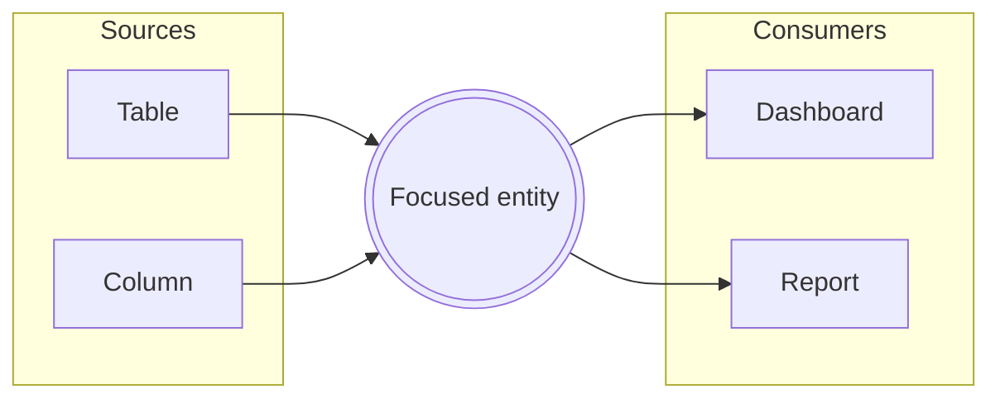

# The Lineage Lens & Context View

*For Viewers.* On a busy canvas, a single entity can have more connections
than you can comfortably read at a glance — and the ones you care about may be
scrolled off-screen or hidden behind the graph's ambient density budget. The
**Lineage Lens** solves this. It's a focused, on-demand view of *one* entity
and everything that touches it — clear, grouped, and searchable — no matter how
large or zoomed-out the canvas is. Think of it as the Context View for a node:
click, and the picture is laid out for you.

Here you'll learn to:

- **Open the Lens** on any entity — a keystroke or a right-click, a dense
  node's own chip, the Anchor Rail, or a curated View.
- **Read its layout** — sources on the left, consumers on the right, the
  focused entity in the middle.
- **Walk a chain** of connections one hop at a time, straight from the data
  source, with Back/Forward to retrace every step.
- **Rearrange it** by dragging cards around, with every connection following.
- **Open a container** into just the entities inside it that touch your focus,
  at any depth — or into everything it holds, with the connected ones marked.
- **Set how far a new focus reaches**, look at just the cause or just the
  impact, and see how any card connects back to what you're looking at.
- **Share exactly what you found**, or export it as data.
- **See lineage beyond a View's boundary** and preview what sits outside it.

## What the Lens shows

The Lens opens as a near-fullscreen focus room over the canvas. By default it
presents an **interactive lineage graph**: the entity you focused sits in the
middle as a highlighted card, its **data sources** (upstream) fan out to the
left and its **data consumers** (downstream) to the right, connected by
direction-tinted edges.

Data flows **left to right** throughout, so the layout reads the same way the
canvas does. Each connected entity appears **once**, however many
relationships reach it — when more than one hop connects it to your focus, the
card and the wire between them say so ("×3") rather than drawing it twice.
Neighbors that belong to the same parent — say, six fields of one dataset —
are drawn **inside a frame named for that dataset**, one row each, with their
own counts and their own wires. A column is never a peer of its own table:
where it comes from is the box it sits in, not a caption you have to squint
at. Wide tables page a **fixed window** through the frame ("page 3 of 12")
rather than growing it, so a 500-column source sits on the board like any
other card. Coarser partners connected **directly to your focal** — a domain,
a platform — resolve on their own: the Lens walks down through the levels
between you and them and shows the entities at **your grain** inside a frame,
with the walked path as its breadcrumb (`⋯ › PROD › CURATED › RISK_DB`). Focus
a table and the picture is tables, however many containment levels the estate
stacks above them. Coarser cards further out stay summarized until you open
them. A closed card says **how much is inside** — how many of its contents sit
on this lineage and how many it holds altogether — so you can often tell
whether it's worth opening without opening it.

The focal's own structure is part of the picture from the moment you focus —
open it further, one chevron at a time, and it keeps unfolding: table →
column → field → sub-field, exactly as deep as the estate actually goes. There
is no cap on nesting; a self-nesting hierarchy nests in the Lens exactly as
many times as it does in the data source. Above the frames, the focal names
**where it lives** — `Snowflake › OrderApp › fact_orders` — as a breadcrumb
you can click to move up a level; those levels are always *text*, never
another nested box, so a deep hierarchy stays readable instead of turning into
boxes inside boxes inside boxes. The focal card shows a quick tally — how many
connections come *in* and how many go *out* — and its **reach so far**: how
many distinct entities the walk has reached, transitively, upstream and
downstream ("Reach: 12 upstream · 47 downstream"). This isn't a separate
measurement; it's exactly what the walk has found up to this point, so it
grows as you click ⊕ to reach further. While the data source has more than the
walk has reached yet, the number shows as a floor ("47+") — the Lens never
invents a number. **Every number here is the data source's own truth, fetched
live the moment you focus** — whether or not the canvas happens to have that
entity loaded. The Lens never answers a lineage question by reading the
canvas; it asks the data source directly, one hop at a time, and shows exactly
what came back.

Prefer scanning to exploring? The **Graph | List** toggle in the header swaps
the body for the classic three-column list (sources | focal | consumers,
grouped by parent with type chips). Both bodies count connections the same
way off the same walk, so the two never disagree. The Lens remembers your
choice.

## Opening the Lens

There are a few natural ways in:

- **Select any entity and press F** — or right-click it and choose **Focus
  Connections**. This works everywhere, any time, on any entity.
- When an entity has a **large connection fan**, the canvas shows only its
  strongest links to stay legible, and a chip appears reading *"Strongest N of
  M"* with an **Open lens** button. That's your cue that there's more to see.
- The **Anchor Rail** — the small docked chips that mark a focused entity's
  off-screen partners — ends in a **"+N more · Open lens"** control when there
  are more partners than it can show.
- From a **curated view**, the "outside this view" chip offers a **Preview**
  action that opens the Lens on the out-of-scope partners (more on that below).

However you open it, the Lens is strictly a way of *looking*. Nothing you do
inside it changes your data — it reads connections, it doesn't rewrite them.

## Moving through connections

The Lens is built for exploring, not just reading:

- **Click a card** to inspect it — a detail strip slides up with the entity's
  identity, its own in/out counts, and actions. Nothing jumps: focusing is
  always a deliberate second gesture.
- **Double-click a card** (or use **Focus here** in the strip) to re-center
  the Lens on that entity. The Lens fetches that entity's own neighbours from
  the data source — instantly, if you've already visited it earlier in this
  session — and the step is recorded in your **path**.
- **Back and Forward** — buttons in the header, or the **←/→** keys — retrace
  your walk in either direction, exactly like browser history: stepping back
  never loses where you'd been, and the hops ahead of you stay visible
  (dimmed) in the **Path** trail. Click any chip in the trail to jump straight
  there. Focusing somewhere new after stepping back starts a fresh forward
  path from that point.
- **Walk one hop further** with the **⊕ pill** on a card's outer edge. The
  Lens starts by fetching just your focus and its immediate neighbours —
  one hop each way by default, or however many you've set (below) — directly
  from the data source. Click ⊕ and the Lens shows more of that entity's
  lineage: instantly, if an earlier hop already brought back more than fit on
  the board, or with a quick fetch for *that one entity's* next hop once
  there's nothing left in hand. Either way it adds exactly what comes back,
  never more, and never a guess. When the data source has told the Lens
  precisely how many more connections are waiting, the pill says so
  (**+12**); when it hasn't, the pill still offers the click with no number
  attached — there may be more, the Lens simply hasn't asked yet. A hub with
  more connections than fit in one response hands back a bookmark, and the
  same ⊕ keeps pulling from where it left off, unnoticed, until the hub is
  drained. A **⊘** where a pill would be is a genuine dead end: the data
  source has confirmed there is nothing further that way, and the Lens only
  ever says that once the walk has actually finished asking — never as a
  guess.
- A small **loop icon** on a wire means that hop curls back *toward* your
  focus rather than away from it — the lineage genuinely cycles, and the Lens
  says so rather than letting two wires between the same pair read as a plain
  duplicate.
- **Open any card into what's inside it** with the **chevron** on its body —
  a column of a table, the tables of a platform, the fields of a column. This
  is a different question from the ⊕ pill next to it, and the two never
  interfere: a card can offer both, and looking inside something never ends
  the walk through it. Opening costs no fetch at all — it's a re-projection of
  lineage the Lens already holds — so it's instant, and it nests as deep as
  the estate actually goes.

  The card unfolds into a frame holding **only the entities inside it that
  connect to the card it hangs off**. At the first hop that's the entity you
  focused; further out it's the card's own partner, and the frame's header
  names it ("4 connected to `STG_ORDERS`") so you always know which question
  was answered. Those children are ordinary cards with chevrons of their own,
  so frames nest — table → column → field, without ever re-centering, and
  without limit. A platform that merely passes lineage through a single
  container is walked through for you, with the levels it skipped shown in
  the frame's header. Frames say how many they hold and state plainly when
  nothing inside connects rather than leaving you guessing.
- **Show everything inside**, not just the connected part, with the small
  toggle in a frame's header (**⛓ Connected** | **▤ All**). "All" lists every
  column, table or dataset the container holds, in the source system's own
  order, with the lineage-carrying ones highlighted exactly where they sit and
  the rest present but quiet — no counts, no edges, labelled *no lineage*.
  That's the honest picture: a column with no lineage is drawn as having none.
  Frames open **Connected** by default — the header's own **Connected | All**
  control changes which mode the *next* frame you open starts in, and it's
  remembered between sessions.
- **Page a wide table** with the frame's own footer (**‹ Prev · page 2 of 22 ·
  Next ›**). One page shows at a time at a fixed size, so a 500-column table
  takes no more room on the board than a five-column one, and the header says
  which rows you are looking at ("3 connected · showing 21–40 of 428"). A
  count still being paged in from the source appears as a floor ("of 3+"),
  never as a guess.
- **Find a column you haven't paged to.** The **Find** box in a frame's header
  searches the *whole* container in the data source, not just the page on
  screen, so a column on page 7 is one keystroke away. A new search starts
  the list again at page 1, and the counts say what they're scoped to.
- **Choose how far a new focus reaches** with the depth control in the header
  (**1 / 2 / 3** hops each way). This only governs what happens the *next*
  time you focus somewhere new — an entity already on the board keeps
  whatever depth it was fetched at, so turning the dial up never re-fetches
  what you're already looking at.
- **Look at just one side of the story** with the direction control —
  **Both**, **Root cause** (upstream only), or **Impact** (downstream only).
  This only changes what's drawn: the Lens still holds both directions
  underneath, so flipping back is instant and every count stays exactly what
  it was.
- **See how a card connects back to your focus** by hovering or selecting it
  — every wire on some shortest path back to the focus lights up and the rest
  of the picture dims. When two routes are equally short, both light up.
- **Drag a card anywhere** to arrange the picture the way you read it. Every
  connection follows the card it belongs to — moving things changes only where
  they sit, never what connects to what. An opened container moves as one
  piece, carrying its contents with it. Your arrangement survives expanding,
  opening and loading more, so the picture grows around it instead of
  resetting; **Tidy up** in the corner controls puts everything back where the
  Lens placed it.
- **Filter connections** with the search box in the header — matching cards
  stay bright while the rest dim, so you can spot what matters in a crowded
  picture at a glance. The filter searches what's currently on the board; open
  a container first if what you're after might be tucked inside it.
- Cards offer two quiet actions on hover alongside Focus: **Reveal on canvas**
  (scrolls the real entity into view) and **Open details** (opens its details
  panel). The path itself is a deliverable too — **Copy path** and **Show on
  canvas** live at the end of the trail.
- **Share the exploration** with the link button in the header: it copies a
  URL that reopens this exact picture — the walked path, the focused entity,
  every hop you've revealed or expanded, which containers you opened and how
  you left them (Connected or All, and which page or search each one was on),
  plus your depth and direction settings — for a colleague. An older link
  someone sends you still opens on the right entity and the right walked
  path; it just won't carry the newer extras a link copied today does. The
  **image button** in the corner controls downloads the graph as a PNG for a
  deck or a doc, and the two **export** buttons beside it download the same
  picture as **JSON** or **CSV** — exactly the entities and connections on
  screen right now, as data for a script or a spreadsheet.

All of this follows you as you explore: double-click a card to focus it and
the same opening, expanding and filtering apply to that entity's own
neighbours.

First time here? The Lens offers a **one-minute guided tour** when the graph
opens; replay it any time from the **Help** panel while you're on a view.

At the bottom, two controls escalate beyond looking:

- **Reveal all on canvas** frames the focal node's neighbours together on the
  canvas.
- **Trace from here** hands off to a full lineage **Trace**, the deliberate way
  to follow a chain across many hops. See [Reading Lineage](/guide/reading-lineage)
  for how tracing works.

Press **Esc** or click the backdrop to close.

## When to reach for it

Open the Lens whenever a node is *too connected to read on the canvas*. A hub
table feeding forty dashboards, a widely-reused dimension, a column referenced
everywhere — on the canvas these show as a dense fan the ambient budget
summarises. The Lens lists **every** connection, grouped by type and searchable,
so "what actually depends on this?" becomes a question you can answer in
seconds.

## Curated views and lineage beyond your scope

A **View** is a curated subset of a Data Source — you chose which entities
belong in it. That means an entity inside your view may legitimately connect to
things *outside* it. Those aren't missing or broken connections; they're simply
beyond the boundary you drew. (See [Browsing Views](/guide/browsing-views) and
[Creating Views](/guide/creating-views) for what Views are and how they're
built.)

{brandShort} makes this visible instead of hiding it. When you select an entity
that has lineage reaching beyond the current view, a chip appears in the
bottom-right corner:

> **Selected: 12↑ 5↓ outside this view**

Those numbers come from a **node-degree signal** — {brand} asks the backend for
each entity's *total* lineage degree and subtracts what's already loaded on the
canvas. The remainder is the lineage that exists in the data source but leads to
entities your view doesn't include. Hovering the chip explains it in plain
terms: this is expected for a curated view, not a sign of missing data. Because
the count is measured, not guessed, an entity with no known external lineage
shows no chip at all — {brand} never invents a "zero."

## Previewing what's outside the view

The chip's **Preview** action is the guided path from that signal straight into
the Lens. It opens the focal entity's Lens with an extra **"Outside this view"**
section listing the out-of-scope partners — each labelled with its direction and
relationship, and each offering a **Trace** control to pull its lineage onto the
canvas if you decide you want it.

This preview is deliberately advisory. It shows you what's *there* without
adding anything to your view — nothing lands on the canvas until you act. It
answers "am I seeing the whole story?" honestly, then leaves the choice to
widen the picture in your hands. When you're ready to include those partners for
real, add them to the View or run a Trace from the row.

> **Note:** The external-lineage chip and the "Outside this view" preview are
> only shown when it makes sense — for curated Views where an out-of-scope
> boundary actually exists. On the open Explorer, where you're pulling in
> whatever you like, there's no boundary to report against.

## Where to next

- Follow a chain across many hops instead of one → [Reading Lineage](/guide/reading-lineage)
- Drive your own investigation on the open canvas → [Exploring the Graph](/guide/exploring-graph)
- Understand what a curated View is and how to build one → [Creating Views](/guide/creating-views)
