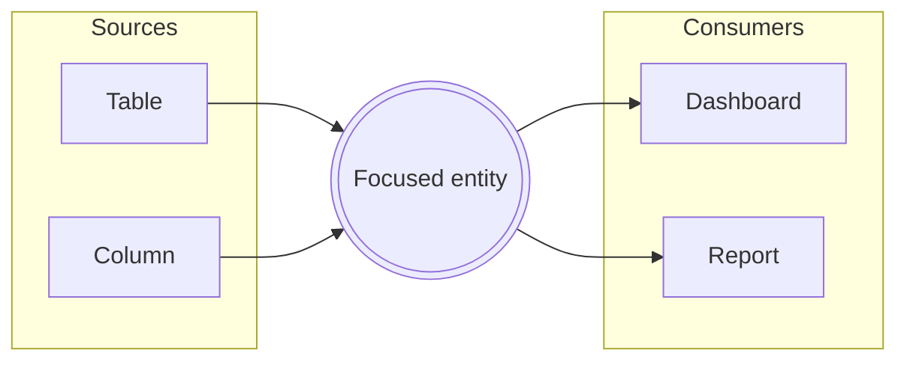

# The Lineage Lens & Context View

*For Viewers.* On a busy canvas, a single entity can have more connections
than you can comfortably read at a glance — and the ones you care about may be
scrolled off-screen or hidden behind the graph's ambient density budget. The
**Lineage Lens** solves this. It's a focused, on-demand view of *one* entity
and everything that touches it — clear, grouped, and searchable — no matter how
large or zoomed-out the canvas is. Think of it as the Context View for a node:
click, and the picture is laid out for you.

Here you'll learn to:

- **Open the Lens** from a dense node, the Anchor Rail, or a curated View.
- **Read its layout** — sources on the left, consumers on the right, the focused
  entity in the middle.
- **Walk a chain** of connections without ever touching the canvas, with
  Back/Forward to retrace every step.
- **Expand the picture** one hop at a time, exactly like dedicated lineage
  tools.
- **See lineage beyond a View's boundary** and preview what sits outside it.

## What the Lens shows

The Lens opens as a near-fullscreen focus room over the canvas. By default it
presents an **interactive lineage graph**: the entity you focused sits in the
middle as a highlighted card, its **data sources** (upstream) fan out to the
left and its **data consumers** (downstream) to the right, connected by
direction-tinted edges.

Data flows **left to right** throughout, so the layout reads the same way the
canvas does. Neighbors that belong to the same parent — say, six fields of one
dataset — arrive **rolled up into a single parent card** with a count, so a
busy entity reads as "which datasets touch me" first; expanding the card
reveals exactly the children that really participate in lineage, never the
parent's full contents. Coarser-grain partners (a container or platform
summarizing finer flows) keep a muted, dashed **rollup** treatment so they
can't read as extra data. The focal card shows a quick tally — how many
connections come *in* and how many go *out* — and, once measured, its
**reach**: how many distinct entities it touches transitively upstream and
downstream ("Reaches 12 upstream · 47 downstream"), the change-impact answer
Focus mode usually gets opened for. A capped measurement shows as a floor
("47+") — the Lens never invents a number. Numbers here always match the
canvas, because the Lens reads the same connections you see on screen.

Prefer scanning to exploring? The **Graph | List** toggle in the header swaps
the body for the classic three-column list (sources | focal | consumers,
grouped by parent with type chips). The Lens remembers your choice.

## Opening the Lens

There are a few natural ways in:

- When an entity has a **large connection fan**, the canvas shows only its
  strongest links to stay legible, and a chip appears reading *"Strongest N of
  M"* with an **Open lens** button. That's your cue that there's more to see.
- The **Anchor Rail** — the small docked chips that mark a focused entity's
  off-screen partners — ends in a **"+N more · Open lens"** control when there
  are more partners than it can show.
- From a **curated view**, the "outside this view" chip offers a **Preview**
  action that opens the Lens on the out-of-scope partners (more on that below).

However you open it, the Lens is strictly a way of *looking*. Nothing you do
inside it changes your data — it reads connections, it doesn't rewrite them.

## Moving through connections

The Lens is built for exploring, not just reading:

- **Click a card** to inspect it — a detail strip slides up with the entity's
  identity, its own in/out counts, and actions. Nothing jumps: focusing is
  always a deliberate second gesture.
- **Double-click a card** (or use **Focus here** in the strip) to re-center
  the Lens on that entity. Its own sources and consumers lay out around it,
  and the step is recorded in your **path**.
- **Back and Forward** — buttons in the header, or the **←/→** keys — retrace
  your walk in either direction, exactly like browser history: stepping back
  never loses where you'd been, and the hops ahead of you stay visible
  (dimmed) in the **Path** trail. Click any chip in the trail to jump straight
  there. Focusing somewhere new after stepping back starts a fresh forward
  path from that point.
- **Expand a hop** with the **⊕ pill** on a card's outer edge to fetch and
  reveal *that* entity's next hop of lineage — growing the graph outward from
  your focus point, one deliberate step at a time. When the total is known,
  the pill shows it (**+12**); the Lens never invents a number.
- **Refine a rolled-up flow** with the **×N badge** on an aggregated
  connection to see the underlying entity-level links it summarizes, with any
  unloaded remainder reported honestly.
- **Filter connections** with the search box in the header — matching cards
  stay bright while the rest dim (a collapsed parent card tells you how many
  matches it's holding), so a match can never silently vanish.
- Cards offer two quiet actions on hover alongside Focus: **Reveal on canvas**
  (scrolls the real entity into view) and **Open details** (opens its details
  panel). The path itself is a deliverable too — **Copy path** and **Show on
  canvas** live at the end of the trail.
- **Share the exploration** with the link button in the header: it copies a
  URL that reopens this exact picture — the walked path, the focused entity,
  and everything you expanded — for a colleague. And the **image button** in
  the corner controls downloads the graph as a PNG for a deck or a doc.

First time here? The Lens offers a **one-minute guided tour** when the graph
opens; replay it any time from the **Help** panel while you're on a view.

At the bottom, two controls escalate beyond looking:

- **Reveal all on canvas** frames the focal node's neighbours together on the
  canvas.
- **Trace from here** hands off to a full lineage **Trace**, the deliberate way
  to follow a chain across many hops. See [Reading Lineage](/guide/reading-lineage)
  for how tracing works.

Press **Esc** or click the backdrop to close.

## When to reach for it

Open the Lens whenever a node is *too connected to read on the canvas*. A hub
table feeding forty dashboards, a widely-reused dimension, a column referenced
everywhere — on the canvas these show as a dense fan the ambient budget
summarises. The Lens lists **every** connection, grouped by type and searchable,
so "what actually depends on this?" becomes a question you can answer in
seconds.

## Curated views and lineage beyond your scope

A **View** is a curated subset of a Data Source — you chose which entities
belong in it. That means an entity inside your view may legitimately connect to
things *outside* it. Those aren't missing or broken connections; they're simply
beyond the boundary you drew. (See [Browsing Views](/guide/browsing-views) and
[Creating Views](/guide/creating-views) for what Views are and how they're
built.)

{brandShort} makes this visible instead of hiding it. When you select an entity
that has lineage reaching beyond the current view, a chip appears in the
bottom-right corner:

> **Selected: 12↑ 5↓ outside this view**

Those numbers come from a **node-degree signal** — {brand} asks the backend for
each entity's *total* lineage degree and subtracts what's already loaded on the
canvas. The remainder is the lineage that exists in the data source but leads to
entities your view doesn't include. Hovering the chip explains it in plain
terms: this is expected for a curated view, not a sign of missing data. Because
the count is measured, not guessed, an entity with no known external lineage
shows no chip at all — {brand} never invents a "zero."

## Previewing what's outside the view

The chip's **Preview** action is the guided path from that signal straight into
the Lens. It opens the focal entity's Lens with an extra **"Outside this view"**
section listing the out-of-scope partners — each labelled with its direction and
relationship, and each offering a **Trace** control to pull its lineage onto the
canvas if you decide you want it.

This preview is deliberately advisory. It shows you what's *there* without
adding anything to your view — nothing lands on the canvas until you act. It
answers "am I seeing the whole story?" honestly, then leaves the choice to
widen the picture in your hands. When you're ready to include those partners for
real, add them to the View or run a Trace from the row.

> **Note:** The external-lineage chip and the "Outside this view" preview are
> only shown when it makes sense — for curated Views where an out-of-scope
> boundary actually exists. On the open Explorer, where you're pulling in
> whatever you like, there's no boundary to report against.

## Where to next

- Follow a chain across many hops instead of one → [Reading Lineage](/guide/reading-lineage)
- Drive your own investigation on the open canvas → [Exploring the Graph](/guide/exploring-graph)
- Understand what a curated View is and how to build one → [Creating Views](/guide/creating-views)
