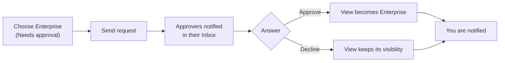

# Managing & Sharing Views

*For Builders.*

Once a View exists, this page helps you decide who can see it, share it with
particular people, publish it to everyone, go back to an earlier design, and
keep your collection tidy.

> **Before you start:** Most of what follows needs you to be the View's
> creator or a workspace admin. Each section says who can do what. To build a
> View in the first place, see [Creating Views](/guide/creating-views).

## Who can see a View

Every View has one of three visibility settings. Visibility decides who can
**open** the View; who can **change** it is a separate question, answered
further down.

| Visibility | Who can open it | What they get |
| --- | --- | --- |
| **Private** | Only you, people it's shared with, and workspace admins | It stays out of the Explorer, search and trending for everyone else |
| **Workspace** | Everyone in the View's workspace — plus anyone it's shared with | They can explore, expand, trace lineage and search inside it, and it appears in their Explorer and search results |
| **Enterprise** | Anyone signed in to {brand} | The same, plus **read-only access to the data source behind it**. People outside the workspace cannot change the View, edit any data, or see the workspace's other Views |

New Views start as **Private**. Super Admins and Org Admins can open every
View; an Org Auditor can open every **Workspace** and **Enterprise** View, but
not a **Private** one.

Choosing is usually quick:

| If the View is… | Choose | Because |
| --- | --- | --- |
| Work in progress, or for you alone | **Private** | Only the people you name (and workspace admins) can open it |
| Your team's shared reference | **Workspace** | Everyone in the workspace finds it in the Explorer |
| Useful far beyond your workspace | **Enterprise** | Anyone signed in can open it — publishing may need approval (see below) |

Visibility is not the only way in. You can also share a View with named people
or groups; a share adds access on top of the visibility and never removes any.

Who can do what to a View:

| Action | Who |
| --- | --- |
| Open it | As set by its visibility and shares (above) |
| Change it (layout, layers, details) | Its creator; anyone with the permission to edit views in its workspace (the **Workspace member**, **Data engineer** and **Workspace admin** roles); anyone given the **Editor** share |
| Change its visibility, or manage its shares | Its creator or a workspace admin. Moving it to or from **Enterprise** may also need the **Publish views** permission — see [Publish a View to everyone](#publish-a-view-to-everyone) |
| Delete it | Its creator, or anyone with the permission to delete views in its workspace (the same three roles). An **Editor** share does not allow it |
| Restore it after deletion, or delete it permanently | Workspace admins |

## Change who can see a View

1. Open the View. In its header, choose **Share** — its icon shows the current
   visibility, and hovering it says who can see the View now. The **Share View**
   dialog opens.
2. Under **Visibility**, choose **Private**, **Workspace** or **Enterprise**.
   The change is saved straight away, and the panel underneath says how many
   people that is and what they can do.
3. Close the dialog.

If **Share** shows only a visibility badge, you can't change this View's
audience — ask its creator or a workspace admin.

Other ways to get there:

- **From the Explorer:** open a View card's **⋯** menu and choose **Change
  Visibility**. The change takes effect immediately.
- **For several Views at once:** select them in the Explorer (or on a
  workspace's **Views** tab) and choose **Change Visibility** in the bar that
  appears.
- **With the other details:** in the View's header, choose **Details**, change
  **Visibility** on the **Edit** tab, then choose **Save changes**.

> **Tip:** **Shareable Link → Copy**, at the top of the **Share View** dialog,
> copies a link to the View. The link only opens for people the View's
> visibility and shares already allow.

## Publish a View to everyone

Choosing **Enterprise** is called *publishing*. Whether you can do it straight
away depends on three settings:

| On the Enterprise option you see | Means | What to do |
| --- | --- | --- |
| Nothing special | You can publish directly | Choose it |
| **Needs approval** | Someone with the **Publish views** permission has to approve it | Ask (next section) |
| The option is greyed out, or missing | Publishing to everyone isn't available to you, or isn't offered on this deployment | Talk to your administrator |

By default, a View's creator can publish it directly. A request is needed when
your organisation reviews everything published to everyone, when your
workspace has chosen **Members must request approval**, or when the View's data
source is restricted.

### Ask to publish a View

1. Open the View and choose **Share**. The **Share View** dialog opens.
2. Under **Visibility**, choose **Enterprise** (marked *Needs approval*). The
   **Ask to publish this view** box opens and says who decides.
3. Optionally explain why everyone should see it — the note goes to the people
   who answer.
4. Choose **Send request**. The dialog says the request is *awaiting approval*,
   and the View's header shows a **Publication requested** badge.

> **Note:** Send the request from **Share**. The **Details** form can't send
> one: choosing *Needs approval* **Enterprise** there and saving only reports
> that the visibility couldn't be changed.

What happens next:

- Everyone who holds the **Publish views** permission in the View's workspace
  gets a message in their **Inbox** (the bell in the top bar). By default that
  is the workspace admins.
- If they **Approve**, the View becomes **Enterprise** and you get an **Inbox**
  message saying it is published.
- If they **Decline**, the View keeps its current visibility. Their reason (if
  they gave one) reaches your **Inbox** and the View's **Activity**.
- Changed your mind? Open **Share** and choose **Withdraw request**.

You can also ask while you create a View: pick **Enterprise** on the wizard's
**Basics** step. The View is created visible to your workspace, and the request
is sent for you.

### Answer a publish request

*For approvers — people with the **Publish views** permission.*

1. Select the request's message in your **Inbox** to open the View, then choose
   its **Publication requested** badge. The **Share View** dialog opens on the
   request, showing who asked, when, and their note.
2. Choose **Approve** to publish the View now, or **Decline**.
3. If you declined, optionally type why (*the asker sees this*), then choose
   **Confirm decline**.

Every pending request in a workspace is also listed under **Publication
requests** on the workspace's **Views** tab. There, **Approve** asks you to
confirm with **Publish to everyone**, which spells out that the View — and
read-only access to its data source — becomes visible to everyone signed in.

> **Admins:** three settings decide when approval is needed.
> **Administration → Features → Publishing views to everyone** sets the ceiling
> for the whole deployment: **Workspaces decide** (the default), **Always
> require approval**, or **Not available**. A workspace admin then chooses, on
> the workspace's **Views** tab, **Members can publish directly** (the default)
> or **Members must request approval**, and can mark individual data sources as
> **Sources that always need a publisher's approval**. When a View is published
> directly, the people with **Publish views** in that workspace are told in
> their **Inbox**, so they can unpublish it if they need to.

**Unpublishing** — moving an Enterprise View back to Workspace or Private —
needs the same standing as publishing it, except that the deployment setting
never blocks it: a View that is already published can always be taken back.

## Share a View with people or groups

A share gives named people or groups access to one View, on top of its
visibility — useful for a colleague outside the workspace, or for a co-owner.

1. Open the View and choose **Share**. The **Share View** dialog opens.
2. Under **Share with people or groups**, choose **User** or **Group**.
3. Choose the role to give: **Viewer** or **Editor**.
4. Type a name in **Add a user…** (or **Add a group…**) and select the person
   or group. A notification confirms the share, and they appear in the list.

| Role | They can |
| --- | --- |
| **Viewer** | Open and explore the View |
| **Editor** | Open it and change it. They cannot share it, change who sees it, or delete it |

To change a role, click the other role on the person's row. To remove a share,
hover the row and choose **Remove share** (the bin icon).

Only the View's creator or a workspace admin can manage shares; everyone else
sees *Only the view's owner or a workspace admin can manage sharing.* Views
shared with you are listed under **Shared** in the Explorer.

> **Tip:** Share as narrowly as the need requires. It's easy to widen later and
> awkward to claw back.

### Owners and co-owners

A View's creator stays its owner — there is no way to hand a View over to
someone else. To make sure an important View outlives its creator's
involvement, give a colleague the **Editor** role on it: they can keep it up
to date. Workspace admins can always manage its visibility and shares, and
restore it if it's deleted.

## Keep your favourites close

- **Add a favourite:** select the heart on a View's card in the Explorer (or
  focus the card and press `f`).
- **Open one:** choose the star in the top bar. The **Favorites** popover lists
  your favourites, then Views you opened recently.
- **See them all:** in the Explorer, choose the **Favorites** filter.

Favourites are personal. Other people only see how many favourites a View has.

## Go back to an earlier version of a View

Every View keeps a history of its **design** — its layers, placements, rules and
settings — as numbered versions: v1, v2, v3…

A version is kept whenever something meaningful happens: creating the View,
saving it in the wizard, importing a file, restoring an earlier version, a
draft's changes to the View going live, or exporting unsaved changes. Changes
you make on the canvas in between are listed as **Changes since vN** until the
next version.

1. In the View's header, choose **Versions** — the button shows the current
   version, such as **v8**, with a dot when the design has changed since. The
   **Versions** panel opens.
2. Use the panel:
   - **Save version** keeps the design as it is now, with an optional note on
     what changed.
   - **Compare with now** shows what changed since a version, and **with vN**
     compares it with the one before: which layers were added, removed or
     changed, and how many placements moved.
   - **Restore** brings an earlier version back. Your current design is saved
     as a version first, so nothing is lost, and who can see the View doesn't
     change.
   - **Export** downloads an earlier version as a file.

**Save version** and **Restore** are for people who can change the View.

> **Note:** *Versions of a View are not the graph's version control.* They
> record the View's design only. Restoring one never changes the graph data —
> drafts, reviews and publishing of the data are covered in
> [Versioning & Change Control](/guide/versioning-change-control).

> **If you don't see Versions:** View versions are a preview. Your
> administrator turns them on in **Administration → Features → View versions,
> import and export**.

## See who uses a View

Under the View's name, a line says how many **people** opened it and how many
**opens** it had in the **last 30 days**, with a small chart of *opens per day*.
A View nobody opened says *Not opened in the last 30 days* — worth knowing
before you keep maintaining it. Explorer cards carry the same figures beside
the favourite count. Anyone who can open a View sees them.

**Activity**, in the View's header, lists who changed the View and when — its
data, its settings and its sharing — with a filter for each.

## Delete and restore a View

1. In the Explorer, open the View card's **⋯** menu and choose **Delete**. The
   **Delete View** dialog opens and warns you if people have it as a favourite.
2. Type the View's name to confirm.
3. Choose **Delete View**. The View leaves every list.

Deleted Views are listed under **Deleted** in the Explorer. A deleted View is
kept until a workspace admin removes it for good:

- **Restore** brings it back exactly as it was. Only workspace admins can
  restore — if you're not one, ask yours.
- **Delete** on a deleted View opens **Permanently Delete View**. This removes
  it for good and can't be undone. Workspace admins only.

## Move a View to another environment

Built a View in development and need it in UAT or production? **Export** it to a
file (from the View's header, its card's **⋯** menu in the Explorer, or several
at once from the Explorer's selection bar) and **Import view** in the other
environment. The import checks every entity the View places against the graph
there and shows you what matched before anything is saved. Importing again
later updates the same View as its next version. The whole journey is in
[Import & Export](/guide/import-export#moving-views-between-environments).

## Look after a workspace's Views

Each workspace has a **Views** tab for working with its whole collection: open
**Workspaces** in the sidebar, choose the workspace, then **Views**.

- **The summary** counts the workspace's Views and owners, and its **Private**,
  **Workspace** and **Enterprise** chips filter the list. **Need attention**
  appears when Views haven't been updated in 90 days or point at a workspace or
  data source that is inactive or gone.
- **Publication requests** lists pending requests for the people who can answer
  them, and holds the workspace's publishing settings for its admins.
- **Recent activity** shows what changed across the workspace.
- **Select several Views** to **Change Visibility**, **Export** or **Delete**
  them together. (Delete is offered only when you may delete every selected
  View.)
- **New view**, **Import view** and **Browse in Explorer** are at the top of
  the list.

A short tidy-up routine keeps the Explorer trustworthy:

1. **Promote** Views that prove broadly useful (Private → Workspace →
   Enterprise).
2. **Retire** stale or superseded Views — delete them, or rename them clearly
   (for example with a `[deprecated]` prefix).
3. **Standardise** names and tags.
4. **Add an Editor** to important Views so they don't depend on one person.

See [Ways of Working](/guide/ways-of-working) for conventions and cadence.

## Troubleshooting

| What you see | Likely cause | What to do |
| --- | --- | --- |
| A teammate can't find your View | It's **Private**, or in a workspace they're not a member of | Widen its visibility, or share it with them |
| **Share** is only a badge, with no dialog | You're not the View's creator or a workspace admin | Ask one of them to change it |
| **Enterprise** says **Needs approval** | Publishing needs someone with **Publish views** | Send a request from **Share** |
| You can't change a View | You can open it but not edit it | Ask its creator or a workspace admin for the **Editor** role |
| **Restore** fails on a deleted View | Only workspace admins can restore | Ask a workspace admin |
| No **Versions**, **Export** or **Import view** | They're a preview, off until your administrator turns it on | **Administration → Features → View versions, import and export**; **Export views** and **Import views** each have their own switch too |

More in [Troubleshooting](/guide/troubleshooting).

## Where to next

- [Users & Access](/guide/users-access) — when you want to understand roles, groups and permissions behind these rules.
- [Display Rules](/guide/display-rules) — when you want a shared View to flag what matters at a glance.
- [Import & Export](/guide/import-export#moving-views-between-environments) — when a View needs to move between environments.
- [Ways of Working](/guide/ways-of-working) — when you want team conventions for names, tags and tidy-ups.
