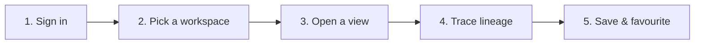

# Quick Start — Your First 10 Minutes

This is the fastest path from "logged in" to "I get it." Follow the five steps
below and you'll have traced real lineage and saved your first View. No prior
graph knowledge required.

> 💡 **Before you start:** make sure you can log in and that an administrator has
> set up at least one workspace with a data source. If you see *"No data source
> for workspace,"* ask your admin to finish [Admin Setup](/guide/admin-setup).

---

## Step 1 — Sign in and orient yourself

After logging in you land on the **Dashboard**. Take a moment to notice the
layout:

- **Left sidebar** — your main navigation: *Dashboard, Explore, Workspaces,
  Ingestion, Semantic Layers,* and (if you're an admin) *Administration*. The
  active **workspace switcher** lives here too.
- **Top bar** — global search (press `⌘K` / `Ctrl-K`), the **Business/Technical
  persona toggle**, notifications, and your profile menu.
- **Main area** — the Dashboard shows your workspaces and a gallery of popular
  and recent Views.

> 💡 **Tip:** Anything you can *look at* is safe. You can't break data by
> clicking around — editing always requires a deliberate action.

---

## Step 2 — Pick a workspace

Use the **workspace switcher** in the left sidebar to select the workspace you
want to explore. The workspace determines which data you'll see.

When you switch, Synodic loads that workspace's **data source** and its
**ontology** (the colours and meanings). The canvas will re-render around the new
context.

---

## Step 3 — Open a View

The easiest way to see something meaningful immediately is to open an existing
**View** — a saved exploration someone has already curated.

1. Go to **Views** (the gallery) from the sidebar or Dashboard.
2. Browse the **Popular** and **Recent** views. Each card shows a name,
   description, and favourite count.
3. Click any View to open it on the canvas.

The graph appears with the saved layout, filters, and layers already applied.
You're now looking at real lineage. See [Reading Lineage](/guide/reading-lineage)
to interpret what's on screen.

> 💡 **No views yet?** Open the **Explorer** instead and use the search box to
> find any node by name — then continue to Step 4.

---

## Step 4 — Trace lineage

This is the heart of Synodic. Pick any node that interests you and follow its
connections:

1. **Click a node** to select it. A details panel opens with its properties,
   tags, and connected edges.
2. Use the **Trace** controls (toolbar or right-click menu) to expand
   **Upstream** (sources) or **Downstream** (consumers).
3. Adjust the **depth** to follow the chain one hop at a time or several at once.
4. **Change granularity** (column → table → domain) to zoom out for the big
   picture or in for precise detail.

As you trace, watch how the highlighted path shows the *blast radius* — every
item that would be affected if your selected node changed.

> 💡 **Power move:** press `⌘K` / `Ctrl-K` to open the **Command Palette** and
> jump straight to actions like search, trace, and filter.

Full details: [Exploring the Graph](/guide/exploring-graph).

---

## Step 5 — Save and favourite

Found something worth keeping? Capture it so you (and your team) can return
instantly.

1. Click **Save as View**. A short wizard opens.
2. Give it a clear **name and description** (see naming tips in
   [Ways of Working](/guide/ways-of-working)).
3. Choose which **entity types** stay visible and, optionally, organise nodes
   into **layers**.
4. Set **visibility** — *Personal*, *Team*, or *Enterprise*.
5. Confirm. Your View now appears in the gallery.

Finally, click the **★ favourite** icon on any View to pin it to your sidebar's
quick-access list. Full walkthrough: [Creating Views](/guide/creating-views).

---

## You did it 🎉

In ten minutes you've used every core idea: workspaces, views, tracing,
granularity, and saving. Where to go next depends on your role:

- **Just looking around?** → [Browsing Views](/guide/browsing-views)
- **Building things to share?** → [Creating Views](/guide/creating-views)
- **Running the platform?** → [Admin Setup](/guide/admin-setup)
- **Want the full vocabulary?** → [Key Concepts](/guide/key-concepts) ·
  [Glossary](/guide/glossary)
