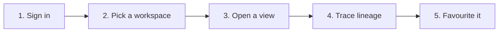

# Quick Start — Your First 10 Minutes

*For anyone new to {brand}.*
In about ten minutes you'll sign in, find your way around, open a view, trace a
piece of data upstream and downstream, and keep the view one click away. You
don't need to know anything about graphs.

> **Before you start:** You need an account and membership of at least one
> workspace that has a view in it. Not sure you have that? Ask your
> administrator, or see [Requesting Access](/guide/requesting-access).

```tour-getting-started
```


```mermaid
flowchart LR
  A["1. Sign in"] --> B["2. Pick a workspace"]
  B --> C["3. Open a view"]
  C --> D["4. Trace lineage"]
  D --> E["5. Favourite it"]
```

---

## Step 1 — Sign in and orient yourself

1. Open {brand} and sign in — with your email and password (**Enter
   Workspace**), or with your organisation's single sign-on (usually a button
   reading **Continue with** followed by its name).
2. You land on the **Dashboard**: a greeting, a search box, and the buttons
   **Build a new view** and **Browse all views** (plus **Pick up**, with the
   name of your last view, once you've opened one). Further down are **Your
   work**, **Activity in your workspaces** and **Your business areas**.


Now take a moment to learn the layout. **The sidebar** on the left is your main
navigation:

| Item | What it's for |
| --- | --- |
| **Dashboard** | Overview and workspace activity — where you start |
| **Explore** | The Explorer: browse and open saved views |
| **Workspaces** | Your workspaces and what's in them |
| **Ingestion** | Connect sources and import data |
| **Semantic Layers** | Define and manage what your data means |
| **Analytics** | Growth, engagement and platform insights |
| **Administration** | System settings, users and health |

The items you see depend on your role, so you may have fewer. **Dashboard**,
**Explore** and **Workspaces** are there for everyone; **Analytics** appears for
administrators and auditors, or for everyone if your administrator has opened
it; **Administration** appears only for administrators. At the bottom of the
sidebar are **Getting started** (your checklist), **User Guide** and
**Documentation**.

**The top bar** runs across the top, left to right:

| Control | What it does |
| --- | --- |
| The {brandShort} name, with **Business View** or **Technical View** under it | Shows which naming mode is on |
| **Search pages, views, workspaces, docs…** (`⌘K` / `Ctrl-K`) | Opens the command palette: jump to any page, view, workspace or guide page |
| **Business** / **Technical** | Switches how entities are named — Technical adds each one's qualified name |
| The star (**Favorites**) | Your favourite views, plus the ones you opened recently |
| The bell (**Inbox**) | Messages for you — for example, a view someone shared with you |
| The theme button | Cycles between light, dark and your system's theme |
| The question mark (**Help**, or press `?`) | Searches this guide and the documentation without leaving the page |
| The cog (**Administration**) | The admin console — Super Admins and Org Admins only |
| Your avatar | **Account settings**, **My access**, **Identities**, **Reduce motion** and **Sign Out** |

If you can invite people, there's one more bell, **Invite activity**, showing who
has joined through your invite links.

> **Tip:** Anything you can *look at* is safe. Browsing, searching and tracing
> never change data — changing it always takes a deliberate step.

> **If you don't see Your business areas:** when the Dashboard says **Welcome to
> {brand}** and shows **Setup Progress** steps instead, you don't belong to a
> workspace yet. Ask an administrator to add you — see
> [Requesting Access](/guide/requesting-access).

**You should now see** the Dashboard, with the sidebar on the left and the top
bar above it.

---

## Step 2 — Pick a workspace

Views live in workspaces, so start with the one your team works in.

1. On the Dashboard, scroll to **Your business areas**. Each card is one of your
   workspaces, with its data sources and how many views it has.
2. On the workspace you want, click **Explore Views**.

There's no global workspace switch to keep in sync: picking a workspace here
just narrows the list, and every view opens in its own workspace whichever way
you reach it. Two other routes to the same place:

- Press `⌘K` / `Ctrl-K` and choose a workspace under **Switch Workspace** (shown
  when you belong to more than one).
- Click **Workspaces** in the sidebar, open a workspace, and choose its **Views**
  tab.

**You should now see** the Explorer, with a **Workspace:** chip above the
results naming the workspace you picked.

---

## Step 3 — Open a view

A **view** is a saved, curated picture of part of your data that someone has
already built.

1. In the Explorer, find a view in the results — or type part of its name in
   **Search views by name, tag, workspace...** (press `/` to jump there).
2. Click the view's card. A preview panel slides in from the right with the
   view's details.
3. Click **Open Full View**.

> **Tip:** To skip the preview, hover over a card and click its **Open view**
> icon. And with no filter applied, the Explorer also shows **Trending** views
> and **Continue where you left off**.

> **If you don't see any views:** **No views match your search** means the
> workspace you picked has no views you can open — click **Clear all filters**
> to see views from all your workspaces. **No views yet** means there are none
> you can open anywhere. Either way, ask a colleague to share one, or build your
> own with **New View** — see [Creating Views](/guide/creating-views).

**You should now see** the view's entities on its canvas, with the view's name
in the header. [Reading Lineage](/guide/reading-lineage) explains what's on
screen.

---

## Step 4 — Trace lineage

This is the heart of {brand}: pick one thing and see where its data comes from
and where it goes.

1. Click any entity on the canvas. It's highlighted, and its details panel
   opens on the right with three buttons at the top: **Root Cause**, **Impact**
   and **Full Lineage**.
2. Click **Full Lineage**. {brand} follows the entity's lineage both ways and
   highlights the chain — upstream (where its data comes from) and downstream
   (what it feeds). **Root Cause** traces upstream only; **Impact** downstream
   only.
3. Look at the header: it now shows **Exit Trace** and a **Depth** chip, and a
   bar along the bottom of the canvas reads **Tracing** with the entity's name
   and its upstream and downstream counts.
4. Click **Depth**. In **Trace settings**, drag **Upstream** or **Downstream**,
   or pick a preset: **Direct** (one hop each way), **Nearby** (five hops) or
   **All hops**. The highlighted chain shrinks or grows straight away.
5. Click **Exit Trace** when you're done.

> **Tip:** Two shortcuts start the same trace: right-click an entity and
> choose **Trace Lineage**, or select it and press `T`. In a Context View,
> **Trace Lineage** is also in the header.

> **Tip:** Steps 3–5 describe a **Context View**, the most common kind of view.
> In a **Graph** or **Hierarchy** view the trace gets its own toolbar instead:
> its gear (**Trace settings**) holds **Upstream Depth** and **Downstream
> Depth**, **Re-trace** applies a change, and **Exit** ends the trace.

> **If you don't see Trace Lineage in a Context View's header:** your
> administrator has turned off **Lineage trace**. If the header says **Loading
> lineage…** instead, wait a moment — tracing becomes available as soon as the
> lineage has loaded.

**You should now see** the view as it was before the trace — and you know how
to find any entity's upstream and downstream. More in
[Tracing Lineage on the Canvas](/guide/exploring-graph).

---

## Step 5 — Favourite it

Found a view you'll come back to? Put it one click away.

1. Go back to the Explorer: click **Explore** in the sidebar, and find the
   view's card (search for its name if you need to).
2. Hover over the card and click the heart (**Favorite**). The heart fills in.
3. Click the star (**Favorites**) in the top bar. Your view is in the list —
   click it any time to open it.

> **If you don't see it in Favorites yet:** reload the page; the list is
> refreshed when {brand} loads. In the Explorer, the **Favorites** tab above the
> results always lists all your favourites.

**You should now see** your view in the **Favorites** list in the top bar.

Want a view of your own? Click **New View** in the Explorer to start the
**Create New View** wizard — see [Creating Views](/guide/creating-views).

---

## Check yourself

You've used every core idea once. You can now:

- find your way around the sidebar and the top bar;
- narrow the Explorer to one workspace and open a view from it;
- trace an entity upstream and downstream, and change how far the trace
  reaches;
- keep a view one click away in **Favorites**.

---

## Where to next

- [Key Concepts](/guide/key-concepts) — when you want the vocabulary behind what
  you just did.
- [Finding Views (the Explorer)](/guide/browsing-views) — when you want to
  search, filter and sort views like a pro.
- [Tracing Lineage on the Canvas](/guide/exploring-graph) — when you want to go
  deeper into tracing.
- [Creating Views](/guide/creating-views) — when you're ready to build your own.
