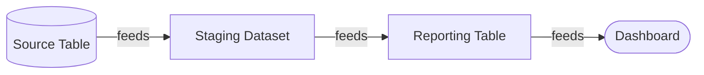

# Reading Lineage

```tour-explore-lineage
```

*For Viewers.* A lineage graph can look busy at first. This page teaches you to
read it fluently — what the shapes, colours, and lines mean, and how to change
the level of detail until the picture answers your question.


*Try it: click a node below to trace its lineage — upstream, downstream, and blast radius.*

```lineage-demo
```

---

## Anatomy of the picture



Every lineage graph is made of just two things:

- **Nodes** — the *things*: tables, columns, datasets, dashboards, domains,
  pipelines. Each node's **colour and icon** come from the ontology and tell you
  its **type** at a glance.
- **Edges** — the *connections* (the lines): they show how data flows or how
  things contain one another. An arrow points in the direction of flow —
  *from* source *to* consumer.

> **Important:** Direction is everything. Follow arrows *backwards* to find where
> data came from (**upstream**); follow them *forwards* to find what it affects
> (**downstream**).

---

## Node types and the legend

Colours and icons aren't decorative — they encode meaning defined by your
organisation's **ontology** (the semantic layer). Common types include:

| Looks like | Typically means |
| --- | --- |
| Domain / business area | A high-level grouping (e.g. *Finance*) |
| Dataset / Table | A collection of data |
| Column / Field | A single attribute within a table |
| Dashboard / Report | A consumer of data |
| Pipeline / Job | A process that moves or transforms data |

Open the **legend** on the canvas to see exactly what each colour and icon means
in *your* environment — it's generated from the active ontology, so it always
matches what you're looking at.

---

## Two kinds of relationship

Edges come in two flavours, and telling them apart is key to reading the graph:

- **Lineage edges** — *"data flows from A to B."* These are the arrows you trace
  to understand impact and origin.
- **Containment edges** — *"A contains B"* (a table contains columns; a domain
  contains datasets). These let you **expand** a node to reveal what's inside it.

When you click to *expand* a node, you're following containment. When you *trace*,
you're following lineage.

> **Tip:** *Too busy to read?* Turn on the **Lineage Lens** (the **Context View**)
> to spotlight just the lineage around one node and dim the rest, or step
> through the **Layer Strip** to read the graph one tier at a time. See
> [The Lineage Lens](/guide/lineage-lens) and
> [Navigating Layers](/guide/navigating-layers).

---

## Changing the level of detail (granularity)

The same lineage exists at several zoom levels. Match the level to your question:

| Choose… | When you want to… |
| --- | --- |
| **Column / Field** | Know exactly which fields are affected |
| **Table / Dataset** | Do everyday tracing without the noise |
| **Domain / Business** | Brief a stakeholder on the big picture |

Switching granularity **re-aggregates** the picture around the same underlying
graph — nothing is lost, you're just changing the altitude. Zoom out to orient,
zoom in to act.

---

## Business vs Technical framing

The **persona toggle** in the top bar reframes the whole graph:

- **Business** — domains, products, friendly names. Ideal for sharing with
  stakeholders who care about *what* and *why*.
- **Technical** — schema fields, system identifiers (URNs), and structural
  detail. Ideal for engineers asking *exactly how*.

It's the same graph, dressed for a different audience. Flip it when you change
who you're talking to.

---

## Inspecting a single node

Click any node to open its **details panel**, which shows:

- its **properties** and **metadata**,
- its **tags** (useful for filtering and search),
- its **incoming and outgoing edges** — the connections in and out.

This is the quickest way to answer *"what is this, and what's it connected to?"*
without changing the whole view.

---

## A reading checklist

When a graph first appears, ask yourself, in order:

1. **What are the big shapes?** Check the legend; identify the dominant node
   types.
2. **Which way does it flow?** Find the sources (no incoming arrows) and the
   sinks (no outgoing arrows).
3. **What's the right altitude?** Set granularity to match your question.
4. **Who's the audience?** Set the persona toggle accordingly.
5. **What's connected to *this*?** Click the node you care about and read its
   panel.

---

## Where to next

- Go beyond reading and start tracing actively → [Exploring the Graph](/guide/exploring-graph)
- Spotlight the context around one node → [The Lineage Lens](/guide/lineage-lens)
- Read a big graph one tier at a time → [Navigating Layers](/guide/navigating-layers)
- Save a picture you've understood → [Creating Views](/guide/creating-views)
- Confused by a term or colour? → [Key Concepts](/guide/key-concepts) ·
  [Glossary](/guide/glossary)
