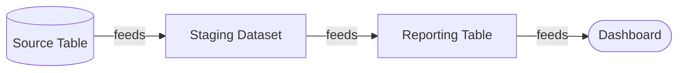

# Reading Lineage

*For Viewers.* A lineage picture can look busy at first. This page teaches you to
read one: what the rows, lines and colours mean, which way data flows, and how to
show more or less detail until the picture answers your question.

```tour-explore-lineage
```


*Try it: click a node below to trace its lineage — upstream, downstream, and blast radius.*

```lineage-demo
```

---

## Anatomy of the picture


```mermaid
flowchart LR
  src[(Source Table)] -->|feeds| stg[Staging Dataset]
  stg -->|feeds| mart[Reporting Table]
  mart -->|feeds| dash([Dashboard])
```

Every lineage picture is made of just two things:

- **Nodes** — the *things*: tables, columns, datasets, dashboards, domains,
  pipelines. On a Context View, each node is a row in one of the layer
  columns. Its **icon** and **type label** tell you what kind of thing it is.
- **Edges** — the *connections*. Lineage edges are the lines between rows:
  they show how data flows, *from* source *to* consumer, and their arrowheads
  point the way the data goes.

> **Important:** Direction is everything. Follow the lines *backwards* to find
> where data came from (**upstream**); follow them *forwards* to find what it
> affects (**downstream**). Both terms are in the [Glossary](/guide/glossary).

> **If you don't see any lines:** lines appear when you hover or select an
> entity — that's the default. Check that **Lineage** in the view's header shows
> a green dot, then rest the pointer on a row. To see more lines at once, open
> **Display** in the header and, under **Lineage appearance**, set **Edge
> Density** to **Adaptive** or **All Edges**.

---

## Node types and the legend

Icons and colours aren't decorative — they come from your organisation's
[semantic layer](/guide/semantic-layer), which defines every type of thing in
your data. Common types include:

| Looks like | Typically means |
| --- | --- |
| Domain / business area | A high-level grouping (e.g. *Finance*) |
| Dataset / Table | A collection of data |
| Column / Field | A single attribute within a table |
| Dashboard / Report | A consumer of data |
| Pipeline / Job | A process that moves or transforms data |

To see what they mean in *your* view:

- **Types:** on a Context View, each row shows its type's icon and, under its
  name, its type label. Turn the label on or off in **Display → Display
  options → Show entity type badge**.
- **Lines:** the **Flows** panel in the bottom-right corner is the legend for
  lines. It lists each kind of flow on screen with its colour, what it means
  and how many there are; hover a row to light up its lines. On a Graph view,
  the **Edge Legend** does the same job.

---

## Two kinds of relationship

Edges come in two flavours, and telling them apart is key to reading the graph:

- **Lineage** — *"data flows from A to B."* These are the lines you trace to
  understand impact and origin.
- **Containment** — *"A contains B"* (a table contains columns; a domain
  contains datasets). On a Context View this is shown as nesting: what a row
  contains is listed under it in the same column. Click the row's chevron to
  **expand** it; a closed row shows **+N** for what's inside.

When you *expand* a row, you're following containment. When you *trace*,
you're following lineage.

> **Tip:** *Too busy to read?* Select one entity and press `F` to open the
> **Lineage Lens**, which lays out just that entity's lineage, or move through
> a wide view one layer at a time with the **Layer Strip**. See
> [The Lineage Lens](/guide/lineage-lens) and
> [Navigating Layers](/guide/navigating-layers).

---

## Changing the level of detail

The same lineage exists at every level — column, table, schema, domain — and
what you see depends on which rows are open:

- When a row that contains others is **closed**, the lineage of everything
  inside it is drawn to that row. This is a **roll-up**. Hover the line: the
  tooltip names the kind of flow and says **roll-up of N**, the number of
  flows it stands for.
- **Open** the row with its chevron and the lines move down to the rows inside
  that actually carry them. Close it again to roll them back up.

There is no separate level setting: what you open is what you see. Match it to
your question:

| To… | Do this |
| --- | --- |
| Brief someone on the big picture | Keep containers closed, so their lineage rolls up onto them |
| Find exactly which columns are involved | Open the table's chevron |
| See every line at once, not only on hover | **Display → Lineage appearance → Edge Density → All Edges** |
| Read one busy entity, grouped by container | Open the [Lineage Lens](/guide/lineage-lens) and choose a **Density** |
| Limit how far a trace reaches | During a trace, set **Depth** — see [Narrow a trace by direction and depth](/guide/exploring-graph#narrow-a-trace-by-direction-and-depth) |

---

## Business vs Technical framing

The **Business** | **Technical** switch in the top bar changes how every entity
is named:

- **Business** — the name people use: a curated business name where one has
  been set, otherwise the entity's own name.
- **Technical** — the entity's name as the source system has it, with its
  qualified name (or its URN) on a second line, on Context View rows, Graph
  cards and the entity details panel.

Nothing else changes — the same entities, the same lines. Switch to
**Technical** when you need an exact identifier to look something up in another
system, and back to **Business** when you're sharing your screen with people
who care about *what* and *why*.

---

## Inspecting a single node

Click any row (or, on a Graph or Hierarchy view, any node) to open its
**details panel** on the right. It shows:

- its type and name, with buttons to trace it — **Root Cause** (upstream),
  **Impact** (downstream) and **Full Lineage** (both) — and **Focus** to open
  the Lineage Lens on it;
- **Identifier** — its URN, with **Copy URN**;
- **Details** — its qualified name, description, source system, layer and
  when it last synced, whichever are known;
- **Relationship** — what it sits inside (click to go there) and how many
  items it holds;
- **Properties** and **Classifications** (its tags);
- **Lineage** — its **Data Sources** and **Data Consumers**;
- **History** — its recorded changes, when version control is turned on.

The **JSON** tab shows the entity's raw data. This is the quickest way to
answer *"what is this, and what's it connected to?"* without changing the
picture.

---

## A reading checklist

When a graph first appears, ask yourself, in order:

1. **What are the big shapes?** Read the layer names at the top of each column
   and the type labels on the rows.
2. **Which way does it flow?** Find the sources (nothing feeds them) and the
   consumers at the end (they feed nothing).
3. **What's the right level?** Open containers until the lines land where your
   question is.
4. **Who's the audience?** Set **Business** or **Technical** in the top bar.
5. **What's connected to *this*?** Click the entity and read its details panel,
   or trace it.

---

## Where to next

- [Tracing Lineage on the Canvas](/guide/exploring-graph) — when you want to
  follow the chain from one entity, or several, as far as it goes.
- [The Lineage Lens & Context View](/guide/lineage-lens) — when one entity has
  too many connections to read on the canvas.
- [Navigating Layers](/guide/navigating-layers) — when a wide view runs off the
  edge of the screen.
- [Glossary & Acronyms](/guide/glossary) — when a term or colour is unfamiliar.
