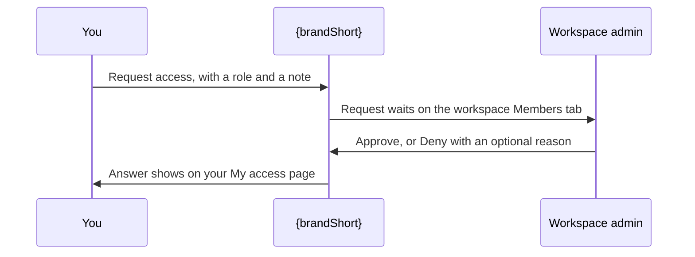

# Requesting Access

*For everyone — and for workspace admins who answer requests.*
Sooner or later {brand} will tell you that you can't open or change something.
This page explains what each message means, how to ask for access from inside
{brand}, where to see the answer, and what to do if nobody replies.

> **Before you start:** Access is granted **per workspace**: you ask a
> workspace's admins for a role in that workspace. A single view works
> differently — to open one, ask its owner to share it (see
> [Get a single view shared with you](#get-a-single-view-shared-with-you)).

---

## What the message means

When {brand} refuses something, you see one of these. Find yours, then follow
the advice next to it.

| If you see… | it means… | so… |
| --- | --- | --- |
| An **Access denied** card at the bottom of the screen, saying what you need — for example "Editing views in this workspace needs edit access." | Your role doesn't allow what you just tried. | If it offers **Request access**, use it ([below](#ask-from-the-access-denied-card)). Otherwise ask a workspace admin. |
| An **Access denied** card whose message says something **is turned off for this deployment** | An administrator has switched that feature off for everyone. It has nothing to do with your access. | Don't request access — it won't turn the feature on, even if the card offers **Request access**. Ask an administrator; see [Feature Switches](/guide/feature-switches). |
| A **Read-only view** card | You're exploring a view shared with you. Everything in it is read-only. | If you need to change it and the card offers **Request edit access**, use it. Otherwise ask a workspace admin. |
| **You don't have access** filling the page | A whole section needs a permission you don't have; the panel names it. | Ask your workspace admin or a platform administrator. |
| **You don't have access to this** or **Access required** inside a page | Your role lacks the permission shown next to **Required**. | Ask a workspace or platform administrator. **Learn about roles & access** opens [Users & Access](/guide/users-access). |
| **Workspace not found.** | You're not a member of that workspace — or it doesn't exist. {brand} doesn't say which, to keep workspace names private. | Ask whoever sent you the link to have you added. |
| **View Cannot Load** | The view doesn't exist, or it isn't shared with you. | Ask the view's owner to share it ([below](#get-a-single-view-shared-with-you)). |
| **Access revoked** | An admin removed your access while you had the workspace open. | Use **Request access again** ([below](#after-your-access-was-removed)). |
| **Analytics isn't open on this deployment** | Not a permission at all: Analytics hasn't been opened to everyone. | Nothing to request — ask an administrator if you need it ([Feature Switches](/guide/feature-switches)). |
| **This feature is turned off** (or a named version, such as **Reviews are turned off**) | An administrator has switched the feature off. | Nothing to request — ask an administrator if you need it ([Feature Switches](/guide/feature-switches)). |

> **Tip:** The **Access denied** card disappears after a few seconds. Click
> **Details** to keep it open — it shows technical details that are useful if you
> contact support.

---

## Ask for access to a workspace

A request names the workspace, the role you want and, if you like, a note
saying why. Workspace admins see your name and email with it. There are three
places in {brand} to send one from — and you can always simply ask a workspace
admin to add you.

### Ask from the Access denied card

When the action that was refused belongs to one workspace, the **Access
denied** card offers **Request access** (in a read-only view, **Request edit
access**).

> **Note:** Read the card's message first. If it says a feature **is turned off
> for this deployment** — for example "Lineage tracing is turned off for this
> deployment." — the refusal comes from a feature switch, not from your role.
> A request can't change that: only an administrator can turn the switch back
> on (see [Feature Switches](/guide/feature-switches)).

1. Click **Request access** on the card. The card stays open and shows
   **Request access to** with the workspace's ID.
2. Under **Role**, click the role you need.
3. Under **Why do you need this? (optional)**, say what you're trying to do —
   it helps the admin decide quickly.
4. Click **Submit request**.

**You should now see** the confirmation "Access request submitted. The
workspace admin will review it." Your request is now on your **My access**
page ([below](#check-your-request-on-my-access)).

> **If you don't see the list of roles:** the card says **Couldn't load roles**,
> or changes to a different **Access denied** message, when your account isn't
> allowed to list roles — at the moment that's most accounts. Your request was
> not sent: use one of the other routes on this page, or
> [ask an admin to add you](#ask-a-workspace-admin-to-add-you).

### Ask from Analytics

If your administrator has opened **Analytics** to everyone, it lists workspaces
you aren't a member of — without their names — and lets you ask for read access.

1. Click **Analytics** in the sidebar, then the **Workspaces** tab.
2. Below the table, click the line that ends **you are not a member of —
   counted in the figures above**. Rows named **Restricted workspace** appear,
   each marked **You are not a member**.
3. On the row you want, click **Request access**. A short form, **Ask for read
   access**, explains what you're asking for.
4. In the note box, say why you need it — the approver can't see what you were
   looking at.
5. Click **Send request**.

**You should now see** **Request sent** on the row, with "An administrator of
that workspace will review it. You will see the workspace here once it is
granted."

This asks for read access (the **Workspace viewer** role). If you need more,
say so in your note.

### After your access was removed

If an admin removes your access while you have a workspace open, the page
changes to **Access revoked** and, after a few seconds, takes you back to your
workspaces.

1. Click **Request access again** before the countdown ends. Clicking it stops
   the countdown.

**You should now see** "Request sent. The workspace admin will review it." This
asks for the **Workspace member** role.

### Ask a workspace admin to add you

No button in sight, or the request didn't go through? Ask an admin of the
workspace — or your team lead, or the person who invited you — to get you added.
A **Super Admin** adds you on the workspace's **Members** tab with **Add member**,
choosing your role as they do, and an **Org Admin** can add a group you're in. A
workspace admin can approve a request you send, but can't use **Add member** yet
— see [Workspace Admin](/guide/workspace-admin#giving-people-access-the-members-tab).

> **Note:** Sending the same request twice doesn't create a second one — you
> keep your place in the queue. There's no way to withdraw a request; it stays
> **Pending** until someone answers it.

---

## Get a single view shared with you

Views have their own sharing. You can open a view if its visibility includes you
— **Workspace** views are open to everyone in their workspace, **Enterprise**
views to everyone signed in — or if its owner has shared it with you directly.
A **Private** view stays closed until someone shares it with you.

1. Ask the person who sent you the link, or the view's creator, to share the
   view with you. On a view card in the Explorer, the creator's initials sit at
   the bottom — hover them for the name and email.
2. When they do, a message arrives in your **Inbox** — the bell in the top bar:
   **"…" was shared with you**, with the role you can open it as.
3. Click the message to open the view.

**You should now see** the view open on its canvas. The rules for who can see
a view are in [Who can see a View](/guide/managing-views#who-can-see-a-view).

---

## Check your request on My access

1. Click your avatar at the right of the top bar and choose **My access**.
2. Find **My access requests**. It lists each request you've made — the
   workspace, the role you asked for, your note and when you sent it — with its
   status: **Pending**, **Approved** or **Denied**. A denied request shows the
   admin's **Reason:** if they gave one.

**You should now see** your request and its status. The **My access
requests** panel appears once you've made at least one request.

> **Note:** Answers to access requests don't arrive in your **Inbox**. Check
> **My access** instead. (The Inbox carries other messages: views shared with
> you, and requests to publish a view to everyone and their answers.)

Once a request is approved, the new role shows on **My access** straight away.
The rest of {brand} catches up the next time your session refreshes — within a
few minutes — and then the workspace appears under **Workspaces**. To pick it up
at once, sign out and sign back in.

### What My access shows

**My access** — also in **Account settings** and in the `⌘K` palette — answers
"what can I do, and why?":

- a summary at the top: how many workspaces you can reach and what you can do in
  the main ones — or, for a Super Admin or Org Admin, what that role means;
- **My access requests**, when you have any;
- **Effective access** — everything you can actually do, platform-wide and per
  workspace, after combining all your roles;
- **Direct bindings** — roles given to you personally;
- **Inherited via groups** — roles you have because you belong to a group;
- **Group memberships** — every group you're in.

Click **Refresh** to reload it after a change.

---

## Answer an access request

*For workspace admins.*

> **Before you start:** You can answer requests for a workspace if you're a
> **Workspace admin** there, an **Org Admin** or a **Super Admin**. Requests
> don't arrive in your Inbox — they wait on the workspace's page.

1. Click **Workspaces** in the sidebar and open the workspace.
2. Click the **Members** tab.
3. Below the member list, find **Pending access requests**. Each request shows
   who's asking, their email, **wants** with the role, their note, and how long
   ago they asked. The panel appears only when something is waiting.
4. Click **Approve** to grant exactly the role requested — or click **Deny**,
   write a reason in **Why are you denying? (optional, shown to the requester)**,
   and click **Confirm deny**.

**You should now see** a confirmation — **Approved access for …** or **Denied
request from …** — and the request gone from the list. An approved person now
appears among the members.

> **Tip:** **Approve** always grants the role that was asked for. To give a
> different one, deny the request with a short note naming the role to ask for
> — or, if you're a Super Admin, add the person with **Add member** and deny the
> request with a note saying what you did.

---

## If nobody responds

- **Check My access first** — your request may already have an answer.
- **Nudge an admin.** Requests wait on the workspace's **Members** tab until an
  admin opens it, and {brand} doesn't send them an Inbox message, so a quick
  word helps.
- **Find the right person.** You can't see a workspace's member list unless you
  administer it, so ask the person who invited you, your team lead, or someone
  you know runs that workspace. Org Admins and Super Admins can answer requests
  for any workspace.
- **Contact support.** If your administrator has set up a support address,
  open **Help** (the question mark in the top bar) and click **Contact
  support** to email it.

---

## Where to next

- [Key Concepts](/guide/key-concepts#who-can-do-what-roles) — when you want to
  know what each role lets you do.
- [Managing & Sharing Views](/guide/managing-views#who-can-see-a-view) — when
  you want the full rules for who can see a view.
- [Users & Access](/guide/users-access) — when you administer roles and groups.
- [Troubleshooting](/guide/troubleshooting) — when something else isn't
  working.
