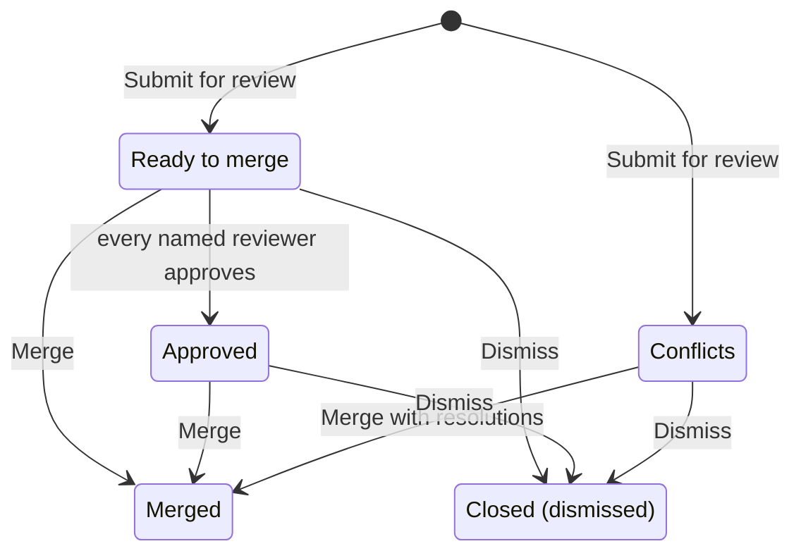

# The Review Center

*For Builders and anyone who reviews changes.*

The Review Center is where submitted drafts wait before their changes reach
**Published**, the version of the graph everyone sees. This page shows you how
to find the requests waiting for you, check exactly what each one changes,
bring it up to date, and merge or dismiss it.

> **Before you start:**
> - **Version control** must be on for your deployment. If it's off, the
>   workspace has no **Reviews** tab and the page says *Reviews are turned off*.
> - To merge, dismiss or update a request, you need permission to manage the
>   workspace's data sources — the **Workspace member**, **Data engineer** and
>   **Workspace admin** roles have it. Without it, you see only the requests
>   you raised or are named on, and you can't act on them.

## How a request moves

A **review request** (the screens also say *merge request*) is a draft someone
has submitted for review. It starts as **Ready to merge** or **Conflicts**, and
ends **Merged** or **Closed**.

| Status | Means | What you do |
| --- | --- | --- |
| **Ready to merge** | Nothing in it clashed with Published when it was submitted | Check it, then **Merge** |
| **Conflicts** | Published changed some of the same things after the draft was started | **Merge**, and choose which values to keep |
| **Approved** | Every reviewer named on the request has approved | **Merge** |
| **Merged** | Its changes are in Published | Nothing — or **Revert this merge** if it was a mistake |
| **Closed** | Dismissed without merging (the **Status** filter calls it *Dismissed / closed*) | Nothing. The draft is kept |

## Open the Review Center

1. In the sidebar, choose **Workspaces**, then choose the workspace.
2. Choose the **Reviews** tab. The requests across every data source in the
   workspace that has version control are listed, newest first, with **Open**
   selected.

You'll also land here from other places:

- **After you submit a draft.** **Submit for review** opens the **Review
  Center** page on your new request. The page's address opens that request
  directly — send it to whoever should review it.
- **From a View.** In the View's header, choose **Reviews**, then the **Pull
  Requests** tab of the **Changes & Reviews** panel. Switch between **From
  this view** and **Whole data source**; **Active only** hides merged and
  closed requests. When requests are open, a chip in the header — *2 from this
  view · 5 on data source* — opens the same tab.
- **From a data source.** On its **Versioning** tab, **Merge requests** shows
  the open ones; **View all** opens the Review Center.

> **Note:** {brand} doesn't notify anyone when a request is submitted. Send
> your reviewer the link.

## Find the requests that need you

### The four counts

| Card | Counts |
| --- | --- |
| **Open requests** | Requests not yet merged or dismissed |
| **Ready to merge** | Requests marked **Ready to merge** or **Approved** |
| **Needs attention** | Requests with conflicts, or whose draft has fallen behind Published |
| **Raised by you** | Requests you submitted |

**Open requests** and **Raised by you** also switch the list to those
requests. To list only the ready or troubled ones, use the **Status** filter.

### Search and filter

- Switch between **Open**, **Raised by you** and **All**.
- Type in **Search by title, branch, or author…** — it matches data source
  names too.
- Narrow by **Status**, **Author** or **Source** (data source). Each appears
  when there is more than one to choose from, and a **Status** you pick
  overrides the **Open** switch.
- **Clear** resets the filters and the search. The number on the right says
  how many requests match; **Show more** lists the next 20.

### What each row tells you

- **Who raised it** and its **title** — or *Publish draft by* and their name
  when they didn't give one.
- Its **status**, plus an amber **behind** chip (for example **behind 2**) when
  Published has moved on since the draft was last brought up to date.
- The **draft's name → main**. *main* is Published.
- The **data source**, the **number of changes** (added, modified, removed),
  and **when** it was raised.
- **Reviewers**, as avatars, when the request names any.
- **Dismiss**, to reject it from the list. See
  [Dismiss a request](#dismiss-a-request).

## Check what a request changes

1. Select a request. Its drawer opens with the title and status — and, when
   reviewers are named, how many have approved (for example **1/2**).
2. Read it from the top:
   - **Description** — the author's context, if they gave any.
   - **Overview** — the draft and its target (**main**), who opened it and
     when, the draft's owner, and any reviewers (✓ marks those who've
     approved).
   - **Changes** — each edit recorded in the draft, with who made it. Expand
     one to see what it changed.
   - **Views** — Views the draft creates or changes (**New view**,
     **Imported**, **Layers edited**). They *go live when this merges*.
   - **Files changed** — every entity and relationship the request adds,
     modifies or removes. Expand a row to compare before and after.
   - **Activity** — when it was opened, approved, merged or closed, and by
     whom.
3. To see the changes on the canvas, choose **Browse this branch’s changes**
   (shown when the draft was started from a View). That View opens on the
   draft, with its changes marked.

People who can manage the workspace's data sources can fix a request's title
or description: choose the pencil (**Edit title & description**), make the
change and choose **Save**.

## Merge a request

1. Open the request.
2. If the drawer says *This draft is behind **main** by N commits*, choose
   **Pull latest** — it takes the place of **Merge** until the draft is up to
   date. Then:
   - *Already up to date — you can merge now.* means nothing new came in.
   - **You’re up to date — here’s what came in** lists the changes published
     since the draft started, and who made them. The draft's own edits are
     kept on top. Choose **Got it**.
   - If incoming changes clash with the draft, **Review changes from main**
     opens — see [Resolve conflicts](#resolve-conflicts). Here, **Merge with
     resolutions** only brings Published's changes into the draft; you still
     merge in the next step.
3. Choose **Merge**.
4. If the draft and Published changed the same things, **Review changes from
   main** opens. Resolve the conflicts, then choose **Merge with resolutions**.
5. The drawer closes. If the draft was started from a View, {brand} opens that
   View on Published, where a banner says *Merged — your changes are now
   live*, with **View in history**.

> **If you see "This PR needs approval from its reviewers before it can be
> merged":** the request names reviewers, and not all of them have approved
> yet. See [Approve a request](#approve-a-request).

### Resolve conflicts

A conflict means the draft and Published both changed the same field of the
same entity. **Review changes from main** says how many changes need your
decision. *Everything else merges automatically* — only real clashes are
listed.

1. For each field, compare the **Original** value with the two versions:
   **Your version** (the draft's value, even when you're reviewing someone
   else's draft) and **Incoming** (Published's value). Choose one, or choose
   **revert** to keep the original.
2. Where one side deleted an entity that the other changed — *Deleted on main,
   but you edited it.* or *You deleted this, but main changed it.* — choose
   **Keep it** or **Accept deletion**.
3. Choose **Merge with resolutions**.

**Keep all mine** and **Take all incoming** decide every field at once, and
**Filter entities…** shortens a long list. **Delete instead** deletes an
entity on merge rather than keeping either version. If anything still clashes,
the dialog says *Some fields still conflict — adjust and retry.* **Cancel**
leaves the request as it was.

## Approve a request

**Approve** appears only on a request that names reviewers. Requests submitted
in {brand} — from the **Publish your draft** dialog, or after importing a View
— don't name any, so they need no approval: anyone who can manage the
workspace's data sources can merge them. Requests created by an integration
can name reviewers.

When a request names reviewers:

1. Open it. **Overview** lists the reviewers, and the pill beside the status
   says how many have approved.
2. Choose **Approve**. *Approved.* confirms it, and ✓ appears beside your name.
3. When every named reviewer has approved, the status becomes **Approved** and
   **Merge** goes through.

You never see **Approve** on a request you raised yourself.

## Dismiss a request

Dismissing rejects a request: nothing is applied to Published. The draft
itself is kept, so its author can carry on editing, submit it again, or
discard it.

1. Open the request and choose **Dismiss**. *Dismiss this merge request?*
   explains what will happen.
2. Choose **Dismiss request**, or **Keep reviewing** to go back.
3. *Request dismissed — no changes applied.* confirms it. The request is now
   **Closed**.

In the list, a row's **Dismiss** does the same: it asks *Dismiss?* — choose
the tick to confirm, or the cross to cancel.

## Ask for changes

There's no "request changes" button. To get a request changed:

1. Tell the author what needs to change, with the request's link, wherever
   your team talks.
2. The author opens the draft — **Browse this branch’s changes**, or **Resume**
   under **Your work** on their Dashboard — and saves the fixes with **Review &
   Save**. Anyone who can edit the data can make small fixes too: choose
   **Edit**, then the draft under **Continue a draft**.
3. Open the request again. Everything saved to the draft is already part of
   it — nobody needs to submit it again.

See [Editing in a Draft](/guide/editing-in-a-draft) for the editing itself.

## What merging does

- The draft's changes land on Published as **one new revision** in the
  history.
- The draft closes as merged, so it no longer appears among the open drafts.
- Views the draft created or changed go live with it.
- The graph that Views read catches up within moments — see
  [After you publish: is it live yet?](/guide/editing-in-a-draft#after-you-publish-is-it-live-yet)

Merged the wrong thing? Open the merged request and choose **Revert this
merge**. It adds a new revision that undoes the merge, and the history is
kept. See
[Undo vs. Restore](/guide/versioning-change-control#undo-vs-restore--the-distinction-that-matters).

If someone sends the draft straight to Published with **Publish now** while its
request is open, {brand} first warns them that this skips the open review. The
request then closes as merged, and its **Activity** says *Published directly
by …, bypassing this review*.

## Who can do what

| Action | Who |
| --- | --- |
| See every request in the workspace | People who can manage the workspace's data sources — the **Workspace member**, **Data engineer** and **Workspace admin** roles |
| See a request | Also its author, and anyone it names as a reviewer |
| **Merge**, **Pull latest**, **Dismiss**, edit the title and description, **Revert this merge** | People who can manage the workspace's data sources |
| **Approve** | The same people — except the request's author. Only the named reviewers' approvals count towards **Approved** |

Organisation-wide admin roles can do all of these in every workspace. People
who open an Enterprise View from outside its workspace don't see **Reviews**.

## Where to next

- [Editing in a Draft](/guide/editing-in-a-draft) — when you need to make the changes a reviewer asked for.
- [Versioning & Change Control](/guide/versioning-change-control) — when a merged change needs undoing, or you want the whole picture.
- [Ways of Working](/guide/ways-of-working) — when your team is agreeing who reviews what, and when **Publish now** is fine.
- [Import & Export](/guide/import-export) — when you'd rather bring a large batch of changes in from a file.
