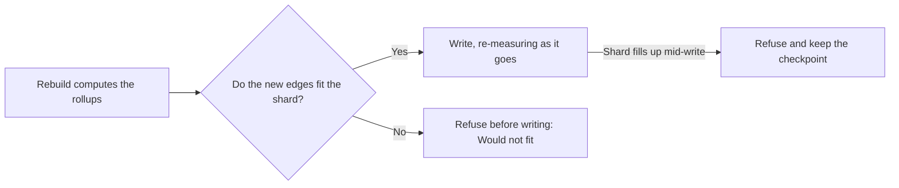

# Rollup Capacity & Large Graphs

*For Administrators.* "My rebuild is slow, or too large — what can I change?"
This page answers that. Every rebuild of rolled-up lineage writes into the
graph store, and a shard that fills up refuses writes for **every** graph on
it, so {brand} measures the room before it writes. Here you'll learn where to
see that measurement, which limits you can change and where, and what to do
when a rebuild says the rollups **would not fit** or runs slowly.

> **Before you start:** The fleet defaults and the graph store's own limits
> are for Super admins. A data source's **Rollup storage**, and retrying or
> pausing its rebuilds, are open to anyone who manages data sources in its
> workspace. For the day-to-day refresh and rebuild tasks, see
> [Data Freshness & Ingestion](/guide/data-freshness).

---

## My rebuild is slow or too large — what can I change?

| What you see | Change this first | Details |
| --- | --- | --- |
| A rebuild was refused: **Would not fit** | Set the source's **Rollup storage** to **Auto**, or free or add memory on its shard. | [When a rebuild says "would not fit"](#when-a-rebuild-says-would-not-fit) |
| A rebuild is slow: **Recomputing · narrowing**, or *Going slower to fit the graph store* | Usually nothing — it's adapting and keeps going. If it may run out of time, give it more with **Adjust this run**. | [When a rebuild says a query was too large or timed out](#when-a-rebuild-says-a-query-was-too-large-or-timed-out) |
| A rebuild failed: **Query too large** | Raise the per-query memory ceiling on the node. | [Adjusting the graph store's own limits](#adjusting-the-graph-stores-own-limits) |
| A rebuild failed: **Timed out** | Resume it. If the store is merely slow, raise **Scan timeout** or **Stall window**, or re-trigger with **Gentle**. | [When a rebuild says a query was too large or timed out](#when-a-rebuild-says-a-query-was-too-large-or-timed-out) |
| A rebuild failed: **Out of property names** | Nothing here helps — the graph must be recreated. | [Watch the property-name budget](/guide/data-freshness#watch-the-property-name-budget) |
| A shard is filling up | Add memory to it, or move a graph off it. | [Where to see it](#where-to-see-it) |
| A view says the store refused part of a read | Narrow the selection, or raise the node's limit. | [When the canvas says the store refused part of a read](#when-the-canvas-says-the-store-refused-part-of-a-read) |

---

## What the write budget measures

A FalkorDB graph lives entirely on **one shard** — a cluster spreads graphs
across shards, it never splits one. So the question a rebuild must answer is
not "does the cluster have room?" but "does *this graph's* shard have room?".

Before it writes, a rebuild reads the memory in use and the memory limit
(`maxmemory`) on the shard that owns the graph, and allows the write only
while the **new** rollup edges fit under a reserve:

> free for rollups = maxmemory − reserve − memory in use − what other running
> rebuilds hold
>
> edges that fit = free for rollups ÷ bytes per rollup edge

What follows from that:

- **Only growth is charged.** Edges the graph already holds are rewritten in
  place and cost nothing new.
- **Adding memory to a shard is enough.** Raise its `maxmemory` and the next
  rebuild sees the room. No setting in {brand} has to change.
- **The reading is fresh every time** — when the rebuild starts, after it has
  computed the result, before each overflow wave, and every million edges
  written during the apply. A shard that fills up during a long rebuild is
  caught as a loud refusal you can resume from, not as an outage.
- **Two rebuilds can't both pass on the same room.** A rebuild that has been
  allowed to write holds what it still has to write, and every other
  rebuild's budget counts that as already used — until the writes land or the
  job ends. The capacity card and any refusal say what is held, and by how
  many rebuilds.
- **The container counts too.** {brand} also works out how much room the
  node's container has left for its next fork — when it saves to disk or
  resyncs a replica — from the container limit your deployment declares, or a
  cautious estimate. The tighter of the two limits governs.

A shard with no `maxmemory` can't be measured. There the rebuild falls back to
a fixed edge cap, and its message says so; set `maxmemory` on the node to let
the budget read real headroom.

---

## Where to see it

**Administration → Graph store** is the whole picture: every node of every
graph store, masters and replicas, with what each holds, how far behind its
replicas are, and which data source owns each graph. Start there when a
figure below looks wrong — see [The Graph Store](/guide/graph-store-topology).

**Ingestion → Freshness → Graph store capacity.** One row per master: a meter
of memory in use with the reserve marked on it, what is free after the
reserve (and what running rebuilds already hold), how many more rollup edges
that is, and the sources whose rollups live there. A node that answered but
has no `maxmemory` says *Cannot govern*; one that didn't answer says
*Unreachable*, with the reason. Select a source to open its drawer. A red
**N would not fit** filters the table to sources whose last rebuild was
refused. **Re-measure** takes a fresh reading; Super admins also get **Open
Graph store** and **Adjust limits**, which opens the **Aggregation defaults**
dialog.

**A data source's profile → Where this lives.** Which node holds the source's
graph, its shard, that node's health and memory, its replicas and their lag,
and how many other graphs share the shard. In dedicated projection mode the
rollups have their own graph, which can be on a different shard — the card
shows both and says so.

**A source's drawer → Capacity.** The source's **Footprint** (edges × bytes
per edge, measured by its last rebuild, or the planning figure until then),
its **Placement**, its shard's **Headroom**, its **Property names**, the
**Last decision** about what to store, and **Before the next rebuild**:
whether **Full detail** would fit today and what **Auto** would store.

**Job History → Re-trigger aggregation.** The same check at the top of the
dialog, worked out again as you change **Rollup storage**, the reserve, bytes
per edge or the ceiling — so you know before the job is queued.

**Administration → Infrastructure → Memory headroom.** The masters the health
probe reached, with the reserve marked and what still fits, and a link to the
Graph store page for the replicas and lag it can't see.

---

## The limits, and where they are set

Every rebuild takes each setting from the first of these that sets it: **the
job's own settings → the source's Rollup storage → the fleet defaults → the
deployment's environment.**

The fleet defaults live in the **Aggregation defaults** dialog: **Ingestion →
Freshness → Graph store capacity → Adjust limits** (Super admins).

| Limit | What it does | Where |
| --- | --- | --- |
| **Shard memory reserve** | Share of a shard's `maxmemory` a rebuild must leave free — for live queries and every other graph on that shard. Default 20%. | Aggregation defaults, or per job in **Advanced tuning** |
| **Bytes per rollup edge** | What one stored edge is assumed to cost when free memory is turned into an edge count. Each successful rebuild **measures** the real figure for its graph and uses it next time; set this only to pin the estimate by hand. Default 512 B. | Aggregation defaults, or per job |
| **Edge ceiling** | An *optional* cap on the total edges a graph may store, on top of the measured budget. Leave it empty — the shard governs. Set it only to hold a graph below what its shard could take. | Aggregation defaults, or per job |
| **Auto’s appetite ceiling** | An *optional* cap on how much full detail **Auto** stores, however much room there is. Its default, 50,000,000, is also its maximum, so out of the box it doesn't bind: Auto stores full detail while the shard's budget can hold it and the job's wall clock can finish writing it. | Aggregation defaults (fleet only) |
| **Estimate margin** | Slack on the upper-bound estimate a **Full detail** run is checked with before anything is computed, so a loose estimate doesn't refuse a cube the exact count would pass. Default 25%. | Aggregation defaults (fleet only) |
| **Rollup storage** | **Full detail** (the shipped default) pre-creates every combination, so no drill comes back thin; a cube the shard can't take is refused before anything is written. **Auto** stores full detail while it fits and the much smaller depth-diagonal otherwise, deriving finer detail on demand: slower drills on the largest graphs, but it degrades instead of failing. | Aggregation defaults or **Automation** (fleet), a source's drawer (this source), Re-trigger (this run) |
| **Memory flush** | The share of the rebuild worker's own memory limit at which it writes what it holds to the graph early and frees it — so a graph that produces more than the worker can hold flushes instead of being killed. Default 60%. Needs the worker's memory limit to be readable. | Aggregation defaults (fleet only) |
| **Scan floor** | The narrowest scan a rebuild descends to under the graph store's per-query pressure before it concludes one row is too large. Default 1 row: the rebuild narrows all the way. | Aggregation defaults, or per job |
| **Scan timeout** / **Write timeout** | How long one read scan (default 30 s), or one write or delete batch (default 60 s), may run before the store stops it. Capped by the store's own **query time cap** (`TIMEOUT_MAX`) — see below. | Aggregation defaults, or per job; raisable on a running job |
| **Graph store limits** | The store's own query time cap (`TIMEOUT_MAX`), per-query memory ceiling (`QUERY_MEM_CAPACITY`) and effects threshold, set on the node while it runs and checked against the container's size. | **Administration → Graph store → Adjust limits** (Super admins) |
| **Stall window** | How long a job may make no progress before it is stopped. A job's own **Stall timeout** wins over the fleet default. Narrowed scans and retries count as progress. Default 3 hours. | Aggregation defaults (fleet), per job as **Stall timeout**; raisable on a running job |
| **Wall clock** | The longest a job may run in total — never less than its stall window. Default 24 hours. | Aggregation defaults, or per job; raisable on a running job |

The **Aggregation defaults** dialog shows each value with where it came from —
**Set here** or **Environment default** — and, as you edit the reserve or
bytes per edge, restates how many more rollup edges each measured shard would
take *before* you save. One figure is set by the deployment and shown for
information only: how often the apply re-measures the shard.

> **Tip:** None of the re-trigger profiles sets the edge ceiling, on purpose.
> A ceiling on a job wins over the measurement, so a number left over in the
> defaults from an older version — 25,000,000 in particular, once the shipped
> default — would hold every rebuild at that many edges however much memory
> the shards have. If a refusal names the ceiling, clear it.

### The query time cap, and clusters

The **Scan timeout** and **Write timeout** can't exceed the store's own query
time cap (`TIMEOUT_MAX`), read from the node; the editors show the cap in
force. The shipped Docker Compose file, the base Kubernetes manifests and the
Helm chart set it to 180 seconds; the production cluster overlay sets 120
seconds.

In a **cluster**, every write — including a rebuild's write and delete
batches — is also held to two fifths of the cluster's node timeout: 6 seconds
with the overlay's 15-second node timeout. This applies whatever the **Write
timeout** or the query time cap says, and the editors don't show it. It
exists because a write that outlasts the node timeout can get its master
voted out mid-batch; a batch that needs longer is halved instead.

---

## When a rebuild says "would not fit"

The rebuild measured the shard and refused **before writing anything**. Its
message carries the whole record: the shard, the edges and bytes needed, what
was free of `maxmemory` after the reserve, the shortfall, and which rule
governed. On **Freshness** the source shows **Would not fit**, and the
drawer's **How to resolve** and **Capacity** point to the ways out, in this
order:

1. **Set this source's Rollup storage to Auto** in its drawer's **Act** stage.
   Auto stores the depth-diagonal instead of the full cube, which is usually
   small enough to fit. You can set it before a large source's first build.
2. **Free or add memory on that shard.** The next rebuild reads it — nothing
   else has to change.
3. **Move the graph.** A dedicated projection puts the rollups in their own
   graph, which can land on another shard.
4. **If the headroom is real**, lower the shard memory reserve or correct
   bytes per rollup edge in **Aggregation defaults** — or clear an explicit
   edge ceiling if the message says one governed.

A refusal is deterministic: the job isn't retried as it is. If automatic
rebuilds keep failing to clear the problem — three in a row by default —
automation stops for that source and shows **Needs a person** until someone
selects **Resume automation** in its drawer.

**A rebuild refused part-way through** (the shard filled while it was
writing, usually because another graph on the same shard grew) keeps its
checkpoint. Free memory, then in **Job History** open the job's re-trigger
dialog and select **Resume from cursor** rather than **Re-trigger from
scratch**. The next successful rebuild tidies any partial result.

---

## When a rebuild says a query was too large or timed out

The graph store limits every **single query**: a per-query memory ceiling
(`QUERY_MEM_CAPACITY`, shown as *per-query limit* on the capacity card) and a
per-query time limit. Neither says anything about the shard's memory — the
store is healthy — and a rebuild doesn't fail on either. It **goes slower
until every query fits**:

1. **It reads one scan at a time.** The first refusal in a run drops read
   concurrency to 1 for the rest of the run.
2. **It reads keys only.** The widest scan in the pipeline switches to two
   passes — a light key scan, then a lookup of only the keys that need
   comparing — instead of narrowing further.
3. **It narrows.** Scans halve down to the **scan floor** (default: one row)
   and grow again only after a run of successes. Write and delete batches
   halve the same way, down to a single row.
4. **It waits.** A narrowest scan that keeps timing out is retried with
   backoff, and the waiting counts as progress for the stall window.

Only two things stop it. A **single row** larger than the per-query memory
ceiling ends that rebuild: the message names the scan, the row's ID range and
the ceiling, and the fix is the ceiling — see
[Adjusting the graph store's own limits](#adjusting-the-graph-stores-own-limits).
And a narrowest scan that keeps timing out through every retry means the
store isn't answering: the job fails as an outage, keeps its checkpoint, and
**Resume from cursor** continues it once the store answers.

**Where to see it.** A running job shows *Going slower to fit the graph
store* in Job History with its current width, concurrency and strategy, and
Super admins see **· narrowing** on the source's **Recomputing** badge on
Freshness. Every run's **Run settings** lists what it ran with — each value
marked **Job override**, **Fleet default**, **Learned from last run** or
**Environment** — and what it adapted to.

**Worker memory.** The worker holds results in its own memory while it
computes. It writes them to the graph early when its pair cap is reached —
and, under a container memory limit, when its memory use crosses the
**Memory flush** share — so a graph that produces more than the worker can
hold goes slower instead of being killed. The run's record says so, for
example *Flushed 3× on worker memory (peak 2.9 GB of 4.0 GB)*.

**It remembers.** What a rebuild had to do is stored for the source, and the
next rebuild starts from there (never wider than its settings, so this only
makes a run more careful), growing again during the run to test whether the
narrowing is still needed.

**The Gentle profile.** For a graph the store keeps refusing, the **Gentle**
profile in the re-trigger dialog — narrow scans, one read at a time, generous
pacing, a longer scan timeout — starts a run the way the narrowing would end
up anyway. After a **Query too large** or **Timed out** failure, the
re-trigger dialog pre-selects it and says why.

**Time limits are yours to raise.** The scan and write timeouts, the stall
window and the wall clock are in **Aggregation defaults** and per job; the two
per-query timeouts are capped as described in
[The query time cap, and clusters](#the-query-time-cap-and-clusters). A
**running** job's limits can be raised without cancelling it: in Job History,
open **Adjust this run** for **Stall window** (**+1 h** to **+12 h**), **Wall
clock** (**Double it**) or the **Per query** **scan** and **write** timeouts —
or, in the **Flat** view, **Extend all by +3 h** for every running job at
once.

**So is the load it puts on the store.** **Adjust this run** also offers **Go
gentler**: **Pace ×2**, **Pace ×4**, **Serial reads**, **Halve scans** and
**Smaller batches**, or **Back to settings** to undo them. Each applies from
the next write, wave or scan without cancelling the job, the narrowing may
still go further on its own, and the run's record lists them as *Changed
while running*. The scan floor, chunk sizes and Rollup storage change only on
the next resume or re-trigger.

---

## Adjusting the graph store's own limits

Two limits belong to the graph store itself, not to a rebuild: the **query
time cap** (`TIMEOUT_MAX` — every scan and write timeout is capped by it) and
the **per-query memory ceiling** (`QUERY_MEM_CAPACITY` — the one thing a
rebuild can't narrow its way past when a single row exceeds it). Both can be
changed while the store runs, so a Super admin can adjust them without a
redeploy.

On **Administration → Graph store**, every node shows its limits (for example
*per-query limit 512 MB · query time cap 180 s · 4 query threads*), and each
master has **Adjust limits** — including a node that holds no rollups yet.
The same dialog opens from **Infrastructure**, from a failed source's
guidance (*Raise the per-query limit on …*, for Super admins) and from the
Gentle pre-selection in the re-trigger dialog.

1. Select **Adjust limits**. The **Graph store limits** dialog reads the node
   fresh: its memory, ceiling, time cap, default time limit and thread count.
2. Change **Query time cap (TIMEOUT_MAX)** (1–3,600 seconds) or **Per-query
   memory ceiling (QUERY_MEM_CAPACITY)**. To raise the ceiling, also fill in
   **Container memory limit** and **Concurrent queries at the ceiling**; the
   dialog restates the sizing rule as you type.
3. On a store with several nodes, tick **Apply the same limits on every
   primary node, not only this one.** to change every node of the store at
   once — replicas included, so a change survives a failover.
4. Select **Review change**, check the list, then select **Apply now**. Each
   node is set, read back and checked, the change is logged with your name,
   and every provider on the node uses the new cap from its next query.

Every check refuses *before* anything is set:

- A time cap is never set below the node's own default time limit.
- `0` (unlimited) is refused for the memory ceiling, and so is a ceiling
  above the node's `maxmemory`. Lowering it needs nothing else.
- **Raising the memory ceiling needs the container's memory limit** — {brand}
  can't read it — and is refused, with the shortfall, when the container
  can't back it: `1.25 × maxmemory + concurrent queries × 1.3 × ceiling +
  replication backlog + replicas × replica output buffer + overhead` (256 MiB,
  or 1 GiB from 32 GiB of `maxmemory`). *Concurrent queries* is how many may
  hold the ceiling at once — at most the node's thread count, since the
  ceiling is charged per thread; plan for 2 when the rebuild is the only heavy
  reader.

**It lasts until the store restarts.** The dialog hands you a configuration
fragment — for example `TIMEOUT_MAX 300000 QUERY_MEM_CAPACITY 1073741824` —
for whoever runs the deployment to add to `FALKORDB_ARGS`, so the change
survives a restart. They should keep `FALKORDB_SERVER_TIMEOUT_MAX_MS` in step
with the time cap: it's only the fallback {brand} uses until it has read a
node, but a wrong fallback would cap the first queries after a restart too
low. Setting `FALKORDB_CONTAINER_MEMORY_BYTES` in the deployment prefills the
container field for everyone (and the dialog refuses a larger figure);
otherwise the dialog remembers what you entered for each node.

---

## When the canvas says the store refused part of a read

The canvas reads rollups in pages and batches, and those queries are bounded
by the same two limits as a rebuild's scans. A read that meets one doesn't
fail and doesn't silently drop what it couldn't fetch: it **narrows**. A
refused page is halved and re-read from the same position, down to 500 rows;
a refused batch is split in halves, down to a single entity; a timeout at the
narrowest width is retried once, briefly. A read that completes after
narrowing is complete and leaves no mark.

Only what is still refused at the narrowest width is lost — and then the
canvas says so: *The graph store refused part of this read at its per-query
memory limit — showing what it could read after narrowing.* with *Narrow the
selection, or raise the per-query limit on the store.* (or, for a time-out,
*The graph store timed out on part of this read …* with *… raise the query
time cap on the store.*). For a Super admin it adds **Adjust graph store
limits**, which opens the limits of the node the read was bounded by. Such a
result is never cached as complete.

---

## Known limits

- A graph can hold at most **65,534** property names, and names are never
  freed; a source that uses them up can't be rebuilt until its graph is
  recreated. See
  [Watch the property-name budget](/guide/data-freshness#watch-the-property-name-budget).
- In a cluster, each write is capped at two fifths of the cluster's node
  timeout whatever the timeouts say (see
  [The query time cap, and clusters](#the-query-time-cap-and-clusters)).
- **Auto** can still be refused if the shard can't take even the
  depth-diagonal; free or add memory.
- The rebuild **worker**'s memory flush reads the worker's memory limit; on a
  host without one, only the pair cap bounds worker memory.
- The **Full detail** check before the next rebuild is *unknown* until a
  source has completed one rebuild — the estimate it needs is recorded then.
- A single row larger than the graph store's per-query memory ceiling still
  ends that rebuild; the message says which row, and raising the ceiling is
  the fix.
- A change to the store's limits lasts until the store restarts; the dialog
  hands over the fragment that keeps it. The container check trusts the
  figure entered (or `FALKORDB_CONTAINER_MEMORY_BYTES`), since {brand} can't
  read the container limit. `THREAD_COUNT`, `OMP_THREAD_COUNT` and
  `CACHE_SIZE` can only be set when the store starts.
- Narrowing on the canvas covers the rolled-up lineage reads; other reads —
  trace drills, children, top-level pages — keep their usual behaviour under
  the store's limits.

---

## Where to next

- [Data Freshness & Ingestion](/guide/data-freshness) — when you want to
  rebuild, retry or pause a source.
- [The Graph Store](/guide/graph-store-topology) — when you need a shard's
  memory, replicas and placement.
- [The aggregation pipeline](/docs/aggregation-pipeline) — when you want the
  mechanism and every environment setting.
- [Automatic reconciliation](/docs/feature-aggregation-reconciliation) — when
  you want to know how automatic rebuilds are scheduled.
