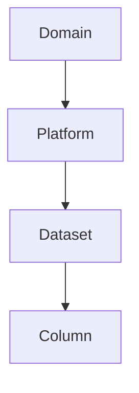
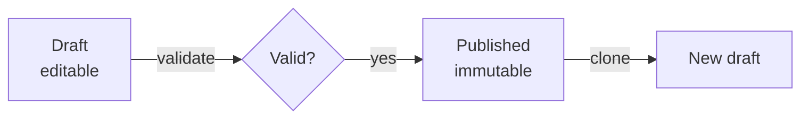

# The Semantic Layer (Ontology)

```tour-semantic-layers
```

*For Builders and curious Viewers.* The **ontology** is what turns a raw graph of
anonymous nodes into a *readable* picture with meaning, colour, and structure.
This page explains it without the jargon — what it is, why it's versioned, and
how to evolve it safely.

> **Note:** *In one line* — the ontology is your data's **shared dictionary**: it
> defines what each type of thing *is*, how things relate, and how they *look*.

---

## Why a semantic layer exists

Without an ontology, a graph database just gives you dots and lines. The ontology
adds the meaning a human needs:

- **Types** — *this* dot is a Dataset, *that* one is a Dashboard.
- **Relationships** — *this* line means "feeds," *that* one means "contains."
- **Appearance** — Datasets are blue with a table icon; Domains are large and
  green.
- **Structure** — Domains contain Datasets, which contain Columns.

Because everyone shares the same dictionary, a graph means the *same thing* to
everyone who opens it. That shared understanding is the whole point.

---

## What's inside an ontology

### Entity types
The kinds of *thing* in your world — for example **Domain, Platform, Dataset,
Table, Column, Dashboard, Pipeline**. Each entity type carries visual settings:

- a **colour** and **icon**,
- a **hierarchy level** (where it sits from big-picture to fine detail).

### Relationship types
The kinds of *connection*. Two broad families:

- **Lineage relationships** (e.g. "feeds", "derives from") — the flow you trace.
- **Containment relationships** (e.g. "contains") — the structure you expand.

### Hierarchy
The ontology defines the ladder of detail, e.g.
**Domain → Platform → Dataset → Column**. This is what powers
[granularity](/guide/reading-lineage) — zooming between business and column
levels.



---

## Versioning: why drafts and publishing matter

Ontologies are **versioned**, and this is a feature, not bureaucracy:

- A **draft** is editable — shape entity and relationship types freely.
- A **published** version is **immutable** — it can never silently change.

Why immutability? Because **Views depend on the ontology to render**. If the
meaning of "Dataset" could change underneath a saved View, that View would become
untrustworthy. Publishing freezes the dictionary so every View built against it
keeps rendering exactly as intended.



To change a published ontology you **clone** it into a new draft, edit, validate,
and publish a new version — leaving the old one (and everything depending on it)
intact.

### This is ontology versioning — not data versioning

> **Important:** Two different things share the word "versioning." This page is
> about versioning the **ontology** — the *meaning* layer (what entity types and colours
> stand for), where publishing freezes a version so your Views keep rendering
> correctly. That's separate from versioning the **graph data itself** — opening a
> draft branch on the actual nodes and edges, editing them, and going through a
> review-and-publish flow before they reach the shared main branch, with the
> ability to revert a single change or roll back to an earlier point in time. That
> "git for graphs" workflow is covered in
> [Versioning & Change Control](/guide/versioning-change-control).

---

## The lifecycle, end to end

1. **Create or import** a draft ontology (start from a template or an existing
   version).
2. **Define** entity types, relationship types, hierarchy, and visuals.
3. **Validate** — {brand} checks for problems like cycles or missing references.
4. **Check coverage** — compare the ontology against the *actual* types found in
   your graph, so nothing real is left undefined.
5. **Publish** — make it immutable; {brand} records the change and (where
   relevant) shows the impact.
6. **Audit** — every lifecycle event (created, updated, published) is logged for
   traceability.

---

## Source mappings (when data uses other names)

If your underlying system uses its own labels (for example a DataHub or
OpenMetadata type name), **source mappings** translate those external labels into
your {brand} entity types. {brand} can also flag **drift** — external types it
finds that *aren't* yet mapped — so your dictionary stays complete as sources
evolve.

The ontology's **Health** tab shows this at a glance: every type is marked
**exact** (matches perfectly), **case drift** (present, but the wrong
capitalisation — invisible to anything that depends on exact naming), or
**unmapped** (not in your ontology at all), with a plain-language verdict up
top.


---

## How this connects to your Views

- Entity types → the **colours, icons, and filters** you choose in the
  [View Wizard](/guide/creating-views).
- Hierarchy → the **granularity** levels you switch between.
- Relationship types → what you **trace** vs **expand**.
- Publishing → why your saved Views stay **visually stable** over time.

A well-designed ontology makes every View across the platform clearer and more
consistent. It's the highest-leverage thing a Builder or admin can invest in.

---

## Good practices

- **Keep types meaningful, not exhaustive.** A handful of clear types beats
  dozens of overlapping ones.
- **Choose colours for contrast and consistency** so the legend is easy to read.
- **Publish deliberately.** Treat a publish like a release — validate and check
  coverage first.
- **Map your sources** so external labels never show up as mystery types.

---

## Where to next

- Put the ontology to work in a View → [Creating Views](/guide/creating-views)
- Understand granularity and edge types → [Reading Lineage](/guide/reading-lineage)
- Who's allowed to publish → [Users & Access](/guide/users-access)
