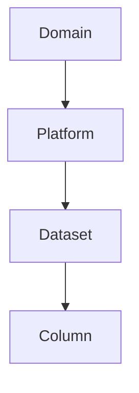
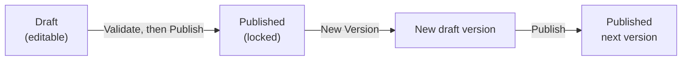

# The Semantic Layer (Ontology)

```tour-semantic-layers
```

*For Builders and curious Viewers.*

The **semantic layer** — also called the **ontology** — is what turns a raw
graph of anonymous nodes into a readable picture with meaning, colour and
structure. This page explains what it is, how to find your way around the
**Semantic Layers** page, and how to change a layer safely.

> **Note:** *In one line* — the semantic layer is your data's **shared
> dictionary**: it defines what each type of thing *is*, how things relate, and
> how they *look*.

> **Before you start:** Anyone who can read a workspace's semantic layers can
> browse them — every built-in workspace role can. Creating, changing or
> publishing a layer needs the permission to manage semantic layers: the
> **Data engineer** and **Workspace admin** roles have it, **Workspace member**
> does not. Your administrator's switches can narrow this further — see
> [Who can change a semantic layer](#who-can-change-a-semantic-layer).

---

## Why a semantic layer exists

Without a semantic layer, a graph database just gives you dots and lines. The
layer adds the meaning a person needs:

- **Types** — *this* dot is a Dataset, *that* one is a Dashboard.
- **Relationships** — *this* line means "feeds," *that* one means "contains."
- **Appearance** — Datasets are blue with a table icon; Domains are large and
  green.
- **Structure** — Domains contain Datasets, which contain Columns.

Because everyone shares the same dictionary, a graph means the *same thing* to
everyone who opens it. That shared understanding is the whole point.

## What's inside a semantic layer

### Entity types

The kinds of *thing* in your world — for example **Domain, Platform, Dataset,
Table, Column, Dashboard, Pipeline**. Each entity type carries visual settings:

- a **colour** and **icon**,
- a **hierarchy level** (where it sits from big-picture to fine detail).

### Relationship types

The kinds of *connection*. Two broad families:

- **Lineage relationships** (e.g. "feeds", "derives from") — the flow you trace.
- **Containment relationships** (e.g. "contains") — the structure you open and
  close.

### Hierarchy

The layer defines what contains what, from big picture to fine detail, e.g.
**Domain → Platform → Dataset → Column**. On the canvas this is what lets you
open a container to see what's inside it and close it again. Lineage between
closed containers is rolled up, so you can read the flow at whatever level of
detail you have open — see [Reading Lineage](/guide/reading-lineage).


```mermaid
flowchart TD
  D[Domain] --> P[Platform]
  P --> DS[Dataset]
  DS --> C[Column]
```

---

## Find your way around the Semantic Layers page

Choose **Semantic Layers** in the sidebar. The page has two parts:

- **The list on the left** — every layer you can see, with a search box, a
  status filter (**All**, **System**, **Published**, **Draft**) and a usage
  filter (**All**, **In Use**, **Unassigned**). **System** layers are built in
  and can't be edited or deleted.
- **The detail pane** — the layer you select, or the **Deployment Dashboard**.

Selecting a layer opens it on these tabs:

| Tab | What it's for |
| --- | --- |
| **Overview** | A summary — hierarchy levels, root types, containment and data-flow relationships — plus graph statistics for the data source you pick at the top of the page |
| **Schema** | The entity types and relationship types. This is where you add and change them |
| **Hierarchy** | What contains what, and which relationship types count as containment |
| **Coverage** | How well the layer covers the types actually found in a data source |
| **Health** | Whether every data source using the layer spells its types the same way (see [Source mappings](#source-mappings-when-data-uses-other-names)) |
| **Usage** | The workspaces, data sources and Views that rely on this layer |
| **History** | Every version and an activity log of who changed what (shown when your administrator allows it) |
| **Settings** | Name, description and identifier |

### The Deployment Dashboard

Choose **Deployment Dashboard** (*Overview & Assignments*) at the top of the
list for the estate-wide picture: which data sources use which layer
(**Deployment by Workspace**, **Deployment by Ontology**), a **Coverage
Matrix**, and alerts such as **Version Mismatches** — data sources using
different versions of the same layer. From here you can assign or unassign
layers and start new ones with **New Semantic Layer** or **Suggest from Graph**.

---

## Change a semantic layer safely

Semantic layers are **versioned**, and this is a feature, not bureaucracy:

- A **Draft** is editable — shape entity and relationship types freely.
- A **Published** version is **locked** — it can never silently change.

Why lock it? Because **Views depend on the semantic layer to render**. If the
meaning of "Dataset" could change underneath a saved View, that View would
become untrustworthy. Publishing freezes the dictionary so every View built on
it keeps rendering exactly as intended.


```mermaid
flowchart LR
  A["Draft<br/>(editable)"] -->|"Validate, then Publish"| B["Published<br/>(locked)"]
  B -->|"New Version"| C["New draft version"]
  C -->|Publish| D["Published<br/>next version"]
```

To change a published layer:

1. Select it in the list. Its header shows **New Version**.
2. Choose **New Version**. A new draft of the same layer opens — *Draft vN
   created — now editing*. The published version, and everything that uses it,
   is untouched.
3. Make your changes on the **Schema** and **Hierarchy** tabs (**Add Entity
   Type**, **Add Relationship Type**, or open an existing one). Your edits
   collect until you save them: **Review** lists them, **Discard** drops them,
   and **Save All** saves them to the draft.
4. Open the **⋯** menu and choose **Validate**. {brand} checks for problems such
   as cycles or missing references.
5. Choose **Publish**. The **Publish** dialog shows an **Impact Preview** (types
   added and removed) and **Readiness checks** (validation and coverage).
6. Choose **Publish Now**. The version is now locked.
7. Point your data sources at the new version: choose **Assign** (it shows how
   many are assigned) and pick them. Publishing alone doesn't move data
   sources onto a new version.

> **If Publish is greyed out:** save or discard your changes first — *Save
> changes to publish* — because publishing works on the saved layer. If the
> dialog says the publish is blocked (for example, it removes types that are
> still in use), fix the layer; platform admins have a last-resort **Force
> publish anyway (administrator override)…**.

**Clone (Independent Copy)**, in the **⋯** menu, is different from **New
Version**: it makes a separate layer named *(copy)* that starts its own history.
Use it to customise a built-in **System** layer, not to update one of yours.

### This is semantic-layer versioning — not data versioning

> **Important:** Two different things share the word "versioning." This page is
> about versioning the **semantic layer** — the *meaning* layer (what entity
> types and colours stand for). That's separate from versioning the **graph
> data itself** — editing nodes and edges in a draft, reviewing the change and
> publishing it, with the ability to undo a single change or roll back to an
> earlier point. That workflow is covered in
> [Versioning & Change Control](/guide/versioning-change-control).

---

## Start a new semantic layer

1. On the **Deployment Dashboard**, choose **New Semantic Layer** (or **New
   Draft**, the **+** at the top of the list). The **Create Semantic Layer**
   dialog opens.
2. Type a **Name** and choose a **Starting Point**: **Empty Draft** to define
   types by hand, or **From Graph** to detect them from your active data source.
3. Choose **Create Draft**. The new draft opens on its tabs.

**Suggest from Graph** goes a step further: it analyses a data source, ranks
the existing layers by how well they fit it (**Recommended Semantic Layers**),
and always offers **Create from Graph** to generate a new draft from what it
found.

## Import and export a layer

Layers travel between environments as JSON files.

- **Export:** select the layer, open **⋯** and choose **Export JSON**. Use it for
  backup, for review, or to move the layer elsewhere.
- **Import:** select a layer, open **⋯** and choose **Import JSON**, then pick
  the file. The **Import Semantic Layer** dialog checks the file and asks for
  an **Import Target**:
  - **Create New Draft** — import it as a brand-new layer.
  - **Import into "*layer name*"** — into the layer you have open. A published
    layer gets a new draft version; a draft is updated in place.

---

## Source mappings (when data uses other names)

If your underlying system uses its own labels (for example a DataHub or
OpenMetadata type name), **source mappings** translate those external labels
into your {brand} entity types. {brand} also flags **drift** — external types it
finds that *aren't* yet mapped — so your dictionary stays complete as sources
evolve.

The layer's **Health** tab shows this at a glance, across every data source the
layer is assigned to: every type is marked **Exact** (declared with exactly the
same spelling and capitalisation), **Case drift** (present, but with different
capitalisation — invisible to anything that depends on exact naming), or
**Unmapped** (not in your semantic layer at all), with a plain-language verdict
up top.


---

## Who can change a semantic layer

Two things decide it: your **permission** to manage semantic layers (see
*Before you start*), and your administrator's switches in **Administration →
Features**. All six are on by default.

| Switch | When it's off |
| --- | --- |
| **Edit semantic layers** | Layers are read-only for everyone, admins included. Publishing, cloning and exporting still work |
| **Let non-admins edit layers** | Only platform admins can change layers, even people who hold the permission |
| **Import layers** | **Import JSON** disappears; layers can still be built in the editor |
| **Export layers** | **Export JSON** disappears |
| **Suggest from graph** | **Suggest from Graph** and the match percentages disappear; people choose a layer by hand |
| **Layer history & audit** | The **History** tab disappears. Nothing is deleted — every version is still kept |

## History and audit

The **History** tab has a **Version Timeline** — every version of the layer —
and an **Activity Log** of who created, changed and published it, and when.
Restoring an earlier version creates a **new draft** with that version's
definitions, so nothing in the history is overwritten.

---

## How this connects to your Views

- Entity types → the **colours, icons and filters** you choose in the
  [View wizard](/guide/creating-views).
- Hierarchy → what opens inside what on the canvas, and how lineage rolls up
  between closed containers.
- Relationship types → what you **trace** vs **open**.
- Publishing → why your saved Views stay **visually stable** over time.

A well-designed semantic layer makes every View across the platform clearer and
more consistent. It's the highest-leverage thing a Builder or admin can invest
in.

## Good practices

- **Keep types meaningful, not exhaustive.** A handful of clear types beats
  dozens of overlapping ones.
- **Choose colours for contrast and consistency** so the legend is easy to read.
- **Publish deliberately.** Treat a publish like a release — validate and check
  coverage first.
- **Map your sources** so external labels never show up as mystery types.

## Where to next

- [Creating Views](/guide/creating-views) — when you want to put the semantic layer to work in a View.
- [Reading Lineage](/guide/reading-lineage) — when you want to see how hierarchy and relationship types show up on the canvas.
- [Users & Access](/guide/users-access) — when you need to know who can manage semantic layers.
- [Feature Switches](/guide/feature-switches) — when you're an administrator deciding who may edit, import or export layers.
