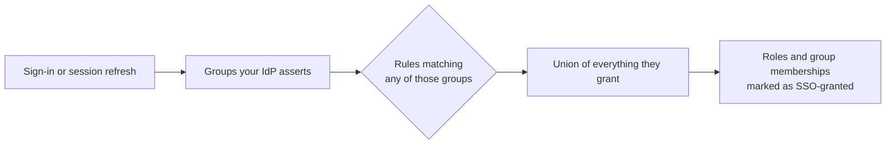

# Running Single Sign-On

*For Administrators.* Once a connection is live, the questions change. Who gets
what, and why. What happens when somebody leaves. Why one person cannot sign in
when everybody else can.

If you are still connecting your first provider, start with
[Single Sign-On](/guide/sso-setup) instead — this page assumes you have one
working.

---

## How access is decided

Everything on this page follows from one loop:

Three properties of that loop matter more than any individual setting.

**It runs constantly.** Not just at sign-in — on every session refresh too, which
happens every few minutes while somebody has the app open. A change in your
directory reaches {brand} without anybody touching this page.

**It is a union.** Somebody in three mapped groups gets everything all three
grant. There is no ordering, no precedence, and no way for a narrower group to
take away what a broader one gave. If you need somebody to have *less*, they need
to be in fewer groups — not in a group that grants less.

**It only governs what it granted.** Access created by these rules is marked as
SSO-granted, and the loop adds and removes only those. Anything an administrator
granted by hand is invisible to it and survives untouched. That is the single
most important sentence on this page, and [the next section](#three-things-that-surprise-people)
explains what it costs you.

---

## Three things that surprise people

### 1. Removing somebody from a group may not remove their access

The loop only revokes what it granted. If an administrator also granted the same
role by hand, that grant is a different thing wearing the same name — and it
stays after the directory group is gone.

It is worse than it sounds, because the two silently collapse. If the manual
grant already exists when the rule fires, the rule does not create a second one.
So the person has *one* grant, and it is the manual one, and removing them from
the group does nothing at all.

> **Note:** *What to do.* When somebody leaves, do not stop at the directory.
> Check **Admin → SSO → Diagnostics**, find them, and look at what they still
> hold. Suspending the account is the reliable way to end access immediately —
> it is re-checked on every refresh regardless of where a grant came from.

### 2. Changing a connection's trust settings can switch its rules off

A rule granting a platform-admin role only works from a **verified** connection,
and that is re-checked on **every sign-in** — not once when you wrote the rule.

So turning on *Trust unsigned payloads*, or switching a corporate portal to read
a proxy header, downgrades the connection's assurance and stops its
platform-admin rules granting from the very next login. The rule stays on the
page looking exactly as it did.

The Access mapping tab marks a rule in this state, so you are not left guessing.
But if somebody reports losing admin access shortly after a connection was
edited, this is why.

### 3. A rule with a mistyped group name fails silently

Nothing validates that `enginering` is a group your IdP actually sends. The rule
sits there matching nobody, indefinitely, and looks identical to one that works.

> **Note:** *What to do.* Group names come from the claim mapped to **Groups**.
> Open the connection's **Claim mapping** section and press **Use last real
> assertion** — the payload it loads contains the exact group strings your IdP
> sends. Copy from there rather than from your IdP's console, where the display
> name and the emitted value often differ.

---

## Access mapping

**Admin → SSO → Access mapping.** Each rule reads as a sentence: *anyone in
`engineering` from Corporate Entra gets Editor in Analytics*.

### What a rule can grant

| Target | Use it when |
|---|---|
| **A role** | The group maps directly onto one job — *everyone in `data-eng` is a Data Engineer in the Warehouse workspace*. The most common case. |
| **Membership of a group** | The access is a bundle you maintain elsewhere. The person joins an internal group under Admin → Groups and gets whatever that group carries, now and in future. Change the bundle once and every rule pointing at it follows. |

Prefer a role when the answer is one role. Prefer group membership when you would
otherwise write the same three rules for four different IdP groups — the internal
group becomes the thing you edit, and the rules stop needing to change.

### Scope is never asked

You pick a role; the scope follows from it. A workspace role asks which
workspace, an organization-wide role does not ask at all. There is no combination
of role and scope you can choose that the server will reject, because the
combinations that would be rejected are not offered.

### What cannot be granted this way

`super_admin` can never be auto-granted — not by any rule, from any connection.
It is refused when you write a rule *and* refused again every time the loop runs,
so a rule inserted straight into the database still cannot grant it.

Platform-admin roles (`org_admin`) have two conditions:

- They must be bound to **one specific connection**, never *any connection*. A
  wildcard rule would apply to an unverified connection added next year, so it is
  refused outright rather than resolved to "fine for now".
- That connection must be **verified**. See [assurance](#assurance) below.

### Assurance

How much a connection's word is worth. Derived from how it is configured, not
stored, so it always reflects reality.

| Level | Means | Can grant platform admin |
|---|---|---|
| **Verified** | The identity was proved against the provider itself — either a signature checked against a key we hold, or an answer the provider gave us directly when we asked it | Yes |
| **Asserted** | A trusted network position vouched for it — sound if your proxy strips inbound copies of the header, a full bypass if it does not | No |
| **Unverified** | We cannot tell a genuine claim from a forged one | No |

---

## Who can sign in, and how

**Admin → SSO → Settings.** Four switches. The page opens with one sentence
describing what somebody arriving at the sign-in page gets right now, because
four independent switches do not add up to that on their own — watch it as you
change them.

| Switch | On | Off |
|---|---|---|
| **Single sign-on** | Connections appear on the sign-in page | No company buttons at all. Nothing is deleted; turning it back on restores every connection as it was |
| **Passwords** | Email and password still work | SSO is the only way in. Refused if it would lock out an admin who has no SSO identity |
| **Create accounts automatically** | An account appears the first time somebody signs in through a connection | They must already exist here. An unknown person is turned away with `jit_disabled` |
| **Ask for an email first** | One field, routed to the connection owning that domain | A button per connection |

### The combination nothing warns you about

Turning **Single sign-on** off while **Passwords** is already off locks everyone
out. Neither switch can warn you on its own — you reach the state by turning the
second one off, and the server cannot refuse it the way it refuses the
lock-out-an-admin case. Existing sessions keep working until they expire, so
there is a window to put one back.

### Create accounts automatically

Off is the right answer for an organisation that wants an explicit step before
somebody has an account — the directory says who *may* sign in, but somebody here
decides who *does*. Turn it off and pre-create accounts, or send invites.

Existing people are unaffected either way. This only decides what happens the
first time a person your IdP knows and {brand} does not arrives.

### Ask for an email first

Better once you have several connections: it stops people guessing which button
is theirs, and it stops the sign-in page publishing your list of identity
providers to anyone who loads it.

Set **Email domains** on each connection first (connection editor → Login page).
An address matching nothing falls back to the password form.

> **Note:** *It will not tell you when you get this wrong.* Every miss — unknown
> domain, disabled connection, a typo in the domain list — returns exactly the
> same empty response, deliberately, so the page cannot be used to enumerate your
> connections. The cost is that a mistyped domain looks like nothing happening.
> Test with a real address after changing it.

---

## Account linking

When somebody signs in through a connection and an account with that email
already exists, what should happen? That is the **linking policy**, set per
connection in the editor's **Identity** section.

| Policy | Links an existing account when | Choose it when |
|---|---|---|
| **Strict** *(default)* | The IdP says the email is verified, the account is active, and it has **no other SSO identity** | You have one identity provider. Safest. |
| **Allow verified** | Same, but tolerates an account that already has other SSO identities | You have more than one connection and people legitimately use both |
| **Manual only** | Never automatically. The person links it themselves from their own account page | You want the account holder, not the directory, to consent to the link |
| **Disabled** | Never. Every IdP subject gets its own fresh account | Testing the refusal path. Rarely right in production |

> **Note:** *This is what makes a second identity provider look broken.* Under
> **Strict**, an account that already has an SSO identity will not link to a
> second one — the sign-in is refused with `strict_existing_sso` and the person
> is stuck. Move the second connection to **Allow verified**, and understand what
> you are accepting: anyone who controls either directory can sign in as that
> person.

---

## When a sign-in fails

The person is shown a short reference like `a1b2c3d4` and nothing else — telling
them the real reason would describe your configuration to anyone who can reach
the sign-in page. Ask them for it, then **Admin → SSO → Diagnostics** and search.

Each row explains its code in place. The full vocabulary:

| Code | What happened | What to do |
|---|---|---|
| `jit_disabled` | They are unknown here and automatic account creation is off | Create the account or send an invite, or turn the switch on |
| `sso_disabled` | The master switch is off | Settings → Single sign-on |
| `unsafe_auto_link` | An account with that email exists but the linking policy refused it. The specific reasons follow | See the reasons below |
| `strict_existing_sso` | That account already has an SSO identity, and this connection is **Strict** | Move this connection to *Allow verified*, or have them link it themselves |
| `email_unverified` | Their IdP did not say the address is verified | Fix it in the IdP, or map a claim that does carry verification |
| `policy:manual_only` | The connection never links automatically, by design | The person links it from their own account page |
| `policy:disabled` | Linking is off for this connection | Change the policy, or expect a separate account |
| `existing_status:pending` | The account exists but was never approved | Approve it under Admin → Users |
| `existing_status:suspended` | The account is suspended | Reinstate it, if that is what you want |
| `existing_deleted` | The account was deleted | Restore it, or let a new one be created |
| `sso_account_inactive` | Their linked account is no longer active | Same as suspended — check Admin → Users |
| `link_target_inactive` | The account they are trying to link to is not active | Reactivate it first |

Missing claims show as a mapping error naming the field. That is a claim-mapping
problem, not a linking one: open the connection's **Claim mapping**, load the last
real assertion, and see what actually arrived.

### Enterprise gateway connections

These make calls out to your own network, so they fail in ways the other kinds
cannot.

| Code | What happened | What to do |
|---|---|---|
| `ambient_token_missing_from_cookie` | The request arrived without your portal's session cookie | Usually correct — they are not signed in to the portal. If they say they are, the cookie is not reaching us: check its domain and `SameSite` |
| `backchannel_rejected:idp_rejected:401` | Your gateway said the session is not valid | Also usually correct. It is what makes signing out of the portal sign them out here |
| `backchannel_rejected:idp_blocked:…` | We refused to make the call | Almost always the host allowlist — Settings → *Internal gateways SSO may call*. Check the host **and the port** |
| `backchannel_rejected:idp_unreachable:…` | The gateway did not answer in time | Network or an outage on their side. Existing sessions ride out a short one; see below |
| `backchannel_rejected:idp_status:5xx` | The gateway answered with an error | Theirs to investigate — quote them the status |
| `backchannel_rejected:gateway_token_absent_at:…` | Their reply did not contain a token where we were told to look | The path in the connection's settings does not match what they actually send. Rehearse and read the reply |
| `backchannel_rejected:claims_absent_at:…` | Same, for the user details | Same fix |
| `backchannel_rejected:auth_time_absent` | Their reply carried no authentication time | Ask them to include one. Turning the requirement off is possible and quietly disables the daily re-authentication ceiling for everyone on that connection |

### "People on the gateway connection keep getting signed out"

Usually this is the feature working. That connection re-checks with your gateway
every time it renews a session, so anyone your portal has signed out is signed
out here too, within one access-token lifetime — a few minutes on the default
setting. Before treating it as a fault, ask
whether the portal considers those people signed in.

If the gateway itself is down, sessions are *not* dropped straight away — they
keep working for the connection's grace period, measured from the last time the
gateway actually answered rather than the last time we tried. A brief outage is
invisible. A long one ends sessions rather than extending them indefinitely,
which is deliberate: an outage should spend that allowance down, not renew it.

---

## Worked scenarios

### Somebody is leaving

1. Remove them from the directory groups. Their SSO-granted access disappears
   within a few minutes — no action needed here.
2. **Check what is left.** Diagnostics → find them. Anything an administrator
   granted by hand is still there and will stay there.
3. **Suspend the account.** This is the part that actually ends access, whatever
   its source, and it takes effect on the next refresh rather than the next
   sign-in.
4. If they had a linked identity you want to reuse, unlink it before the account
   is deleted — the external ID is the join key, and a new account claiming the
   same one is what "orphaned" means.

Removing the connection itself is not an offboarding tool: it turns off a route
for everyone, and grants already made stay made.

### Adding a second identity provider

Common after an acquisition, or when contractors use a different directory.

1. Connect and publish it exactly as you did the first — draft, rehearse,
   publish.
2. **Expect the collisions.** Anybody who exists in both directories will fail on
   the second connection with `strict_existing_sso`, because Strict refuses to
   add a second identity to an account that already has one.
3. Decide which you want:
   - **Allow verified** on the second connection — they can use either. Accept
     that either directory can now authenticate as them.
   - **Manual only** — the person links it themselves from their account page.
     Slower, and the consent is theirs.
4. Turn on **Ask for an email first** once both are live. Two buttons is where
   people start guessing.
5. Remember that platform-admin rules are bound to one connection. If admins
   arrive through both, each connection needs its own rule — and both must be
   verified.

### Onboarding a contractor cohort

1. Have the directory team put them in one group — `contractors-acme`.
2. One rule: *anyone in `contractors-acme` from that connection gets Viewer in
   the Delivery workspace*. Workspace-scoped, so nothing else is exposed.
3. Leave **Create accounts automatically** on for the duration, so the first
   person through does not need a ticket. Turn it off afterwards if that is your
   normal posture.
4. Confirm the group name is real: load the last assertion after the first
   contractor signs in and check the group string matches your rule exactly.
5. **When the contract ends,** removing the group from the directory removes the
   access. Then delete the rule — a rule matching nobody is not harmful, but the
   next person to read this page should not have to work out whether it is live.

---

## Keeping it healthy

**Certificate expiry.** A SAML signing certificate that expires takes every
sign-in down at once, and the date is readable months ahead. Each connection
shows its remaining days and warns from 30 days out. After rotating one, rehearse
a sign-in rather than waiting for a user to find the problem.

**The stat tiles.** The row above the tabs is the quickest health check you have:
drafts nobody has rehearsed, and failed sign-ins in the last 24 hours. Both
should usually be zero.

**Rehearse after changes.** The rehearsal from setup is available on every
connection's card at any time, not just during setup. It writes nothing and
creates no session, so there is no reason not to use it after editing a
connection.
