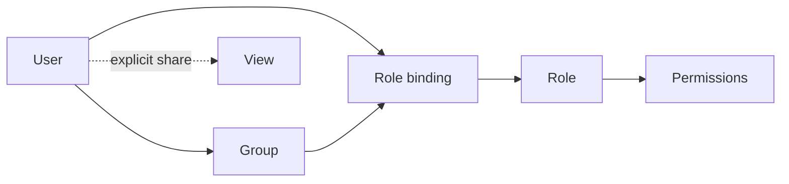

# Users & Access

*For Administrators.* Synodic's access model is layered but predictable. This
page explains how people get in, what roles mean, and how to grant exactly the
right access — no more, no less.

> 💡 **Mental model:** *People* (and **groups** of people) are given **roles**,
> roles carry **permissions**, and individual resources like Views can be
> **shared** on top. Three layers, working together.

---

## How people get in: the signup flow

Access is **approval-based**, so no one reaches your data by simply registering.

1. A person **signs up** with email and a password (strength-checked).
2. Their account enters a **pending** state.
3. An admin **approves** them in **Admin → Users** → status becomes **active**.
4. They can now **log in**; a session token is issued.

You can also **suspend/reactivate** accounts and **reset passwords** from the
same screen. Filter the list by status (**pending / active / suspended**) to find
who needs attention.

---

## Roles

A **role** is a named bundle of permissions. The built-in global roles:

| Role | Can broadly… |
| --- | --- |
| **Admin** | Everything: providers, ontologies, workspaces, users, features, announcements, permissions |
| **User** | Create and edit workspaces and Views; explore data they have access to |
| **Viewer** | Read-only — open workspaces and Views they're given |

Pick the **least powerful role** that lets someone do their job. You can always
elevate later.

---

## Global vs workspace scope

Roles can be granted at two scopes via **role bindings**:

- **Global binding** — the role applies across the *whole platform* (e.g. a
  platform admin, or an org-wide viewer).
- **Workspace binding** — the role applies only inside a *specific workspace*
  (e.g. someone is an editor in *Finance* but has no access to *HR*).

This is how you give a person broad reach in one team without exposing
everything everywhere. You can also create **custom workspace-scoped roles** for
finer control.

---

## Groups

Managing dozens of people one by one is painful. **Groups** let you bind a role
to *many* people at once:

1. Go to **Admin → Groups** and create a group.
2. Add members.
3. Bind the **group** to a role (global or per-workspace).

Now every member inherits that access, and you manage it in one place. Groups may
be **local** or, where configured, synced from an identity provider (SCIM/SSO).

> 💡 **Prefer groups over individuals** for anything beyond a handful of people.
> It keeps access auditable and easy to change.

---

## Permissions

Roles are built from **fine-grained permissions** spanning three areas:

| Scope | Examples |
| --- | --- |
| **system:** | manage providers, ontologies, users, feature flags |
| **workspace:** | create Views, manage data sources, invite members |
| **resource:** | per-View grants (editor, viewer) |

You can inspect and adjust role→permission mappings in **Admin → Permissions**.
Most teams use the built-in roles; reach for custom permissions only when you
have a genuine need.

---

## Sharing individual resources

Beyond roles, a View's owner can **explicitly share** that single View with
specific people or groups as **viewer** or **editor**. This handles the common
"just give Dana access to *this one thing*" case without changing anyone's role.
See [Managing Views](/guide/managing-views).

---

## The "My Access" page

Every authenticated user has a **My Access** page that plainly answers *"what am
I allowed to do?"* — their roles, scopes, and effective permissions. Point
confused users there before they file a ticket; it resolves most "why can't I…?"
questions on its own.

---

## Admin checklist for a new teammate

- [ ] Approve their **signup** (or confirm SSO provisioning).
- [ ] Assign the **least-powerful role** that fits.
- [ ] Bind at the right **scope** — global only if truly needed, else
      per-workspace.
- [ ] Add them to the appropriate **group** rather than binding individually.
- [ ] Tell them about **My Access** and this guide.

---

## Where to next

- Day-to-day platform health and governance → [Governance & Operations](/guide/governance-ops)
- How Views get shared by their owners → [Managing Views](/guide/managing-views)
- Access questions and fixes → [Troubleshooting](/guide/troubleshooting)
