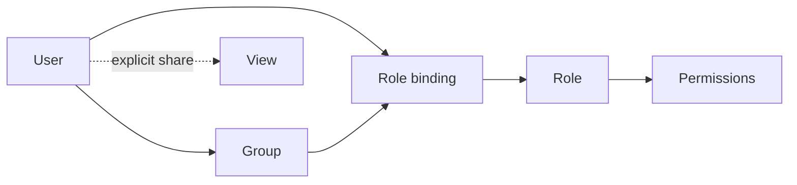
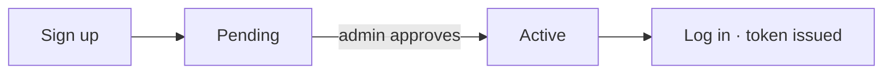

# Users & Access

*For Administrators.* {brand}'s access model is layered but predictable. This
page explains how people get in, what roles mean, and how to grant exactly the
right access — no more, no less.

> **Note:** *Mental model* — *People* (and **groups** of people) are given
> **roles**, roles carry **permissions**, and individual resources like Views
> can be **shared** on top. Three layers, working together.



---

## How people get in: the signup flow

Access is **approval-based**, so no one reaches your data by simply registering.

1. A person **signs up** with email and a password (strength-checked).
2. Their account enters a **pending** state.
3. An admin **approves** them in **Admin → Users** → status becomes **active**.
4. They can now **log in**; a session token is issued.



You can also **suspend/reactivate** accounts and **reset passwords** from the
same screen. Filter the list by status (**pending / active / suspended**) to find
who needs attention.

---

## Managing your own account

**Account settings**, in the profile menu behind your avatar, is where you
change the things about your own account that used to need an administrator:

| Setting | Notes |
|---|---|
| **Name** | First and last, plus an optional **display name** if you'd rather be shown as something else. Leave the display name blank to go back to *First Last*. |
| **Avatar** | Stored on the account, so it follows you to a new browser. |
| **Password** | Asks for your current one. Changing it **signs you out everywhere, including the device you're on** — so a password change is also how you end a session you think somebody else has. |
| **Sign out everywhere** | The same revocation without changing your password. |
| **Recent activity** | Password changes, resets, and session revocations on your account, and whether an administrator did them. History starts when your deployment was upgraded, so it will not show anything older than that. |

Your **email is not editable here** — it identifies you to your identity
provider, so changing it is a re-link an administrator performs.

If you sign in through SSO and have no password, the password section says so
rather than offering a form; ask an administrator if you need a local password
as a fallback.

> **Note:** *Why the whole session ends.* Revoking a session used to only
> tombstone the short-lived access token, and the browser would quietly obtain a
> new one seconds later. A revocation now also invalidates the refresh tokens
> behind it, which is what makes "signed out everywhere" mean it.

---

## The system administrator account

A fresh deployment seeds one administrator from `ADMIN_EMAIL` /
`ADMIN_PASSWORD`. If that password is one of the defaults published in this
project's setup documentation (`admin123`, `changeme`), the account is flagged
and **must choose a new password at first sign-in** — the API refuses everything
else until it does. Supply your own `ADMIN_PASSWORD` and no prompt appears.

Admin → Users shows a **DEFAULT PASSWORD** badge against any account still in
that state.

### Locked out

If the only administrator forgets their password there is no way in through the
UI — **Forgot password** does not send anything (this deployment has no email
infrastructure); it flags the request for an administrator to action, and in
this case that is the same person. Recover from the host:

```bash
python -m backend.scripts.reset_admin_password --email admin@example.com
```

It prompts for the new password rather than taking it as an argument, so it
stays out of shell history, and it signs out every existing session. Database
access is the authorisation model, which is why there is no HTTP equivalent.

> **Tip:** *Prefer central identity?* Administrators can configure **single
> sign-on** via **OIDC** or **SAML**, so people log in through your
> organisation's identity provider instead of a local password. Approvals and
> roles still apply on top.

---

## Invite links

The route above needs an admin to notice a pending account and approve it. An
**invite link** skips that: it carries the role, workspace and groups the person
should get, so redeeming it creates an account that is already active, already
assigned, and already signed in.

Create one from **Admin → Users → Invite by Link**. You choose:

| Setting | What it does |
|---|---|
| **Role + workspace** | What the account is granted on arrival. |
| **Groups** | Group memberships attached on signup. |
| **Send to** | Leave blank for a link anyone can use, pin an email so only that address can redeem it, or restrict to a **domain** (`company.com`) — the middle ground that makes a link safe to post in a team channel. |
| **Expires in** | 24 hours to 90 days. |
| **How many people** | A seat cap. The link closes itself once that many people have signed up. |

Privileged roles — anything granting workspace admin or system permissions —
always require a pinned email, so a forwarded link cannot escalate someone you
did not intend.

**Single sign-on.** If your deployment has an identity provider configured, an
invite link offers **Continue with &lt;your IdP&gt;** alongside the password form —
and in an SSO-only deployment that is the only route that works, since a
password chosen on the signup form would be refused at login. The provider
handshake proves who the person is; the invite's role, workspace and groups are
applied immediately afterwards. An invite is only applied to an account that has
no access yet: somebody who is already set up has already been onboarded, so a
forwarded link cannot add grants to an established account.

**Managing what you have handed out.** **Admin → Users → Manage links** lists
every outstanding link with its usage (`3 / 10`), who created it, when it
expires, and exactly who has redeemed it. Three actions:

- **Extend** — another 30 days, plus 5 more seats on a capped link. The URL you
  already shared keeps working.
- **New URL** — issues a fresh link for the same invitation and stops every URL
  already sent from working. The role, groups, seat count and the record of who
  has joined all stay put, so one invitation keeps one history. Shown once.
- **Revoke** — kills the link immediately, whatever its expiry or remaining
  seats. The first thing to reach for if one ends up somewhere it shouldn't.

Tokens are never shown again after creation, so a read-only list cannot become
somewhere credentials are harvested. Use **New URL** if you have lost the link.

**Who can invite.** Platform administrators can invite anyone, anywhere.
Workspace admins can invite into workspaces they administer, limited to
non-privileged roles — you can never grant access you do not hold yourself —
and they see and revoke only the links they created.

**Two independent switches.** In **Admin → Features**:

| `signupEnabled` | `inviteLinksEnabled` | Result |
|---|---|---|
| off | on | **Invite-only** — the default, and the usual choice |
| on | on | Open registration plus invites |
| off | off | Closed — admins create accounts directly |
| on | off | Open registration, no shareable links |

Turning **invite links** off is a kill switch: every link already in circulation
stops working immediately, not just new ones. Outstanding links stay listed so
you can review and revoke them, and any that have not expired start working
again if you turn it back on.

---

## Roles

A **role** is a named bundle of permissions, at one of two tiers: **global**
(applies across the whole platform) or **workspace** (applies only inside one
workspace).

**Global roles**

| Role | Can broadly… |
| --- | --- |
| **Super Admin** | Everything, platform-wide: providers, ontologies, workspaces, users, features, announcements, permissions. Reserved for platform owners — bind sparingly. |
| **Org Admin** | Create and manage workspaces, groups, and users, without Super Admin's full reach. |
| **Org Auditor** | Read-only across every workspace, plus the audit log and who-has-access-to-what — built for compliance review, not day-to-day work. |
| **User** | The default tier for anyone with no explicit global role. No platform-wide access on its own — what they can do comes entirely from their workspace bindings below. |

**Workspace roles** (bound separately in each workspace)

| Role | Can broadly… |
| --- | --- |
| **Workspace Admin** | Everything inside that workspace — members, settings, data sources, Views. |
| **Workspace Data Engineer** | Owns data sources, Views, and ontology assignment in the workspace, without managing members or settings. |
| **Workspace Member** | Create and edit Views; manage data sources. |
| **Workspace Viewer** | Read-only — open the workspace and the Views they're given. |

Pick the **least powerful role** that lets someone do their job. You can always
elevate later.

---

## Global vs workspace scope

Roles can be granted at two scopes via **role bindings**:

- **Global binding** — the role applies across the *whole platform* (e.g. a
  platform admin, or an org-wide viewer).
- **Workspace binding** — the role applies only inside a *specific workspace*
  (e.g. someone is an editor in *Finance* but has no access to *HR*).

This is how you give a person broad reach in one team without exposing
everything everywhere. You can also create **custom workspace-scoped roles** for
finer control.

---

## Groups

Managing dozens of people one by one is painful. **Groups** let you bind a role
to *many* people at once:

1. Go to **Admin → Groups** and create a group.
2. Add members.
3. Bind the **group** to a role (global or per-workspace).

Now every member inherits that access, and you manage it in one place. Groups may
be **local** or, where configured, synced from an identity provider (SCIM/SSO).

> **Tip:** Prefer groups over individuals for anything beyond a handful of
> people. It keeps access auditable and easy to change.

---

## Permissions

Roles are built from **fine-grained permissions** spanning three areas:

| Scope | Examples |
| --- | --- |
| **system:** | manage providers, ontologies, users, feature flags |
| **workspace:** | create Views, manage data sources, invite members |
| **resource:** | per-View grants (editor, viewer) |

You can inspect and adjust role→permission mappings in **Admin → Permissions**.
Most teams use the built-in roles; reach for custom permissions only when you
have a genuine need.

---

## Sharing individual resources

Beyond roles, a View's owner can **explicitly share** that single View with
specific people or groups as **viewer** or **editor**. This handles the common
"just give Dana access to *this one thing*" case without changing anyone's role.
See [Managing Views](/guide/managing-views).

---

## The "My Access" page

Every authenticated user has a **My Access** page that plainly answers *"what am
I allowed to do?"* — their roles, scopes, and effective permissions. Point
confused users there before they file a ticket; it resolves most "why can't I…?"
questions on its own.

---

## Admin checklist for a new teammate

- [ ] Approve their **signup** (or confirm SSO provisioning).
- [ ] Assign the **least-powerful role** that fits.
- [ ] Bind at the right **scope** — global only if truly needed, else
      per-workspace.
- [ ] Add them to the appropriate **group** rather than binding individually.
- [ ] Tell them about **My Access** and this guide.

---

## Where to next

- Day-to-day platform health and governance → [Governance & Operations](/guide/governance-ops)
- How Views get shared by their owners → [Managing Views](/guide/managing-views)
- Access questions and fixes → [Troubleshooting](/guide/troubleshooting)
