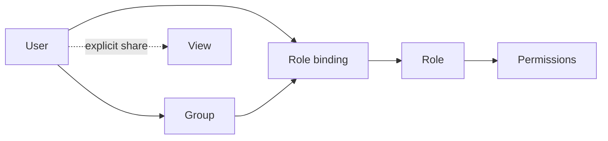
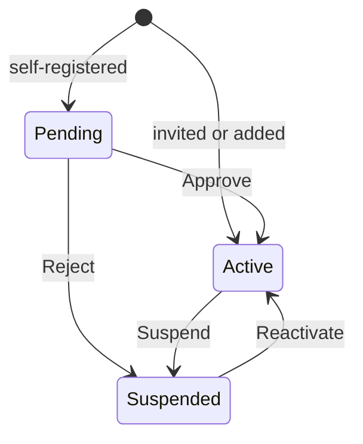

# Users & Access

*For Administrators.* This page shows how people get into {brand}, how to give
each person the right role, and how to keep access tidy as teams change — no
more access than people need, and no less.

> **Before you start:** **User Management** and **Permissions** (both under
> **Administration**) need the **Super Admin** role. **Groups** also opens for
> anyone with the `system:groups:manage` permission, which **Org Admins** have.
> Giving someone a role inside one workspace happens on that workspace's
> **Members** tab — see [Workspace Admin](/guide/workspace-admin#giving-people-access-the-members-tab).

> **Note:** *Mental model* — *People* (and **groups** of people) are given
> **roles**, roles carry **permissions**, and individual resources like Views
> can be **shared** on top. Three layers, working together.


```mermaid
flowchart LR
  U[User] --> G[Group]
  U --> RB[Role binding]
  G --> RB
  RB --> R[Role]
  R --> P[Permissions]
  U -.explicit share.-> V[View]
```

---

## How people get in

A new deployment is **invite-only**: nobody can register unless you send them
a link or create their account. Pick the route that fits:

| If you want… | Use | Where | Because |
| --- | --- | --- | --- |
| To bring in one person or a team, with access ready when they arrive | **Invite by Link** | **Administration → User Management** | The usual route. Accounts arrive active — nothing to approve. |
| To create the accounts yourself, right now — one, or a list from a spreadsheet | **Add people** | **Administration → User Management** | Accounts exist the moment you finish; you hand out setup links. |
| Anyone who reaches the sign-in page to register | **Self-registration** switch | **Administration → Features** | Off by default. New accounts wait as **Pending** until you approve them. |
| People to sign in with your company's identity provider | Single sign-on | **Administration → SSO** | See [Single Sign-On](/guide/sso-setup). Invites and roles still apply. |

Two independent switches in **Administration → Features** decide which doors
are open (see [Feature Switches](/guide/feature-switches)):

| **Self-registration** (`signupEnabled`) | **Invite links** (`inviteLinksEnabled`) | Result |
|---|---|---|
| off | on | **Invite-only** — the default, and the usual choice |
| on | on | Open registration plus invites |
| off | off | Closed — admins create accounts directly with **Add people** |
| on | off | Open registration, no shareable links |

Turning **Invite links** off is a kill switch: every link already in circulation
stops working immediately, not just new ones. Outstanding links stay listed so
you can review and revoke them, and any that have not expired start working
again if you turn it back on.

---

## Invite links

An **invite link** carries everything the person should get, so redeeming it
creates an account that is already active, already assigned, and already
signed in. Only Super Admins create invite links, because they live in **User
Management**.

1. Open **Administration → User Management** and select **Invite by Link**. The
   **Invite by link** wizard opens at **Who it's for**.
2. Choose who the link is for, enter their address, addresses or domain where
   asked, and select **Next**. Each choice sets safe limits that you can still
   change on the **Safety** step:

   | Choose | Who can use it | Starts as |
   | --- | --- | --- |
   | **One specific person** | Only that email address — forwarding it achieves nothing | 1 person, 7 days |
   | **Several people** | A separate link per pasted address, each revocable on its own | 1 each, 7 days |
   | **Anyone at a domain** | Any address at one domain (`company.com`) — safe to post in a team channel | Up to 25, 30 days |
   | **Anyone with the link** | Whoever ends up with the URL | Up to 5, 7 days |

3. On **What they get**, keep **Standard user** for most people — a team
   account with no organization-wide privileges; each workspace's admin then
   grants workspace access. Only if you must, open the organization-wide roles
   and pick one (**Organization-wide** or **Custom roles**). Optionally choose
   groups under **Add to groups**. Select **Next**.
4. On **Safety**, check **Link expires in** (**24 hours**, **7 days**, **30
   days** or **90 days**) and, for domain and open links, **How many people can
   use it** (**Just 1**, **Up to 5**, **Up to 25** or **Unlimited**). The
   **Reach** meter shows how far the link goes. Select **Next**.
5. On **Review**, check the summary and select **Generate link** (or **Generate
   *N* links** for several people).
6. Select **Copy link** and send it however you like. It is shown only once.

**You should now see** "Your invite link is ready". The link appears under
**Manage links** (below).

Two rules keep a forwarded link from giving the wrong person too much:

- **Privileged roles always need one address.** A role that grants workspace
  admin or any `system:` permission can only go on a link pinned to **One
  specific person** or **Several people**.
- **Groups need one address too, by default.** Group memberships can reach
  across workspaces, so a link that adds groups is pinned to email addresses.
  You can override this for non-privileged links — **Keep it shareable
  anyway** — after confirming you understand that anyone with the link joins
  those groups.

**Single sign-on.** If your deployment has an identity provider configured, an
invite link offers **Continue with *your provider*** alongside the password
form — and in an SSO-only deployment that is the only route that works, since a
password chosen on the signup form would be refused at login. The provider
handshake proves who the person is; the invite's role, workspace and groups are
applied immediately afterwards. An invite is only applied to an account that has
no access yet: somebody who is already set up has already been onboarded, so a
forwarded link cannot add grants to an established account.


### Managing what you have handed out

Select **Manage links** on **User Management**. The **Outstanding links**
drawer lists every link — filter by **Active**, **Revoked**, **Expired**,
**Used up** or **All**, and search by person, domain, role or workspace. Each
row shows what the link grants, who can use it, its seat count, when it
expires, and how many people joined (expand it to see who). The actions menu
on each row offers:

- **Extend** — another 30 days, plus 5 more seats on a capped link. The URL you
  already shared keeps working.
- **New URL** — issues a fresh link for the same invitation and stops every URL
  already sent from working. The role, groups, seat count and the record of who
  has joined all stay put, so one invitation keeps one history. Shown once.
- **Revoke** — kills the link immediately, whatever its expiry or remaining
  seats. The first thing to reach for if one ends up somewhere it shouldn't.

Links are never shown again after creation, so the list can't become a place
where credentials are harvested. Use **New URL** if you have lost one. **Manage
links** stays available even while **Invite links** is switched off — that's
when you most need to revoke what's still out there.

---

## Add people directly

**Add people** creates accounts straight away — nobody has to accept anything
first. It works whether or not invite links are switched on.

1. Open **Administration → User Management** and select **Add people**. The
   **Add people** wizard opens at **Who**.
2. Choose **One person** and enter their **Email address**, **First name** and
   (optionally) **Last name** — or choose **A list of people** and paste
   addresses, one per line (`Ada Lovelace <ada@company.com>` works too). Select
   **Next**.
3. On **Access**, choose what they get, exactly as for an invite: **Standard
   user** unless you need an organization-wide or custom role, plus optional
   groups. Select **Next**.
4. On **Sign-in**, choose how they first get in:

   | Choose | When | What happens |
   | --- | --- | --- |
   | **Send them a setup link** | Most of the time | The account has no password until they choose one; nobody else ever knows it. |
   | **Set a password yourself** | One person, and you'll pass it on | At least 12 characters. You will know their password, and nothing sends it for you. Not offered for a list. |
   | **Single sign-on only** | They sign in through your identity provider | No password at all. |

   **Active straight away** is ticked; untick it to park the accounts in the
   pending queue instead. Select **Next**.
5. On **Review**, select **Create account** (or **Create *N* accounts**).
6. If you chose setup links, copy each one and send it — they are shown only
   once. For a list, **Copy all *N*** copies every link at once.

**You should now see** **Account created** (or "*N* accounts created", with a
result for each address: **Created**, **Already had an account**, **Not a valid
address**, **Listed twice** or **Could not be created**).

---

## Approve pending accounts

Only relevant when **Self-registration** is switched on, or when you used **Add
people** with **Active straight away** unticked. These accounts start as
**Pending** and can't sign in until you approve them.

1. Open **Administration → User Management**. When anyone is waiting, a banner
   reads "*N* users awaiting approval".
2. Select **Review Now** (or the **Pending** tab).
3. On each row, select **Approve** — or **Reject** to turn the signup down.

**You should now see** "*name* is approved — they can sign in now." Approved
accounts start as **User**: give them workspace access next (see [Workspace
Admin](/guide/workspace-admin#giving-people-access-the-members-tab)). A
rejected signup is kept as **Suspended** and can't sign in.

---

## Roles

A **role** is a named bundle of permissions. **Organization-wide** roles apply
across the whole platform and are set per person in **User Management**.
**Workspace** roles apply inside one workspace and are granted on that
workspace's **Members** tab. Pick the **least powerful role** that lets someone
do their job; you can always raise it later.

**Organization-wide roles** — set with **Change organization access** (below)

| Role | ID | What it's for |
| --- | --- | --- |
| **Super Admin** | `super_admin` | The platform owner. Carries `system:admin`, which implies every permission everywhere: every Administration page, every workspace, user accounts, single sign-on and feature switches. Bind sparingly. |
| **Org Admin** | `org_admin` | Runs every workspace and creates new ones, manages groups, and sees Analytics. Does **not** manage user accounts or single sign-on — in Administration it opens only **Groups**. |
| **Org Auditor** | `org_auditor` | Read-only across every workspace, with the permissions to read the audit log and every role binding (`system:audit:read`, `system:bindings:read`) and to see Analytics. Can't change anything. |
| **User** | `user` | The default for anyone without an organization-wide role. No platform-wide access on its own — everything comes from workspace roles. |

> **Note:** Opening **Administration** itself needs `system:admin` or
> `system:groups:manage`. An **Org Auditor** has neither, so today it can't
> reach the **Audit Log** page in the app, even though it holds the permission
> to read the log. See [The Admin Console](/guide/governance-ops#who-can-open-each-page).

> **Note:** A workspace appears in an **Org Admin**'s or **Org Auditor**'s
> **Workspaces** list only once they hold a binding into it, directly or
> through a group. **Workspace viewer** is enough — their organization-wide
> role supplies the rest. Only **Super Admins** see every workspace without
> one.

**Workspace roles** — granted per workspace on its **Members** tab

| Role | ID | What it's for |
| --- | --- | --- |
| **Workspace admin** | `workspace_admin` | Everything inside that workspace — settings, members, deletion, data and views. Nothing outside it. |
| **Data engineer** | `workspace_data_engineer` | Owns the workspace's data — data sources, semantic layers, catalog items and views — without managing members or workspace settings. |
| **Workspace member** | `workspace_member` | The everyday contributor: creates, edits and deletes views, and manages data sources. |
| **Workspace viewer** | `workspace_viewer` | Read-only: opens the workspace's views and sees its data sources, semantic layers and providers. |

To change someone's organization-wide role:

1. In **Administration → User Management**, find the person.
2. Select **Change organization access** on their row. The **Change
   Organization Access** dialog shows their current role.
3. Pick **User**, **Org Auditor**, **Org Admin** or **Super Admin**, then select
   **Update Role**.

**You should now see** the new role in their row's **Role** column. It takes
effect on their next request.

---

## Global vs workspace scope

Roles are granted at two scopes via **role bindings**:

- **Global binding** — the role applies across the *whole platform* (for
  example a platform admin, or an org-wide auditor).
- **Workspace binding** — the role applies only inside a *specific workspace*
  (for example someone is an editor in *Finance* but has no access to *HR*).

This is how you give a person broad reach in one team without exposing
everything everywhere. You can also create **custom roles** in
**Administration → Permissions** (**New role**): choose **Global** (bindable in
any workspace or globally) or **Workspace-scoped** (only assignable inside one
workspace you pick).

---

## Groups

Managing dozens of people one by one is painful. **Groups** let you give a role
to *many* people at once.

1. Open **Administration → Groups** and select **New group**. Give it a name
   and an optional description, then select **Create group**.
2. On the group's row, select **Manage members**, then **Add**, and pick the
   people.
3. Give the group access in each workspace it should reach: open the
   workspace's **Members** tab, select **Add member**, choose **Group**, pick
   the group and a role, and select **Add to workspace**.

**You should now see** every member of the group with that role in the
workspace — and anyone you add to the group later gets it too. Deleting a
group revokes every workspace binding and view share it held; its members lose
that access on their next request.

> **Tip:** Prefer groups over individuals for anything beyond a handful of
> people. It keeps access auditable and easy to change. You can also attach
> groups to an invite link, so new people land in them.

Groups are created and managed here — SCIM provisioning isn't available, so
the page's **SCIM-synced** count reads 0. To fill groups from your
directory, use single sign-on: an **Access mapping** rule can add people to a
group each time they sign in (see [Running Single Sign-On](/guide/sso-operations#access-mapping)).
Members added that way carry a note in the group's member list: removing them
by hand only lasts until their next sign-in.

---

## Permissions

Roles are built from **fine-grained permissions** in two families:

| Family | Examples |
| --- | --- |
| `system:` | `system:admin` (everything), `system:groups:manage`, `system:audit:read`, `system:workspaces:create` |
| `workspace:` | `workspace:admin`, `workspace:view:create`, `workspace:datasource:manage`, `workspace:ontology:read` |

**Administration → Permissions** ("See exactly what each role grants — and who
has access where") is where you inspect and change them. Its search box finds
roles, permissions, people and workspaces in one place; its tabs answer five
different questions:

| Tab | Use it to |
| --- | --- |
| **Role matrix** | See what each role bundles. Create a role with **New role**; edit any role. Built-in roles can be tailored too — changes apply to everyone bound to them — and **Reset to default** restores the seeded version. |
| **Permissions** | Browse the permission catalogue, filtered by **System**, **Workspace** or **Resource**, and see which roles grant each one. |
| **Feature access** | See which roles can reach each section of the app. Read-only: to change who reaches a section, change the permissions on a role in the **Role matrix**. |
| **By user** | Pick a person and see every binding they hold — directly or through a group — and the effective permissions that result. |
| **By workspace** | Pick a workspace and see every member binding, users and groups, with the role each one holds. |

Most teams use the built-in roles; reach for custom roles only when you have a
genuine need. A custom role can be deleted only once nothing is bound to it.

---

## Sharing individual resources

Beyond roles, a View's owner can **explicitly share** that single View with
specific people or groups as **Viewer** or **Editor**. This handles the common
"just give Dana access to *this one thing*" case without changing anyone's role.
See [Managing Views](/guide/managing-views).

---

## Looking after existing accounts

**Administration → User Management** lists every account, with tabs for **All
Users**, **Pending**, **Active** and **Suspended**, and a search box that
matches names, email addresses, user IDs, roles and identity-provider names —
so "everyone from Entra" is one query.


```mermaid
stateDiagram-v2
  [*] --> Pending: self-registered
  [*] --> Active: invited or added
  Pending --> Active: Approve
  Pending --> Suspended: Reject
  Active --> Suspended: Suspend
  Suspended --> Active: Reactivate
```

The **Sign-in** column says how each account gets in: **Local** for a password
account, a chip naming each linked identity provider for an SSO one (hover it
for the last sign-in and whether SSO created the account), both together when
an account has both, and **No sign-in** for an account with neither — stranded
until you grant a reset token or a connection links it. A **System** chip leads
the cell for break-glass accounts (see below).

Next to **Joined**, **Last seen** says how long ago each person last had the
app open (hover it for the exact time, in UTC). Sort by it to find accounts
nobody uses any more; accounts never seen sort last either way.

Each row has the actions for that account's state:

| Action | What it does |
| --- | --- |
| **Approve** / **Reject** | Pending accounts only — let them in, or turn the signup down. |
| **Edit profile** | Change their name. Email is fixed, because it identifies them to an identity provider. |
| **Change organization access** | Set their organization-wide role (see [Roles](#roles)). |
| **Mark as system account** | Make it a break-glass account (see below). |
| **Reset password** | **Generate Token** (a one-time token they enter at `/reset-password`) or **Set Password** directly. |
| **End sessions** | Sign them out everywhere, now. They can sign straight back in. |
| **Suspend user** / **Reactivate** | Stop the account signing in — immediately — or let it back in. |

Clicking a row opens that person's access drawer, which leads with an
**Activity** block:

| Field | What it means |
|---|---|
| **Joined** | When the account was created. |
| **Last signed in** | The last successful sign-in of any kind — password, invite link, OIDC, SAML, portal, Enterprise Gateway, including the gateway's silent re-sign-in. |
| **Last seen** | The last time they had the app open (made any signed-in request). |
| **Last activity** | The last time they did something Activity analytics counts: opened a view, searched or traced, exported or published, or edited a view. |

Each shows the exact time in UTC and how long ago it was. **Last seen** and
**Last activity** are recorded to the nearest five minutes. All three
"Last …" values start filling in from when this tracking was deployed, so
**Not yet** means nothing has happened *since then*, not necessarily never.
The exception is **Last signed in** for SSO users, which is backfilled from
their linked identities' last sign-in.

When someone uses **Forgot password**, nothing is emailed — this deployment
has no email infrastructure. Instead a banner on **User Management** counts
the password reset requests waiting; use **Reset password** on their row and
pass the token on.

---

## The system administrator account

A fresh deployment creates one administrator from its `ADMIN_EMAIL` and
`ADMIN_PASSWORD` settings. If that password is one of the defaults published
in this project's setup documentation, the account must choose a new password
at first sign-in — the API refuses everything else until it does. Supply your
own `ADMIN_PASSWORD` and no prompt appears. **User Management** shows a
**DEFAULT PASSWORD** badge against an account still in that state.

### System accounts (break-glass)

Marking an account as a **system account** (**Mark as system account** on its
row) takes it out of scope for SSO enforcement: it keeps password sign-in even
while **Passwords** is switched off in **Administration → SSO → Settings** — via
`/login?password=1`, since the sign-in page hides the form — and "require
everyone to sign in again" sweeps skip it. The seeded administrator is marked
automatically on a fresh install; reserve the mark for operational accounts,
because it is the door that survives an identity-provider outage.

Unmarking re-runs the lockout check: while passwords are off, the mark cannot
be removed from an active Super Admin who has no linked SSO identity — it is
the only thing keeping them able to sign in.

### Locked out

If the only administrator forgets their password there is no way in through the
UI — **Forgot password** does not send anything (this deployment has no email
infrastructure); it flags the request for an administrator to action, and in
this case that is the same person. Recover from the host:

```bash
python -m backend.scripts.reset_admin_password --email admin@example.com
```

It prompts for the new password rather than taking it as an argument, so it
stays out of shell history, and it signs out every existing session. Database
access is the authorisation model, which is why there is no HTTP equivalent.

> **Tip:** *Prefer central identity?* Administrators can configure **single
> sign-on** via **OIDC** or **SAML**, so people log in through your
> organisation's identity provider instead of a local password. Roles and
> invites still apply on top. See [Single Sign-On](/guide/sso-setup).

---

## Managing your own account

**Account settings**, in the profile menu behind your avatar, is where everyone
— you included — changes the things about their own account that don't need an
administrator:

| Setting | Notes |
|---|---|
| **Profile** | **First name**, **Last name** (optional — a single name like *Prince* saves fine), and an optional **Display name** if you'd rather be shown as something else. Leave the display name blank to go back to *First Last*. |
| **Avatar** | Stored on the account, so it follows you to a new browser. When your SSO connection supplies a picture, that image is what everyone sees and the picker says so — it is re-applied at every sign-in, and it clears if the identity is unlinked, after which your own pick (or initials) returns. |
| **Password** | Asks for your current one. Changing it **signs you out everywhere, including the device you're on** — so a password change is also how you end a session you think somebody else has. |
| **Signed-in devices** | **Sign out everywhere** — the same sign-out without changing your password. |
| **Recent activity** | Password changes, resets, and session sign-outs on your account, marked **BY AN ADMIN** when an administrator did them. History starts when your deployment was upgraded, so it will not show anything older than that. |

Your **email is not editable here** — it identifies you to your identity
provider, so changing it is a re-link an administrator performs. If you sign in
through SSO and have no password, the **Password** section says so and offers
**Request a password** instead; an administrator approves it and sends you a
link.

### When single sign-on owns your name

If you sign in through an identity provider, the fields it asserts are shown
**locked and attributed** ("Okta"), because the provider re-applies them every
time you sign in — a change made here would silently revert. The API refuses
those writes too, for you and for administrators alike: being an admin does not
make the edit survive the next sign-in.

Three things make this workable rather than annoying:

- **It is per field, not per account.** A directory that releases a first name
  but no surname owns only the first. The rest stays yours.
- **It follows what the provider actually sends.** If your IdP stops releasing a
  claim, that field is handed back and becomes editable at your next sign-in. It
  is never locked on the strength of an old login.
- **Display name is never owned.** It is the one name that is always yours, and
  it survives every re-sync — so an SSO account can still choose how it appears.

To correct a locked field, fix it in your directory, or set a display name. When
two providers are linked, the one you **most recently signed in with** owns the
fields — the same rule group memberships already follow.

---

## The "My Access" page

Every signed-in person has a **My access** page (profile menu → **My access**)
that plainly answers *"what am I allowed to do, and how did I get it?"* — their
roles, scopes and effective permissions. It also lists their **My access
requests**, each marked **Pending**, **Approved** or **Denied**. Point confused
users there before they file a ticket; it resolves most "why can't I…?"
questions on its own. What people see when they ask for access is covered in
[Requesting Access](/guide/requesting-access).

---

## Admin checklist for a new teammate

- [ ] Send an **invite link** (or use **Add people**) with **Standard user**
      unless they genuinely need an organization-wide role.
- [ ] Give them the **least-powerful workspace role** that fits, in each
      workspace they need — ideally through a **group**.
- [ ] Bind at the right **scope** — organization-wide only if truly needed.
- [ ] Tell them about **My access** and this guide.

---

## Where to next

- [Workspace Admin](/guide/workspace-admin) — when you want to give people a
  role in a workspace or answer their access requests.
- [Requesting Access](/guide/requesting-access) — when you want to know what
  people see when they ask you for access.
- [Single Sign-On](/guide/sso-setup) — when people should sign in with your
  company's identity provider.
- [Troubleshooting](/guide/troubleshooting#a-new-user-cant-log-in) — when
  someone can't sign in or has the wrong access.
