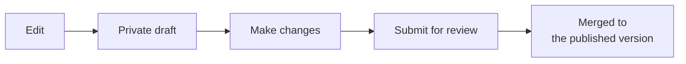

# Versioning & Change Control

*For Builders (making changes) and Administrators (reviewing and rolling them back).*
Every edit to a graph's data goes through a **draft**, gets **reviewed**, and is
**published** — with a full history you can always undo or roll back. This page
covers the whole loop.

> **Note:** *The one-sentence model* — editing a graph works like editing a
> shared document with track changes: you draft privately, someone reviews, it
> publishes, and nothing is ever silently lost.

---

## Is this turned on?

Version control is a per-data-source setting an administrator enables (**Admin
→ Features → Version control**). If it's off, you'll see a banner offering
**Enable version control** instead of an Edit button. Turning it on runs safely
in the background and proves itself with an integrity report before it's
relied on — existing data is never touched during the process.

---

## Starting a draft

Open a View or the Explorer and look for **Edit** in the header. Clicking it
opens (or resumes) your **private draft** — a personal workspace for changes
that doesn't affect what anyone else sees until you publish.

While you're in a draft, an amber strip appears under the header showing what's
changed so far — how many edits are committed, and how many are still
unsaved on the canvas. A **ring** around each node tells you its status at a
glance: solid means committed to your draft, a dashed halo means staged but
not yet saved, and the colour says what happened — green for new, orange for
edited, rose for deleted.

> **Note:** Nothing is lost if you navigate away. If you leave mid-edit, {brand}
> restores your unsaved changes next time you return, with the option to
> discard them instead.

Changed your mind entirely? **Discard draft** abandons everything in it — the
published version was never touched, so there's nothing to undo there.

---

## Submitting changes for review

When your draft is ready, click **Publish your draft**. Give it a short
**title** (what changed, in a sentence) and, optionally, a longer description
for reviewers. Then choose:

- **Submit for review** — the normal path. Opens a review request that a
  workspace manager approves or requests changes on before it reaches the
  published version.
- **Publish now** — skips review and goes live immediately. Only available to
  workspace managers, for small or urgent fixes.

---

## Reviewing and merging

Reviewers work from the request's detail panel, which shows what changed field
by field — not just "something changed," but the actual before/after diff.
A reviewer can:

- **Approve** — sign off, so the change is ready to merge.
- **Merge** — apply the change to the published version. If someone else
  published a conflicting change first, {brand} detects it and walks the
  reviewer through resolving it — a merge never silently overwrites someone
  else's work.
- **Dismiss** — reject the request without applying anything. The draft's
  author keeps their draft and can revise it.

If a draft has fallen behind the published version, {brand} tells you and
offers a one-click **Pull latest** before merging.

---

## Undo vs. Restore — the distinction that matters

Two different tools fix a published mistake, and they're not interchangeable.
Both add a **new** entry to the history rather than erasing anything, so
nothing is ever truly destroyed.

| | **Undo this change** | **Restore to this point** |
| --- | --- | --- |
| **What it does** | Reverses *one specific* published change | Resets the *entire graph* to how it looked at a chosen moment |
| **Later work** | Kept — only the targeted change is reversed | Rolled back along with everything else |
| **Can it conflict?** | Yes — if later changes touched the same items, {brand} will say so and offer to restore instead | No — it can't conflict, by design |
| **Use it when** | You know exactly which change was wrong, and other work since then should stay | You need to get back to a known-good state, no matter what else has happened since |

Both actions are reachable from the **history timeline** (scoped to a draft,
a single View, or the whole graph) and from a merged review request. Both
require the same review permissions as merging a change, and both are visible
afterward in the history — an undo or a restore is just another recorded step,
never a rewrite of what came before.

> **Tip:** If in doubt, Undo first. It's the narrower, safer tool. Reach for
> Restore only when you need to reset everything back to a specific point,
> or when Undo tells you it can't apply cleanly.

---

## Where to next

- Bulk-load or export data through the same draft-and-review flow → [Import & Export](/guide/import-export)
- Understand the *other* kind of versioning (the ontology, not the data) → [The Semantic Layer](/guide/semantic-layer)
- Manage data sources day-to-day → [Workspace Admin](/guide/workspace-admin)
