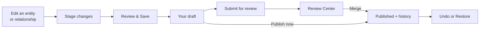

# Versioning & Change Control

*For Builders who change data, and anyone who reviews or rolls back changes.*

Version control is how the graph's **data** changes safely: you edit in a
private draft, someone can review it, it is published, and every published
change stays in a history you can undo or roll back. This page explains what
it gives you, how it is switched on, and the path through this part of the
guide.

> **Note:** *The one-sentence model* — editing a graph works like editing a
> shared document with track changes: you draft privately, someone reviews, it
> publishes, and nothing is ever silently lost.

## What version control gives you

- **Edit safely in drafts.** Your changes stay private until they are
  published. The live graph — what {brand} calls **Published**, the version
  everyone sees — is never touched by work in progress.
- **Review before anything ships.** Raise a change for review, see exactly what
  moves, resolve conflicts, then merge.
- **Full history, and a way back.** Every publish is a revision you can
  inspect, undo on its own, or roll the whole graph back to.

Version control covers the graph's entities and relationships. It is not the
same as the versioning of a [semantic layer](/guide/semantic-layer) (the
meaning of your types), or the
[versions of a View's design](/guide/managing-views#go-back-to-an-earlier-version-of-a-view)
(its layers and settings).

## Is it turned on? Two levels

Version control is switched on at two levels, and both must be on before you
can edit a data source.

| Level | Who controls it | Where | Default | While it's off |
| --- | --- | --- | --- | --- |
| **The whole deployment** | Your administrator | **Administration → Features → Version control** | On | Every version-control surface is hidden and canvases are view-only: no drafts, no reviews, no publishing, no blank models. Existing history is kept, and switching it back on restores everything as it was |
| **Each data source** | Anyone who can manage the workspace's data sources (the **Workspace member**, **Data engineer** and **Workspace admin** roles) | On the canvas, or the data source's **Versioning** tab | Off until someone turns it on (a model built from scratch has it from the start) | The data source can be read, explored and exported, but not edited: **Edit** says *Version control isn't set up for this data source yet* |

A third switch, **Administration → Features → Edit mode** (on by default),
decides whether anyone may change entities and relationships at all. With it
off, Views are read-only and the server refuses any change to a node or edge,
even in a draft.

> **If you see "Reviews are turned off":** the deployment-wide **Version
> control** switch is off. Ask your administrator.

### Turn on version control for a data source

*For people who can manage the workspace's data sources.*

1. Open a View built on the data source. A strip above the canvas says
   **Version control is off for this data source**. (Or open **Workspaces**,
   choose the workspace, select the data source on the **Data Sources** tab, and
   open its **Versioning** tab — it says **Version control is off**.)
2. Choose **Enable version control**. The **Turn on version control** dialog
   opens and says how much it will copy into the version history.
3. Choose **Turn on version control**. The strip shows the copy's progress —
   *N of M items copied*. You can keep using the graph while it runs, and
   nothing changes until every item has been checked against the source.
4. When it finishes, the strip says **Everything checked out**: *Your graph is
   now under version control — and we verified the copy against the source
   before switching it on.* Choose **Done**.

Your existing data is never changed by turning version control on. If the copy
stops part-way, the strip explains why and offers **Resume** or to start over.

[screenshot-pending]: # "versioning-change-control-enable — The canvas strip after turning on version control: 'Everything checked out', the list of passed checks, and the View history and Done buttons"

## The life of a change

```mermaid
flowchart LR
  A["Edit an entity<br/>or relationship"] --> B["Stage changes"]
  B --> C["Review & Save"]
  C --> D["Your draft"]
  D --> E["Submit for review"]
  E --> F["Review Center"]
  F -->|Merge| G["Published + history"]
  D -->|"Publish now"| G
  G --> H["Undo or Restore"]
```

1. **Edit** — in a draft, change an entity or relationship in its drawer, or
   add and connect entities on the canvas.
2. **Stage changes** — keep the edit for review. Nothing is saved yet.
3. **Review & Save** — check your staged edits and save them to the draft as
   one save point.
4. **Publish** your draft — **Submit for review**, or **Publish now** if you
   don't need a review.
5. **Review Center** — a reviewer checks the changes, pulls in newer published
   work if needed, and **Merge**s it, or **Dismiss**es it.
6. **History** — every merge or publish becomes a revision you can undo or roll
   back to.

## Follow the track

Read these in order the first time; afterwards, jump to what you need.

1. [Editing in a Draft](/guide/editing-in-a-draft) — start a draft, change
   entities and relationships, Review & Save, and submit your draft for review.
2. [The Review Center](/guide/review-center) — find the requests waiting for
   you, check what they change, and merge or dismiss them.
3. [Import & Export](/guide/import-export) — make many changes at once from a
   file, and take backups out.
4. [Undo vs. Restore](#undo-vs-restore--the-distinction-that-matters), on this
   page — fix a mistake that has already been published.

## Words you will see

| On screen | Means |
| --- | --- |
| **Published** | The live version of the graph that everyone sees |
| **Draft** | A working copy where your changes wait until they're published |
| **Stage changes** | Keep an edit for **Review & Save** — nothing is saved yet |
| **Review & Save** | Save your staged edits to your draft |
| **Publish** | Send your draft to **Published** — through a review, or directly |
| Review request / merge request | A draft submitted for someone to check and merge |
| **Merge** | Apply a reviewed request to **Published** |
| **Get latest updates** / **Pull latest** | Bring newer published changes into a draft that has fallen behind |
| Revision | One published change in the history |

More terms are in the [Glossary](/guide/glossary).

## See the history

1. Open a View on a data source with version control.
2. In the View's header, choose **Reviews**. The **Changes & Reviews** panel
   opens — on **Changes** if you're in a draft, on **Commits** if you're on
   **Published**.
3. On **Commits**, choose the scope: **This draft**, **This view** (changes made
   from this View) or **Whole graph**. Select a revision to see its changes.

After a merge or publish, the banner *Merged — your changes are now live* (or
*Published — …*) offers **View in history** too. A data source's **Versioning**
tab lists its recent commits, drafts and open merge requests.

## Undo vs. Restore — the distinction that matters

Two different tools fix a published mistake, and they're not interchangeable.
Both add a **new** revision to the history rather than erasing anything, so
nothing is ever truly destroyed.

| | **Undo just this change** | **Restore graph to here** |
| --- | --- | --- |
| **What it does** | Reverses *one* published revision | Resets the *whole graph* to how it looked at the chosen revision |
| **Later work** | Kept — only the chosen revision is reversed | Rolled back along with everything else after that point |
| **Can it conflict?** | Yes — if a later revision changed the same items, it stops and offers to restore instead | No — it can't conflict, by design |
| **Use it when** | You know exactly which change was wrong, and other work since then should stay | You need to get back to a known-good state, whatever has happened since |

To use either:

1. Open the history (**Reviews → Commits**, scope **This view** or **Whole
   graph**).
2. On the revision, open the **⋯** (**Revision actions**) menu.
3. Choose **Undo just this change** or **Restore graph to here**.
   - *Undo this change?* shows the revision and reminds you that later changes
     are kept. Choose **Undo change**.
   - *Restore the graph to this point?* works out the exact impact first — how
     many later revisions it rolls back and how many items are updated, removed
     or brought back. Choose **Restore**.
4. A notification confirms that a new revision was added to the history.

If **Undo** can't apply cleanly, the dialog says *This change can't be undone on
its own*, names the items a later revision changed again, and offers **Restore
to just before it instead**.

A merged review request offers the same undo from the Review Center: **Revert
this merge**.

Undo and Restore are for people who can manage the workspace's data sources —
the same people who can merge. They are not offered on the **This draft** scope:
a draft that's wrong is simply discarded.

> **Tip:** If in doubt, Undo first. It's the narrower, safer tool. Reach for
> Restore only when you need to reset everything back to a specific point, or
> when Undo tells you it can't apply cleanly.

## Who can do what

Version-control actions follow the workspace's data-source permissions, not the
View's sharing.

| Action | Who |
| --- | --- |
| See a data source's history and its Review Center | Anyone who can read the workspace's data. People who can't manage its data sources see only the requests they raised or are named on |
| Turn on version control for a data source | People who can manage the workspace's data sources — the **Workspace member**, **Data engineer** and **Workspace admin** roles |
| Start a draft, edit, **Review & Save**, **Submit for review** | The same people |
| **Publish now** (skip review) | The same people |
| **Merge**, **Dismiss**, **Pull latest** in the Review Center | The same people |
| **Approve** | The same people — and never the request's own author. Shown only on requests that name reviewers |
| **Undo just this change**, **Restore graph to here**, **Revert this merge** | The same people |
| Switch version control or edit mode off for everyone | Administrators, in **Administration → Features** |

Organisation-wide admin roles can do all of the above in every workspace.

> **Note:** Review is a team habit, not a lock: anyone who can edit can also
> **Publish now**. Agree in your team when a review is expected — see
> [Ways of Working](/guide/ways-of-working).

## Where to next

- [Editing in a Draft](/guide/editing-in-a-draft) — when you're ready to make your first change.
- [The Review Center](/guide/review-center) — when someone has asked you to review a change.
- [Import & Export](/guide/import-export) — when you need to change many items at once, or take a backup.
- [The Semantic Layer](/guide/semantic-layer) — when you mean the *other* kind of versioning: the meaning of your types.
