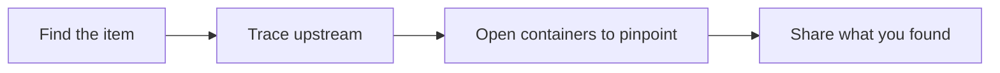

# Ways of Working

*For everyone — especially whoever keeps a team's views in order.* Agree a few
team habits — how you name and tag views, who can see what, and when you tidy
up — so {brand} stays useful for the whole team rather than becoming a pile of
personal bookmarks. Adopt what fits, and agree it together.

> **Note:** *The north star* — a newcomer should be able to open your workspace
> and understand your data landscape *without asking anyone*. Everything below
> serves that goal.

---

## Naming conventions

Consistent names let the [Explorer](/guide/browsing-views) do the organising for
you: its search matches names, tags and workspaces.

**Views** — name them by *audience + subject + intent*:

- Good: `Finance → Revenue dashboard lineage`
- Good: `[Golden] Customer 360 — table level`
- Avoid: `view2`, `test`, `my graph`

Prefixes your team can standardise on:

| Prefix | Meaning |
| --- | --- |
| `[Golden]` | Canonical, trusted reference |
| `[WIP]` | Work in progress — don't rely on it yet |
| `[Deprecated]` | Replaced by something else; will be removed |

**Workspaces** — name them by team or domain (`Finance`, `Marketing Analytics`),
not by person.

---

## Tagging strategy

Tags are how views get *found*: the Explorer can filter by them, and clicking a
tag on a view's card shows every view with that tag. You add tags on the
**Basics** step when you create a view. Agree a **small, shared vocabulary** and
stick to it — five good tags beat fifty ad-hoc ones.

- **By domain:** `finance`, `marketing`, `hr`
- **By cadence:** `daily-load`, `realtime`, `batch`
- **By status:** `golden`, `wip`, `deprecated`

Keep your team's tag list somewhere central and review it now and then. Tag
sprawl is the main reason the Explorer becomes hard to search.

---

## Choosing the right level of detail

Match the detail to the audience and the question. There is no single switch
for it: you decide which entity types a view shows when you build it, and
readers fold or unfold detail as they go — lines between closed containers
summarise everything inside them.

| Audience or goal | Show | How |
| --- | --- | --- |
| Executive overview, onboarding | Systems or domains | Build a view with only the high-level types, and keep containers closed. |
| Everyday tracing and reviews | Tables and datasets | Trace from the table in question with **Trace Lineage**. |
| Precise impact analysis, debugging | Columns | Open containers down to the columns, or use the [Lineage Lens](/guide/lineage-lens) with **Density** set to **Every card**. |

When you share with stakeholders, switch the top bar's toggle to **Business**
so the canvas shows names only. See [Reading Lineage](/guide/reading-lineage).

---

## Collaboration and sharing etiquette

- **Share at the right level.** Every view has a visibility: **Private** while
  you work on it, **Workspace** for your team's shared references, and
  **Enterprise** only for views the whole organisation should rely on. Don't
  make everything Enterprise — it buries the views that matter. See
  [Who can see a View](/guide/managing-views#who-can-see-a-view).
- **Least access first.** Give the narrowest visibility or role that works, and
  widen it when someone asks. See [Users & Access](/guide/users-access).
- **Co-own important views.** Select **Share** and add a colleague as an
  **Editor**, so a key view survives someone's holiday — or departure.
- **Explain in the description.** The "why" belongs in the view's description
  (on the **Basics** step), not in someone's memory.

---

## Keeping things tidy

A small, regular tidy-up keeps everyone's trust in what they find:

| When | Do |
| --- | --- |
| As you go | Name, describe and tag every view you create. |
| Monthly | Open the Explorer's **Attention** filter — views not changed for 90 days, or whose workspace or data source is inactive or missing — and retire or fix them. Tidy inconsistent tags. |
| Quarterly | Review workspace members and roles for drift. |

For bulk clean-ups, select several views in the Explorer, or on a workspace's
**Views** tab, then use **Change Visibility** or **Delete**. See
[Managing & Sharing Views](/guide/managing-views).

---

## Recommended workflows

### Investigating an issue

1. Find the affected item: use the search box in the top bar (⌘K / Ctrl-K) to
   open the right view, then **Advanced search** (⌘⇧F / Ctrl-Shift-F) to find
   the item in it.
2. Trace upstream to the source of the problem: open the item and select
   **Root Cause**.
3. Open containers until you reach the column at fault.
4. Share what you found so the investigation doesn't evaporate. In a Context
   View, select **Share** in the trace dock, then **Copy link** — the link
   reopens your trace. To keep it as a view, select **New View** in the
   Explorer.

### Onboarding a new team member

1. Point them at [Key Concepts](/guide/key-concepts) and this guide.
2. Share a `[Golden]` view that maps your core data landscape.
3. Have them do the [Quick Start](/guide/quick-start) in your real workspace.

### Briefing a stakeholder

1. Open a high-level view and switch the top bar's toggle to **Business**.
2. Walk the flow from left to right — sources to consumers.
3. If you'll repeat the briefing, build a tailored view for it with **New View**.

---

## Anti-patterns to avoid

- **Hoarding private views** of things the team needs — share them.
- **Making everything Enterprise** — it drowns the genuinely canonical views.
- **Cramming one view with everything** — build focused views that each answer
  one question.
- **Changing a data source or its semantic layer without telling anyone** —
  announce changes that affect other people's views.

---

## Where to next

- [Key Concepts](/guide/key-concepts) and the [Glossary](/guide/glossary) —
  when you want the vocabulary behind these habits.
- [Creating Views](/guide/creating-views) — when you're ready to build a view
  well from the start.
- [Managing & Sharing Views](/guide/managing-views) — when you need to change
  who can see or edit a view.
- [The Admin Console](/guide/governance-ops) — when you look after governance
  for the whole platform.
