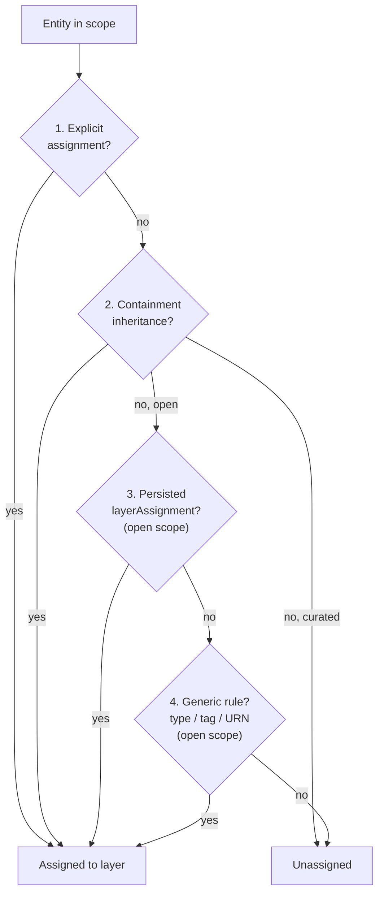

# Assignment Engine

The Assignment Engine decides which **layer** each entity belongs to when a view
is rendered. Given a view's layer configuration and the set of entities on the
canvas, it computes a placement for every entity — the step that turns a context
lens's layer rules into concrete per-entity assignments.

Related reading: [Platform Services](/docs/services-overview),
[Context Engine](/docs/services-context-engine), [Backend guide](/docs/backend).

**This page covers:**

- **What it does** — the rendered-scope inputs and the `LayerAssignmentResult`
- The fixed **placement precedence** and how curated vs open scope differ
- **Ontology (foreign-schema) mapping** for non-{brandShort} graphs
- **Where it runs**, the compute **endpoint**, configuration, and **limitations**

## Purpose / What it does

`AssignmentEngine.compute_assignments` (`backend/app/services/assignment_engine.py`)
takes a `LayerAssignmentRequest` (the view's layers + rules + any explicit
placements) and a workspace-scoped `ContextEngine`, and returns a
`LayerAssignmentResult`: the per-entity assignment map, the parent map, the
in-scope edges, the list of unassigned entities, and timing/coverage stats.

**Scope is exactly the rendered set — never the whole graph.** The engine reads
only the entities the caller is placing: `request.urns` (the canvas's loaded set,
ancestors included) or, for legacy callers, the keys of `request.assignments`.
Each scope is read completely (node limit = scope size) so no rendered entity is
clipped; edges are read only among the scope. If there is no scope and nothing
being placed, it returns empty rather than scan the graph.

Placement follows a fixed **precedence**:

1. **Explicit assignment** — an entity named directly in the request's
   `assignments` map or a legacy per-layer `entity_assignments` (all scopes).
2. **Containment inheritance** — inherit the parent's resolved layer, unless the
   parent's explicit assignment set `inheritsChildren = false` (all scopes).
3. **Node's own persisted `layerAssignment`** — the per-entity hint stamped by
   explicit create/move actions (open scope only).
4. **Generic rules** — type / tag / URN-pattern rules, highest priority wins
   (open scope only).

In **open scope**, an entity that matches none of tiers 1–4 is left unassigned;
the canvas shows it only in a layer that opts in with `showUnassigned`.
In **curated scope**, only tiers 1–2 apply; anything that falls through is left
unassigned. Containment direction comes from the resolved ontology's
**containment edge types** (not hardcoded), which is why the engine resolves the
ontology through the `ContextEngine` before building the parent map.

> **Important:** Scope is **exactly the rendered set, never the whole graph** — the engine reads only the entities the caller is placing (`request.urns`, ancestors included). In **curated scope** only tiers 1–2 apply; anything else is left unassigned by design.

### Ontology mapping (foreign-schema mapping)

When a data source points at a graph that wasn't populated by {brand} — for
example an existing Neo4j database whose nodes use `uuid` / `title` / `name`
instead of the canonical `urn` / `displayName` / `qualifiedName` — a
`SchemaMapping` (`backend/graph/adapters/schema_mapping.py`) describes the
translation so the provider can query and hydrate `GraphNode` / `GraphEdge`
objects transparently. Configuration lives in `extra_config.schemaMapping` on
either the Provider (a shared default) or the WorkspaceDataSource (a per-workspace
override); the DataSource-level mapping wins when both are present. Defaults match
{brandShort}'s own property schema, so no mapping is needed for graphs written by
the platform. This mapping is what makes an entity's type, tags, and identity
resolvable — the same fields the Assignment Engine's type/tag/pattern rules key
on.

## Where it runs

Assignment compute runs **in the WEB role**, workspace-scoped, driven from the
canvas. The endpoint resolves a `ContextEngine` via `get_context_engine` and
passes it into `compute_assignments`, guaranteeing the ontology (and its
containment edge types) is resolved before any provider call. Results are routed
through the graph cache: a given `(workspace, data_source, request)` is
deterministic, so repeat calls with the same layer config hit Redis instead of
the provider, and the same generation counter that invalidates other graph-cache
entries invalidates this one.

## Key endpoints

| Method | Path | Auth | Purpose |
|--------|------|------|---------|
| POST | `/api/v1/{ws_id}/graph/assignments/compute` | `workspace:datasource:read` (router) + workspace-manage check in the handler | Compute layer assignments for the entities in the request and return a `LayerAssignmentResult`. |

The response includes `assignments` (entity → layer), `parentMap`, `edges` (when
requested), `unassignedEntityIds`, and `stats` (`totalNodes`, `assignedNodes`,
`computeTimeMs`, `truncated`). The response also carries an `X-Provider-Health`
header, and `X-Cache-Status: stale-fallback` when a cached result was served
under provider stress.

## Configuration

The Assignment Engine has no dedicated environment knobs; its behavior is driven
by request input (layers, rules, scope) and the resolved ontology. Relevant
surrounding configuration:

- **Containment edge types** come from ontology resolution in the Context Engine
  (5-minute cache). An empty set is valid and means "flat graph, no hierarchy" —
  it is not treated as "unresolved."
- **Edge read cap** for a scope is `max(len(scope) * 8, 10000)`; exceeding it sets
  `stats.truncated = true` (it never silently drops a needed edge for a normal
  view).
- **Schema mapping** is configured per Provider / DataSource via
  `extra_config.schemaMapping` (see above), not via environment variables.

## How it appears in the product

Assignment results determine which layer/lane each entity renders in on the graph
canvas. When a user opens a view, changes its layer configuration in Layer Studio,
or moves an entity between layers, the computed assignments drive the placement.
Explicit moves are persisted onto the entity's `layerAssignment` so they survive
reload (tier 3 above) rather than snapping back to a type-rule layer.

## The placement contract (preview, behind `placementContractEnabled`)

Everything above describes placement with the flag **off**, which is the default. With the admin
flag `placementContractEnabled` on (Admin → Features → Experimental → *One placement rule for every
view surface*), every surface answers "which layer of this view is this entity in, and why" with
one contract instead of its own rules: the server compute, view-scoped import and the layer-rule
save check (`backend/app/services/view_placement.py`), and the canvas columns, trace lanes, search
badges, wizard preview and assignment tree, Layer Studio, Build Mode and rail create
(`frontend/src/lib/placement/`). The two are twins held together by one shared corpus
(`backend/tests/fixtures/placement/*.json`), run by `tests/test_placement_conformance.py` and by
`frontend/src/lib/placement/__tests__/conformance.test.ts` in required CI.

**Tiers**, first match wins:

1. The entity's own explicit entry (a stale entry naming a deleted layer is skipped, flagged `staleExplicit`).
2. Inherited from a parent placed **by hand** (an explicit entry, or a draft-created entity's stamp in a curated view), unless that parent's entry sets `inheritsChildren: false`.
3. *(Curated views stop here.)*
4. Stamped: the entity's own `layerAssignment` (legacy, open views only).
5. The entity's **own rule**.
6. Inherited from a parent placed by a stamp or a rule, unless that rule sets `inheritsFromParent: false`.
7. Fallback: the first `showUnassigned` layer — display only, never a member, never inherited.
8. None.

**Rules.** A rule is the AND of everything it sets: entity types (any of, case-insensitive), tags
(any of, exact), a URN glob (anchored; only `*` and `?` are special; case-sensitive), `propertyMatch`
and `conditions` (the shared operator table in `backend/common/search_semantics`, the same one display
rules use). When several rules match, the higher `priority` wins (missing = 0; a layer's
`entityTypes` act as priority-0 rules after its authored rules); ties go to the **first** layer by
order. A rule that can never match (no criteria, `contains ''`, an unknown operator) matches nothing,
and saving a new or changed one is refused with a 422 that names the layer, the rule and why.

**Split by type.** A child whose own type a layer claims is shown in that layer even when its
parent sits in another one. Like a hand placement, it carries the violet *Placed* tag with its path
in the data ("placed by a layer rule"), and the parent counts it as in another column. Hand
placements still carry their subtree with them.

**Outside the contract in this phase** (unchanged, pinned by their tests): export and scoped
replace, advanced-search view scope, the search Layer filter and layer aggregation,
`get_nodes_by_layer`, open-view type feeds and column totals.

### Turning it on (runbook)

1. Check required CI is green and the flag is off (it is seeded off; no migration).
2. Dry run (read-only): `python -m backend.scripts.placement_dry_run --json /tmp/placement.json`
   (`--view <id>` or `--workspace <id>` to narrow). Per view it reports what it sampled (and whether
   the sample was capped), `changed` with `byTransition` counts and examples, `inertRules`,
   `staleExplicit`, `rejected` and `canvasOnly` constructs.
3. Review the transitions (`<old source>-><new source>`, plus ` +stale`): `inherited->rule` means a
   typed child now leaves its parent's column; `rule->rule` first-layer-wins, priority or AND;
   `rule->none` AND or the anchored glob; `none->rule` case-insensitive types or property rules now
   working; `*->* +stale` an entry naming a deleted layer. `canvasOnly` flags (`duplicate-types`,
   `authored-rules`, `empty-rule`, `glob-pattern`, `property-rule`, `fallback-layer`) change the
   canvas even when the server counts do not. Fix stale entries, priorities and inert rules first.
4. Enable the flag. Servers pick it up within 30 s, open tabs within about a minute or on focus.
5. Check the listed views: canvas, Layer Studio, search badges and trace lanes agree, and the
   canvas sends no `/assignments/compute` request.
6. Roll back by turning the flag off. No view is rewritten.

### Known limitations of the preview

- The canvas, trace and search read containment as source = parent, so `BELONGS_TO` (child → parent)
  children can be placed differently on the canvas than on the server.
- An ancestor the canvas has not loaded passes down only a hand placement (from its URN chain).
- Placement still covers the loaded/rendered set; exact per-layer membership and totals come with
  server-side membership (next phase).

## Limitations

- Assignment covers only the rendered scope. It deliberately does **not** assign
  layers across the whole graph — a whole-graph pass would be slow and, when
  capped, lossy.
- Curated-scope views leave anything outside explicit assignment + containment
  inheritance unassigned by design.
- The containment-direction heuristic assumes `BELONGS_TO`-style edges point
  child→parent and other containment edges point parent→child; unusual custom
  containment semantics may need explicit ontology configuration.
- If a scope's intra-view edges exceed the edge cap, `stats.truncated` flags it
  rather than failing — a signal to narrow the view, not a silent data loss.
