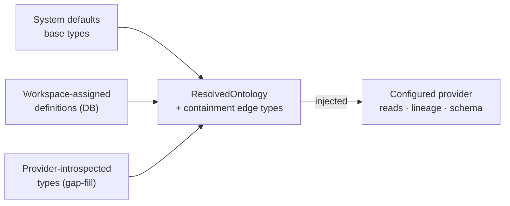

# Context Engine

The Context Engine is the central query orchestrator in {brand}. It binds a
workspace's graph provider and its resolved ontology together, so every read —
nodes, edges, children, lineage, traces, aggregated edges, schema — runs against
a correctly configured provider with the workspace's semantic model applied.

Related reading: [Platform Services](/docs/services-overview),
[Backend guide](/docs/backend), [Assignment Engine](/docs/services-assignments),
[Aggregation pipeline](/docs/aggregation-pipeline).

**This page covers:**

- **What it does** — three-layer ontology resolution and the read surface it exposes
- **Context models and lenses** — how saved view configs get their semantics
- **Where it runs** — the per-request/per-job orchestration layer (not a process)
- **Configuration** (cache TTL, provider binding) and **limitations**

## Purpose / What it does

`ContextEngine` (`backend/app/services/context_engine.py`) is the layer between
the API and the raw graph provider. Its core job is to resolve the workspace's
**ontology** — the semantic schema of entity and relationship types — and push
it into the provider before any query runs, then orchestrate the actual reads.

Ontology resolution is **three-layer**: system defaults + workspace-assigned
definitions + provider-introspected types, assembled into a single resolved
ontology and cached for 5 minutes per engine instance. Resolution also injects
the authoritative **containment edge types** into the provider, which is what
lets containment-aware queries (child counts, parent lookups, top-level roots)
work correctly. Resolution is eager (so call sites that hit
`engine.provider.*` directly still see a configured provider) and non-fatal on
failure (the engine still returns so the endpoint can surface a clean error and
retry once the cache TTL rolls).

> **Important:** The resolved ontology is cached for **5 minutes per engine instance** (`_ONTOLOGY_CACHE_TTL`). A just-changed ontology can take up to one TTL to be reflected by an already-warm engine — the engine is created per request/job precisely because it holds this per-instance cache.

On top of ontology resolution, the engine exposes the read surface the product
is built on, including:

- Node / edge reads and queries (`get_nodes_query`, `get_edges`,
  `get_children_with_edges`, `get_top_level_or_orphan_nodes`).
- Lineage and tracing (`get_lineage`, `trace`, `get_trace_v2`,
  `get_trace_delta_v2`, `expand_aggregated_edge`).
- Aggregated edges (`get_aggregated_edges`, `materialize_aggregated_edges`).
- Schema and stats (`get_graph_schema`, `get_schema_stats`, `get_stats`).

### Context models and context lenses

A **context lens** (product term) is a saved view configuration that highlights a
specific aspect of lineage — a data domain, a pipeline stage, an ownership
boundary — without modifying the underlying graph. A **context model** is the
reusable layer configuration behind it: how entities are grouped into layers and
displayed.

The Context Engine is what makes lenses meaningful: it applies the resolved
ontology (containment, granularity, lineage semantics) that layer grouping and
lineage aggregation depend on. Context-model **instances** are retired — layers
and entity assignments now live on the view config
(`view.config.layout.referenceLayout`). What remains as first-class,
independently managed objects are the reusable **Quick Start Templates**, exposed
through the context-model template endpoints below. Turning a view's layer
configuration into actual per-entity placements is the job of the
[Assignment Engine](/docs/services-assignments).

## Where it runs

The Context Engine is a **library / orchestration layer, not a standalone
process**. It is instantiated per request or per job wherever graph access
happens:

- In the **WEB** role, via the `get_context_engine` FastAPI dependency, backing
  the graph, canvas, search, and assignment endpoints.
- In the **insights service**, via `ContextEngine.for_workspace(...)`, to run
  stats collection and schema profiling.
- In the **aggregation worker**, for lineage projection and aggregated-edge
  materialization.

The factory `ContextEngine.for_workspace(workspace_id, registry, session,
data_source_id=...)` scopes an engine to one workspace data source and resolves
its ontology on construction.

## Key endpoints

The engine has no dedicated router of its own — it powers the workspace-scoped
graph endpoints. Representative routes (under `/api/v1/{ws_id}/graph`, requiring
`workspace:datasource:read`) include node/edge queries, `/nodes/top-level`,
`/nodes/{urn}/children-with-edges`, the lineage walk `/trace/closure` (below),
and aggregated edges.

Context-model templates (the reusable layer configs behind lenses):

| Method | Path | Purpose |
|--------|------|---------|
| GET | `/api/v1/{ws_id}/context-models/templates` | List Quick Start Templates available to a workspace (read-only). |
| GET | `/api/v1/{ws_id}/context-models/templates/{template_id}` | Get a single template. |
| GET/POST/PUT/DELETE | `/api/v1/admin/context-model-templates[/{id}]` | Full template CRUD (requires `system:admin`). |

## Lineage walks: `POST /api/v1/{ws_id}/graph/trace/closure`

The endpoint behind both the canvas **Trace** and the **Lineage Lens** (the
`require_trace` permission). One request is one *page* of a walk; the client
drives the walk hands-free until nothing is owed. The contract (2026-08-21/22):

**Request** (camelCase on the wire)

| Field | Meaning |
|-------|---------|
| `urn`, `direction` (`upstream` · `downstream` · `both`), `upstreamDepth` / `downstreamDepth` (0–25) | What to walk from, which way, how far. |
| `maxNodes` | Page size; clamped to `TRACE_MAX_NODES` (default 2,000) and never above `TRACE_MAX_NODES_HARD` (10,000). Ancestors never count toward it. |
| `seedUrns` (≤ 500) | Re-root a page on explicit anchors (a card's ⊕, or a batch of frontier entries). |
| `seedCursor` (`s:<urn>`) | Continue enumerating a container focus's lineage-bearing descendants from this anchor (inclusive). Legal together with `seedUrns`. |
| `afterCursor` (`e:<n>`) | Continue paging one hub anchor's own adjacency. |
| `excludeUrns` (≤ 2,000) | Nodes the client already holds; never decides where a walk *starts*. |
| `grain` | `fine` (default): raw lineage edges. `coarse`: one shot, focus-anchored — every `:AGGREGATED` cell incident to the focus, with `properties.weight/sourceDepth/targetDepth/latestUpdate/sourceEdgeTypes`; 422 when combined with any cursor or `seedUrns`. Providers without a rollup lane fall through to `fine` (the result says which). |

**Result** — `nodes`, `edges`, `containmentEdges` (every shipped node comes with
its ancestor chain), `upstreamUrns` / `downstreamUrns`, `frontierUp` /
`frontierDown` (each `{ urn, totalCount, nextCursor?, reason: 'cut' | 'depth' }`),
`seedCursor`, `truncated` + `truncationReason`, `grain`, `focus`,
`effectiveLevel`, `meta`.

**Invariants the tests pin**

1. Every anchor walked in a page has its *entire* adjacency in each requested
   direction — the walk is degree-exact (anchors are measured first, then
   expanded under the budget), so no page ever re-does another page's work.
   The only exception is a hub carrying a real `e:<n>` cursor.
2. `len(nodes) ≤ maxNodes`, always.
3. Every un-walked anchor has exactly one resume: descendants of a container
   focus by `seedCursor`; explicit seeds and deeper-ring members by a
   cursor-less frontier entry with `reason: 'cut'` (re-rooted via `seedUrns`,
   batchable); hubs by `e:<n>`. A `depth` entry is the next hop, not owed
   work. `e:0` is never minted.
4. Anchor lists are urn-sorted, so a page is a pure function of (graph,
   request) and caches cleanly.
5. No silent loss: a failed query sets `truncationReason` to `timeout`,
   `seed_failed`, `nodes_failed` or `ancestors_failed` (in that precedence,
   ahead of `max_nodes`); a page that made no progress ships no `seedCursor`.
6. Every edge endpoint is shipped, excluded, or the request `urn`.

**Coarse first paint.** The client fires the `coarse` page beside the first
`fine` page. The cells name partner *containers* (materialised per
containment-level pair), so which endpoints become cards is decided
client-side by **inner-first accounting**: an endpoint is a card iff its
residual `W − Σ W(inner cells)` > 0; residual-0 ancestors are hosts; cells
whose far endpoint is the focus or one of its ancestors are internal flows.
Raw evidence replaces a cell per pair as it lands (complete → dropped;
partial → residual `W − R`), so a board never shows both. Coarse is an
accelerator only: absent or stale rollups cost nothing, and counts render as
"≈N" until raw lands.

**Caching.** A closure page `truncated` for `max_nodes` is complete by
contract and deterministic, so it is cached for the full TTL; any failure
reason stays on the short negative TTL; `grain` is part of the key. A wide
page is ~2.5 MB, larger than the library's 1 MiB per-payload cap, so the
compose stack raises `GRAPH_CACHE_MAX_PAYLOAD_BYTES` to 8 MiB for every
service that holds a cache client (see `docs/SETUP.md`).

## Configuration

- **Ontology cache TTL** is 5 minutes per engine instance (`_ONTOLOGY_CACHE_TTL`),
  after which the ontology is re-resolved on the next call.
- The active **graph provider** (FalkorDB / Neo4j / DataHub / Spanner) is
  selected by the data source's provider binding, not by the engine.
- Read timeouts, trace headroom, and aggregated-read budgets come from the shared
  resilience configuration (e.g. `TRACE_TIMEOUT_SECS`,
  `FALKORDB_AGGREGATED_READ_TIMEOUT_SECS`), applied uniformly whether a call
  originates from the web tier or a background worker.

## How it appears in the product

Every graph the user explores in the canvas is served through the Context Engine:
the top-level entry list, expanding children, lineage traces, aggregated
rollups, and the schema panel all flow through it. Context lenses (saved view
configurations) reshape what the user sees on top of the same engine-served
graph, without changing the underlying data.

## Limitations

- The 5-minute ontology cache means a just-changed ontology can take up to one
  TTL to be reflected by an already-warm engine instance.
- Ontology resolution is best-effort: if resolution fails, the engine still
  constructs, and containment-dependent queries may fall back or error until a
  later resolution succeeds.
- The engine is stateful per instance (its ontology cache), so it is created per
  request/job rather than shared as a long-lived singleton.
- Not every provider supports every operation identically; provider capability
  differences (e.g. advanced search) surface at the call site, not in the engine.
