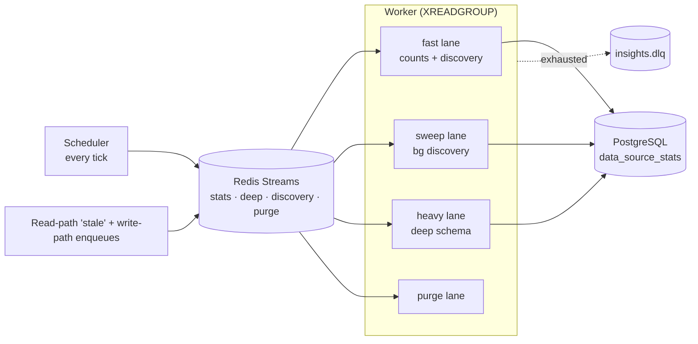

# Insights Service

The insights service is the headless background service that keeps per–data-source
statistics, graph-schema profiles, and pre-registration asset discovery fresh —
so the web tier can answer "how big is this graph, what's in it, and is it
healthy?" from cache instead of hitting a provider on every request.

Related reading: [Platform Services](/docs/services-overview),
[Aggregation pipeline](/docs/aggregation-pipeline), [Backend guide](/docs/backend).

**This page covers:**

- **What it does** — the counts and deep facets, discovery, and top-level materialization
- **Where it runs** — the headless process, its scheduler/worker loop, lanes, and admission control
- The admin **cache-only endpoints** and the read envelope
- **Configuration** knobs and the service's **limitations**

## Purpose / What it does

The service continuously polls registered data sources and profiles their graphs,
writing the results to PostgreSQL where the web tier reads them. It has two
collection facets and a discovery path:

- **Counts facet (`stats_poll`)** — the cheap facet: node/edge counts plus
  per-type breakdowns via two grouped scans. Partial-upserted so counts
  freshness never waits on schema work. Triggered by the scheduler interval,
  by read-path "stale" enqueues, and by app write paths.
- **Deep facet (`stats_deep`)** — one `get_schema_stats` pass (labels + samples,
  edge-type, tag scans) that serves both the counts derivation and the
  graph-schema build, then stamps `schema_updated_at`. Includes change
  detection: a cheap counts probe is compared against the stored row, and when
  nothing changed the expensive schema scans and rebuild are skipped and only
  freshness markers advance.
- **Discovery** — pre-registration asset listing and per-asset stats for a
  provider, so the registry UI can browse a provider's assets before a data
  source is created.

Every counts write also **captures a history snapshot** — see below.

For large graphs, the counts lane also **materializes a top-level-nodes payload**
into Postgres so the entry-list endpoint serves pages from the DB instead of
running an expensive live roots query per request, and a **cache warmer**
pre-fills the graph cache for the first few endpoints a user hits when opening a
data source.

## Where it runs

The insights service is a **separate headless process**, not part of the FastAPI
web tier. It is started with:

```bash
python -m backend.insights_service [--health-port PORT]
```

(`Dockerfile.insights` uses this as its entrypoint.) The entrypoint wires up
concurrent tasks in one event loop:

1. **Scheduler** — every tick, finds due data sources and enqueues jobs to Redis.
2. **Worker** — an `XREADGROUP` loop over the job streams, routing each message
   through a dispatcher to the registered handler under per-lane concurrency
   budgets.
3. **Discovery scheduler** and a periodic **stream-trim** task.
4. **Health HTTP** — a minimal liveness endpoint (default port `8092`).

Jobs flow over **Redis Streams**, one stream per kind (post-registration stats,
deep schema, discovery, purge), each with its own consumer group; a single DLQ
(`insights.dlq`) collects exhausted messages tagged with their origin. Worker
concurrency is split into **lanes** — `fast` (counts polls + user-initiated
discovery), `sweep` (background discovery), `heavy` (deep schema scans), and
`purge` — so a slow large-graph scan can never starve the slots that keep counts
fresh. On `SIGTERM` the service drains in-flight jobs (up to
`STATS_DRAIN_TIMEOUT_SECS`) so restarts don't leave partial upserts.



**Admission control** guards provider I/O: a per-provider **Redis-backed GCRA
token bucket** caps the request rate across the whole worker fleet, and a
**rolling success window** (persisted to `provider_health_window`) feeds the
"provider degraded" UI. Duplicate enqueues are prevented by a Redis `SET NX`
dedup claim per `(data_source_id, tick)` with a size-aware TTL.

> **Note:** All Redis state here is **advisory** — streams, dedup claims, and cooldown keys. If Redis is lost, in-flight queue entries are lost with it but heal on the next scheduler tick; **Postgres rows are the only authority**.

**Degradation contract:** if Redis is down the stats pipeline pauses (streams,
dedup claims, and cooldown keys all live in Redis), the web read path keeps
serving Postgres rows marked `status=stale`, and the admission GCRA fails open.
All Redis state here is advisory — lost claims and queue entries heal within a
scheduler tick; Postgres rows are the only authority.

## Counts history

`data_source_stats` is one row per data source, upserted in place: it answers
"how big is this graph now" and destroys the previous answer on every write.
`data_source_count_snapshots` is its append-only twin — what a source looked
like at a point in time, per label, with the delta against the observation it
replaced. It is what makes "did an external loader delete half of this on
Tuesday" answerable.

**Where capture happens.** Not in a collector, but inside
`stats_repo.upsert_data_source_stats_counts` / `upsert_data_source_stats` —
the functions every lane already writes through (counts poll, deep profile,
drift probe, reconcile sweep, and two app write paths). Capturing in one
collector would give a history whose meaning depended on which lane happened to
observe a change; capturing at the write gives one series with one definition.
The row being overwritten is already in memory, so the delta costs no extra
read, and the capture runs in the caller's transaction, so history can never
disagree with the current-state row about what was observed.

**Why it is gated.** The drift probe writes every 60s. A row per write would be
~43k rows per source per month describing a graph that mostly did not change.
So a snapshot is written when `counts_digest` moves, and otherwise at most once
per `INSIGHTS_HISTORY_HEARTBEAT_SECS`. The heartbeat is not optional padding:
without it an idle month is a gap, and a gap reads as lost data.

**What a failed collection writes: nothing.** Capture is reached only after the
provider has answered. A FalkorDB pod rotation makes the collection raise
upstream — in `_run_guarded`'s retry, the circuit breaker, or the admission
gate's soft-retry — so no row is written and no phantom zero enters the series.
A *genuinely* empty graph is different: the provider verifies absence via
`EXISTS` before reporting zero, so that zero is real, and recording it is the
point.

**Retention** runs on the stream-trim tick behind its own cadence gate, and has
two passes. The age cutoff bounds how far back the table goes; the per-source
cap bounds how much one source thrashing under a broken loader can contribute,
which the age cutoff alone cannot. Both defaults can be overridden live via
`PUT /api/v1/admin/platform/history-retention` — `persisted ?? env`, so a no-op
save round-trips the real default rather than pinning it.

**What counts as a notable change** is decided per source, not by a fixed
threshold. The window's median absolute delta is the baseline; a movement three
times that is `notable`, eight times is `severe`. A fixed threshold cannot tell
a catastrophic drop apart from a nightly rebuild, because the same number is
both depending on whose graph it is. The classification is symmetric — a
runaway loader tripling a graph is as much a failure as a deletion — and it is
always computed from the RAW rows, since averaging a bucket is exactly what
destroys the movement being looked for.

**Correlation.** Each window also returns the `refresh_events` rows inside it,
so the UI can answer "what else was running when this moved" — a reconcile
sweep, an aggregation rebuild, a script-driven refresh. Two reads, never a
JOIN: `refresh_events` is the aggregation domain's. Absence is informative and
surfaced as such: if nothing of ours ran, whatever changed the graph came from
outside the platform.

| Method | Path | Purpose |
|--------|------|---------|
| GET | `/api/v1/admin/insights/data-sources/{id}/history` | Counts over time for one source, per label, with deltas, significance and correlated activity. Accepts a catalog-item id too. |
| GET | `/api/v1/admin/insights/data-sources/{id}/history.csv` | The same series as CSV — always raw, one column per label. |
| GET | `/api/v1/admin/insights/providers/{id}/history` | Rolled up across a provider's onboarded sources. |
| GET | `/api/v1/admin/insights/history/fleet` | Rolled up across the whole platform, one series per provider. |
| GET/PUT | `/api/v1/admin/platform/history-retention` | Read / set the retention policy. |

Both history reads take `from`, `to` and `grain` (`raw` \| `hour` \| `day` \|
`auto`) and return the standard `{ data, meta }` envelope. `auto` picks the
grain from the window width and errs toward `raw` — the value of the view is
seeing the exact moment something changed. At hour/day grain each bucket also
carries its min and max, because a downsample that keeps only the closing value
would hide a drop that happened and recovered inside the bucket, which is
precisely the event this exists to surface.

### Anomaly alerting

The history knows what "unusual" means for each source — the same per-source
baseline the chart draws markers from. Alerting is that reading, delivered.

**It is a sweep, not a hook on the write.** Significance is a property of a
WINDOW, so judging at capture time would put a range scan on the 60s probe path
and would run inside the web tier as well; a request handler is no place to
decide whether to wake someone up. Evaluation runs in the insights service on
its own cadence, beside the retention purge, and reads what capture already
wrote.

**The verdict is frozen.** The baseline moves as the window moves, so an alert
recomputed later against a different baseline could quietly downgrade itself and
contradict the notification already sent. The classification, the baseline
behind it and the per-label evidence are written once into
`data_source_count_alerts` and never derived again — which also means an alert
outlives the snapshot that produced it.

**Four severities, and the top one is measured differently.** `notable` (≥3×)
and `severe` (≥8×) are relative to the source's own median movement — the right
lens for "is this unusual". `critical` is proportional to the **graph**: a drop
taking ≥90% of it. That distinction is the point, not a refinement. A source
with large routine churn can lose *everything* without the loss reaching 8× its
own median, so the tier that should shout loudest would otherwise stay silent on
the worst failure. `critical` also clears any configured severity floor: a floor
is a noise control, and a wipe is not noise. It is asymmetric — only losses
qualify — because a graph doubling is dramatic but recoverable, where one that is
nearly gone may have nothing left to recover from.

**Every alert names what it was about.** `provider_name`, `data_source_label`,
`graph_name` and `catalog_item_id` are resolved once and frozen onto the alert
beside the ids. An operator opening a week-old alert has to know which source
under which provider was hit, and by then the provider may have been renamed and
the source relabelled or deleted — ids alone send them hunting. Each lookup
degrades independently, so a missing provider row costs the alert its provider
name and nothing else.

**One alert per source per cooldown.** A graph thrashing under a broken loader
moves unusually on every probe; alerting on each turns one incident into a pager
storm and trains people to ignore it. The worst movement in the stretch wins,
and only movements observed *since* the last reported one count as new.

Delivery is the in-app bell — workspace data source managers plus globally bound
`system:admin`, unread-deduped per source, exactly as
`notify_reconcile_suspended` already does for the sibling ops alert. The bell is
the channel; the table is the record. Retention never removes an
**unacknowledged** alert by age: one nobody has looked at is the piece of this
that must not disappear quietly.

| Method | Path | Purpose |
|--------|------|---------|
| GET | `/api/v1/admin/insights/alerts` | Recorded anomalies, fleet-wide or per source, with frozen evidence. |
| POST | `/api/v1/admin/insights/alerts/{id}/acknowledge` | Mark one as seen. First acknowledgement wins. |
| GET/PUT | `/api/v1/admin/insights/alerts/policy` | Read / set the switch, severity floor and cooldown. |

## Key endpoints

The web tier exposes an admin surface under `/api/v1/admin/insights` (all routes
require `system:admin`). These reads are **cache-only** — the web tier never
calls a provider here; a cache miss enqueues a job into the insights service and
returns `200` with `meta.status="computing"`.

| Method | Path | Purpose |
|--------|------|---------|
| GET | `/providers/{provider_id}/assets` | Cached asset list for a provider (discovery). |
| GET | `/providers/{provider_id}/assets/{asset_name}/stats` | Cached per-asset stats. |
| POST | `/providers/{provider_id}/assets/{asset_name}/refresh` | Enqueue a refresh for one asset. |
| POST | `/providers/{provider_id}/assets/refresh` | Enqueue a refresh for all assets. |
| GET | `/jobs/{job_id}` | Poll the status of an enqueued job. |
| GET | `/dlq` | List dead-letter-queue entries. |
| POST | `/dlq/{msg_id}/redrive` | Redrive a DLQ message back to its stream. |
| DELETE | `/dlq/{msg_id}` | Drop a DLQ message. |
| GET | `/admission/{provider_id}` | Read admission knobs + rolling-window health. |
| PUT | `/admission/{provider_id}` | Upsert per-provider admission knobs. |
| GET | `/discovery/status` | Last discovery-scheduler tick summary. |
| POST | `/discovery/trigger` | Run one discovery tick immediately. |
| GET | `/config` | Frontend-facing insights UX tuning values. |

Every cache-only read uses a universal envelope: `{ data, meta }`, where
`meta.status` is one of `fresh`, `stale`, `computing`, or `unavailable`.

## Configuration

The service reads all knobs from the environment. Required infra:
`MANAGEMENT_DB_URL` and `REDIS_URL` (a preflight check fails fast with a fix
pointer if either is missing).

Scheduler / worker tunables (defaults in parentheses):

| Env var | Default | Meaning |
|---------|---------|---------|
| `STATS_SCHEDULER_TICK_SECS` | `30` | Scheduler poll cadence. |
| `STATS_DEFAULT_INTERVAL_SECS` | `900` | Idle reconcile interval (freshness is mostly event-driven). |
| `STATS_MIN_INTERVAL_SECS` | `60` | Floor on per-source poll interval. |
| `STATS_WORKER_CONCURRENCY` | `4` | Fast-lane concurrency budget. |
| `STATS_SWEEP_CONCURRENCY` | `2` | Background-discovery lane. |
| `STATS_HEAVY_CONCURRENCY` | `1` | Deep schema-scan lane. |
| `STATS_PURGE_CONCURRENCY` | `1` | Purge lane. |
| `STATS_MAX_CONCURRENT_PER_GRAPH` | `1` | Cap on concurrent jobs per graph. |
| `STATS_MAX_DELIVERY_ATTEMPTS` | `3` | Redeliveries before DLQ. |
| `STATS_DRAIN_TIMEOUT_SECS` | `60` | Graceful-drain budget on shutdown. |
| `STATS_HEALTH_PORT` | `8092` | Liveness endpoint port (also `--health-port`). |
| `INSIGHTS_TRIM_INTERVAL_SECS` | `3600` | Stream-trim cadence. |
| `INSIGHTS_COUNTS_PARITY_CHECK` | `0` | Diagnostic: run direct count scans alongside the deep facet and log divergence. |
| `INSIGHTS_HISTORY_ENABLED` | `true` | Master switch for counts-history capture. |
| `INSIGHTS_HISTORY_HEARTBEAT_SECS` | `3600` | Continuity snapshot when nothing changed. |
| `INSIGHTS_HISTORY_RETENTION_DAYS` | `90` | Snapshot age cutoff (product floor is 30, with headroom). |
| `INSIGHTS_HISTORY_MAX_ROWS_PER_SOURCE` | `5000` | Per-source snapshot cap, applied alongside the age cutoff. |
| `INSIGHTS_HISTORY_PURGE_INTERVAL_SECS` | `3600` | Snapshot purge cadence. |
| `INSIGHTS_ALERTS_ENABLED` | `true` | Master switch for anomaly evaluation. |
| `INSIGHTS_ALERT_MIN_SEVERITY` | `severe` | Floor: `severe` (≥8× usual) or `notable` (≥3×). `critical` ignores it. |
| `INSIGHTS_ALERT_COOLDOWN_SECS` | `21600` | At most one alert per source per this interval. |
| `INSIGHTS_ALERT_INTERVAL_SECS` | `900` | How often movements are judged. |

Per-provider admission knobs (`bucket_capacity`, `refill_per_sec`) are stored in
`provider_admission_config` and tuned live via the `PUT /admission/{provider_id}`
endpoint; workers re-read on their next acquire.

## How it appears in the product

The service is invisible except through the freshness and health it produces.
In the registry / assets UI, a `RefreshControl` pill renders
"Auto-refreshes every X · Last refresh Ym ago" from `GET /discovery/status`, and
cache-only reads let the frontend render a placeholder with an ETA chip while a
job is `computing`. A stuck pipeline (Redis down) surfaces as a
"background refresh paused" affordance when a read comes back `unavailable`.
The counts history appears as a **Last 30 days** card in the data source
profile and, behind it, a full history view at
`/datasources/{catalogId}/history` — counts over time by label, a change ledger
with correlated platform activity, an unusual-only filter, a CSV export, and a
scope switch between this source, its provider and the whole platform. The
retention policy is edited in place from the coverage line that reports it,
read-only for non-admins — and the alert policy sits in the same dialog, because
how much evidence to keep and how loudly to react to it are one decision in
practice. Open anomalies appear as a band above the chart until someone
acknowledges them, naming the provider and source they belong to; at the
provider and platform scopes they are grouped into an inbox by provider, because
several affected sources under one provider is a provider problem — a rotated
cluster, a broken loader, an expired credential — and a flat severity-ordered
list scatters that signal instead of leading with it.
Providers that fail repeatedly show as degraded via the rolling success window.

## Limitations

- The scheduler and worker run in the insights process. The web tier's
  `GET /discovery/status` reflects only the **web process's** view of that state,
  which is empty in a split-process deployment (live only in single-process /
  dev mode).
- Freshness is bounded by the scheduler tick plus poll interval; the default
  `900s` reconcile interval is a safety net, not the primary freshness mechanism
  (write paths enqueue within seconds).
- All queueing, dedup, and cooldown state is advisory Redis state — a Redis flush
  loses in-flight queue entries, which heal on the next tick but do not replay.
- Top-level materialization and cache warming are best-effort optimizations that
  only engage above a size threshold; they never block or fail a counts write.
- Counts history begins at the first capture, not at the data source's creation
  — there is no backfill, because the observations simply were not recorded. The
  history API reports `coverage_from` so the UI can say so rather than letting a
  short series read as data loss.
- Alerting latency is the evaluation cadence plus the capture cadence: a
  movement is recorded when a lane next observes it, and judged when the sweep
  next runs. It is a background signal, not a real-time one.
- History resolution is bounded by the capture cadence: a change is recorded
  when a lane next observes it, which for a FalkorDB source is the 60s probe and
  for everything else the counts poll.
