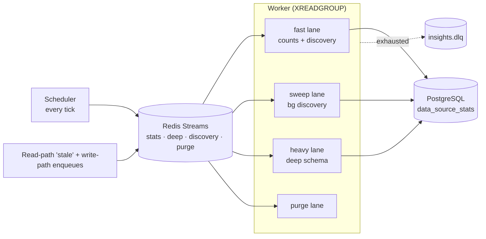

# Insights Service

The insights service is the headless background service that keeps per–data-source
statistics, graph-schema profiles, and pre-registration asset discovery fresh —
so the web tier can answer "how big is this graph, what's in it, and is it
healthy?" from cache instead of hitting a provider on every request.

Related reading: [Platform Services](/docs/services-overview),
[Aggregation pipeline](/docs/aggregation-pipeline), [Backend guide](/docs/backend).

**This page covers:**

- **What it does** — the counts and deep facets, discovery, and top-level materialization
- **Where it runs** — the headless process, its scheduler/worker loop, lanes, and admission control
- The admin **cache-only endpoints** and the read envelope
- **Configuration** knobs and the service's **limitations**

## Purpose / What it does

The service continuously polls registered data sources and profiles their graphs,
writing the results to PostgreSQL where the web tier reads them. It has two
collection facets and a discovery path:

- **Counts facet (`stats_poll`)** — the cheap facet: node/edge counts plus
  per-type breakdowns via two grouped scans. Partial-upserted so counts
  freshness never waits on schema work. Triggered by the scheduler interval,
  by read-path "stale" enqueues, and by app write paths.
- **Deep facet (`stats_deep`)** — one `get_schema_stats` pass (labels + samples,
  edge-type, tag scans) that serves both the counts derivation and the
  graph-schema build, then stamps `schema_updated_at`. Includes change
  detection: a cheap counts probe is compared against the stored row, and when
  nothing changed the expensive schema scans and rebuild are skipped and only
  freshness markers advance.
- **Discovery** — pre-registration asset listing and per-asset stats for a
  provider, so the registry UI can browse a provider's assets before a data
  source is created.

Every counts write also **captures a history snapshot** — see below.

For large graphs, the counts lane also **materializes a top-level-nodes payload**
into Postgres so the entry-list endpoint serves pages from the DB instead of
running an expensive live roots query per request, and a **cache warmer**
pre-fills the graph cache for the first few endpoints a user hits when opening a
data source.

## Where it runs

The insights service is a **separate headless process**, not part of the FastAPI
web tier. It is started with:

```bash
python -m backend.insights_service [--health-port PORT]
```

(`Dockerfile.insights` uses this as its entrypoint.) The entrypoint wires up
concurrent tasks in one event loop:

1. **Scheduler** — every tick, finds due data sources and enqueues jobs to Redis.
2. **Worker** — an `XREADGROUP` loop over the job streams, routing each message
   through a dispatcher to the registered handler under per-lane concurrency
   budgets.
3. **Discovery scheduler** and a periodic **stream-trim** task.
4. **Health HTTP** — a minimal liveness endpoint (default port `8092`).

Jobs flow over **Redis Streams**, one stream per kind (post-registration stats,
deep schema, discovery, purge), each with its own consumer group; a single DLQ
(`insights.dlq`) collects exhausted messages tagged with their origin. Worker
concurrency is split into **lanes** — `fast` (counts polls + user-initiated
discovery), `sweep` (background discovery), `heavy` (deep schema scans), and
`purge` — so a slow large-graph scan can never starve the slots that keep counts
fresh. On `SIGTERM` the service drains in-flight jobs (up to
`STATS_DRAIN_TIMEOUT_SECS`) so restarts don't leave partial upserts.



**Admission control** guards provider I/O: a per-provider **Redis-backed GCRA
token bucket** caps the request rate across the whole worker fleet, and a
**rolling success window** (persisted to `provider_health_window`) feeds the
"provider degraded" UI. Duplicate enqueues are prevented by a Redis `SET NX`
dedup claim per `(data_source_id, tick)` with a size-aware TTL.

> **Note:** All Redis state here is **advisory** — streams, dedup claims, and cooldown keys. If Redis is lost, in-flight queue entries are lost with it but heal on the next scheduler tick; **Postgres rows are the only authority**.

**Degradation contract:** if Redis is down the stats pipeline pauses (streams,
dedup claims, and cooldown keys all live in Redis), the web read path keeps
serving Postgres rows marked `status=stale`, and the admission GCRA fails open.
All Redis state here is advisory — lost claims and queue entries heal within a
scheduler tick; Postgres rows are the only authority.

## Profiling — counts and composition over time

`data_source_stats` is one row per data source, upserted in place: it answers
"how big is this graph now" and destroys the previous answer on every write.
Profiling is the time axis of that same profile — node and relationship
counts, and the breakdown by entity type and relationship type, as they were
at a point in time. It is what makes "did an external loader delete half of
this on Tuesday" answerable.

It is a member of the **Ingestion** section, beside Freshness and Job History,
not a separate feature. Freshness asks "is it current?", Reconciliation asks
"does it agree?", Profiling asks "what is in it, and is that changing?".

**Where capture happens.** Not in a collector, but inside
`stats_repo.upsert_data_source_stats_counts` / `upsert_data_source_stats` —
the functions every lane already writes through (counts poll, deep profile,
drift probe, reconcile sweep, and two app write paths). Capturing in one
collector would give a series whose meaning depended on which lane happened to
observe a change; capturing at the write gives one series with one definition.
The row being overwritten is already in memory, so the delta costs no extra
read, and the capture runs in the caller's transaction, so the record can
never disagree with the current-state row about what was observed.

**Why it is gated.** The drift probe writes every 60s. A row per write would
be ~43k rows per source per month describing a graph that mostly did not
change. So a snapshot is written when `counts_digest` moves, at most once per
`PROFILING_HEARTBEAT_SECS` otherwise, and unconditionally at a **run
boundary** — a refresh that changed nothing is itself a finding, and it
carries the `refresh_event_id` that caused it so "counts per run, per type in
the run" is an exact join rather than a ±15-minute correlation.

**What a failed collection writes: nothing.** Capture is reached only after
the provider has answered. A FalkorDB pod rotation makes the collection raise
upstream — in `_run_guarded`'s retry, the circuit breaker, or the admission
gate's soft-retry — so no row is written and no phantom zero enters the
series. A *genuinely* empty graph is different: the provider verifies absence
via `EXISTS` before reporting zero, so that zero is real.

### Tiered retention

Raw snapshots are the record of what was OBSERVED; `data_source_count_rollups`
is the record of what a PERIOD looked like. The compactor builds `hour` rows
from raw **before raw is purged**, and `day` rows from `hour`, so coverage
outlives resolution instead of being bounded by it.

That inversion is the point. Retention used to be an age cutoff plus a
per-source row cap, and the cap bounds ROWS, not days: a source thrashing
under a broken loader hits a 5,000-row cap in under a week, so the cap
silently evicted exactly the source whose 30-day history someone would come
looking for. A day bucket is one row however violently the source moved inside
it, which makes the 30-day floor structural. The cap survives as a raw-tier
safety valve only.

| Tier | Default | Built from |
|---|---|---|
| raw | 7 days | the counts write |
| hour | 45 days | raw, before raw is purged |
| day | 400 days | hour |

Rollups are **per source only**; workspace, provider and platform series are
sums of them at read time. Materialising those scopes would be four things to
keep in agreement plus a membership ledger, and a membership ledger that
drifts is how `:AGGREGATED` weights got silently double-counted once already.

Each bucket carries its closing value **and** its intra-bucket min/max,
because a drop that happened and recovered inside a bucket is exactly the
event this exists to surface, and a closing value hides it.

**Purge never outruns compaction.** Raw may only be deleted up to the
compaction watermark. If compaction stalls, raw stops being deleted rather
than being deleted uncompacted: a table that grows is visible and
recoverable, observations that silently never reached a tier are not.

**Compaction is idempotent and gap-immune.** The watermark is `MAX(bucket_start)`
in the rollup table — no cursor state — and each pass restarts at the
watermark bucket, refining it through an upsert on `uq_dscr_bucket`. A pass is
bounded by *buckets that hold data*, not by calendar span: advancing a fixed
number of hours stalls forever on a gap, because an empty window builds
nothing and the watermark never moves past it.

### Findings

A number moving is data; a finding is what an operator acts on. Each is judged
in the sweep and **frozen** onto `data_source_count_alerts` — the baseline
moves as the window moves, so a verdict recomputed later could quietly
downgrade itself and contradict the notification already sent.

- **`movement`** — a delta far outside what is ordinary for this source. The
  window's median absolute delta is the baseline; 3× is `notable`, 8× is
  `severe`. `critical` is proportional to the **graph** instead: a drop taking
  ≥90% of it. A source with large routine churn can lose *everything* without
  reaching 8× its own median, so the tier that should shout loudest would
  otherwise stay silent on the worst failure. `critical` clears any severity
  floor, because a floor is a noise control and a wipe is not noise.
- **`type_gone`** — an entity or relationship type reached zero. The clearest
  evidence an external process deleted data, and as a share of a large graph
  frequently too small to register as movement at all. A type that comes back
  clears its own finding, so a nightly rebuild is not an incident.
- **`silent`** — the source stopped reporting. Not the same as dropping to
  zero: an expired credential or a dropped graph ends the series rather than
  moving it, and a chart of what a source did report cannot show the reports
  that never arrived. Joined against `workspace_data_sources`, so a *deleted*
  source never trips it.

**Nodes and edges are judged independently**, with their own baselines and
their own cooldowns. A loader that drops every relationship while leaving
every entity intact moves the node count not at all — judged on nodes alone,
a graph that has become a bag of disconnected records reported nothing.

Delivery is the in-app bell — workspace data source managers plus globally
bound `system:admin`, unread-deduped per source. The bell is the channel; the
table is the record. Retention never removes an **unacknowledged** finding by
age: one nobody has looked at is the piece of this that must not disappear
quietly.

### API

Everything lives under `/api/v1/profiling`, gated by the Ingestion-surface
read permission (`system:admin`, `system:org-admin`,
`workspace:provider:read`, `workspace:datasource:manage`) — the same gate
Freshness and Job History use. An `/admin/` URL serving a workspace journey is
a statement about who a surface is for that the permission model does not
agree with.

| Method | Path | Purpose |
|---|---|---|
| GET | `/profiling/series` | The time series at any scope |
| GET | `/profiling/observations` | The change ledger for one source, run-bound |
| GET | `/profiling/sources` | The board — what moved, ranked |
| GET | `/profiling/export.csv` | The same series as CSV |
| GET | `/profiling/alerts` | Recorded findings with frozen evidence |
| POST | `/profiling/alerts/{id}/acknowledge` | Mark one seen. First ack wins. |
| GET/PUT | `/profiling/policy` | Retention + alerting. Read for any reader, write for `system:admin`. |

`/series` takes `scope` (`source` | `workspace` | `provider` | `all`), an `id`
for all but `all`, a `window` token (`24h` | `7d` | `30d` | `90d`) or explicit
`from`/`to`, `grain`, `metric` (`total` | `nodes` | `edges`), `breakdown`
(`none` | `entity_type` | `edge_type`) and `compare`.

Two shape decisions carry weight:

- **Series-major, not point-major.** The response is a list of series, each
  with its own points. The previous shape embedded per-type maps inside every
  point, which forced every consumer to pivot before drawing anything and
  entangled `metric` with `breakdown` rather than leaving them orthogonal.
- **Window tokens, not absolute ranges.** The client sends `window=30d`; the
  server resolves and returns the bounds it used. A client computing
  `to=now()` on every render produces a new value every time — a cache key
  that never hits, and a React Query key that re-fetches forever.

`scope=all` means *everything the caller can see*, not *everything*:
`compute_visible_data_source_ids` returns `None` for a platform operator and
the caller's own workspaces otherwise, and an **empty** set is fail-closed
rather than unrestricted. The response reports `platform_wide` so the client
can say which altitude it is at — "nothing moved" means very different things
at the two.

Profiling reads **never touch FalkorDB**. They are pure Postgres over durable
rows, nothing is enqueued and no cache is warmed, which means the board stays
up during a provider outage — precisely when someone opens it.


## Key endpoints

The web tier exposes an admin surface under `/api/v1/admin/insights` (all routes
require `system:admin`). These reads are **cache-only** — the web tier never
calls a provider here; a cache miss enqueues a job into the insights service and
returns `200` with `meta.status="computing"`.

| Method | Path | Purpose |
|--------|------|---------|
| GET | `/providers/{provider_id}/assets` | Cached asset list for a provider (discovery). |
| GET | `/providers/{provider_id}/assets/{asset_name}/stats` | Cached per-asset stats. |
| POST | `/providers/{provider_id}/assets/{asset_name}/refresh` | Enqueue a refresh for one asset. |
| POST | `/providers/{provider_id}/assets/refresh` | Enqueue a refresh for all assets. |
| GET | `/jobs/{job_id}` | Poll the status of an enqueued job. |
| GET | `/dlq` | List dead-letter-queue entries. |
| POST | `/dlq/{msg_id}/redrive` | Redrive a DLQ message back to its stream. |
| DELETE | `/dlq/{msg_id}` | Drop a DLQ message. |
| GET | `/admission/{provider_id}` | Read admission knobs + rolling-window health. |
| PUT | `/admission/{provider_id}` | Upsert per-provider admission knobs. |
| GET | `/discovery/status` | Last discovery-scheduler tick summary. |
| POST | `/discovery/trigger` | Run one discovery tick immediately. |
| GET | `/config` | Frontend-facing insights UX tuning values. |

Every cache-only read uses a universal envelope: `{ data, meta }`, where
`meta.status` is one of `fresh`, `stale`, `computing`, or `unavailable`.

## Configuration

The service reads all knobs from the environment. Required infra:
`MANAGEMENT_DB_URL` and `REDIS_URL` (a preflight check fails fast with a fix
pointer if either is missing).

Scheduler / worker tunables (defaults in parentheses):

| Env var | Default | Meaning |
|---------|---------|---------|
| `STATS_SCHEDULER_TICK_SECS` | `30` | Scheduler poll cadence. |
| `STATS_DEFAULT_INTERVAL_SECS` | `900` | Idle reconcile interval (freshness is mostly event-driven). |
| `STATS_MIN_INTERVAL_SECS` | `60` | Floor on per-source poll interval. |
| `STATS_WORKER_CONCURRENCY` | `4` | Fast-lane concurrency budget. |
| `STATS_SWEEP_CONCURRENCY` | `2` | Background-discovery lane. |
| `STATS_HEAVY_CONCURRENCY` | `1` | Deep schema-scan lane. |
| `STATS_PURGE_CONCURRENCY` | `1` | Purge lane. |
| `STATS_MAX_CONCURRENT_PER_GRAPH` | `1` | Cap on concurrent jobs per graph. |
| `STATS_MAX_DELIVERY_ATTEMPTS` | `3` | Redeliveries before DLQ. |
| `STATS_DRAIN_TIMEOUT_SECS` | `60` | Graceful-drain budget on shutdown. |
| `STATS_HEALTH_PORT` | `8092` | Liveness endpoint port (also `--health-port`). |
| `INSIGHTS_TRIM_INTERVAL_SECS` | `3600` | Stream-trim cadence. |
| `INSIGHTS_COUNTS_PARITY_CHECK` | `0` | Diagnostic: run direct count scans alongside the deep facet and log divergence. |
| `PROFILING_ENABLED` | `true` | Master switch for capture. |
| `PROFILING_HEARTBEAT_SECS` | `3600` | Continuity snapshot when nothing changed. |
| `PROFILING_RAW_RETENTION_DAYS` | `7` | Full-fidelity tier. |
| `PROFILING_HOURLY_RETENTION_DAYS` | `45` | Carries the 30-day product floor, with headroom. |
| `PROFILING_DAILY_RETENTION_DAYS` | `400` | Long tier: this quarter vs the same quarter last year. |
| `PROFILING_MAX_ROWS_PER_SOURCE` | `5000` | Raw-tier safety valve only; it can no longer shorten coverage. |
| `PROFILING_COMPACT_INTERVAL_SECS` | `300` | How often raw is compacted into the tiers. Much tighter than the purge, because the purge cannot delete raw beyond the compaction watermark. |
| `PROFILING_RETENTION_INTERVAL_SECS` | `3600` | Retention cadence across all three tiers. |
| `PROFILING_ALERTS_ENABLED` | `true` | Master switch for finding evaluation. |
| `PROFILING_ALERT_MIN_SEVERITY` | `severe` | Floor: `severe` (≥8× usual) or `notable` (≥3×). `critical` ignores it. |
| `PROFILING_ALERT_COOLDOWN_SECS` | `21600` | At most one finding per source **per metric** per this interval. |
| `PROFILING_ALERT_INTERVAL_SECS` | `900` | How often findings are judged. Now genuinely 900s: these used to ride the hourly stream-trim tick, where a cadence gate can never fire faster than its host loop. |
| `PROFILING_SILENT_AFTER_SECS` | `21600` | A source unheard-from this long is `silent`. |

Per-provider admission knobs (`bucket_capacity`, `refill_per_sec`) are stored in
`provider_admission_config` and tuned live via the `PUT /admission/{provider_id}`
endpoint; workers re-read on their next acquire.

## How it appears in the product

The service is invisible except through the freshness and health it produces.
In the registry / assets UI, a `RefreshControl` pill renders
"Auto-refreshes every X · Last refresh Ym ago" from `GET /discovery/status`, and
cache-only reads let the frontend render a placeholder with an ETA chip while a
job is `computing`. A stuck pipeline (Redis down) surfaces as a
"background refresh paused" affordance when a read comes back `unavailable`.
The counts history appears as a **Last 30 days** card in the data source
profile and, behind it, a full history view at
`/datasources/{catalogId}/history` — counts over time by label, a change ledger
with correlated platform activity, an unusual-only filter, a CSV export, and a
scope switch between this source, its provider and the whole platform. The
retention policy is edited in place from the coverage line that reports it,
read-only for non-admins — and the alert policy sits in the same dialog, because
how much evidence to keep and how loudly to react to it are one decision in
practice. Open anomalies appear as a band above the chart until someone
acknowledges them, naming the provider and source they belong to; at the
provider and platform scopes they are grouped into an inbox by provider, because
several affected sources under one provider is a provider problem — a rotated
cluster, a broken loader, an expired credential — and a flat severity-ordered
list scatters that signal instead of leading with it.
Providers that fail repeatedly show as degraded via the rolling success window.

## Limitations

- The scheduler and worker run in the insights process. The web tier's
  `GET /discovery/status` reflects only the **web process's** view of that state,
  which is empty in a split-process deployment (live only in single-process /
  dev mode).
- Freshness is bounded by the scheduler tick plus poll interval; the default
  `900s` reconcile interval is a safety net, not the primary freshness mechanism
  (write paths enqueue within seconds).
- All queueing, dedup, and cooldown state is advisory Redis state — a Redis flush
  loses in-flight queue entries, which heal on the next tick but do not replay.
- Top-level materialization and cache warming are best-effort optimizations that
  only engage above a size threshold; they never block or fail a counts write.
- Counts history begins at the first capture, not at the data source's creation
  — there is no backfill, because the observations simply were not recorded. The
  history API reports `coverage_from` so the UI can say so rather than letting a
  short series read as data loss.
- Alerting latency is the evaluation cadence plus the capture cadence: a
  movement is recorded when a lane next observes it, and judged when the sweep
  next runs. It is a background signal, not a real-time one.
- History resolution is bounded by the capture cadence: a change is recorded
  when a lane next observes it, which for a FalkorDB source is the 60s probe and
  for everything else the counts poll.
