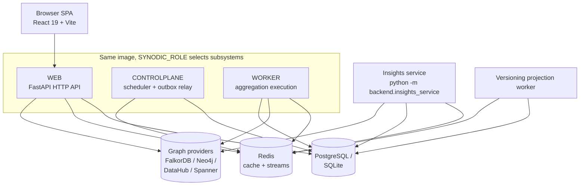

# Platform Services

> **At a glance:** The catalog of backend services that make up {brandShort} — what each is responsible for, the process role it runs under, and how they fit together at runtime. Start here, then follow the links into each service page.

**This page covers:**

- The **service catalog** and links to each service's detail page
- **Process roles** (`SYNODIC_ROLE`) and which subsystems each starts
- The **runtime topology** and shared backing stores
- **Configuration** entry points and cross-cutting limitations

For deeper reading, see [Architecture](/docs/architecture), the
[Backend guide](/docs/backend), the [Aggregation pipeline](/docs/aggregation-pipeline),
and [RBAC](/docs/rbac).

## Purpose / What it does

{brandShort} is built from a small set of cooperating backend services rather
than a single monolith. The HTTP API, the aggregation execution engine, the
control plane, and the headless insights service all share the same Python code
base but start different subsystems depending on their **process role**. This
lets the same image run as a stateless web tier, a heavy background worker, or a
singleton scheduler without separate builds.

The services documented in this section:

| Service | Page | Responsibility |
|---------|------|----------------|
| Insights service | [Insights](/docs/services-insights) | Background collection of per–data-source stats, schema profiling, and pre-registration asset discovery. |
| Search | [Search](/docs/services-search) | Deep Search (provider-agnostic contract) and Advanced Search (structured, view-scoped predicate queries) over the graph. |
| Context Engine | [Context Engine](/docs/services-context-engine) | Query orchestration that binds a workspace's provider and ontology; the layer behind reads, lineage, and context lenses. |
| Assignment Engine | [Assignments](/docs/services-assignments) | Computes per-view layer assignments for rendered entities, plus foreign-schema (ontology) mapping. |

## Where it runs

The process role is selected by the `SYNODIC_ROLE` environment variable. It
controls which subsystems the FastAPI lifespan starts.

> **Important:** The same image runs as every role — `SYNODIC_ROLE` alone decides which subsystems boot. A misconfigured value falls back to `dev` (all-in-one), so verify the role in each deployed process; the `controlplane` role is a singleton and must not be run twice.

| Role (`SYNODIC_ROLE`) | Starts | Notes |
|-----------------------|--------|-------|
| `web` | HTTP API, auth, reads, lightweight writes | Fully stateless; scale horizontally. |
| `worker` | Aggregation execution, heavy provider I/O | Consumes the aggregation job stream. |
| `controlplane` | Scheduler, outbox relay, crash recovery | Singleton. Applies Alembic migrations on deploy. |
| `dev` | All-in-one | Default; runs every subsystem in one process for local development. |

Two subsystems run outside the FastAPI process entirely:

- **Insights service** — a headless container started with
  `python -m backend.insights_service` (see `Dockerfile.insights`). It hosts its
  own scheduler + worker + health endpoint and does not serve the HTTP API.
- **Versioning projection worker** — started with
  `python -m backend.app.services.versioning` (or in-process in dev via
  `GRAPHVER_PROJECTION_INPROCESS=1`).

Backing stores are shared across roles:

- **Graph providers:** FalkorDB (default, Redis-protocol), Neo4j, DataHub,
  Google Cloud Spanner Graph.
- **Management DB:** PostgreSQL in production, SQLite for the local quickstart.
- **Cache / session / streams:** Redis.

## Runtime topology

## Key endpoints

Each service page lists its own real endpoint paths. As orientation:

- Graph reads, lineage, and search live under `/api/v1/{ws_id}/graph/...`.
- Assignment compute lives under `/api/v1/{ws_id}/graph/assignments/compute`.
- Context-model templates live under `/api/v1/{ws_id}/context-models/...`.
- Insights (admin, cache-only) lives under `/api/v1/admin/insights/...`.

## Configuration

Role selection and infrastructure wiring are environment-driven:

- `SYNODIC_ROLE` — process role (`web` / `worker` / `controlplane` / `dev`).
- `MANAGEMENT_DB_URL` — PostgreSQL/SQLite connection for the management DB.
- `REDIS_URL` — Redis connection for cache, sessions, and job streams.
- `AGGREGATION_DISPATCH_MODE` — how aggregation jobs are dispatched
  (`redis` / `postgres` / `dual` / `inprocess` / `auto`).

Service-specific knobs (`STATS_*`, `DEEP_SEARCH_*`, `INSIGHTS_*`, `GRAPHVER_*`)
are documented on the individual service pages.

## How it appears in the product

Most of this section is invisible to end users by design — the web tier serves
the SPA, and background services keep stats, schema, and search indexes fresh
behind it. The admin surfaces (system status, insights, admission tuning) expose
the health of these services to platform administrators.

## Limitations

- Role separation is cooperative, not enforced: a misconfigured `SYNODIC_ROLE`
  falls back to `dev`, which starts every subsystem. Running two `controlplane`
  processes is unsupported (the control plane is a singleton).
- The insights service and versioning projection worker are separate processes;
  status endpoints served by the web tier reflect only what that process can see
  locally (see the Insights page for the split-process caveat).
- The topology diagram is deliberately simplified; it omits the auth service,
  the outbox relay's delivery targets, and per-pool database session routing.
