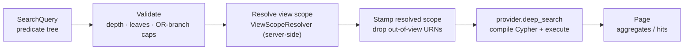

# Search: Deep Search & Advanced Search

{brand} ships a structured, server-side graph search built on two layers: a
provider-agnostic **Deep Search** contract that graph adapters implement, and an
**Advanced Search** service that validates, view-scopes, and executes structured
predicate-tree queries against it.

Related reading: [Platform Services](/docs/services-overview),
[Context Engine](/docs/services-context-engine), [RBAC](/docs/rbac).

**This page covers:**

- The **two layers** — provider-agnostic Deep Search and the Advanced Search service
- The **validate → scope → execute** pipeline and its correctness invariant
- The **workspace-scoped endpoints** and their headers
- **Configuration** (`DEEP_SEARCH_*`) and current **limitations**

## Purpose / What it does

Advanced Search replaces free-text node search with a structured predicate tree,
so callers (including AI agents) can express precise queries — property, tag, and
text predicates combined with AND/OR groups — and get either flat hits or
per-ancestor aggregates back.

Two layers cooperate:

- **Deep Search (`backend/app/services/deep_search`)** — the provider-agnostic
  surface. It defines the `DeepSearchProvider` Protocol that every graph adapter
  implements, the canonical `CompileError` exception, and `DeepSearchSettings`
  (all the env-tunable caps). The service and HTTP layers bind only to this
  package; the Cypher dialect stays inside each provider module. The Protocol has
  three operations:
  - `deep_search` — execute a `SearchQuery`, return a page.
  - `deep_search_explain` — compile only; return the generated Cypher + params.
  - `deep_search_discover` — sample the graph and return queryable property /
    tag / edge metadata.
- **Advanced Search (`advanced_search_service.py`)** — the service layer.
  Its pipeline is: validate the predicate tree (depth / leaf-count / OR-branch
  caps) → resolve the view scope (server-side `ViewScopeResolver`) → stamp the
  resolved scope onto the query → call `provider.deep_search`. The
  **view scope is the load-bearing correctness invariant**: a search must never
  cross its view's boundary, and that is enforced before any Cypher is generated —
  regardless of what the client passes in `scope.rootUrns` (out-of-view URNs are
  dropped server-side).



> **Important:** View scoping is enforced **server-side, before any Cypher is generated**. Whatever a client passes in `scope.rootUrns`, out-of-view URNs are dropped — cross-view leakage would be a correctness/RBAC violation, so a search without a resolvable `scope.viewId` fails by design.

## Where it runs

Search runs **in the WEB role**, as endpoints on the workspace-scoped graph
router. Execution flows through the request's `ContextEngine` to the active graph
provider. The routes use a dedicated read database session
(`get_graph_read_db_session`) held across the provider call, isolating the search
path from the main web session pool.

> **Warning:** **FalkorDB only.** Deep Search is implemented for the FalkorDB adapter today; Neo4j / DataHub / Spanner raise `NotImplementedError`, which the route maps to HTTP `501` for `/search/advanced` until they implement the Protocol.

**Provider support is not uniform.** Only the FalkorDB adapter implements
`deep_search` today; other providers raise `NotImplementedError`, which the route
maps to HTTP `501`. `CompileError` (an unsupported predicate shape) maps to
HTTP `400` with the message intact.

## Key endpoints

All routes are workspace-scoped under `/api/v1/{ws_id}/graph` and require
`workspace:datasource:read`.

| Method | Path | Purpose |
|--------|------|---------|
| POST | `/search/advanced` | Structured predicate-tree search, strictly scoped to `scope.viewId`. Default response is per-ancestor aggregates; set `options.results` to `hits` or `both` for a flat list. |
| POST | `/search/explain` | Compile a query without executing it; returns Cypher + bound params + the resolved-scope summary. Side-effect-free. |
| GET | `/search/discover` | Sample nodes per label and return the native property keys present (`samplePerLabel`, 1–2000). Labels with nodes but no user keys appear in `blobOnlyLabels`. |
| GET | `/search/schema` | The canonical `SearchQuery` JSON Schema (ETag + `X-Schema-Version`), fetched once by the FE and used to drive client-side validation. |
| POST | `/search` | Legacy free-text node search (superseded by `/search/advanced`). |

`/search/advanced` sets response headers `X-Search-Scope-Hash` and, when
out-of-view URNs were dropped, `X-Search-Dropped-URNs`.

There is a separate, unrelated admin search — `GET /api/v1/admin/rbac/search`
(unified search across users, groups, workspaces, roles, and permissions). It
backs the Permissions admin page and is not part of graph Deep/Advanced Search;
it is noted here only to disambiguate the two "search" surfaces.

## Configuration

All tunables read from `DEEP_SEARCH_*` environment variables via a cached frozen
settings object. Defaults:

| Env var | Default | Meaning |
|---------|---------|---------|
| `DEEP_SEARCH_MAX_TREE_DEPTH` | `6` | Max predicate-tree depth. |
| `DEEP_SEARCH_MAX_LEAF_COUNT` | `64` | Max leaf predicates per query. |
| `DEEP_SEARCH_MAX_OR_BRANCH` | `24` | Max branches in an OR group. |
| `DEEP_SEARCH_CANDIDATE_CAP` | `10000` | Default per-query candidate cap. |
| `DEEP_SEARCH_CANDIDATE_CAP_MAX` | `100000` | Hard ceiling on the candidate cap. |
| `DEEP_SEARCH_SOFT_DEADLINE_MS` | `30000` | Default soft execution deadline. |
| `DEEP_SEARCH_DISCOVER_SAMPLES` | `200` | Nodes sampled per label in discovery. |
| `DEEP_SEARCH_SCOPE_ROOT_URNS_CAP` | `5000` | Max root URNs accepted on `scope.rootUrns`. |
| `DEEP_SEARCH_SEARCHABLE_TEXT_CAP` | `8192` | Byte cap on stored searchable text. |
| `DEEP_SEARCH_CACHE_TTL` | `60` | Result-cache TTL (see Limitations). |
| `DEEP_SEARCH_RATE_LIMIT_PER_MIN` | `120` | Per-minute rate limit (see Limitations). |

(Additional `DEEP_SEARCH_DISCOVER_*` and `DEEP_SEARCH_SUBAGG_*` caps exist for
discovery sampling and sub-aggregation fan-out.)

## How it appears in the product

Advanced Search powers the structured search panel in the graph canvas. The
default per-ancestor aggregate response drives an "orient before drill" UX — you
see which parts of the view match before expanding to individual hits. The dev
panel's "Show Cypher" button calls `/search/explain`, and the property / value /
tag / edge pickers are populated from `/search/discover`. Property predicates
that return zero results are usually diagnosed here: a label in `blobOnlyLabels`
signals nodes that still need the native-property migration
(`python -m backend.scripts.migrate_native_properties`) to be queryable by
property.

### The denormalised `searchableText` column

`TextPredicate(target='any')` — what a plain typed word in the Context View's
search box compiles to — reads `n.searchableText`, a lowercased concatenation
of displayName, qualifiedName, description and every string-valued user
property, written by `_compute_searchable_text` at node-write time.

Only the provider write paths populate it. Nodes written by a script that
issues raw Cypher will not have it, and **property values are the one thing no
other column carries**. The compiler therefore ORs `searchableText` with
`displayName`, `qualifiedName` and `description`, so a node missing the column
is still found by name — but its property values are not searchable until the
column exists. Backfill an existing graph with:

```
python -m backend.scripts.migrate_native_properties --searchable-text
```

Any new node-write path must set `searchableText`; a missing column produces
no error, just silently unmatchable rows.

## Limitations

- **FalkorDB only.** Deep Search is implemented for the FalkorDB adapter;
  Neo4j / DataHub / Spanner return `501` for `/search/advanced` until they
  implement the Protocol.
- **Caching and rate limiting are deferred.** The service pipeline intentionally
  does not yet wire result caching or rate limiting (marked for later
  workstreams in the service); the `DEEP_SEARCH_CACHE_TTL` and
  `DEEP_SEARCH_RATE_LIMIT_PER_MIN` settings exist ahead of that work.
- Queries that exceed the validation caps (depth / leaves / OR-branch) are
  rejected with `400` rather than truncated.
- View scoping is mandatory — a search without a resolvable `scope.viewId`
  fails; this is by design, since cross-view leakage would be a correctness/RBAC
  violation.
