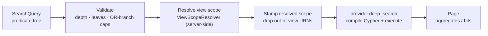

# Search: Deep Search & Advanced Search

{brand} ships a structured, server-side graph search built on two layers: a
provider-agnostic **Deep Search** contract that graph adapters implement, and an
**Advanced Search** service that validates, view-scopes, and executes structured
predicate-tree queries against it.

Related reading: [Platform Services](/docs/services-overview),
[Context Engine](/docs/services-context-engine), [RBAC](/docs/rbac). The full
query model, request and response shapes, and scripting recipes are in the
[Search & Display Rules Reference](/docs/feature-search-and-rules-reference);
the user guides are [Advanced Search](/guide/advanced-search) and
[Display Rules](/guide/display-rules).

**This page covers:**

- The **two layers** — provider-agnostic Deep Search and the Advanced Search service
- The **validate → scope → execute** pipeline and its correctness invariant
- The **workspace-scoped endpoints** and their headers
- The **view library** — saved queries and display rules — and its **library packs**
- **Configuration** (`DEEP_SEARCH_*`) and current **limitations**

## Purpose / What it does

Advanced Search replaces free-text node search with a structured predicate tree,
so callers (including AI agents) can express precise queries — property, tag, and
text predicates combined with AND/OR groups — and get either flat hits or
per-ancestor aggregates back.

Two layers cooperate:

- **Deep Search (`backend/app/services/deep_search`)** — the provider-agnostic
  surface. It defines the `DeepSearchProvider` Protocol that every graph adapter
  implements, the canonical `CompileError` exception, and `DeepSearchSettings`
  (all the env-tunable caps). The service and HTTP layers bind only to this
  package; the Cypher dialect stays inside each provider module. The Protocol has
  three operations:
  - `deep_search` — execute a `SearchQuery`, return a page.
  - `deep_search_explain` — compile only; return the generated Cypher + params.
  - `deep_search_discover` — sample the graph and return queryable property /
    tag / edge metadata.
- **Advanced Search (`advanced_search_service.py`)** — the service layer.
  Its pipeline is: validate the predicate tree (depth / leaf-count / OR-branch
  caps) → resolve the view scope (server-side `ViewScopeResolver`) → stamp the
  resolved scope onto the query → call `provider.deep_search`. The
  **view scope is the load-bearing correctness invariant**: a search must never
  cross its view's boundary, and that is enforced before any Cypher is generated —
  regardless of what the client passes in `scope.rootUrns` (out-of-view URNs are
  dropped server-side).

```mermaid
flowchart LR
    Q["SearchQuery<br/>predicate tree"]
    V["Validate<br/>depth · leaves · OR-branch caps"]
    S["Resolve view scope<br/>ViewScopeResolver (server-side)"]
    St["Stamp resolved scope<br/>drop out-of-view URNs"]
    D["provider.deep_search<br/>compile Cypher + execute"]
    R["Page<br/>aggregates / hits"]

    Q --> V --> S --> St --> D --> R

```

> **Important:** View scoping is enforced **server-side, before any Cypher is generated**. Whatever a client passes in `scope.rootUrns`, out-of-view URNs are dropped — cross-view leakage would be a correctness/RBAC violation, so a search without a resolvable `scope.viewId` fails by design.

## Where it runs

Search runs **in the WEB role**, as endpoints on the workspace-scoped graph
router. Execution flows through the request's `ContextEngine` to the active graph
provider. The routes use a dedicated read database session
(`get_graph_read_db_session`) held across the provider call, isolating the search
path from the main web session pool.

> **Warning:** **FalkorDB only.** Deep Search is implemented for the FalkorDB adapter today; Neo4j / DataHub / Spanner raise `NotImplementedError`, which the route maps to HTTP `501` for `/search/advanced` until they implement the Protocol.

**Provider support is not uniform.** Only the FalkorDB adapter implements
`deep_search` today; other providers raise `NotImplementedError`, which the route
maps to HTTP `501`. `CompileError` (an unsupported predicate shape) maps to
HTTP `400` with the message intact.

## Key endpoints

All routes are workspace-scoped under `/api/v1/{ws_id}/graph` and require
`workspace:datasource:read`, or a `?viewId=` the caller can read (a share link,
held to that view's `view` scope; `discover` and `values` refuse it). Each takes
optional `dataSourceId` and `branchId` query parameters.

| Method | Path | Purpose |
|--------|------|---------|
| POST | `/search/advanced` | Structured predicate-tree search, strictly scoped to `scope.viewId`. Default response is per-ancestor aggregates; set `options.results` to `hits` or `both` for a flat list. |
| POST | `/search/explain` | Compile a query without executing it; returns Cypher + bound params + the resolved-scope summary. Side-effect-free. |
| GET | `/search/schema` | The canonical `SearchQuery` JSON Schema (ETag + `X-Schema-Version`), fetched once by the FE and used to drive client-side validation. |
| GET | `/search/discover` | Sample nodes per label and return the native property keys present (`samplePerLabel`, 1–2000). Labels with nodes but no user keys appear in `blobOnlyLabels`. |
| GET | `/search/values` | A property's most common values across the view (`viewId`, `key`, `q`, `limit` 1–50) — the value picker's suggestions, bounded to about 1.5 s. |
| POST | `/search/membership` | Which of up to 1,000 on-screen entities match which of up to 32 display rules. |
| POST | `/search/counts` | How many entities in the view match each of up to 32 rules, exactly; repeat with the returned `sessions` until every count is complete. |
| POST | `/search/catalog` | Every property the view's entities carry, read from every entity in scope; repeat with `sessionId` until complete. |
| POST | `/search/ancestor-counts` | How many of a search session's matches each of up to 2,000 containers holds. |
| POST | `/search/exports` | Write every match to a CSV or NDJSON file; repeat with `sessionId` until complete. Gated by the `graphExportEnabled` feature. |
| GET | `/search/exports/{sessionId}/download` | Download a finished export with its `token`, for the user who ran it, for an hour. |
| POST | `/search` | Legacy free-text node search (superseded by `/search/advanced`). |

`/search/advanced` sets response headers `X-Search-Scope-Hash` and, when
out-of-view URNs were dropped, `X-Search-Dropped-URNs`.

Saved queries and display rules are stored per view under
`/api/v1/views/{view_id}/library/*` ([below](#library-packs)).

There is a separate, unrelated admin search — `GET /api/v1/admin/rbac/search`
(unified search across users, groups, workspaces, roles, and permissions). It
backs the Permissions admin page and is not part of graph Deep/Advanced Search;
it is noted here only to disambiguate the two "search" surfaces.

## Library packs

A view's **library** is its saved queries (for everyone who can open the view)
and its display rules. Both hold predicates in the same model as a search, and
both are read and written through `/api/v1/views/{view_id}/library/*`: reading
needs read access to the view, writing needs `can_edit_view` (`403` otherwise).
Rules are kept per branch (a draft has its own); saved queries belong to the
view.

A library travels between views as a **pack** — a `*.library.json` file of
format `synodic.view-library`, version 1:

- `GET /library/export` writes the view's rules and saved queries as a pack.
- `POST /library/import?strategy=merge|copy|replace&dryRun=…` reads one.
  `dryRun` defaults to `true`, so an import only says what it would do until
  it is sent `dryRun=false`. Every item is checked as it would be when saved;
  a bad one is refused and the rest import, each under a new id.
- The pack's JSON Schema is `backend/common/schema/view-library.v1.json`
  (`python -m backend.scripts.export_view_library_schema`).
- There is no data-source-level library: `backend/scripts/publish_view_library.py`
  imports a pack into every view of a data source, one view at a time.

Users export and import packs from the Property Manager or the search panel's
Library ([Import & Export](/guide/import-export#view-libraries-rules-and-saved-searches));
the format, the import rules and the recipes are in the
[Search & Display Rules Reference](/docs/feature-search-and-rules-reference#library-packs).

## Configuration

All tunables read from `DEEP_SEARCH_*` environment variables via a cached frozen
settings object. Defaults:

| Env var | Default | Meaning |
|---------|---------|---------|
| `DEEP_SEARCH_MAX_TREE_DEPTH` | `6` | Max predicate-tree depth. |
| `DEEP_SEARCH_MAX_LEAF_COUNT` | `64` | Max leaf predicates per query. |
| `DEEP_SEARCH_MAX_OR_BRANCH` | `24` | Max branches in an OR group. |
| `DEEP_SEARCH_CANDIDATE_CAP` | `10000` | Default per-query candidate cap. |
| `DEEP_SEARCH_CANDIDATE_CAP_MAX` | `100000` | Hard ceiling on the candidate cap. |
| `DEEP_SEARCH_SOFT_DEADLINE_MS` | `60000` | Not read: the default soft deadline is `options.softDeadlineMs` (`60000`), set per request. |
| `DEEP_SEARCH_CHUNK_TIMEOUT_MS` | `45000` | Budget for one scan unit of the uncapped engine. A range unit that runs out is split and retried; a single-root walk unit cannot be, so the search fails. |
| `DEEP_SEARCH_DISCOVER_SAMPLES` | `200` | Nodes sampled per label in discovery. |
| `DEEP_SEARCH_SCOPE_ROOT_URNS_CAP` | `5000` | Max root URNs accepted on `scope.rootUrns`. |
| `DEEP_SEARCH_SEARCHABLE_TEXT_CAP` | `8192` | Byte cap on stored searchable text. |
| `DEEP_SEARCH_CACHE_TTL` | `60` | Result-cache TTL (see Limitations). |
| `DEEP_SEARCH_RATE_LIMIT_PER_MIN` | `120` | Per-minute rate limit (see Limitations). |

(Additional `DEEP_SEARCH_DISCOVER_*` and `DEEP_SEARCH_SUBAGG_*` caps exist for
discovery sampling and sub-aggregation fan-out.)

**Timeouts.** One search request runs at most 100 s server-side (the engine's
request cap). That fits inside the 120 s `/graph/` HTTP tier
(`HTTP_TIMEOUT_GRAPH_SECS`) and the browser's 150 s budget
(`VITE_TIMEOUT_SEARCH_ADVANCED_MS`). A scan that needs longer is not cut off:
the request answers with what it has found so far (`status: 'running'`, plus
`deadlineExceeded: true` outside progressive mode) and a `sessionId` that the
next request continues from. A unit is still cut at 94 s (the request cap minus
grace); a `DEEP_SEARCH_CHUNK_TIMEOUT_MS` above that only lets the abandoned
server-side statement run on, holding a FalkorDB thread, so keep it at or below
94 000.

## How it appears in the product

Advanced Search powers the structured search panel in the graph canvas. The
default per-ancestor aggregate response drives an "orient before drill" UX — you
see which parts of the view match before expanding to individual hits. The dev
panel's "Show Cypher" button calls `/search/explain`, and the property / value /
tag / edge pickers are populated from `/search/discover`. Property predicates
that return zero results are usually diagnosed here: a label in `blobOnlyLabels`
signals nodes that still need the native-property migration
(`python -m backend.scripts.migrate_native_properties`) to be queryable by
property.

## Limitations

- **FalkorDB only.** Deep Search is implemented for the FalkorDB adapter;
  Neo4j / DataHub / Spanner return `501` for `/search/advanced` until they
  implement the Protocol.
- **Caching and rate limiting are deferred.** The service pipeline intentionally
  does not yet wire result caching or rate limiting (marked for later
  workstreams in the service); the `DEEP_SEARCH_CACHE_TTL` and
  `DEEP_SEARCH_RATE_LIMIT_PER_MIN` settings exist ahead of that work.
- Queries that exceed the validation caps (depth / leaves / OR-branch) are
  rejected with `400` rather than truncated.
- View scoping is mandatory — a search without a resolvable `scope.viewId`
  fails; this is by design, since cross-view leakage would be a correctness/RBAC
  violation.
