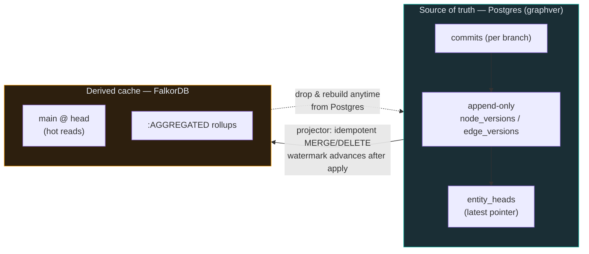
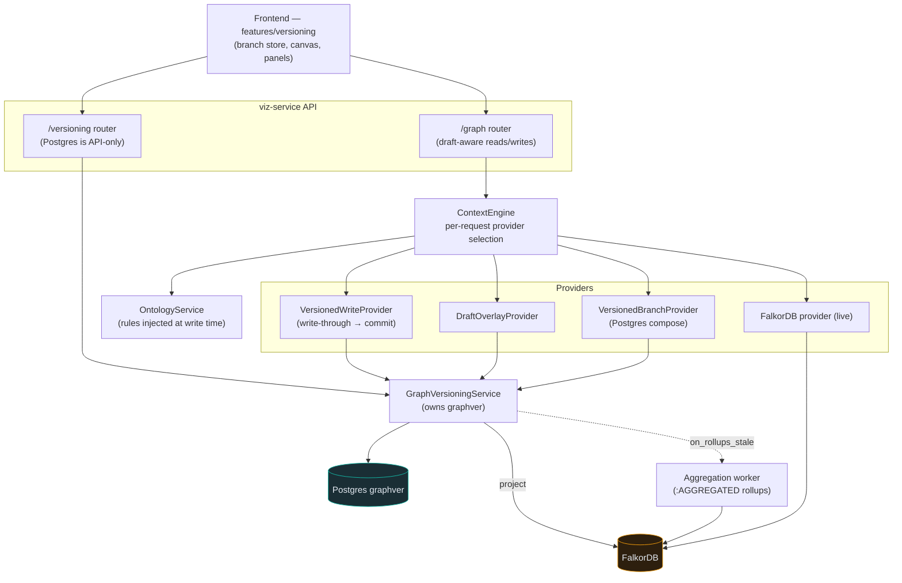
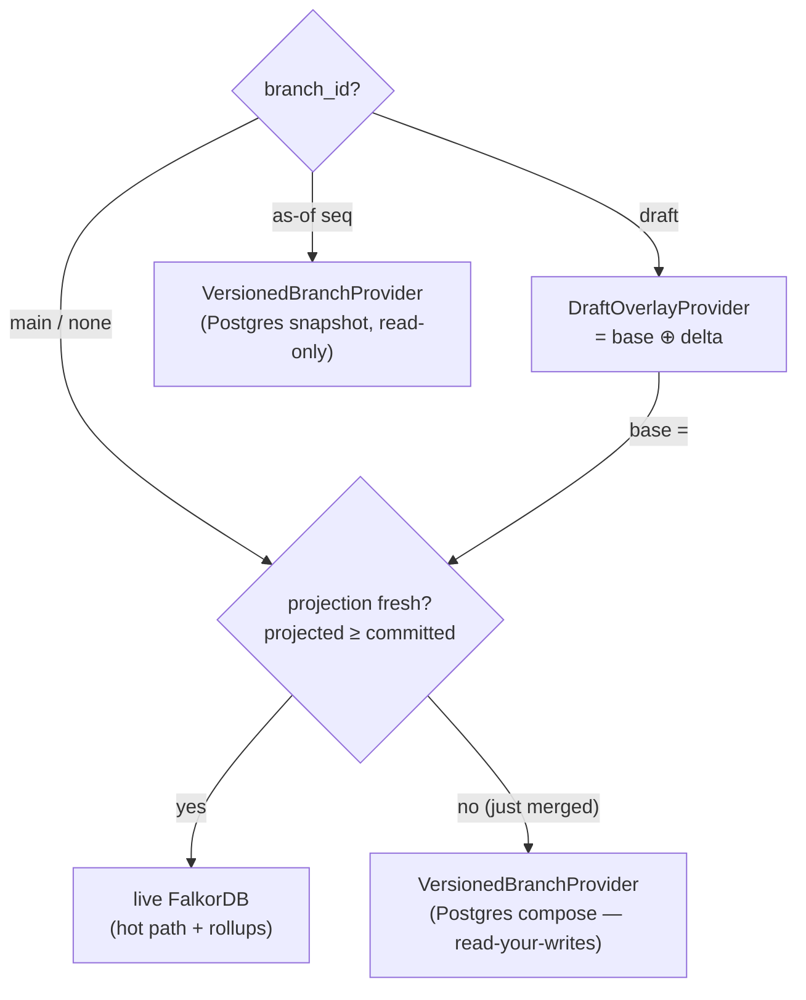
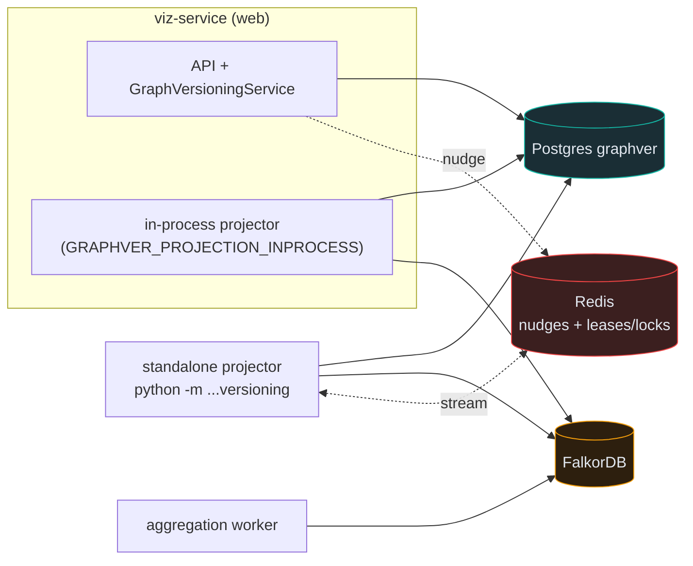

# 01 · Overview & Architecture

> **Audience & scope:** everyone. The big picture — what the Versioned Graph is, the mental models
> to hold, how it routes reads and writes, how it's deployed, and the headline design decisions.
> Read this before the detail chapters.

**TL;DR.** The Versioned Graph is a Git-style version-control layer over a property graph. **Postgres
(the `graphver` schema) is the source of truth** — an append-only log of per-entity versions and
commits. **FalkorDB is a derived, rebuildable hot-read cache** of the published `main` branch. Users
edit in isolated **drafts**, review a diff, and **squash-publish** (or open a merge request) into
`main`; a 3-way field-level merge keeps concurrent work safe. Reads are routed per request to the
freshest correct source. Everything the browser does goes through the API — Postgres is never touched
directly.

---

## 1. The problem it solves

The platform lets teams explore and **curate** a metadata / lineage graph. Curation is a write, and
enterprise curation demands the guarantees software teams take for granted:

- **Isolation** — I can make a set of changes without others seeing half-finished work.
- **Review** — someone approves before it becomes the shared truth.
- **Audit** — a durable record of who changed what, when, and why; nothing is silently lost.
- **Undo** — any published change can be reverted; any past state can be read back.
- **Governance** — writes must satisfy the graph's **ontology** (valid types, legal containment,
  compatible edge endpoints).
- **Scale** — millions of entities, with edits that cost `O(change)`, not `O(graph)`.

The answer is Git, adapted to a **typed property graph with a containment hierarchy**, and paired with
a **read cache** that must remain a faithful, rebuildable projection of committed truth.

## 2. The Git analogy

| Git | Versioned Graph | Notes |
|-----|-----------------|-------|
| Repository | **Graph** | 1:1 with a data source; `kind ∈ manual/authoritative/hybrid/blank` |
| Branch | **Draft** (or `main`) | per-user, optionally shared; scoped to a view |
| Working tree | **`working_changes`** | durable staging buffer before a checkpoint |
| Commit | **Checkpoint** / commit | append-only, monotonic `commit_seq` per branch |
| `git commit --amend`/squash | **Publish** (`squash_publish`) | a draft folds into `main` as one commit |
| Pull request | **Merge Request / PR** | reviewed draft→`main`, or fork→base |
| Fork | **Fork** | copy-on-write; no rows copied |
| `git rebase`/pull | **Rebase / pull-latest** | 3-way merge `main` into the draft |
| `git revert` | **Revert** | inverse of a `main` commit, audited |
| 3-way merge | **3-way field-level merge** | per-entity, per-field; see [03](03-branching-commits-merge.md) |

> **Not Git:** the unit of change is an **entity** (node/edge), not a text line; merges are
> **field-level** over JSON payloads with ontology-aware set fields; `main` history is **squash-only**
> (linear, one commit per publish/merge) so the shared timeline stays legible.

## 3. Two mental models

### 3a. Postgres is truth; FalkorDB is a rebuildable cache



The cache can be evicted, corrupted, or lost and **rebuilt in full from Postgres** — so the projector
is free to be aggressive (drop + reseed) as long as it never advances its **watermark** before a batch
lands. Details: [04 · Projection & Cache](04-projection-and-cache.md).

### 3b. A draft is `main ⊕ a sparse delta`

> **Invariant.** A draft opened off `main` reads **identically** to `main` — every node, every edge,
> every aggregated rollup — until it changes something. Then **only** the entities it added, removed,
> or edited differ.

This is guaranteed *by construction*, not by re-derivation: the `DraftOverlayProvider` wraps whatever
serves `main` and overlays only the draft's bounded change set. **An empty delta ⇒ a pure
pass-through**, so a no-op draft literally *is* `main`. This is why opening a draft is cheap and why a
draft never silently diverges. See [03](03-branching-commits-merge.md) and
[04](04-projection-and-cache.md).

## 4. Where it sits in the stack

The Versioned Graph is one layer inside the larger platform (providers, ontologies, views,
aggregation). It owns the `graphver` store and mediates all graph writes.



- **Providers / ontology / views / aggregation** are the surrounding stack — see
  [`../DATA_ARCHITECTURE.md`](../DATA_ARCHITECTURE.md).
- **Ontology governance** is enforced at the commit boundary: [05](05-ontology-governance.md).
- **Views** scope which entities a draft/import/export touches (via
  `context_models.instance_assignments`): [07](07-frontend-integration.md),
  [08](08-import-export.md).
- **Aggregation** (`:AGGREGATED` rollups) is maintained incrementally by the projector and rebuilt via
  a hook: [04](04-projection-and-cache.md).

## 5. Read routing — the freshest correct source, per request

`ContextEngine` selects a read provider per request based on branch and projection freshness
(`backend/app/services/context_engine.py:111-218`):



- **`main`, fresh** → live FalkorDB (the only place materialized rollups exist).
- **`main`, lagging** (e.g. seconds after a merge) → Postgres composition, so a just-committed change
  is visible immediately.
- **draft** → `DraftOverlayProvider`, whose *base* is whichever of the above serves `main`.
- **as-of / historical** → a read-only Postgres snapshot at a `commit_seq`.

> **Limitation.** Two read surfaces compute "fresh" slightly differently (the neighbors endpoint
> honors `READ_MAX_LAG`; ContextEngine uses strict `projected ≥ committed`). They coincide at the
> default `READ_MAX_LAG=0`. See [09](09-scale-limits-and-roadmap.md).

## 6. Write paths — two ways in, one system of record

1. **Draft flow (the reviewed path).** Edit → `working_changes` → **checkpoint** (fold into version
   rows + a commit) → **publish** or open a **merge request**. This is what the canvas and bulk import
   use. See [03](03-branching-commits-merge.md), [07](07-frontend-integration.md),
   [08](08-import-export.md).
2. **Write-through (the direct path).** `VersionedWriteProvider` wraps any provider so an ordinary
   graph write **also lands as an audited commit** on the data source's versioned graph before hitting
   the backing store — making versioning the system of record even for non-draft writes (toggle
   `GRAPHVER_VERSIONED_WRITES`). See [04](04-projection-and-cache.md).

Both funnel through `GraphVersioningService.apply_ops` (`O(ops)`), which enforces ontology + edge
integrity and writes append-only version rows. `update` ops are **field-level patches**, not wholesale
replaces — a defensive invariant that closed a real merge-time data-loss class.

## 7. Deployment topology

- **viz-service (FastAPI).** Hosts the `/versioning` and `/graph` routers and
  `GraphVersioningService`. Optionally runs the projection worker **in-process** when
  `GRAPHVER_PROJECTION_INPROCESS=1` (set in the dev compose) — see `backend/app/main.py:872-908`.
- **Standalone projection worker.** `python -m backend.app.services.versioning` runs the reconciling
  projector as its own process for production/multi-node. (One known gap: it lacks the
  `on_rollups_stale` wiring the in-process/interactive paths have — [09](09-scale-limits-and-roadmap.md).)
- **Aggregation worker.** Maintains `:AGGREGATED` rollups on full-seed / stale windows via a triggered
  job. **Redis** carries projection nudges (stream) and cache leases/locks.
- **Postgres.** The `graphver` schema is **decoupled** — point `GRAPHVER_DB_URL` at its own instance
  in production; it falls back to `MANAGEMENT_DB_URL` in single-instance dev.



## 8. Request lifecycle (two representative flows)

**A draft edit that reaches the canvas as a diff:**

```mermaid
sequenceDiagram
    participant UI as Canvas (Edit mode)
    participant API as /graph & /versioning
    participant SVC as GraphVersioningService
    participant PG as Postgres
    participant WK as Projector
    participant FDB as FalkorDB
    UI->>API: resolve → open draft (POST /resolve)
    UI->>API: POST /graph/changes?branchId (staged edits)
    API->>SVC: apply_ops (ontology + integrity gates)
    SVC->>PG: append version rows + commit (O(ops))
    UI->>API: GET /branches/{id}/diff-vs-main
    API->>SVC: compose draft = main ⊕ delta
    UI->>API: POST /branches/{id}/publish
    API->>SVC: squash → main (advisory lock, 3-way if stale)
    SVC->>PG: squash_publish commit; bump target_commit_seq
    API-->>WK: nudge
    WK->>PG: read window
    WK->>FDB: MERGE/DELETE; advance watermark
```

## 9. Headline architecture decisions

> **Decision — Postgres source of truth, FalkorDB rebuildable cache.** Correctness and durability live
> in an append-only relational log; the graph DB is a fast, disposable read model. Rationale: graph
> DBs are excellent at traversal but weaker at the transactional, append-only, point-in-time
> guarantees versioning needs. The cache can always be rebuilt. ([04](04-projection-and-cache.md))

> **Decision — append-only versions + a mutable head pointer.** Version tables are never `UPDATE`d;
> "latest" is a small `entity_heads` pointer. Rationale: preserves full history and audit for free,
> keeps the high-cardinality tables churn-free, and makes point-in-time reconstruction a range scan.
> ([02](02-data-model.md))

> **Decision — a draft is `main ⊕ sparse delta`.** Chosen over recomputing rollups per read or
> materializing a per-draft FalkorDB graph. Rationale: reuses `main`'s caches and rollups, costs
> `O(delta)`, and makes "no-op draft ≡ main" true by construction. ([03](03-branching-commits-merge.md))

> **Decision — `update` is a field-level PATCH, not a replace.** The canvas sends only edited fields;
> treating that as a whole-entity replace silently erased unmentioned fields on publish. Patch
> semantics make every partial caller safe. ([03](03-branching-commits-merge.md))

> **Decision — squash-only `main`, 3-way field-level merge.** `main` history stays linear and legible
> (one commit per publish/merge); concurrent edits merge per-field with ontology-aware set fields, and
> only genuine same-field clashes conflict. ([03](03-branching-commits-merge.md))

> **Decision — ontology enforced at the commit boundary, injected from the API layer.** The versioning
> package never imports the management DB; rules are resolved and pushed down at write time and
> **re-checked at merge** against current published rules. ([05](05-ontology-governance.md))

> **Decision — HASH-partition the append-only tables on `graph_id`; blake2b content/Merkle hashing.**
> Fixed-modulo partitioning (not partition-per-data-source) bounds partition count; blake2b + a
> length-prefixed encoding give collision-resistant, unambiguous hashes. Both are
> **immutable-after-data**. ([02](02-data-model.md))

> **Decision — a provider-capability seam (managed vs federated).** Each provider type declares whether
> we own its store (writable) or merely present a view of an external catalog. This is the hinge for
> connecting authoritative sources like DataHub / OpenMetadata. ([10](10-authoritative-sources-datahub-openmetadata.md))

---

## Related chapters

- [02 · Data Model](02-data-model.md) — the `graphver` schema and its invariants.
- [03 · Branching, Commits & Merge](03-branching-commits-merge.md) — the engine.
- [04 · Projection & Cache](04-projection-and-cache.md) — FalkorDB as a rebuildable read model.
- [05 · Ontology Governance](05-ontology-governance.md) — commit-boundary enforcement.
- [09 · Scale, Limits & Roadmap](09-scale-limits-and-roadmap.md) — the honest edges.
- [10 · Authoritative Sources](10-authoritative-sources-datahub-openmetadata.md) — the federation
  direction.
