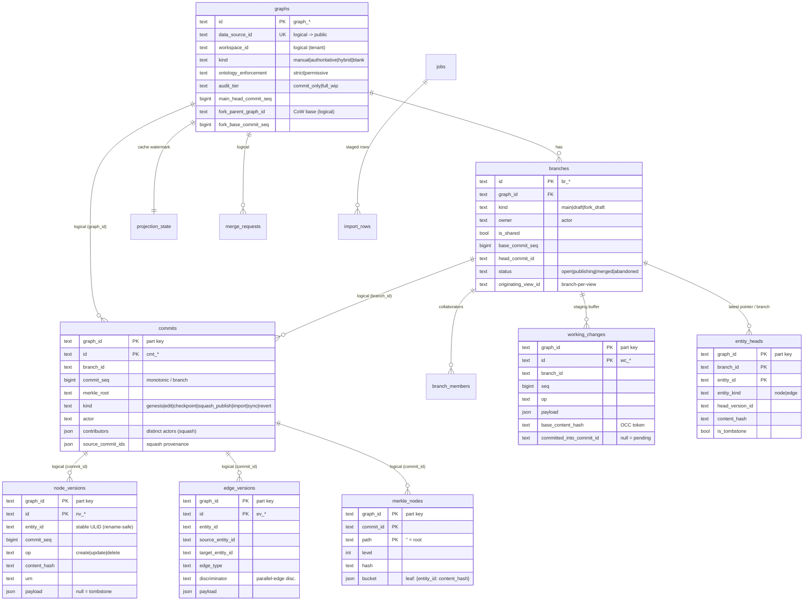
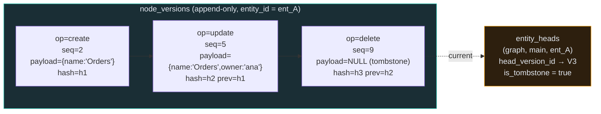
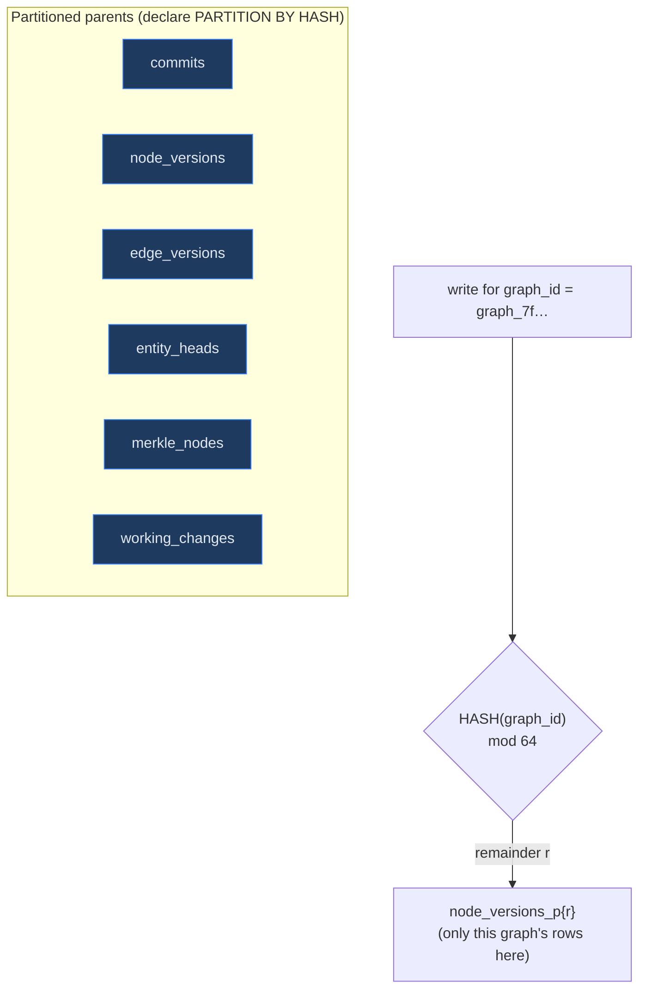

# 02 · Data Model — the `graphver` Postgres schema

> **Audience & scope.** Anyone touching the durable store. This chapter is the definitive reference
> for every table in the `graphver` schema, the invariants that keep it correct, and the design
> choices behind them. Terminology follows the [glossary](README.md#glossary).

**TL;DR.** `graphver` is a **decoupled, append-only** Postgres schema that is the **source of truth**
for versioned graphs. Every entity is a chain of immutable **version rows**; "latest" is a small,
mutable **head pointer** (`entity_heads`), never an `is_head` flag — so the high-cardinality tables
never churn. The six hot tables are **HASH-partitioned on `graph_id`**; primary keys are **ULIDs** so
inserts stay append-friendly; content is **blake2b**-hashed for integrity and Merkle diffing. Nothing
here foreign-keys into the management database — cross-store references are **logical only**.

Defined in `backend/app/services/versioning/models.py` (ORM), `config.py` (tunables),
`ids.py` (ULIDs), `db.py` (engine/session), and provisioned by
`backend/alembic/versions/20260601_1200_graphver_schema.py`.

---

## 1. Design principles (read these first)

The table shapes only make sense once you accept five decisions. Each is load-bearing.

> **Decision — the store is decoupled.** `graphver` has its own SQLAlchemy declarative base
> (`VersioningBase`, `db.py:32`) and its own connection URL (`GRAPHVER_DB_URL`, `config.py:29`). It can
> be split onto its own CloudSQL instance by changing one env var — no code change — because there are
> **no cross-schema foreign keys to `public`**. References like `data_source_id`, `workspace_id`,
> `actor`, `originating_view_id` are **logical** strings, resolved against the management DB at the API
> boundary (see [06 · API Reference](06-api-reference.md) for actor-name resolution). Dev/test falls
> back to `MANAGEMENT_DB_URL` so a single Postgres serves both (`config.py:29-40`, `db.py:1-14`).

> **Decision — append-only versions + a mutable head pointer.** Version tables (`node_versions`,
> `edge_versions`) are **never `UPDATE`d**. Each edit appends a new row. "Which row is current?" is
> answered by the small `entity_heads` pointer table (`models.py:471-493`) rather than an `is_head`
> boolean, so the massive version tables don't rewrite rows (no bloat, no vacuum pressure, clean audit
> log). This is stated as the module's core discipline (`models.py:13-16`).

> **Decision — HASH-partition on `graph_id`, fixed modulo.** The six high-cardinality tables are
> partitioned `HASH (graph_id)` into `config.PARTITIONS` (**64** by default) — **never** a partition per
> data source (`models.py:9-15, 45-54`; `config.py:52`). One graph's rows all land in one partition, so
> per-graph scans hit one partition; the count is fixed so it can't explode with tenant growth. Because
> Postgres requires the partition key in every PK/UNIQUE, these tables use a **composite PK
> `(graph_id, id)`** (`models.py:11-13`).

> **Decision — ULID primary keys.** IDs are `<prefix>_<ULID>` (e.g. `cmt_01J9Z…`, `ids.py:55-57`). A
> ULID is a 48-bit millisecond timestamp + 80-bit randomness, Crockford-base32, **monotonic within a
> millisecond** (`ids.py:35-52`) — so it sorts in creation order and B-tree inserts stay sequential
> instead of fragmenting the index like random UUIDs would (`ids.py:1-9`).

> **Decision — full-payload versions, last-writer-wins per entity.** A version row stores the entity's
> **entire** payload, not a field delta. Composition is therefore trivial (take the latest row per
> entity), at the cost of write amplification. This is exactly why an `update` op must be applied as a
> **field-level PATCH** onto the current payload before the row is written — a partial payload written
> wholesale would erase unmentioned fields (the merge data-loss class; see
> [03 · Branching, Commits & Merge](03-branching-commits-merge.md) and
> [`../VERSIONING_DRAFTS_LINEAGE_AND_MERGE.md`](../VERSIONING_DRAFTS_LINEAGE_AND_MERGE.md)).

A sixth, `config.py`, splits every tunable into **IMMUTABLE-AFTER-DATA** (fixes the on-disk encoding —
`HASH_ALGO`, `HASH_DIGEST_SIZE`, `MERKLE_DEPTH`, `PARTITIONS`) vs **RUNTIME-TUNABLE** (§8).

---

## 2. Schema at a glance

Two tiers: **control-plane** (low/medium cardinality, unpartitioned) and **versioned data** (high
cardinality, append-only, partitioned).

| Tier | Tables | Cardinality | Partitioned? |
|------|--------|-------------|--------------|
| **Control-plane** | `graphs`, `branches`, `branch_members`, `merge_requests`, `projection_state`, `jobs`, `import_rows` | low / medium | no |
| **Versioned data** | `commits`, `node_versions`, `edge_versions`, `entity_heads`, `merkle_nodes`, `working_changes` | high, append-only | **HASH(`graph_id`) × 64** |

`PARTITIONED_TABLES` is the authoritative list (`models.py:45-52`).

---

## 3. Control-plane tables

### `graphs` — one versioned graph, 1:1 with a data source
`models.py:76-114`. The root aggregate. Key columns: `kind` (`manual|authoritative|hybrid|blank`,
CHECK `ck_graphs_kind`, `models.py:105-107`), `ontology_enforcement` (`strict|permissive`,
`ck_graphs_enforce`), `audit_tier` (`commit_only|full_wip`, `ck_graphs_audit`), `main_head_commit_seq`
(the current tip of `main`, `models.py:93`), and the copy-on-write fork pointers
`fork_parent_graph_id` / `fork_base_commit_seq` (`models.py:94-95`). `ontology_spec` holds an inline
vocabulary when a graph isn't bound to a managed ontology. Uniqueness is enforced on `data_source_id`
(`uq_graphs_data_source`, `models.py:101`) — that constraint is also the race backstop when two
requests try to "enable versioning" for the same source concurrently.

> **Invariant.** `main_head_commit_seq` is the single source of "where is `main`". Every
> main-advancing operation bumps it under an advisory lock; the projector's `target_commit_seq` tracks
> it (see [04 · Projection & Cache](04-projection-and-cache.md)).

### `branches` — `main`, drafts, and fork drafts
`models.py:117-151`. `kind ∈ main|draft|fork_draft` (`ck_branches_kind`). A draft carries `owner`
(the actor for a per-user draft), `is_shared` (multi-collaborator), `base_commit_seq` (the `main` seq
it branched from — the merge base), `head_commit_id` (its latest checkpoint), `status`
(`open|publishing|merged|abandoned`, `ck_branches_status`), and **`originating_view_id`**
(`models.py:134`) — the field that makes drafts **branch-per-view** (a draft is scoped to the Context
View it was opened from). `base_ontology_version_id` snapshots which ontology version the draft opened
against.

### `branch_members` — shared-draft collaborators
`models.py:154-178`. Grants `subject_type ∈ user|group` a `role ∈ editor|viewer|maintainer` on a
shared branch (`ck_bm_role`), unique per `(branch, subject_type, subject_id)`. Backs shared-draft OCC
and the collaborator gates in [03](03-branching-commits-merge.md).

### `merge_requests` — draft→main MRs *and* fork→base PRs (one table)
`models.py:181-220`. The discriminator is `source_graph_id`: **`source_graph_id == target_graph_id`**
⇒ a draft→`main` **MR**; **`NULL`** ⇒ a legacy fork **PR** (`models.py:189`). Carries the human review
surface (`title`, `description`), the computed `conflicts` (JSONB, field-level set), user-supplied
`resolutions`, `reviewers`/`approved_by`/`approval_status`, `checks_status` (e.g. ontology
re-validation), and full lifecycle attribution (`actor` raised, `merged_at`/`merged_by`,
`closed_at`/`closed_by`). `status ∈ open|conflicts|mergeable|approved|merged|closed`
(`ck_mr_status`, `models.py:216-219`).

### `projection_state` — the FalkorDB cache watermark (one row / graph)
`models.py:223-250`. Drives read freshness and bounded staleness: `projected_commit_seq` vs
`target_commit_seq`, `status ∈ idle|projecting|rebuilding|evicted` (`ck_proj_status`), the pinned
`falkor_graph_name` + `falkor_provider` (per-provider cache placement/eviction), and the in-flight
full-reseed progress bar (`progress_done`/`progress_total`, `models.py:238-242`). Fully explained in
[04 · Projection & Cache](04-projection-and-cache.md).

### `jobs` — crash-recoverable worker jobs (+ import/export)
`models.py:253-325`. Mirrors the aggregation job model (cursor checkpoint, idempotency key, phase,
retry, monotonic sequence). `job_type ∈ ingest|projection|rebuild|export` (`ck_jobs_type`,
`models.py:322-324`). The branch's **import/export** vertical extends it with full traceability +
parameters + artifact URIs + a `summary` JSONB tally (`models.py:285-305`) — see
[08 · Import/Export](08-import-export.md). A **partial unique** index `ix_jobs_idem_active` enforces
one active job per `(graph_id, idempotency_key)` (`models.py:311-317`).

### `import_rows` — transient staging for an async import
`models.py:328-355`. The uploaded file is parsed **once** into cursor-ordered rows
(`PrimaryKeyConstraint(job_id, row_index)`), then the worker resolves/diffs/applies them by keyset
scan — resumable across a crash, reused by both preview and apply (idempotent re-runs). **Plain
(non-partitioned)** and GC'd by job after a terminal state, because rows are transient and keyed by
`job_id`, not `graph_id` (`models.py:328-334`).

---

## 4. Versioned data tables (append-only, partitioned)

### `commits` — the append-only commit log
`models.py:361-397`. Linear **per branch** (squash-only on `main`). Every commit has a `commit_seq`
monotonic within its branch, enforced by `uq_commits_branch_seq (graph_id, branch_id, commit_seq)`
(`models.py:387-389`) — the unique constraint that turns a concurrent-writer race into a retriable
integrity error (see the concurrency model in [03](03-branching-commits-merge.md)). `kind` spans the
full lifecycle: `genesis | edit | checkpoint | squash_publish | import | sync | revert`
(`ck_commits_kind`, `models.py:392-396`). Squash provenance lives here: `contributors` (distinct
actors folded in), `source_branch_id`, `source_commit_ids` + `source_commit_count` (the "merged N
commits" drill-down), plus `merkle_root`, `stats`, `originating_view_id`, and `idempotency_key` (bulk
dedup). A BRIN index on `commit_seq` (`ix_commits_seq_brin`) keeps range scans cheap on the naturally
ordered column.

### `node_versions` — append-only node history *and* audit log
`models.py:400-432`. One row per (entity, commit) change. Identity is the stable **`entity_id`**
(a ULID) — **rename-safe**, because `urn`/`display_name`/`qualified_name` are just denormalized,
mutable columns on the row, not the identity (`models.py:407, 414-417`). `op ∈ create|update|delete`
(`ck_nv_op`). `content_hash`/`prev_content_hash` chain the version for integrity. **`payload` NULL is
the tombstone** (a delete, `models.py:418`). The denormalized `urn`/`entity_type`/`display_name`/
`qualified_name` columns exist so reads and the projector don't have to crack open the JSONB. Indexes
matter: `ix_nv_entity_hist (graph_id, entity_id, commit_seq)` powers point-in-time reconstruction;
`ix_nv_branch_changeset (graph_id, branch_id, commit_seq)` powers O(changed) diffs; `ix_nv_urn` powers
urn→entity lookup (`models.py:425-430`).

### `edge_versions` — append-only edge history
`models.py:435-468`. Same shape, but endpoints are **stable `entity_id`s** (`source_entity_id`,
`target_entity_id`) — so renaming a node never rewrites its edges (`models.py:436-437, 450-451`). An
optional `discriminator` distinguishes parallel edges of the same type between the same pair;
`edge_type` and `confidence` are first-class. `ix_ev_source`/`ix_ev_target` bound neighborhood reads
by node degree.

> **Invariant — edges reference identities, not names.** Because both endpoints are `entity_id`s and
> the payload carries them, a node rename can never dangle or re-point an edge. The projector resolves
> endpoint `urn`s only at write time to FalkorDB.

### `entity_heads` — the mutable "latest" pointer
`models.py:471-493`. PK `(graph_id, branch_id, entity_id)`. Holds `entity_kind (node|edge)`,
`head_version_id` (which version row is current), `content_hash`, and `is_tombstone`. This is the one
mutable table in the version path, and it is what lets the version tables stay strictly append-only.

> **Invariant — a draft holds only what it changed.** A draft's `entity_heads` contains rows *only*
> for entities that draft has touched; every other entity is resolved by falling back to `main`
> (`models.py:471-474`). That is the storage-level reason a no-change draft is byte-identical to
> `main` — the substrate behind the "draft = main ⊕ sparse delta" overlay in
> [04 · Projection & Cache](04-projection-and-cache.md).

### `merkle_nodes` — persisted copy-on-write Merkle tree
`models.py:496-517`. A hierarchical, content-addressed trie per commit; **only changed buckets are
materialized**, and unchanged subtrees are inherited from earlier commits via the as-of index
`ix_merkle_asof (graph_id, branch_id, path, commit_seq)` (`models.py:516`). PK `(graph_id, commit_id,
path)`; `path=""` is the root; leaf rows carry a `bucket` of `{entity_id: content_hash}`. The full
mechanics (16-way trie, incremental root, diff) are in [03](03-branching-commits-merge.md).

### `working_changes` — the durable draft staging buffer
`models.py:520-554`. Client edits are bulk-flushed here **before** a checkpoint folds them into
version rows — so an in-progress draft survives a crash without polluting the version history. Each
row is `(op, entity_kind, entity_id, payload)` plus `base_content_hash` (the **OCC token** captured
against the head at edit time) and `committed_into_commit_id` (NULL while pending). The partial index
`ix_wc_uncommitted` (`WHERE committed_into_commit_id IS NULL`, `models.py:543-549`) makes "what's still
uncommitted on this branch?" a cheap scan.

### One entity's life across the version tables

Reading "current state on `main`" = join `entity_heads` → the referenced version rows (skipping
tombstones). Reading "state as of seq K" = `DISTINCT ON (entity_id)` over `ix_nv_entity_hist` filtered
to `commit_seq ≤ K` — no head table needed for time travel (the reconstruction is detailed in
[03](03-branching-commits-merge.md)).

---

## 5. Partitioning & keys in practice

- **Why HASH, not per-source.** A per-data-source partition scheme would create unbounded partitions
  as tenants grow and give Postgres a hard planning problem. Fixed modulo (64) bounds the partition
  count while still co-locating a single graph's rows in one child, so per-graph queries prune to one
  partition (`models.py:9-15`).
- **Composite PKs.** Postgres requires the partition key in every unique constraint, so partitioned
  tables use `(graph_id, id)` PKs (or `(graph_id, branch_id, entity_id)` for `entity_heads`,
  `(graph_id, commit_id, path)` for `merkle_nodes`).
- **ULID + BRIN.** Sequential ULID inserts pair naturally with BRIN indexes on `commit_seq`
  (`ix_*_seq_brin`) — tiny indexes over an append-ordered column.

> **Limitation — the hot-graph partition.** HASH(`graph_id`) gives a busy collaborative graph **no**
> intra-graph parallelism: all its rows share one partition. Partition count is IMMUTABLE-AFTER-DATA,
> so this must be decided before production data lands. Tracked in
> [09 · Scale, Limits & Roadmap](09-scale-limits-and-roadmap.md).

---

## 6. Content hashing & the op model

- **Algorithm.** `config.new_hash()` is **blake2b** (32-byte digest) by default, or blake3 if the
  wheel is installed — and it **fails fast** rather than silently downgrading, because a mismatch would
  corrupt hash continuity (`config.py:60-78`). `hash_parts(*parts)` is **length-prefixed** so
  `hash("ab","c") ≠ hash("a","bc")` — concatenation is unambiguous (`config.py:81-92`).
- **Content hash vs tombstone.** A live payload hashes its canonical (sorted-key) JSON; a deleted
  entity gets a distinct stable tombstone hash. `content_hash`/`prev_content_hash` chain successive
  versions of one entity for integrity and drive the Merkle leaf buckets.
- **The op model.** Three ops × two kinds: `create` (writes a full payload), `update` (a **field-level
  PATCH** onto the current payload — never a wholesale replace), `delete` (writes a tombstone). Edge
  payloads carry `sourceEntityId`/`targetEntityId`, which is how the engine tells a node from an edge
  without a kind lookup. The full apply semantics live in [03](03-branching-commits-merge.md).

> **Invariant — `update` is a PATCH.** Because a version row is the *entire* payload and composition is
> last-writer-wins per entity, applying a partial `update` as a replace erases unmentioned fields. The
> engine merges the patch onto the current payload before writing the new version. This is the single
> most important correctness rule in the store.

---

## 7. Configuration: immutable-after-data vs runtime-tunable

`config.py` deliberately labels every knob. Get the split wrong and you corrupt existing data.

| Class | Setting (env) | Default | Meaning |
|-------|---------------|---------|---------|
| **IMMUTABLE-AFTER-DATA** | `PARTITIONS` (`GRAPHVER_PARTITIONS`) | 64 | Hash-partition modulo (`config.py:52`) |
| | `MERKLE_DEPTH` (`GRAPHVER_MERKLE_DEPTH`) | 4 | Trie depth → 16⁴ leaf buckets (`config.py:55`) |
| | `HASH_ALGO` / `HASH_DIGEST_SIZE` | blake2b / 32 | Content + Merkle hash (`config.py:60-61`) |
| **RUNTIME-TUNABLE** | `POOL_SIZE` / overflow / timeout | 10 / 5 / 10s | graphver engine pool (`config.py:104-106`) |
| | `INGEST_BATCH_SIZE` / `PROJECTION_BATCH_SIZE` | 5000 / 5000 | rows per COPY / UNWIND chunk (`config.py:109-110`) |
| | `DEFAULT_AUDIT_TIER` | `commit_only` | per-graph default (`config.py:177`) |
| | `DEFAULT_ONTOLOGY_ENFORCEMENT` | `strict` | per-graph default (`config.py:180`) |
| | `SET_FIELDS` | `{tags}` | payload fields merged as unordered sets in 3-way merge (`config.py:184`) |
| | `DRAFT_TTL_DAYS` | 30 | auto-abandon idle drafts (`config.py:169`) |
| | `COMMIT_MAX_RETRIES` | 5 | `commit_seq` contention retry budget (`config.py:173`) |

The projection/cache/eviction/import knobs are catalogued where they're used —
[04 · Projection & Cache](04-projection-and-cache.md) and [08 · Import/Export](08-import-export.md).

> **Limitation — no GC / retention.** Superseded version rows, committed `working_changes`, and
> Merkle leaf buckets accrue forever; nothing prunes them today. See
> [09 · Scale, Limits & Roadmap](09-scale-limits-and-roadmap.md).

---

## 8. Provisioning & migrations

- **Bootstrap helper.** `create_schema_and_partitions(engine)` (`models.py:560-580`) creates the
  schema, all parent tables (via `metadata.create_all`), and the 64 child hash partitions per
  partitioned table. Idempotent; used by dev bootstrap and the migration body.
- **The migration.** `20260601_1200_graphver_schema.py` makes a normal `alembic upgrade head`
  provision the store so the API works on a fresh DB. It is deliberately idempotent
  (`CREATE SCHEMA IF NOT EXISTS` + `create_all(checkfirst=True)` + `CREATE TABLE IF NOT EXISTS …
  PARTITION OF`), and it back-fills columns added after the first cut (`merkle_nodes` CoW columns +
  `ix_merkle_asof`, `commits.idempotency_key`, `graphs.ontology_spec`,
  `projection_state.falkor_provider`, `merge_requests` review metadata) with `ADD COLUMN IF NOT
  EXISTS` (`migration:50-90`). Partition count is read from `config.PARTITIONS` so DDL always matches
  the runtime modulo.
- **Decoupled deploys.** When `graphver` lives on its own instance, provision it out-of-band with the
  same DDL — the migration and the bootstrap helper share the exact logic (`migration:14-22`).

> **Note.** Later branch migrations extend this base (e.g. `20260703_1200_graph_kind_blank` swaps the
> `ck_graphs_kind` CHECK to add `blank`; `20260704_1400_import_export` adds `import_rows` + the job
> import/export columns). They are catalogued in the chapters that own those features (05, 08).

---

## Related chapters

- [03 · Branching, Commits & Merge](03-branching-commits-merge.md) — how these tables are written and
  composed (stage → checkpoint → publish, 3-way merge, Merkle).
- [04 · Projection & Cache](04-projection-and-cache.md) — `projection_state` and how committed `main`
  becomes a FalkorDB read graph.
- [05 · Ontology Governance](05-ontology-governance.md) — `ontology_enforcement`, `ontology_spec`, and
  the `blank` kind.
- [09 · Scale, Limits & Roadmap](09-scale-limits-and-roadmap.md) — partitioning, GC/retention, and the
  hot-graph partition caveat.
