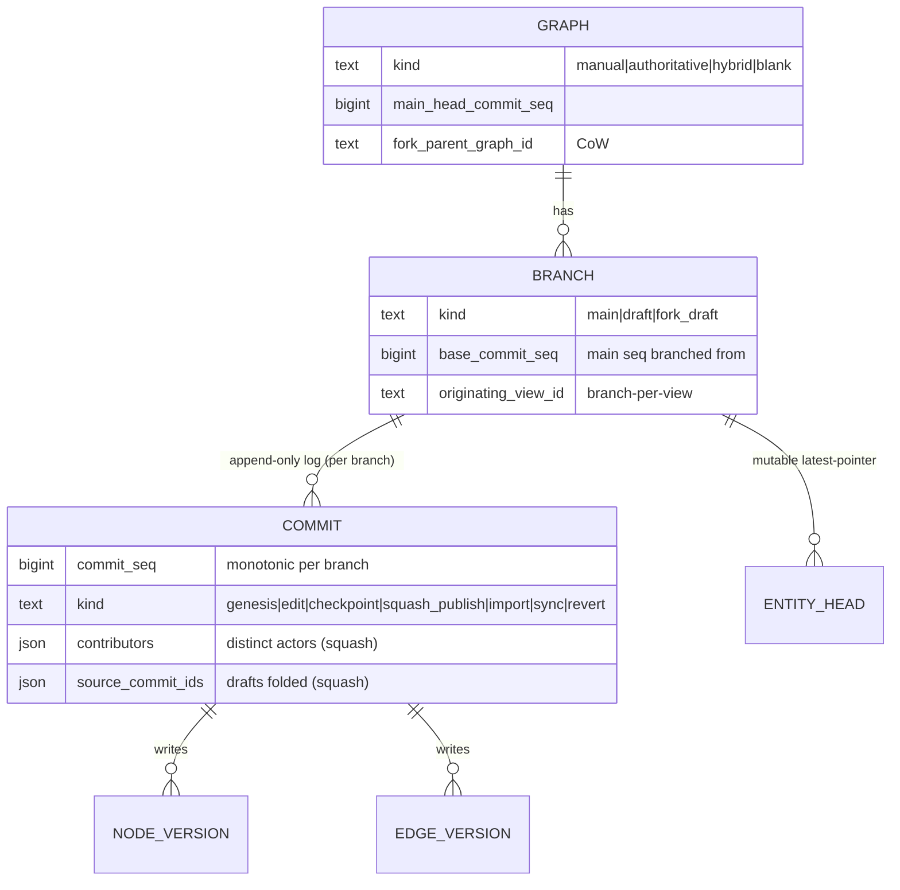
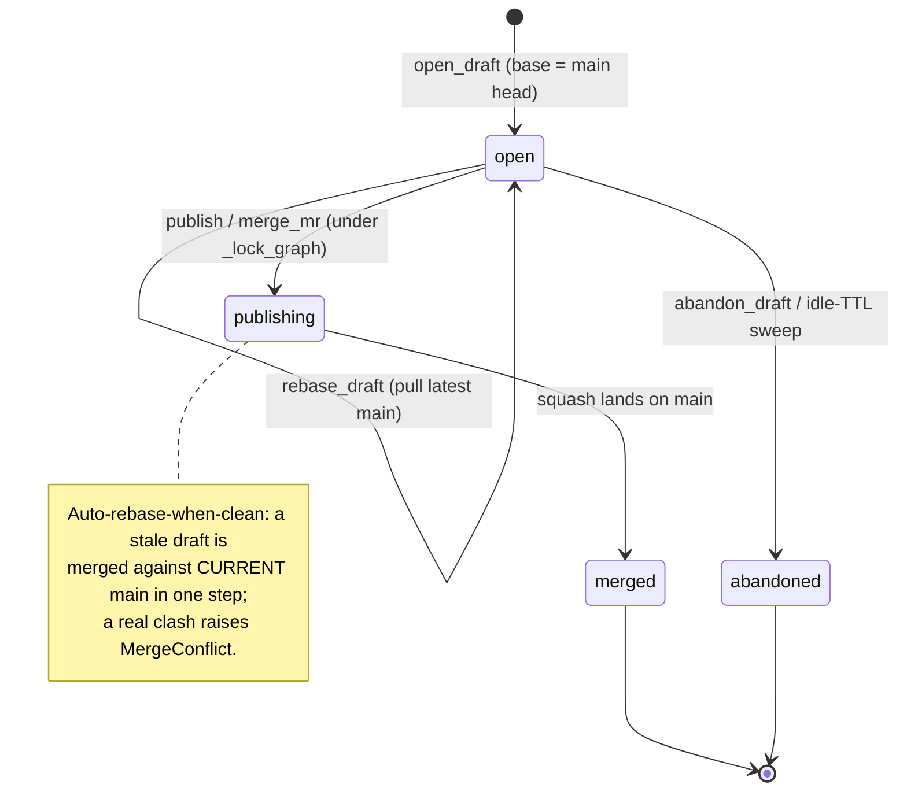
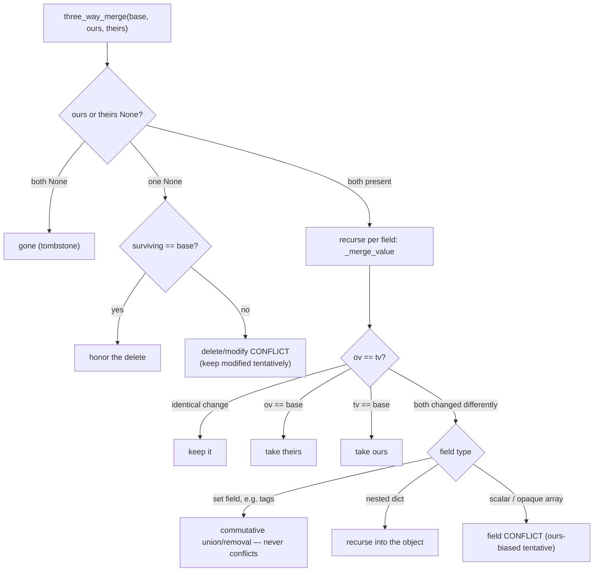
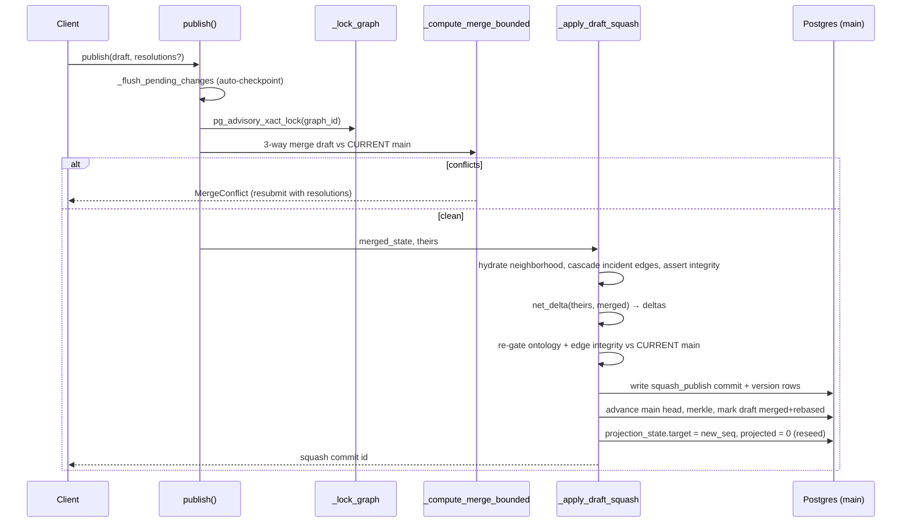
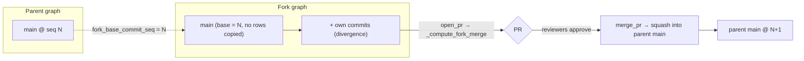
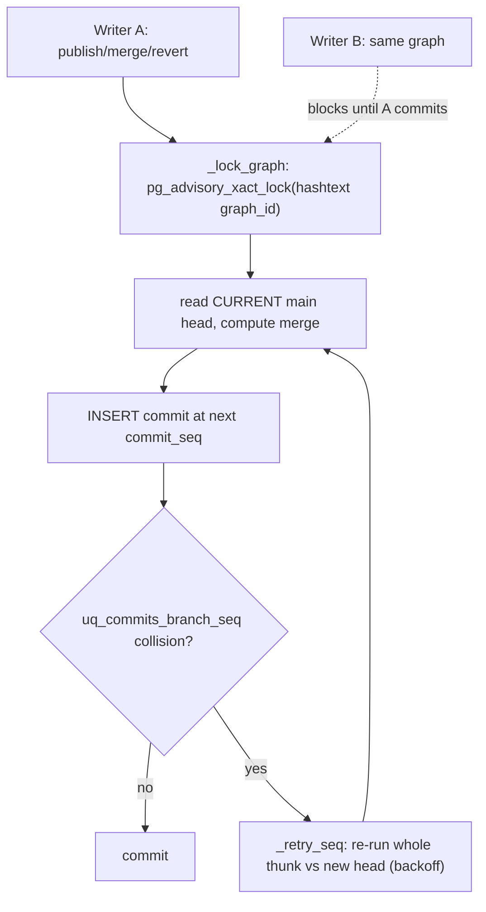

# 03 · Branching, Commits & Merge — the engine

> **Audience & scope:** engineers working on the versioning core, and architects who want to know
> exactly how "git for graphs" behaves. This is the heart of the subsystem — the write paths, the
> 3-way merge, publish/fork/PR/rebase/revert, and the concurrency model. Everything here is served by
> `GraphVersioningService` in `backend/app/services/versioning/service.py` and the pure engines
> `merge.py` / `changeset.py` / `merkle.py`. Read [02 · Data Model](02-data-model.md) first for the
> tables; see the [README glossary](README.md) for terms used verbatim below.

**TL;DR.** A **draft** is a branch off `main`. You **stage** edits into a durable buffer, **checkpoint**
them into append-only version rows, then **publish** — a 3-way, *field-level* squash-merge onto `main`.
The same merge engine powers rebase ("pull latest"), fork PRs, and conflict resolution. `main` advances
only under a per-graph advisory lock with a `commit_seq` retry, so concurrent writers never lose data.
An `update` is a **PATCH**, never a wholesale replace — the single most important correctness rule in
the system.

---

## 3.1 The model: graphs, branches, commits

A **graph** (`GraphORM`) is 1:1 with a data source. It always has a reserved `main` branch and an
append-only **commit** log per branch. `main_head_commit_seq` on the graph row is the authoritative
"where `main` is now" pointer.

`create_graph` (`service.py:164`) provisions the whole skeleton in one transaction: the graph row
(`main_head_commit_seq=1`), a `main` `BranchORM`, an **empty `genesis` commit** at `commit_seq=1`
carrying `MerkleTree.build({}).root`, and a `ProjectionStateORM(projected=0, target=1)` (`service.py:205-224`).

**Commit kinds** (checked by `ck_commits_kind`, see [02 · Data Model](02-data-model.md)):

| kind | Written by | On branch |
|------|-----------|-----------|
| `genesis` | `create_graph`, `fork_graph` (fork point) | `main` |
| `edit` | `apply_ops` (first commit on a branch) | any |
| `checkpoint` | `checkpoint` / `rebase_draft` | draft |
| `squash_publish` | `publish` / `merge_mr` / `merge_pr` | `main` |
| `import` | `bulk_ingest` / `enable_versioning` | `main` |
| `sync` | `sync_ingest` (authoritative re-sync — see [10](10-authoritative-sources-datahub-openmetadata.md)) | `main` |
| `revert` | `revert_commit` | `main` |

> **Invariant.** Version tables are **append-only**; a commit never rewrites history. "Latest" is
> resolved through the mutable `entity_heads` pointer, so the high-cardinality tables never churn
> (see [02 · Data Model](02-data-model.md)).

---

## 3.2 Opening a draft

`open_draft` (`service.py:277`) inserts a `draft` `BranchORM` whose `base_commit_seq` is the graph's
current `main_head_commit_seq` — the point the draft is "branched from." A draft is **per-user** by
default (`owner`); `shared=True` opens a collaborative draft whose checkpoints field-merge concurrent
editors instead of clobbering (§3.13).

**Branch-per-view.** A draft carries an `originating_view_id` so each Context View gets its *own*
isolated draft on the same data source. `resolve_graph` (`service.py:3032`) is the UI's boot lookup —
data source → graph + the caller's editing draft. Its resolution rules matter:

- No `originating_view_id` → the owner's most-recent open draft (legacy behavior).
- With a view → prefer *this view's* draft; else **claim-if-null**: adopt a legacy
  `originating_view_id IS NULL` draft for this view — **but only on a write-intent resolve**
  (`open_draft_if_absent=True`). A plain read *sees* the null draft without mutating it, so two
  concurrent reads from different views can't race to claim the same draft (`service.py:3053-3074`).

---

## 3.3 The two write paths

There are two ways an edit becomes a commit. Both converge on `_write_deltas` (append version rows +
upsert `entity_heads`), and both enforce the same ontology + integrity gates ([05 · Ontology](05-ontology-governance.md)).

### (a) Staged path — `stage → checkpoint` (drafts)

`stage_changes` (`service.py:365`) bulk-appends ops to the durable `working_changes` buffer. Each op is
`{ref?, op, entity_kind, entity_id?, payload, change_reason?}`; a `create` without an `entity_id` gets
a minted ULID, returned in `{ref: entity_id}` so the client can reconcile. For every non-`create` op it
records `base_content_hash = _effective_head_hash(...)` — the **OCC token** capturing what the edit was
made against (`service.py:415-419`).

`checkpoint` (`service.py:457`) folds the buffer into a commit. It is a thin `_retry_seq` wrapper around
`_checkpoint_once` (`service.py:481`):

1. Load uncommitted `working_changes` ordered by `seq`; nothing staged → return `None`.
2. Compose the **base state** for just the touched entities, fork-aware (`_composed_state`).
3. **Fold** — a private draft calls `changeset.materialize(base, ops)`; a **shared** draft calls
   `_fold_shared`, which 3-way-merges per collaborator against each edit's staged ancestor and raises
   `MergeConflict` on a same-field clash unless `resolutions` settle it (`service.py:529-550`).
4. **Cascade** deleted nodes to their containment subtree + incident edges so a checkpoint can't orphan
   descendants or dangle edges (`service.py:552-568`; §3.10).
5. `net_delta(base, head)` squashes to the minimal delta (`changeset.py:75`).
6. **Rich ontology gate** — the *authoritative* check for staged edits (`service.py:571-594`; [05](05-ontology-governance.md)).
7. Write one `checkpoint` commit (or `edit` if it's the branch's first), `_write_deltas`, compute the
   `merkle_root`, and mark each working change `committed_into_commit_id` (`service.py:596-621`).

> **Invariant.** Publish/merge read the draft's *committed* heads. So `publish`/`merge_mr` first call
> `_flush_pending_changes` (`service.py:624`) to auto-checkpoint anything staged-but-uncommitted —
> otherwise a draft that staged edits but never checkpointed would publish an **empty delta** and
> silently drop them.

### (b) Direct path — `apply_ops` (default on `main`)

`apply_ops` (`service.py:3936`) applies create/update/delete ops as **one audited commit** with no draft
round-trip — the "versioned write" primitive behind provider write-through ([04 · Providers](04-projection-and-cache.md)).
It is **O(ops), not O(graph)**: it resolves only the affected entities' current values, cascades node
deletes over a bounded degree query, and checks referential integrity only for the edges it writes
(`service.py:3948-3951`). It is `_retry_seq`-wrapped so concurrent writers to a branch retry on the
`commit_seq` collision.

### `update` = field-level PATCH — the correctness keystone

> **Decision.** An `update` op **patches** the entity's current payload; it does **not** replace it.
> `changeset.materialize` merges the op payload onto the current value, preserving fields it doesn't
> mention (`changeset.py:68-71`); `_apply_ops_once` does the same via `_patch_payload`.

This is not a nicety — it fixes a severe **merge-time data-loss** bug. The canvas sends *partial* update
payloads (only the edited fields). A wholesale replace stored `displayName=None, properties=null`,
which stayed invisible on the draft (the read overlay still had the base row) and only surfaced when a
publish/merge projected the truncated entity onto `main` — nodes rendering their URN instead of a name,
junk properties. `create` still replaces wholesale; `delete` still tombstones; full-payload callers are
unaffected (`changeset.py:50-72`). Regression: `test_changeset_materialize.py`. The full root-cause
narrative lives in [`../VERSIONING_DRAFTS_LINEAGE_AND_MERGE.md`](../VERSIONING_DRAFTS_LINEAGE_AND_MERGE.md) §3.3.

> **Invariant (empty-payload chokepoint).** A degenerate `{}` payload is treated as a **tombstone**, never
> a live entity, at the universal write chokepoint `net_delta` (`changeset.py:85-104`) — an identity-less
> `{}` node would otherwise fail `GraphNode` validation on read.

---

## 3.4 State composition & reads

Every read, merge, and diff composes from a small set of primitives. Understanding them explains the
system's scale story ([09 · Scale](09-scale-limits-and-roadmap.md)).

| Primitive | `service.py` | What it returns | Cost |
|-----------|--------------|-----------------|------|
| `_state_as_of(graph, branch, seq)` | `4310` | full branch state at a seq | **O(live state)**, two-phase |
| `_composed_state(graph, branch)` | ~`3363` | current state (main, or main@branch-point ⊕ draft's own) | O(state) |
| `_values_at(graph, branch, ids, seq)` | ~`4369` | latest value of *a bounded id set* at a seq | **O(ids)** |
| `_current_values(graph, branch, ids)` | ~`4391` | current value of a bounded id set | O(ids) |
| `_branch_own_payloads(graph, branch)` | ~`3433` | only entities this branch itself changed ("ours") | O(delta) |

> **Decision (two-phase `_state_as_of`).** Reconstructing state is **O(live state), not O(history)**
> (`service.py:4310-4322`). Phase 1 picks each entity's winning version with a narrow
> `DISTINCT ON (entity_id)` over `ix_*_entity_hist` selecting only `(entity_id, version_id, op)` — payloads
> never enter the sort, superseded versions are never transferred. Phase 2 point-fetches payloads for the
> **live winners only** (deletes skip payload I/O). Fork mains recursively seed from the parent at the fork
> point, copying no rows. Equivalence at every seq is proven by `test_versioning_state_reconstruction.py`.

The bounded primitives (`_values_at`, `_compute_merge_bounded`, revert's window) exist specifically so
the hot write paths never pay the whole-branch `_state_as_of` cost inside a lock.

---

## 3.5 The 3-way field-level merge engine

One pure-stdlib engine (`merge.py`, no DB imports) serves **four** call sites: shared-draft checkpoint,
rebase, draft→main squash, and fork PR. `three_way_merge(base, ours, theirs, set_fields)` (`merge.py:91`)
dispatches **by shape** because a naïve field merge that treated nested objects/arrays atomically would
destroy them:

Field removal is modeled as a change to a `MISSING` sentinel (`merge.py:41-55`), so delete/modify falls
out of the same rules. `MergeOutcome.merged` is always a best-effort ours-biased value so the UI has
something to render; `conflicts` is the authoritative list the caller must resolve before committing
(`merge.py:71-85`).

**Worked example** (`merge.py` self-test, `:202-256`):

| base | ours | theirs | result | conflict? |
|------|------|--------|--------|-----------|
| `{a:1, b:2}` | `{a:1, b:2, c:3}` | `{a:1, b:9}` | `{a:1, b:9, c:3}` | no (disjoint fields) |
| `{a:1}` | `{a:2}` | `{a:3}` | tentative `{a:2}` | **yes** (`path=("a",)`) |
| `{p:{x:1,y:1}}` | `{p:{x:2,y:1}}` | `{p:{x:1,y:3}}` | `{p:{x:2,y:3}}` | no (nested auto-merge) |
| `{tags:[a,b]}` | `{tags:[a,b,c]}` | `{tags:[a,d]}` | `{tags:[a,c,d]}` | no (set union) |
| `{a:1}` | `None` (deleted) | `{a:2}` | tentative `{a:2}` | **yes** (`delete/modify`) |

**Set fields** are opt-in via `set_fields` (config `SET_FIELDS`, default `{"tags"}` — [02 · Config](02-data-model.md)).
Adds from either side apply, removals from either side apply, never a conflict (`merge.py:165-172`).

**Cross-entity integrity.** Per-entity merge structurally cannot catch "main added edge E→N while the
draft tombstoned N" — E and N are different entities. `find_dangling_edges(live_node_ids, edges)`
(`merge.py:182`) runs over the merged result to surface those before publish.

---

## 3.6 Publish & squash

`publish` (`service.py:656`) is the ungated path (admin / no review); `merge_mr` (`service.py:1462`) is the
reviewed equivalent. Both flush pending edits, then run under `_retry_seq` + `_lock_graph`, then share the
squash body `_apply_draft_squash` (`service.py:715`).

Notable behaviors inside `_apply_draft_squash`:

- **Auto-rebase-when-clean.** If `main` advanced under the draft, publish does **not** hard-block. The
  merge composes against *current* main (base = main@branch-point, theirs = current main head) and
  writes `net_delta(current_main, merged)` while advancing the draft's `base_commit_seq` — a conflict-free
  stale merge rebases-and-squashes in one step (`service.py:697-712`). A genuine clash still raises
  `MergeConflict`. `NotUpToDate` exists but is used only to drive the UI merge gate, not to block here.
- **Attribution.** The squash carries `contributors` (distinct commit actors), `source_branch_id`,
  `source_commit_ids`, and `source_commit_count` (`service.py:744-760`) — this is what powers the "merged
  N commits" drill-down (§3.14).
- **Merge-time re-gates.** Ontology rules are resolved from the *current published* ontology and
  re-checked at merge time, so a draft opened before an ontology tightening can't merge violating creates
  (`service.py:769-790`). Edge integrity is re-checked against current `main` too, so two individually-clean
  drafts can't compose a two-parent or cyclic hierarchy (`service.py:791-803`; §3.11).
- **Head before merkle.** The head pointer + `main_head_commit_seq` advance *before* `_commit_merkle`, and
  the projection target is set to the new seq with `projected_commit_seq=0` — a deliberate **full reseed**
  on publish because the incremental projector has been observed to miss a merge's field-level updates
  that a count-based verify can't detect (`service.py:806-825`; see [04 · Projection](04-projection-and-cache.md)).

---

## 3.7 Pull-latest / rebase

`rebase_draft` (`service.py:828`) is the mirror of the squash, writing the merged result back into the
**draft**. It short-circuits if `base_commit_seq >= main_head` (`already_up_to_date`), runs the full
`_compute_merge`, returns `{clean: False, conflicts}` for the user to resolve, and on a clean rebase
rewrites **only the draft's own edits** to the merged result as a new `checkpoint` commit, advancing
`base_commit_seq` to the current main head (`service.py:849-880`). Entities the draft never touched come
from the advanced base automatically. Proof: `test_versioning_rebase.py`.

---

## 3.8 Fork (copy-on-write) & pull requests

`fork_graph` (`service.py:1057`) creates a new graph whose `main` **inherits the parent's state without
copying any rows** — `fork_parent_graph_id` + `fork_base_commit_seq` are set, and the fork-point commit
carries the parent's merkle root (`service.py:1076-1101`). Divergence accrues only as the fork's own
commits; reads compose parent@fork-base ⊕ own (that recursion lives in `_state_as_of`, §3.4). The fork
gets its own FalkorDB graph name **only if the parent is pinned** — an unpinned parent's fork stays
unpinned so the projector doesn't materialize an orphan key nothing reads (`service.py:1104-1114`).

`open_pr` (`service.py:1121`) opens a fork-main → parent-main PR, recording the current
mergeability/conflict set from `_compute_fork_merge`; listed `reviewers` make approval a merge
precondition. `merge_pr` re-locks the parent, recomputes the fork merge, runs the ontology + approval
gates, and squashes into the parent's `main` with the fork's contributors. `merge_mr` (`service.py:1462`)
is the unified entry: it dispatches a fork PR to `merge_pr` and a draft→main MR through the shared squash
body, enforcing the reviewer-approval gate (`ApprovalRequired`) in between (`service.py:1512-1519`). Proof:
`test_versioning_fork.py`, `test_versioning_pr_gate.py`, `test_versioning_draft_mr.py`.

---

## 3.9 Revert

`revert_commit` (`service.py:975`) applies the inverse of a published `main` commit as a new `revert`
commit — restoring every entity that commit touched to its **pre-commit** value. It is **bounded** for a
non-fork main (reads only the touched window at `k-1`, `k`, and head via `_values_at`; forks fall back to
the CoW-aware full replay, `service.py:994-1012`). It is **conflict-guarded**: if a later commit also
changed one of those entities (`content_hash(cur) != content_hash(after)`), it raises `MergeConflict`
rather than silently clobbering (`service.py:1014-1020`). No data is ever lost — pre-commit payloads live
in history. The operator CLI `backend/scripts/repair_revert_commit.py` wraps this for damaged-graph repair.
Proof: `test_versioning_revert.py`, `test_repair_revert_commit.py`.

---

## 3.10 Cascade-delete

Deleting a node cascades to its containment subtree **and** all incident edges, on every write path, so a
commit can never orphan descendants or leave a dangling edge. The DB-backed `_cascade_deletes`
(`service.py:~4480`) is **shared-child-safe**: a descendant with multiple containment parents is deleted
only when *all* of them are in the delete set. The same traversal backs the read-only `delete_impact`
preview, so the UI's "this will remove N entities" matches the commit exactly. A `_CASCADE_MAX_NODES =
1_000_000` cap bounds a pathological subtree.

---

## 3.11 Structural edge integrity

`_validate_edge_integrity` (`service.py:2245`) enforces three structural invariants for a batch of edge
**creates**, evaluated against live state with the batch's deletes subtracted and its other creates
overlaid:

1. **(a) duplicate** — no second edge with the same `(source, target, type)` (`service.py:2273-2281`).
2. **(b) second containment parent** — a node may not gain a 2nd containment parent; the message steers
   the user to "Move to" (`service.py:2282-2293`).
3. **(c) containment cycle** — a new parent→child edge that makes the child an effective-post-batch
   ancestor of the parent is rejected; a self-loop too. Overlaying the batch admits a legitimate
   one-commit restructure (delete P→C + create C→P) while catching a cycle built entirely inside one
   batch (`service.py:2294-2330`, bounded to 64 hops).

Because it runs on **both** the write path (`_apply_ops_once`) and the merge path (`_apply_draft_squash`),
an invariant no single commit can violate can't be composed onto `main` by merging two clean drafts
either. Proof: `test_versioning_edge_integrity.py` (10 cases).

---

## 3.12 Merkle: history, diff & integrity

Each commit carries a `merkle_root` — a tamper-evident fingerprint of the whole graph state at that
commit — and the tree also enables **O(changed)** diff/history instead of rescanning the graph.

`merkle.py` is a fixed 16-way trie of depth `config.MERKLE_DEPTH` (default 4 → 16⁴ = 65,536 leaf
buckets). A leaf's hash covers its sorted `(entity_id, content_hash)` pairs; an internal node hashes its
16 children; `content_hash(None)` is a distinct tombstone hash so "deleted" differs from "never existed"
(`merkle.py:57-65`). `MerkleTree.apply` is **copy-on-write**: only buckets on the path to a changed entity
are recomputed, untouched subtree hashes shared by value (`merkle.py:123-148`). Tree-diff walks top-down,
pruning equal subtrees (`merkle.py:150-176`).

`merkle_store.py` persists this incrementally for a **non-fork `main`**: `commit_tree` recomputes only the
changed buckets and bubbles to the root (O(changed · depth)), writing **only changed-path rows**;
unchanged subtrees are inherited via the as-of index `(graph_id, branch_id, path, commit_seq)`
(`merkle_store.py:42-107`). `_commit_merkle` uses this store for non-fork mains; `_merkle_root` does a full
in-memory rebuild for **draft checkpoints and fork mains** (`service.py:615`, `1098`).

> **Limitation.** Cross-branch incremental Merkle is not built — draft checkpoints and fork mains pay a
> full O(graph) `MerkleTree.build` every commit (`merkle_store.py:13-15`). This is the top remaining Merkle
> hotspot; see [09 · Scale](09-scale-limits-and-roadmap.md). Hash algorithm and depth are
> **immutable-after-data** ([02 · Config](02-data-model.md)); blake3 fails fast rather than silently
> downgrading. Proof: `test_versioning_merkle.py`.

---

## 3.13 Concurrency model

Four mechanisms keep concurrent writers correct without a global lock.

1. **Advisory lock.** `_lock_graph` (`service.py:3927`) takes a transaction-scoped
   `pg_advisory_xact_lock(hashtext(graph_id))` **before** reading `main` head, so the merge composes
   against current main. Different graphs never contend — no cross-graph latency. Wraps publish, merge_mr,
   merge_pr.
2. **`commit_seq` retry.** `_retry_seq` (`service.py:3912`) re-runs the whole thunk — which re-fetches
   state and recomputes against the *current* head — on a `uq_commits_branch_seq` `IntegrityError` (or a
   head-CAS miss, §4 below), up to `COMMIT_MAX_RETRIES` (5) with exponential backoff, else
   `ConcurrencyError`. For the **lock-holding** paths (publish/merge/rebase) this closes the
   read-stale-then-write race outright, because state is read *under* the lock, so any intervening commit
   forces the seq collision. Wraps checkpoint, publish, merge_mr, merge_pr, apply_ops.
3. **OCC, three ways.** (a) Direct-edit `base_version` token → a 3-way merge in `_apply_ops_once` turns a
   stale same-field edit into a conflict, not an overwrite. (b) Shared-draft staged `base_content_hash` →
   `_fold_shared` merges each edit against the value it was staged against. (c) Sync base-snapshot 3-way in
   `sync_ingest` ([10](10-authoritative-sources-datahub-openmetadata.md)). Proof:
   `test_versioning_occ_concurrency.py`, `test_versioning_shared.py`.
4. **Per-entity head compare-and-swap** (`_write_deltas(occ_guard=True)`). The lock-free `apply_ops` path
   (interactive canvas / provider write-through / import) takes **no** advisory lock, so its state read and
   its `commit_seq` allocation are separate statements — a concurrent same-branch commit that lands
   *between* them would get a non-colliding next seq and (with only §2) silently overwrite the other
   writer's entity from stale state. Closed by a CAS on the mutable head pointer: the `entity_heads` upsert
   advances an entity only if its `content_hash` is still the pre-image this commit read
   (`content_hash == prev`, empty-state/tombstone-aware so a legit delete→re-create resurrects while a
   concurrent *live* create misses). A miss updates 0 rows → `_StaleHead` → `_retry_seq` re-runs against
   fresh state (auto-rebase; a genuine same-field clash then surfaces as `MergeConflict` via §3a). Because
   version rows are **append-only**, the head pointer is the *only* contended resource, so guarding just its
   transition makes same-branch concurrent writes **lose-free without serializing the graph** — two writers
   on different entities never contend. Proof: `test_versioning_lost_update.py` (forces the exact
   read-stale-then-write interleaving and asserts no lost update).

---

## 3.14 Attribution & history drill-down

Because a squash folds many draft commits into one, attribution is preserved on the `squash_publish`
commit: `contributors` (distinct actors), `source_branch_id`, `source_commit_ids`, `source_commit_count`.
`squashed_commits` reads `source_commit_ids` back to render the "merged N commits" drill-down; `commit_log`
supports a `published_only` view that returns only the `main` timeline attributed to a view (its
squash-publishes + shared genesis/import/revert events), which is byte-identical to "whole graph" for a
single-view data source. `entity_history` returns one entity's full revision timeline across branches.
These read APIs are documented in [06 · API Reference](06-api-reference.md) and surfaced by the UI in
[07 · Frontend](07-frontend-integration.md).

---

## Related chapters

- [02 · Data Model](02-data-model.md) — the tables, append-only + head-pointer discipline, the op model.
- [04 · Projection & Cache](04-projection-and-cache.md) — how a committed `main` becomes FalkorDB reads;
  why publish forces a reseed.
- [05 · Ontology Governance](05-ontology-governance.md) — the commit-boundary gates referenced throughout.
- [06 · API Reference](06-api-reference.md) — the HTTP surface for every operation here.
- [`../VERSIONING_DRAFTS_LINEAGE_AND_MERGE.md`](../VERSIONING_DRAFTS_LINEAGE_AND_MERGE.md) — the merge
  data-loss root-cause memory (context for §3.3).
