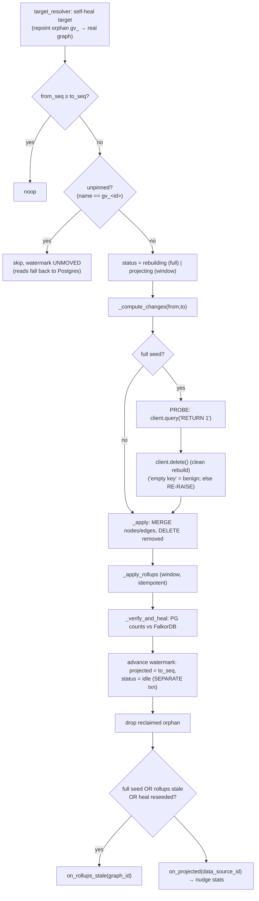
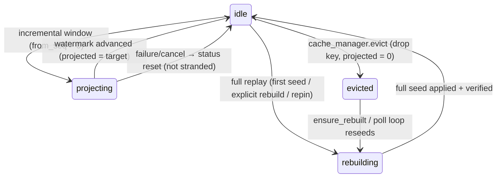
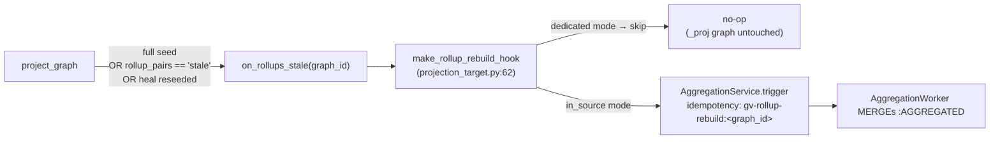
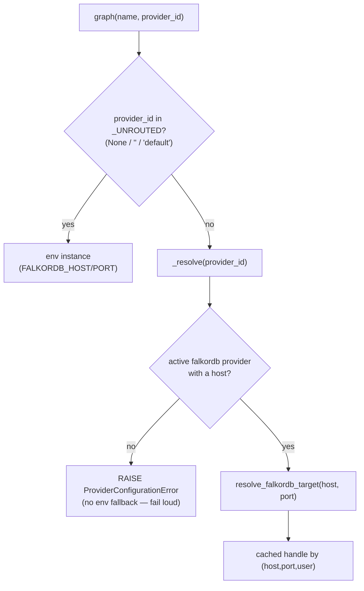

# 04 · Projection & Cache — FalkorDB as a Rebuildable Read Graph

> **Audience & scope:** engineers operating or extending the read path, and architects assessing the
> caching model. Covers how committed `main` becomes a hot FalkorDB graph, how staleness is bounded,
> how the cache self-heals, how `:AGGREGATED` rollups stay consistent, how a graph is routed to its
> FalkorDB instance, and the cache's lifecycle. See [02 · Data Model](02-data-model.md) for the store
> and [03 · Branching, Commits & Merge](03-branching-commits-merge.md) for what produces commits.

**TL;DR.** Postgres (`graphver`) is the source of truth; **FalkorDB is a derived, rebuildable read
cache of committed `main`** written by the `FalkorProjector`. Two properties make it safe to run
unattended: every write is an idempotent `MERGE`/`DELETE`, and the **watermark advances only after a
batch lands** — so a crash gives bounded staleness, never corruption. Reads serve from FalkorDB only
when the projection is caught up; otherwise they fall back to Postgres composition. The cache can be
dropped and rebuilt from Postgres at any moment, which is why the projector treats a full seed as a
*non-destructive clean rebuild* (probe-before-drop) and reconciles counts after every apply.

The whole subsystem lives in `backend/app/services/versioning/projection.py` (the projector),
`reconcile.py` (drift audit), `cache_manager.py` (eviction/leases), `worker.py` (the runtime),
`backend/app/services/projection_target.py` (app-layer hooks), and the provider layer under
`backend/app/providers/`.

---

## 1. Why a projection cache at all

The canvas needs low-latency graph traversals (children-with-edges, lineage traces, aggregated
rollups) that a Cypher-native store serves far better than reconstructing state from append-only
Postgres rows per request. So committed `main` is **projected** into the data source's *real*
FalkorDB graph — the same graph, keyed and labelled exactly as the existing reader expects — and the
`ContextEngine` reads it natively when it is fresh.

> **Invariant (safety).** *Postgres is truth; FalkorDB is derived.* The cache can be evicted and
> rebuilt from Postgres at any time with no data loss. Every projection write is a `MERGE` (upsert)
> or `DELETE`, and `projection_state.projected_commit_seq` advances **after** the batch lands, in a
> separate transaction (`projection.py:9-14`, `:320-328`). A crash mid-apply leaves the watermark
> behind; the retry re-`MERGE`s and converges.

> **Invariant (draft ≡ main).** A draft never gets its own FalkorDB graph. It reads through the
> [`DraftOverlayProvider`](#10-the-read-providers) as *main ⊕ sparse delta*, so an unchanged draft is
> a pure pass-through over main's cache (including its materialized rollups). See §8.

---

## 2. The projector — reader-compatible schema

`FalkorProjector` (`projection.py:147`) writes **byte-for-byte the schema the reader already
consumes**. It imports the reader's own helpers verbatim (`_compute_searchable_text`,
`_sanitize_label`, `_split_user_properties`, `projection.py:44-48`) so a reader-schema change flows
through the projector automatically.

- **Nodes** are `urn`-keyed and labelled by `entityType`. The MERGE (`_node_merge_cypher`,
  `projection.py:57-67`) sets the denormalized read fields (`entityId`, `displayName`,
  `qualifiedName`, `description`, `tags`, `layerAssignment`, `childCount`, `sourceSystem`,
  `lastSyncedAt`, `propertiesRaw`, `searchableText`), spreads native scalar properties with
  `n += item.nativeProps`, and `REMOVE n.properties` (strips the legacy blob). The row is built by
  `_node_item` (`projection.py:109-128`), which splits `properties` into native vs residual and
  computes `searchableText`.
- **Edges** are typed by `edgeType` and keyed by `r.id == entity_id`. The MERGE (`_edge_merge_cypher`,
  `projection.py:95-103`) `MATCH`es both endpoints by **label + urn** — endpoint labels ride on each
  `EdgeUpsert`, resolved from the committed `entityType` (window nodes first, then `_urn_label_for`,
  `:965`, fork-aware) — so every endpoint lookup is a per-label URN **index seek** instead of the
  pre-2026-07 unlabeled full-node-scan-per-row; then sets `id`, `confidence`, and a JSON-stringified
  `properties`.
- **Deletes** are label-anchored too: `_delete_nodes_cypher` (label + urn, `DETACH DELETE`,
  `projection.py:105`), `_delete_edges_cypher` (typed + endpoint-anchored, `r.id` matched inside the
  `(a)->(b)` adjacency, `:109`; ids whose before-state can't be resolved fall back to the legacy
  per-id scan `_DELETE_EDGES_FALLBACK`, `:123`, WARN-logged), and a heal-only
  `_delete_nodes_by_pair_cypher` that matches by (label, indexed `urn`) **and confirms `entityId`**
  so a reused urn is never wrongly deleted (`:127`).
- **Every projector query carries a server-side budget** via `_q` (`projection.py:69`):
  `PROJECTION_FALKOR_WRITE_TIMEOUT_S` (default 60, clamped under the fleet's `TIMEOUT_MAX`) /
  `PROJECTION_FALKOR_READ_TIMEOUT_S` (default 30), plus a client-side hang net. Without an explicit
  budget the FalkorDB fleet's `TIMEOUT_DEFAULT 30000` killed un-budgeted seed batches mid-load.

> **Limitation (phantom keys).** A node with no `urn` in its payload is keyed as `gv:<entity_id>` and
> logs a WARN (`_node_urn`, `projection.py:93-106`; `_urn_for`, `:701-718`). This is a deliberate
> "FalkorDB-not-a-subset-of-Postgres" signal for reconciliation, not a handled case — a `gv:`
> fallback for a node that *should* have a urn can duplicate an existing urn-keyed node.

The projector is injected with everything that would otherwise couple it to the management DB — a
`graph_client_factory` `(name, provider_id=None) -> graph`, a `target_resolver` (self-heal the
projection target), an `edge_types_resolver` (ontology edge types for rollups), an `on_rollups_stale`
hook, and an `on_projected` nudge (`FalkorProjector.__init__`, `projection.py:150-186`).

---

## 3. Full seed vs incremental window — `_compute_changes`

`_compute_changes` (`projection.py:433-493`) produces `(node_upserts, edge_upserts, node_deletes,
edge_deletes)` two ways:

- **Full seed (`from_seq <= 0`)** — composes the *entire* live state via
  `_svc._state_as_of(graph.id, main_id, to_seq)` (fork-aware copy-on-write composition), splits nodes
  vs edges by `_is_edge_payload`, and resolves edge endpoint urns through a per-pass cache
  (`projection.py:442-458`).
- **Incremental (`from_seq > 0`)** — selects `node_versions`/`edge_versions` rows in
  `(from_seq, to_seq]` ordered by `(commit_seq, created_at)` and **net-folds by `(kind, entity_id)`**
  — keyed on the tuple, *not* `entity_id` alone, so a node and an edge that ever share an id can't
  clobber each other (`projection.py:460-493`). Last op per entity wins; `delete` → a delete list,
  else an upsert.

`_apply` (`projection.py:1217`) writes in a fixed order — nodes-in (grouped by label), edges-in
(grouped by **(type, srcLabel, tgtLabel)** so the endpoint MATCH stays index-eligible), edges-out
(typed + anchored via `_run_edge_deletes`, `:1258`), nodes-out (grouped by label) — each chunked by
`PROJECTION_BATCH_SIZE` (default 5000, `config.py:110`), firing the optional progress callback per
chunk.

> **Limitation (full-seed cost).** A full seed still composes the whole live state **in memory** (not
> streamed). The per-edge endpoint lookup is no longer the bottleneck — since 2026-07 it is a
> label+urn index seek (the unlabeled form was a full node scan per row, O(N·E) overall; the same
> pattern measured ~2000× slower on `save_custom_graph`'s bulk path) — so the remaining cost is the
> in-memory composition; a keyset-streaming rebuild is the documented upgrade path (see
> [09 · Scale & Limits](09-scale-limits-and-roadmap.md)).

---

## 4. `project_graph` — the apply pipeline

`project_graph(graph_id)` (`projection.py:209-393`) catches a single graph up to its target
watermark. The full sequence:

Key guards:

- **Unpinned graphs are skipped without advancing the watermark** (`projection.py:227-235`). A
  synthetic `gv_<id>` name means there is no real FalkorDB target (a test graph, or one whose data
  source couldn't be healed); even an empty `GRAPH.QUERY` would instantiate an orphan key, so the
  projector refuses. `project_pending` applies the same exclusion in SQL (`:411-413`).
- **The cancel/failure handler resets a committed `projecting` row** (`projection.py:329-363`). Once
  `status="projecting"` is committed, a later exception *or a cancellation* (e.g. the `project_now`
  timeout, a `BaseException` that plain `except Exception` would miss) must reset the row to `idle`
  or it strands the UI's "Refreshing…" badge forever and blocks the manual rebuild escape hatch. The
  reset is `asyncio.shield`ed against a second cancel and re-raises `CancelledError` per contract.

**Entry points that drive it:**

| Function | Where | Purpose |
|---|---|---|
| `project_graph` | `projection.py:209` | Catch one graph up to target. |
| `project_pending(limit, concurrency)` | `projection.py:395` | Catch up all lagging graphs, **stalest first**, `Semaphore(PROJECTION_CONCURRENCY=8)`, keyed by PK (no same-graph race), per-graph failures logged not fatal. |
| `project_now(graph_id)` | `endpoints/versioning.py:163` | Interactive post-write catch-up; wraps `project_graph` in `asyncio.wait_for(_SYNC_PROJECTION_TIMEOUT_SECS=10.0)` (`versioning.py:115,176`) so a write endpoint stays snappy and defers a long seed to the worker. |
| `rebuild_now(graph_id)` | `endpoints/versioning.py:193` | Operator "Rebuild"; `_rebuild_inflight` guard (`:190`), a generous `REBUILD_SYNC_TIMEOUT_SECS=900` budget (`config.py:130`) because a full reseed is O(whole graph). |

---

## 5. Watermark & bounded staleness

`ProjectionStateORM` (`models.py:223-250`) is the per-graph control row:
`projected_commit_seq`, `target_commit_seq`, `status ∈ idle|projecting|rebuilding|evicted`,
`falkor_graph_name`, `falkor_provider`, `last_error`, `last_projected_at`, and
`progress_done`/`progress_total` (live full-seed progress).

- **Writers advance `target`.** Every main-advancing commit (publish, merge, sync, revert, direct
  `apply_ops`) bumps `projection_state.target_commit_seq` to the new head.
- **The projector advances `projected`** to `to_seq` after the apply lands (`projection.py:322`).
- **Freshness** is `projection_watermark` (`service.py:1606`), which returns `committed`
  (`graph.main_head_commit_seq`), `projected`, `target`, `status`, plus **`fresh = projected >=
  committed`** and the fields the Data-health UI polls (`last_error`, `progress_*`).
- **Live rebuild progress** is written throttled — at most ~1/s, always on the final item — by
  `_progress_writer` (`projection.py:863-885`), so the progress bar moves without a DB write per
  chunk. Best-effort; a progress write can never fail the projection.

> **Limitation (freshness is defined twice).** Two read paths decide "serve FalkorDB vs Postgres"
> differently. The **ContextEngine** uses strict `fresh` — `projected >= committed`
> (`context_engine.py:127`) — ignoring `READ_MAX_LAG`. The **neighbors endpoint** additionally allows
> a tolerance: `projected >= committed - READ_MAX_LAG` (`versioning.py:1747`). With the default
> `READ_MAX_LAG=0` (`config.py:119`) the two coincide, but a non-zero lag would make the surfaces
> disagree on when the cache is trusted. Unify before relying on `READ_MAX_LAG` in production.

---

## 6. Non-destructive rebuild (probe-before-drop)

A full seed is a **clean rebuild**: it must `DROP` the graph so the projected result equals committed
main exactly (a MERGE-only apply would leave a deleted entity alive — "the delete still shows on
Main"). But dropping against an unreachable or misrouted instance would wipe the cache with no way to
repair it. So the projector (`projection.py:270-299`):

1. **Probes first** — `client.query("RETURN 1")` proves the resolved client is reachable *before* any
   destructive op (`:278`). If unreachable, the error propagates to the outer handler with nothing
   dropped — reads keep serving Postgres and the existing cache is intact.
2. **Drops, then classifies the drop error** — `"empty key"` is the benign fresh-graph case (the
   MERGE will create it, `:295-297`); **any other drop error re-raises** (`:298-299`) so a MERGE never
   runs over a half-broken drop.

> **Decision.** FalkorDB is rebuildable and reads fall back to Postgres while `projected < committed`,
> so the brief empty window during a clean rebuild is never actually served — which is what makes a
> drop-then-reseed safe as the default rebuild strategy.

---

## 7. Verify & self-heal — `_verify_and_heal`

After every apply (when `PROJECTION_VERIFY_ENABLED`, default on, `config.py:124`), the projector
reconciles **live node/edge counts** between Postgres and FalkorDB and bounded-heals a mismatch
(`projection.py:742-816`). It is best-effort — any count failure skips the check.

- **PG counts** come from `entity_heads` via `reconcile.pg_live_counts` (the single source, shared
  with the reconciler), but **only for a non-fork main that is fully caught up** (`_pg_live_counts`,
  `projection.py:720-733`); a fork's composed count is O(graph), a lagging head verifies on catch-up.
- **FalkorDB counts** come from `reconcile.falkor_counts` (`projection.py:735-740`), which excludes
  `:AGGREGATED` and meta nodes.
- **FalkorDB has *more* than committed main** (`projection.py:773-794`): first `_sweep_tombstoned`
  DETACH-DELETEs anything `main` has tombstoned that the incremental pass stranded (matched by
  committed `urn` with `entityId` confirmed, bounded by delete count — `projection.py:818-861`), then
  re-counts. Whatever extra remains carries no tombstone (un-imported legacy/aggregation data) and is
  **not** auto-deleted — it records an error prompting enablement/bootstrap.
- **FalkorDB has *fewer*** (`projection.py:795-813`): **bounded reseed once** — recompute the full
  `_compute_changes(0, to_seq)`, drop, re-apply, re-verify. Returns `reseeded=True`, which (because it
  wipes rollups) makes the caller queue a rollup rebuild via `on_rollups_stale`.

---

## 8. `:AGGREGATED` rollups — incremental maintenance

Coarse-grained lineage edges (column→table, etc.) are materialized in FalkorDB as `:AGGREGATED`
relationships. The projector maintains them **incrementally per committed window** so a publish's
rollups are fresh without waiting for a full aggregation job.

- **Compute deltas** — `_compute_rollup_deltas` (`projection.py:499-636`) nets rollup adjustments from
  the window's edge rows. It compares each touched edge's value **before vs after the window** (via
  `_values_at(from_seq)`) using a `(src, tgt, edgeType)` signature (`:534-561`) — robust to
  create+update, delete+recreate, and endpoint/type rewrites that op-labels alone would mishandle.
  Each lineage create contributes **+1** and each delete **−1** over the **Cartesian product of the
  endpoints' containment-ancestor chains** (`contribute`, `projection.py:582-602`); moved containers
  trigger a bounded recount of the subtree's lineage edges (`:604-619`). Complexity: O(window delta ×
  chain depth²).
- **Bounded, else stale** — if lineage creates+deletes or a moved subtree exceed `_MOVE_EDGE_CAP=1000`
  (`projection.py:497,563,609,615`), it returns the sentinel `"stale"` — a bulk import/sync window is
  the aggregation *job's* territory, not the projector's inline math.
- **Apply idempotently** — `_apply_rollups` (`projection.py:638-699`) stamps a graph-level
  `_GVRollupMeta.seq` high-water marker and a per-pair `gvSeq`. A retried window skips already-stamped
  pairs (weights never double-count); a partial/foreign overlap returns `False` so the caller rebuilds
  rather than guesses. The property shape (`weight`, `sourceEdgeTypes`, `aggKey`, `gvSeq`,
  `latestUpdate`) **mirrors the aggregation worker**, so a later full rebuild MERGEs onto the same
  relationships.

**When incremental maintenance can't keep up, it hands off to a rebuild:**

The hook fires after the watermark is durable (`projection.py:376-382`) so the rebuild sees the
projected raw edges. `make_rollup_rebuild_hook` (`projection_target.py:62-98`) resolves the data
source, **skips dedicated mode** (the `{graph_name}_proj` graph is never wiped by the projector,
`:81-85`), and otherwise triggers the aggregation service with a stable idempotency key that collapses
churn to one job. `resolve_aggregation_edge_types` (`projection_target.py:22-49`) likewise returns
`None` in dedicated mode (incremental maintenance would write where nothing reads).

> **Limitation (standalone-worker rollup gap).** The **in-process** worker (`main.py:905`) and the
> **interactive** path (`versioning.py:148`) both wire `on_rollups_stale=make_rollup_rebuild_hook(...)`.
> The **standalone** worker does **not** — `__main__.py:49-50` builds the projector with
> `target_resolver` + `edge_types_resolver` but no `on_rollups_stale` (acknowledged at
> `__main__.py:33-35`: no in-process aggregation service in that runtime). Consequence: in a
> deployment running *only* the standalone worker, a full-seed wipe / `"stale"` window / heal-reseed
> leaves `:AGGREGATED` rollups stale until a manual aggregation rebuild. This is the single biggest
> behavioral difference between the two projector wirings.

> **Limitation (no level stamps).** Incremental rollups stamp `gvSeq`/`aggKey`/`weight` but not a
> hierarchy `level`, so they can't reconcile level-scoped aggregation; a bulk or overlapping window
> punts to `"stale"` → full rebuild. Forks skip incremental rollups entirely (their containment chains
> span the parent's rows), getting rollups only from full rebuilds (`projection.py:250-254`).

---

## 9. Provider resolution & routing

Reads, the projection registry, and key-listing all resolve a `(host, port)` through **one** function
so the read instance and the projection instance can never drift:

- **`resolve_falkordb_target(host, port)`** (`falkordb/hosts.py:39`) composes, in order,
  `apply_local_dev_falkordb_override` (`manager.py:46` — opt-in host-run dev override) then
  `_normalize_falkordb_host` (`falkordb/hosts.py:10` — Docker→host rewrite and IPv4 pin to dodge
  IPv6 `::1` failures).
- **`make_registry_graph_factory`** (`falkor_graph_registry.py:52`) returns the async
  `(name, provider_id=None) -> graph` factory that routes each graph to **its data source's pinned
  FalkorDB instance** (`ProviderORM.host/port` + decrypted creds), caching handles by
  `(host, port, username)`. `_UNROUTED = (None, "", "default")` (`:36`) short-circuits to the env
  instance (`graph()`, `:125-126`).

> **Decision (fail loud, no silent fallback).** `_resolve` (`falkor_graph_registry.py:70-110`) raises
> `ProviderConfigurationError` for a pinned provider that is missing / inactive / non-`falkordb` / has
> no host, rather than silently landing writes on the env-default instance — that would be a
> data-corruption risk (raw edges and `:AGGREGATED` rollups on different instances). Failures are not
> memoized (`:78`) so a since-fixed provider is retried. The env-instance
> `make_falkor_graph_factory` (`projection.py:922-941`) is the explicit fallback and **ignores**
> `provider_id`.

The probe-before-drop guard (§6) turns an unreachable pinned instance into a raised error before any
destructive op — so a misroute never wipes the cache.

---

## 10. The read providers

The `ContextEngine.for_workspace` routing block (`context_engine.py:65-218`) selects the read
provider per request:

| Situation | Provider | Anchor |
|---|---|---|
| `main`, projection **fresh** | live **FalkorDB** provider (hot path; the only place materialized rollups live) | `context_engine.py:142` (`base = provider`) |
| `main`, projection **lagging** (just after a merge) | `VersionedBranchProvider` (Postgres composition — read-your-writes) | `context_engine.py:147-151` |
| a live **draft** | `DraftOverlayProvider` wrapping whatever serves main | `context_engine.py:130-146` |
| **as-of / historical** | `VersionedBranchProvider(as_of_seq=…)` (read-only snapshot) — routed through the versioning service, not constructed here | `versioned_branch_provider.py:50` |

- **`DraftOverlayProvider`** (`draft_overlay_provider.py:97`) serves a draft as **main ⊕ sparse
  delta**. Every read short-circuits `if delta.empty: return base` (`_OverlayDelta.empty`,
  `draft_overlay_provider.py:67`), so an unchanged draft is a pure pass-through — *the draft IS main
  by construction*, including main's materialized rollups. `get_aggregated_edges_between`
  (`:310`) returns main's rollups verbatim when there is no lineage delta, else adjusts them by the
  draft's delta. Writes reset the cached delta and delegate to an internal `VersionedBranchProvider`
  writer (`:387-403`).
- **`VersionedBranchProvider`** (`versioned_branch_provider.py:45`) is an ordinary provider over one
  `(graph_id, branch_id[, as_of_seq])`, composing base+overlay from Postgres. Its
  `get_aggregated_edges_between` returns **empty** (a draft/Postgres read has no materialized rollups;
  the engine degrades gracefully, `:165`); as-of views are read-only (a `_commit` with `as_of` set
  raises). Its `get_stats`/`get_schema_stats` recompute counts with the projector's own label
  sanitizer so they match FalkorDB once main projects.
- **`VersionedWriteProvider`** (`versioned_write_provider.py:40`) wraps any provider: reads and
  lifecycle delegate transparently via `__getattr__` (`:62`), but **every write also lands as an
  audited commit** before hitting the inner provider — making versioning the system of record.
  `set_containment_edge_types`/`set_ontology_rules` are intercepted (`:67-84`) so every recorded
  commit enforces containment/ontology rules. Disabled with `GRAPHVER_VERSIONED_WRITES=0`.

---

## 11. Cache lifecycle — leases, single-flight rebuild, eviction

`CacheManager` (`cache_manager.py`) treats FalkorDB as a bounded, evictable resource (called out as
"the riskiest scale bet" at `cache_manager.py:17`):

- **Single-flight rebuild** — `ensure_rebuilt` (`cache_manager.py:110`) takes a Redis `SET NX`
  lock (TTL `REBUILD_LOCK_TTL=120s`, `config.py:139`) so only one rebuild runs per graph across the
  standalone worker, the in-process loop, and a read-trigger; the holder flips `evicted→rebuilding`
  and calls `project_graph`.
- **Read leases** — module-level `acquire_lease`/`release_lease`/`is_pinned`
  (`cache_manager.py:46-63`, TTL `LEASE_TTL=60s`, `config.py:140`) refcount in-flight reads so a
  graph isn't evicted mid-read. The neighbors endpoint pins the graph on the FalkorDB path
  (`versioning.py:1750`). Best-effort — a broker outage never fails a read.
- **Evict** — `evict` (`cache_manager.py:87`) **skips a pinned graph**, marks `status=evicted` +
  `projected_commit_seq=0` (so the poll loop rebuilds it), and drops the FalkorDB key on the graph's
  pinned provider. Reads of an evicted graph serve the bounded Postgres fallback meanwhile.
- **Per-provider RAM budget** — `ProjectionWorker.evict_once` (`worker.py:86`) evicts the coldest
  resident graphs per provider (`lru_candidates` by `last_projected_at`, `cache_manager.py:159`) down
  to that provider's budget. Budgets come from `make_registry_budget_resolver` (`eviction_budget.py:24`,
  provider row → `vconfig.falkor_budget_for` fallback).

> **Limitation (eviction dormant by default).** RAM is a property of a FalkorDB *instance*, so each
> provider has its own budget — but `FALKOR_MAX_RESIDENT` defaults to **0** ("unlimited",
> `config.py:151`) and the daemon is off entirely unless a budget is configured
> (`falkor_eviction_configured`, `config.py:157-159`). In practice caches are currently unbounded per
> provider until an operator sets `GRAPHVER_FALKOR_MAX_RESIDENT` / `GRAPHVER_FALKOR_BUDGETS`.

> **Limitation (ephemeral pool unimplemented).** The `EPHEMERAL_POOL_MAX_GRAPHS` /
> `EPHEMERAL_TTL_SECS` / `TRACE_LEASE_TTL_SECS` knobs (`config.py:189-194`) have **no call sites** —
> time-travel reads are served from Postgres (`_state_as_of`), and the active read lease uses
> `LEASE_TTL`, not `TRACE_LEASE_TTL_SECS`.

---

## 12. The reconciler — entity-level drift audit

`_verify_and_heal` only checks *counts*. `ProjectionReconciler` (`reconcile.py:168`) answers the
stronger question — *is all of committed main present entity-for-entity?* — and is the operator tool
behind the Data-health "reconcile" action. `reconcile` (`reconcile.py:180`) streams in bounded
batches (O(batch) memory, safe on a million-node graph) at three levels: **counts** (shared
`pg_live_counts`/`falkor_counts`), an **id-set diff** (a sorted merge, `reconcile.py:142`, of
keyset-paginated PG `entity_heads` under `COLLATE "C"` vs a FalkorDB scan — `_stream_pg_nodes`,
`:266`), and an optional **deep field check** (`_field_mismatches`, `:412`).

> **Limitation (collation parity).** The sorted merge assumes FalkorDB's string `ORDER BY` matches
> Postgres `COLLATE "C"` byte order (`reconcile.py:88-95`) — true for ASCII ids; non-ASCII ids could
> mis-align and need a keyset upgrade with a shared collation. Legacy entries with null
> `entityId`/`r.id` are excluded from the diff and only surface via count drift.

---

## 13. Worker runtime & deployment topology

The projector runs in one of two runtimes (never blocking boot):

- **In-process** (`main.py:872-916`) — gated by `GRAPHVER_PROJECTION_INPROCESS` (`config.py:126`, set
  in the dev compose). Builds a `ProjectionWorker` with the full hook set:
  `make_registry_graph_factory()`, `target_resolver=repair_projection_target`,
  **`on_rollups_stale=make_rollup_rebuild_hook(...)`**, `on_projected`, and
  `evict_budget=make_registry_budget_resolver()` (`main.py:903-913`).
- **Standalone** (`python -m backend.app.services.versioning`, `__main__.py`) — the same worker
  **minus `on_rollups_stale`** (see §8's callout).

`ProjectionWorker.run` (`worker.py:112`) gathers several loops: `_poll_loop` (the durable backstop —
`project_pending` every `PROJECTION_POLL_SECS=5`, `config.py:115`), `_stream_loop` (a Redis-stream
consumer that reacts to `nudge_projection` events, `worker.py:159`), and optional `_sweep_loop`
(idle-draft janitor) and `_evict_loop`. `_reclaim_pending` (`worker.py:182`) does PEL recovery on
boot via `XAUTOCLAIM`. `_project_one` (`worker.py:65`) serializes per-graph via an in-memory
`_inflight` set so the poll loop and stream consumer never project the same graph concurrently.

> **Invariant.** `ProjectionStateORM` is the durable queue — a lost stream nudge is always caught by
> the poll loop, so no committed change is permanently unprojected.

---

## 14. Operating it — Data health & config

- **Watermark** — `GET /graphs/{gid}/watermark` (`versioning.py:1397`) drives the "Refreshing…"
  badge and the Data-health hero (status, `fresh`, progress, `last_error`). See
  [06 · API Reference](06-api-reference.md).
- **Rebuild** — `POST /graphs/{gid}/projection/rebuild` (`versioning.py:1418`) schedules `rebuild_now`
  unconditionally (self-heals a stranded status); 409 if there is no real target; idempotent.
- **Reconcile** — `POST /graphs/{gid}/projection/reconcile` (`versioning.py:1457`) runs the entity-
  level drift audit; concurrent calls 409, a read-layer failure 503.

| Knob | Default | Meaning |
|---|---|---|
| `GRAPHVER_PROJECTION_BATCH_SIZE` | 5000 | Rows per MERGE/DELETE chunk (`config.py:110`). |
| `GRAPHVER_PROJECTION_POLL_SECS` | 5 | Reconciling poll cadence (`config.py:115`). |
| `GRAPHVER_PROJECTION_CONCURRENCY` | 8 | Max graphs projected per pass (`config.py:118`). |
| `GRAPHVER_READ_MAX_LAG` | 0 | Neighbors-endpoint staleness tolerance (`config.py:119`; see §5 callout). |
| `GRAPHVER_PROJECTION_VERIFY` | on | Post-apply count reconcile + heal (`config.py:124`). |
| `GRAPHVER_PROJECTION_INPROCESS` | off | Run the worker in the web process (`config.py:126`). |
| `GRAPHVER_REBUILD_TIMEOUT_SECS` | 900 | Operator-rebuild budget (`config.py:130`). |
| `GRAPHVER_REBUILD_LOCK_TTL` / `GRAPHVER_LEASE_TTL` | 120 / 60 | Single-flight rebuild lock / read-lease TTLs (`config.py:139-140`). |
| `GRAPHVER_FALKOR_MAX_RESIDENT` / `_BUDGETS` | 0 / {} | Per-provider eviction budget (off by default, `config.py:151`). |
| `GRAPHVER_EVICT_SECS` | 300 | Eviction sweep cadence (`config.py:154`). |

---

## 15. Limitations at a glance

Consolidated here and expanded in [09 · Scale & Limits](09-scale-limits-and-roadmap.md):

1. **Standalone worker misses `on_rollups_stale`** → stale `:AGGREGATED` until a manual rebuild (§8).
2. **Read-freshness defined twice** (ContextEngine strict vs neighbors `READ_MAX_LAG`) (§5).
3. **Full seed is O(N·E), in-memory, non-streamed** (§3); keyset streaming is the upgrade.
4. **Eviction budget dormant** (default 0 = unlimited) and the **ephemeral time-travel pool is
   config-only** with no call sites (§11).
5. **Incremental rollups lack level stamps**; forks never get incremental rollups (§8).
6. **Reconcile sorted-merge assumes ASCII collation** (§12).
7. **`gv:<id>` urn fallback can mint phantom nodes** — a reconciliation signal, not a handled case
   (§2).
8. **Credential rotation needs a process restart** (registry memoizes provider rows).

---

### Related chapters

- [03 · Branching, Commits & Merge](03-branching-commits-merge.md) — what advances `target` and how
  `_state_as_of` composes the state the full seed projects.
- [06 · API Reference](06-api-reference.md) — the watermark / rebuild / reconcile / neighbors
  endpoints and their gates.
- [09 · Scale, Limits & Roadmap](09-scale-limits-and-roadmap.md) — the consolidated performance and
  roadmap view.
- [`../VERSIONING_DRAFTS_LINEAGE_AND_MERGE.md`](../VERSIONING_DRAFTS_LINEAGE_AND_MERGE.md) — the
  draft-overlay design and the merge-time reseed that made a data-loss bug visible graph-wide.
