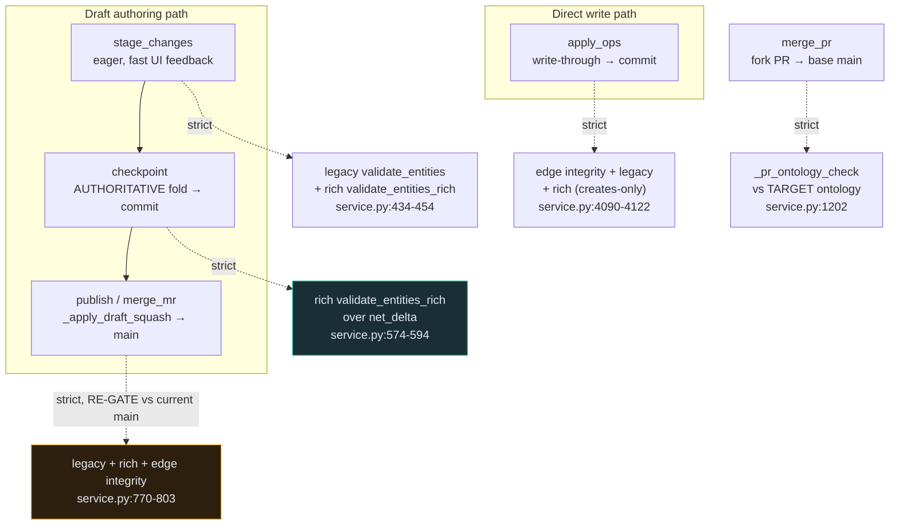

# 05 — Ontology Governance (Enforcement at the Commit Boundary)

> **Audience & scope:** engineers working on validation, authoring, or the write path, and
> architects evaluating data-quality guarantees. Covers how the assigned ontology governs every
> durable write — the two validation tiers, where they fire, structural edge integrity, and the
> decoupled rule-injection seam.

**TL;DR.** A versioned graph can be governed by an **ontology** — a vocabulary of entity types and
relationship types with structural rules (`can_contain`, edge `source_types`/`target_types`). The
Versioned Graph enforces those rules **at the commit boundary**, on every durable write path, so
`main` can never accumulate an invalid entity or relationship. Enforcement is **creates-only**
(legacy data is never re-litigated), **re-validated at merge time** against the *current* published
ontology, and **decoupled**: the versioning package never imports the management DB — the API layer
resolves the ontology into a plain rules object and injects it. Two structural invariants (single
containment parent, no cycles) are always on, even when no ontology is assigned.

See [`README.md`](README.md) for the shared glossary; this chapter uses **op**, **commit**,
**checkpoint**, **draft**, **strict/permissive**, and **entity_id** as defined there.

---

## 1. Why enforce at the commit boundary

Two facts force the design. First, a versioned edit can arrive through several paths — a draft
`checkpoint`, a direct `apply_ops` write to `main`, a `publish`/merge squash, a fork PR, a bulk
import — and the browser sends only *partial* payloads. If governance lived only in the interactive
pre-write check (`backend/app/ontology/mutation_validator.py`), a batch save or a merge could slip an
invalid entity past it. Second, an ontology can be **tightened after a draft opens**; a rule that was
satisfiable when the draft started may not be at publish time.

> **Decision:** validate at the point a change becomes durable (the commit), not only at the UI.
> Every write path that folds ops into version rows carries the same rich gate, and the merge/PR
> paths **re-validate against the current published ontology**. The result: an invariant that no
> single commit may violate cannot be composed onto `main` by merging two individually-clean drafts.

---

## 2. The two validation tiers

Both tiers live in `backend/app/services/versioning/ontology.py` (module docstring:
`ontology.py:1-24`). A graph opts in per-graph — a graph with no ontology is unconstrained on the
dimensions it doesn't specify.

### 2.1 Inline-spec fallback — `validate_entities`

`Ontology.from_spec` (`ontology.py:39-47`) reads a graph's inline `ontology_spec`
(`{entity_types, edge_types}`) and `validate_entities` (`ontology.py:173-193`) checks bare
**type-name set membership** on the constrained dimensions only — an unset dimension stays open, and
deletes (`payload is None`) are skipped. It returns `[{entity_id, kind, reason}]` where `kind` is the
violated dimension (`entity_type` / `edge_type`). This is the lightweight fallback for graphs that
carry a spec but no rich rules.

### 2.2 Rich commit-boundary rules — `validate_entities_rich`

The authoritative tier is `OntologyRules` (`ontology.py:64-83`) + `validate_entities_rich`
(`ontology.py:92-162`). `OntologyRules` is a frozen, dependency-free value object:

| Field | Shape | Meaning |
|-------|-------|---------|
| `entity_types` | `{name → EntityRule(can_contain)}` (`ontology.py:50-53`) | Which child types each type may contain. Empty `can_contain` = may contain anything. |
| `edge_types` | `{UPPER(name) → EdgeRule(source_types, target_types, is_containment)}` (`ontology.py:56-61`) | Endpoint type compatibility per relationship. Empty sets = unrestricted. |
| `containment_edge_types` | `frozenset` | The edge types that establish parent→child containment. |

`validate_entities_rich(entities, endpoint_types, rules)` performs four checks on **create** ops:

1. **`unknown_entity_type`** — a node whose `entityType` is not defined (`ontology.py:116-121`).
2. **`unknown_edge_type`** — an edge whose `edgeType` is not defined (`ontology.py:126-132`).
3. **`invalid_source` / `invalid_target`** — an edge whose endpoint entity-type is not allowed by
   the relationship's `source_types` / `target_types` (`ontology.py:138-149`).
4. **`containment_not_allowed`** — for a containment edge, the parent's (source's) `can_contain`
   does not permit the child's (target's) type (`ontology.py:150-161`).

Type matching is **case-insensitive** (`canonical_entity_type` `ontology.py:73-83`, `_type_in`
`ontology.py:165-170`), mirroring `mutation_validator.py` so the interactive pre-write check and the
durable gate agree. `endpoint_types` maps each endpoint `entity_id → entityType`; an endpoint absent
from the map **skips** that edge's type-compatibility check (the caller couldn't resolve it — a later
gate will).

> **Invariant (violation shape):** `validate_entities_rich` returns
> `[{entity_id, kind, reason, rule}]` where `rule ∈ {unknown_entity_type, unknown_edge_type,
> invalid_source, invalid_target, containment_not_allowed}`. This is a **superset** of the legacy
> `{entity_id, kind, reason}` shape, so every existing consumer of `OntologyViolation.violations`
> keeps working. The API maps `OntologyViolation` → **HTTP 422** `{type: "ontology_violation",
> violations: [...]}` (see [`06-api-reference.md`](06-api-reference.md)).

---

## 3. Creates-only gating

Both tiers gate **only `create` ops** — `update` and `delete` always pass
(`validate_entities_rich` `ontology.py:111-113`; `validate_entities` skips `payload is None`).

> **Decision:** an `update` is a field-level PATCH that cannot change an entity's type (see
> [`03-branching-commits-merge.md`](03-branching-commits-merge.md)), and legacy data that predates the
> ontology — or was ingested before a type was retired — must never block a user from editing a
> property or deleting a stale node. Gating creates only keeps governance forward-looking: new
> structure must be valid; existing structure is grandfathered. The one subtlety: on the direct write
> path a `create` op targeting an already-live entity is the write-through's idempotent endpoint
> upsert, so it is treated as an update and **not** re-litigated (see `_apply_ops_once`).

---

## 4. Where enforcement fires

Every durable write path resolves the graph's rules and passes them via the `ontology_rules=` kwarg;
the gate runs only when `graph.ontology_enforcement == "strict"`.

| Gate (call-site) | What it checks | Timing / authority | Notes |
|---|---|---|---|
| `stage_changes` (`service.py:434-454`) | legacy + rich | **eager** — fast feedback while typing | Edge endpoints typed from the batch, then committed heads; endpoints that exist only as *earlier uncommitted* staged changes can't be typed here → checkpoint is authoritative. |
| `checkpoint` (`service.py:574-594`) | rich, over the squashed `net_delta` | **authoritative** for staged edits | Runs against the composed head state. |
| `apply_ops` (`service.py:4090-4122`) | edge integrity + legacy + rich | authoritative for the direct write-through path | Creates-only; a create on a live entity counts as an update. |
| `_apply_draft_squash` (`service.py:770-803`) | legacy + rich + edge integrity | **re-gate at merge time vs *current* published rules** | A draft opened before a tightening can't merge violations onto `main`. |
| `merge_pr` (fork PR) (`service.py:1202`) | `_pr_ontology_check` | re-gate vs the **target** graph's ontology | Fork PRs are validated against the base they land in. |

---

## 5. Strict vs permissive

`graph.ontology_enforcement` is `strict | permissive` (default `strict`, from
`GRAPHVER_ONTOLOGY_ENFORCEMENT`; CHECK-constrained `ck_graphs_enforce`, see
[`02-data-model.md`](02-data-model.md)). Every gate above is wrapped in
`if ... and graph.ontology_enforcement == "strict":` — under **strict**, a violation is **raised**
(`OntologyViolation` → 422) and the transaction rolls back so nothing is staged/committed
(`service.py:436, 454, 594, 775, 790, 4102, 4122`). Under **permissive**, the gate does not raise —
the write proceeds. (The inline-spec docstring frames permissive as "returned as a warning";
structurally, the service call-sites simply skip the raise.)

> **Invariant:** a strict violation is **all-or-nothing**. `stage_changes` rolls back the whole batch
> ("nothing staged", `service.py:436`), `checkpoint` commits nothing (`service.py:594`), and a squash
> aborts before advancing `main` — there is never a partial write of a partially-valid batch.

---

## 6. Structural edge integrity (always on)

Independent of any ontology, `_validate_edge_integrity` (`service.py:2245-2258`) enforces three
structural invariants on a batch of edge **creates**, evaluated against the branch's live state with
**the batch's own deletes subtracted and its other creates overlaid** (batch-aware):

- **(a) duplicate edge** — no two edges with the same `source + target + type`.
- **(b) second containment parent** — a node may not gain a second containment parent (the message
  steers the user to "Move to…" instead).
- **(c) containment cycle** — a new parent→child edge may not close a cycle; a self-loop is rejected.

Batch-awareness is what makes legitimate restructures pass while catching illegal ones in the same
commit: a one-commit reparent (delete `P→C`, create `C→P`) is admitted, but an all-in-one-batch cycle
(`A→B` + `B→A`) is rejected.

> **Invariant:** `_validate_edge_integrity` is called on **both** the write path (`apply_ops`,
> `service.py:4090-4094`) **and** the merge/squash path (`_apply_draft_squash`, `service.py:798-803`).
> Because the same structural check runs at merge time against current `main`, two individually-clean
> drafts cannot compose a two-parent or cyclic hierarchy on `main` by being merged in sequence.

Unlike ontology gating, edge integrity has **no strict/permissive switch** — it always runs, because
a duplicate/second-parent/cycle is a structural corruption, not a policy choice.

---

## 7. Rule injection & the decoupling seam

The versioning package **never imports the management DB**. Ontologies live in the management schema
(`ontologies`, see [`../DATA_ARCHITECTURE.md`](../DATA_ARCHITECTURE.md)); the rules reach the service
as an **injected** `OntologyRules` value — the same decoupling pattern the projector uses for its
`target_resolver` (see [`04-projection-and-cache.md`](04-projection-and-cache.md)).

**Resolution happens at the API layer:**

- **Versioning router** (`backend/app/api/v1/endpoints/versioning.py`): `_live_ontology_rules`
  (`versioning.py:378`) resolves the *currently assigned, published* ontology into `OntologyRules`;
  `_rules_for_meta` (`versioning.py:425`) wraps it with graph metadata. Injected at every durable
  endpoint — stage (`versioning.py:1291`), checkpoint (`versioning.py:1310`), publish
  (`versioning.py:1341`), and PR merge via `_pr_ontology_rules` (`versioning.py:418-422`).
  `_live_containment_types` (`versioning.py:352`) drives the delete cascade and the containment
  dimension of edge integrity.
- **Graph router** (`backend/app/api/v1/endpoints/graph.py`): `_resolve_ontology_rules`
  (`graph.py:1641`) closes the `/graph/changes` batch-edge gap — the unified draft save injects both
  containment types and rules (`graph.py:1767-1769`). `_resolve_containment_types` (`graph.py:1629`)
  supplies containment types (degrading to `[]`, i.e. cascade only the node's own incident edges, on
  failure).
- **Provider push-down**: on the interactive provider path, `ContextEngine` calls
  `set_ontology_rules` on `VersionedWriteProvider`
  (`backend/app/providers/versioned_write_provider.py:77-84`), which intercepts the call (rather than
  blindly delegating) so every recorded write-through commit carries the same gate.

**Scoping.** Only data sources with an **explicitly assigned** ontology are gated —
`_live_ontology_rules` returns `None` for a graph that never opted in, so system-default /
introspection fallback ontologies never retroactively gate legacy graphs. When rules are `None`, the
gate is a no-op.

---

## 8. Blank models fail closed; re-sync & revert are exempt

**Blank models fail closed.** A `kind="blank"` graph is contractually ontology-governed — it was
created to be authored under a published ontology. If its ontology can't be resolved, the write is
**rejected**, not waved through: `_live_ontology_rules` raises `ontology_required` (422) when a blank
graph has no rules and `ontology_unavailable` (503) when resolution fails (`versioning.py:399, 412`);
`_resolve_ontology_rules(fail_closed=True)` does the same on the `/graph/changes` path for
`kind=="blank"` (`graph.py:1658, 1670; 1768-1769`). See
[`06-api-reference.md`](06-api-reference.md) for the blank-graph provisioning endpoint.

> **Decision:** blank models are the one case that fails closed. Everywhere else, "no assigned
> ontology" means "unconstrained"; for a blank model, "no resolvable ontology" means "refuse the
> write" — because a blank model with a broken ontology binding is a misconfiguration, not a legacy
> graph.

**Exemptions.** `bulk_ingest`, `sync_ingest`, and `revert_commit` are deliberately **not** gated by
the rich ontology: re-sync from an authoritative source must not break because the local ontology
disagrees (that is a mapping/drift concern, not a write to reject — see
[`10-authoritative-sources-datahub-openmetadata.md`](10-authoritative-sources-datahub-openmetadata.md)),
and `revert` is the administrative repair path that must be able to restore pre-ontology states.
(These paths do not pass `ontology_rules`; structural edge integrity still applies where they compose
edges.)

---

## 9. Limitations

> **Limitation:** `stage_changes` cannot type an edge endpoint that exists only as an *earlier
> uncommitted* staged change, so its rich gate can under-check those edges — **checkpoint is the
> authoritative gate** (`service.py:437-454` vs `574-594`). This is by design (fast eager feedback +
> a sound final gate), not a hole, but it means a violation may surface at Save rather than at edit.

> **Limitation:** endpoint type-compatibility is skipped for any endpoint absent from
> `endpoint_types` (`ontology.py:100-102, 136-137`). A create whose endpoint the caller couldn't
> resolve passes that check and relies on a later gate / referential-integrity check.

> **Limitation:** the rich gate mirrors `mutation_validator.py` semantics by convention, not by a
> shared implementation — the two must be kept in sync manually if either changes.

> **Limitation:** ontology *evolution* policy (deprecate/migrate on type removal) lives in the
> management ontology layer, not here; the commit gate only sees the resolved rules snapshot. A
> tightened ontology re-gates *new* creates at merge time but does not retroactively flag already-
> committed entities that a newer ontology would now reject.

---

## Related chapters

- [`03-branching-commits-merge.md`](03-branching-commits-merge.md) — the write/merge paths these gates
  hook into, `update`=PATCH semantics, and cascade-delete.
- [`06-api-reference.md`](06-api-reference.md) — the `OntologyViolation` → 422 mapping, the
  `/graph/changes` seam, and blank-graph provisioning.
- [`02-data-model.md`](02-data-model.md) — `graphs.ontology_enforcement`, `ontology_spec`, and
  the `kind` field.
- [`10-authoritative-sources-datahub-openmetadata.md`](10-authoritative-sources-datahub-openmetadata.md)
  — why re-sync is exempt and how ontology mapping/drift is handled for federated sources.

**Proof-of-behavior (tests):** `backend/tests/test_versioning_ontology_rules.py` (pure validator),
`backend/tests/integration/test_versioning_rich_enforcement.py` (apply_ops / stage+checkpoint /
publish re-gate / permissive + None unchanged / legacy-endpoint upsert not re-litigated),
`backend/tests/integration/test_versioning_edge_integrity.py` (duplicate / second-parent / cycle,
batch-aware), `backend/tests/integration/test_blank_graph_provisioning.py` (fail-closed provisioning).
