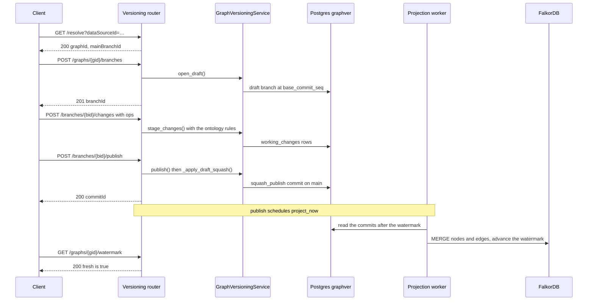

# 06 · API Reference — REST Surface & the Draft-Aware Graph Plane

*For integrators and backend and frontend engineers who call the versioned graph over HTTP.*

This is the contract for the two workspace-scoped routers behind version control: every route,
who may call it, and what it answers. For how the operations behave, see
[03 · Branching, Commits & Merge](/docs/versioning-branching-and-merge). To sign a script in, see
[Sign in from a script](/docs/api-guide#sign-in-from-a-script) in the API Guide.

**How to read it.** Paths in §2 are relative to `/api/v1/{ws_id}/versioning`; paths in §4 are
relative to `/api/v1/{ws_id}/graph`. **Gate** is the permission a route needs (`_READ` or
`_MANAGE`, [§1](#permissions-rbac)), plus any feature switch that can close it. `{gid}` is a graph
id (`graph_…`), `{bid}` a branch id (`br_…`), `{cid}` a commit id (`cmt_…`) and `{pr}` a pull or
merge request id (`pr_…`). Every route and its exact request and response models are also in the
live OpenAPI explorer — see [Find the endpoint you need](/docs/api-guide#find-the-endpoint-you-need).

**TL;DR.** Two workspace-scoped FastAPI routers own everything. The **versioning router**
(`/api/v1/{ws_id}/versioning`) is the *only* path between a client and the `graphver` Postgres
store — it delegates to `GraphVersioningService`. The **graph router** (`/api/v1/{ws_id}/graph`) is
the provider and engine read and write plane, made **draft-aware** by a single `?branchId=` query
parameter. Auth is a cookie session plus CSRF; authorization reuses **data-source permissions** (a
graph is 1:1 with a data source); a graph, request or data source in another workspace answers
**404**, never 403.

Both routers are mounted on `api_router` in `backend/app/api/v1/api.py`: the versioning router with
the `versioning_write_gate` dependency, the graph router with `require_ds_read_or_view`. Wire shapes
are camelCase over snake_case Python (`_ApiModel`, `populate_by_name=True`), with the exceptions the
tables call out.

---

## 1. Auth, RBAC & tenancy

### Session & CSRF

`POST /api/v1/auth/login {email, password}` sets the session cookies, among them `nx_access`
(`HttpOnly`) and `nx_csrf`. Send the cookies back on every request, and copy `nx_csrf` into the
`X-CSRF-Token` header on **every** `POST`, `PUT`, `PATCH` and `DELETE` — including the reads that are
`POST`s. `GET`s need no header. The access cookie lasts 15 minutes in the shipped configuration;
`POST /api/v1/auth/refresh` renews every cookie, `nx_csrf` included. Working curl, `requests` and
`httpx` helpers are in the [API Guide](/docs/api-guide#sign-in-from-a-script). The routers trust the
authenticated `User` and `PermissionClaims`; they never re-derive identity.

### Permissions (RBAC)

Two permission strings gate the whole surface (`_READ` and `_MANAGE` in
`backend/app/api/v1/endpoints/versioning.py`):

| Constant | Value | Applies to |
|---|---|---|
| `_READ` | `workspace:datasource:read` | All reads; **fork**; **open a fork PR**; PR and commit inspection; exports |
| `_MANAGE` | `workspace:datasource:manage` | All writes; **merge** and **publish**; projection rebuild and reconcile; branch admin; upload and publish-job status |

> **Decision — governance by permission asymmetry.** Anyone who can *see* a graph may propose
> changes: **forking** (`POST /graphs/{gid}/forks`) and **opening a PR** (`POST /graphs/{gid}/pulls`)
> need only `_READ`. Landing changes on a shared `main` — **merge** and **publish** — needs
> `_MANAGE`. That single asymmetry is the review gate; there is no separate ACL system.

`system:admin` implies both everywhere, `system:org-admin` in every workspace, and `workspace:admin`
in its own workspace. Which roles hold which permission is in [RBAC](/docs/rbac). One read accepts
more than membership: `GET /resolve` also admits a caller who can read the view passed as `viewId`,
so a read-only canvas can boot. Every other versioning route is membership-only.

### The switches that close these routes

| Switch (Administration → Features) | Key | Closes |
|---|---|---|
| **Version control** | `versioningEnabled` | Every `POST`, `PUT`, `PATCH` and `DELETE` on the versioning router except `…/projection/rebuild`, `…/projection/reconcile` and `POST …/exports`; on the graph router, `POST /bootstrap`, `/bootstrap/retry`, `/bootstrap/abandon` and `/resync`. Reads stay open |
| **Export graph data** | `graphExportEnabled` | Export plan, stream, job creation and download, on both routers |
| **Build lineage from scratch** | `blankModelsEnabled` | `POST /blank-graphs` |
| **Edit mode** | `editModeEnabled` | `POST /graph/changes` |
| **Lineage trace** | `traceEnabled` | The `/graph/trace…` routes ([§4](#lineage-trace-routes)) |

A closed switch answers **403** with `{"detail": {"type": "feature_disabled", "feature": …, "message": …}}`.
Every switch and its default is in the [Feature Switches API](/docs/api-features) reference.

### Tenant isolation → 404, not 403

Every `{gid}` route depends on `graph_in_workspace`, which resolves the graph and asserts that its
`workspace_id` is `{ws_id}`, raising **404** on a mismatch so existence never leaks across
workspaces. `pr_in_workspace` does the same for a request's **base** graph and also requires you to
take part in the request — its author, an assigned reviewer, or a holder of `_MANAGE` — else **404**.
`view_in_workspace` resolves a view from the **management** database (a separate store from
`graphver`) with the same rule. On the graph router, the enablement routes check the data source
with `_data_source_in_workspace`, and `/changes` and `/nodes/{urn}/delete-impact` check the graph
that backs `dataSourceId`.

### Domain → HTTP error map

`_domain_errors()` translates the service's domain exceptions centrally:

| Exception | HTTP | Body `detail` |
|---|---|---|
| `MergeConflict` | **409** | `{type: "merge_conflict", conflicts: […]}` |
| `OntologyViolation` | **422** | `{type: "ontology_violation", violations: [{entity_id, kind, reason, rule}]}` |
| `AccessDenied` | **403** | `{type: "access_denied", message}` |
| `ApprovalRequired` | **409** | `{type: "approval_required", pending: […]}` |
| `NotUpToDate` | **409** | `{type: "not_up_to_date", branchId, behindBy, message}` — pull `main` in with `…/rebase`, then retry |
| `PullRequestExists` | **409** | `{type: "pull_request_exists", prId, branchId, title, message}` — the branch already has a live request ([03](/docs/versioning-branching-and-merge)); `prId` is the one that exists, so send the user *to* it |
| `ConcurrencyError` | **409** | `{type: "integrity", message}` |
| `DiffTooLarge` | **409** | `{type: "too_large_for_tree", changed, limit, message}` — the draft changes more entities than the Changes tree lays out |
| `ValueError` | **404** | `str(message)` — an unknown id |

Other refusals you will meet on these routers:

| Answer | `detail.type` | When |
|---|---|---|
| **422** | `invalid_patch` | An `unsetProperties` that contradicts its op or payload |
| **422** | `invalid_cursor` | A history page's `before` cursor isn't one the server issued |
| **422** | `ontology_required` | A blank (ontology-governed) graph whose data source has no ontology assigned |
| **503** | `ontology_unavailable` | A blank graph's ontology can't be resolved right now; writes wait for it |
| **422** | `graph_too_large_to_sync` | A sync or re-sync on a graph above the size guard ([§2.9](#29-bulk-ingest--authoritative-sync)) |
| **403** | `feature_disabled` | A switch closed the route ([above](#the-switches-that-close-these-routes)) |

> **Invariant.** A conflict or violation is **atomic**: the service raises before any partial write,
> so a 409 or 422 leaves the branch exactly as it was. Resolve, then retry.

### Actor-name resolution

`graphver` stores raw user ids (it is independent of the provider and of the management database).
Answers that carry actor ids — branch lists, PR and merge-request lists and reads, the commit log, an
entity's history and summary — hang a `userNames: {id → "First Last"}` map, filled by one batched,
de-duplicated lookup per request against the management database (`_attach_user_names`). The commit
log carries one map for the whole page; lists carry one per item.

---

## 2. REST catalog — `/api/v1/{ws_id}/versioning`

All paths below are relative to `/api/v1/{ws_id}/versioning`; `…` stands for `/graphs/{gid}`.
"Gate" is the permission required.

### 2.1 Graph lifecycle & resolution

| Method · Path | Gate | Purpose / key fields |
|---|---|---|
| `POST /graphs` | `_MANAGE` | Create a versioned graph holding only its genesis commit. `{dataSourceId, workspaceId, kind?, baseOntologyId?, tenantId?, falkorGraphName?, falkorProvider?, ontologySpec?, ontologyEnforcement?}` → **201** `{graphId, mainBranchId, genesisCommitId}`. `workspaceId` must equal the path (else **400**); `falkorProvider` defaults to the data source's provider. To copy a data source's existing graph in, use **bootstrap** ([§4](#cascade-preview--bootstrapresync)) instead |
| `GET /graphs/{gid}` | `_READ` | Graph metadata (`GraphResponse`: `kind`, `forkParentGraphId`, `forkBaseCommitSeq`, `mainHeadCommitSeq`, `createdBy`, `createdAt`) |
| `GET /resolve` | `_READ`, or read access to the view in `viewId` | `?dataSourceId&viewId` → `ResolveResponse{graphId, mainBranchId, mainHeadCommitSeq, myDraft?, kind, bootstrap?}`. **Read-only — never opens a draft.** `kind` is `manual`, `authoritative`, `hybrid` or `blank`; `bootstrap` is the enablement job while the graph is still at genesis and that job is pending, running or failed. **404** when no versioned graph backs the data source |
| `POST /resolve` | `_MANAGE` | `{dataSourceId, originatingViewId?}` → the same shape, but **opens the caller's draft if there is none** (the frontend's `resolveAndOpenDraft`) |

> **Note.** "Enable version control" (**bootstrap**) and the authoritative **re-sync** from the
> provider are on the *graph* router ([§4](#cascade-preview--bootstrapresync)), because they snapshot
> the live provider into the versioned base and need the `ContextEngine`.

### 2.2 Blank models (self-service, ontology-governed)

| Method · Path | Gate | Purpose / key fields |
|---|---|---|
| `GET /blank-graphs/name-check` | `_MANAGE` | `?providerId&graphName` → `{available, normalized, reason?, suggestion?}`. A name is 3–64 characters of lowercase letters, digits, `-` and `_`, starting with a letter or digit. The prefixes `gv_`, `gvt_`, `gvtest_`, `blank_` and `__fork_`, and the ending `_proj`, are reserved. The name must be free on that connection: no other data source or catalogued graph uses it, and no graph of that name exists (a live, best-effort check). A taken name comes back with a free `suggestion` (`data_lineage` → `data_lineage_2`) |
| `POST /blank-graphs` | `_MANAGE` + **Build lineage from scratch** | `{name, description?, providerId, ontologyId, graphName?}` → **201** `BlankGraphResponse{dataSourceId, graphId, mainBranchId, graphName, label}`. One call provisions a manual data source, a genesis-only **strict** `kind="blank"` graph, and its aggregation registration; without `graphName`, a name is minted. Preflight: the provider exists, is active, is FalkorDB, is permitted in the workspace (else **403**) and is reachable (`provider_unreachable`); the ontology is **published** (`ontology_not_published`); the name is re-checked under an advisory lock. If creating the graph fails, the new data source is deleted again (no two-phase commit) and the answer is **502** |

### 2.3 Branches & drafts

| Method · Path | Gate | Purpose / key fields |
|---|---|---|
| `GET …/branches` | `_READ` | `?limit(100, max 500)&offset&viewId` → `[BranchResponse]`. Graph-wide by default; `viewId` narrows to that view's drafts (**branch-per-view**). Without `_MANAGE` you see `main`, your own drafts, and the shared drafts you are a member of |
| `POST …/branches` | `_MANAGE` | `{name?, originatingViewId?, shared?}` → **201** `{branchId}` |
| `GET …/branches/{bid}/members` | `_READ` | A shared draft's collaborators: `{members: […]}` |
| `POST …/branches/{bid}/members` | `_MANAGE` | Add one: `{subjectType: "user" \| "group", subjectId, role: "viewer" \| "editor" \| "maintainer"}` |
| `DELETE …/branches/{bid}/members/{subjectType}/{subjectId}` | `_MANAGE` | Remove one → `{removed: true}` |
| `PATCH …/branches/{bid}` | `_MANAGE` | `{name?, description?, isShared?}`, by the owner or a maintainer; `""` clears a name or description |
| `POST …/branches/{bid}/abandon` | `_MANAGE` | Discard the draft → `BranchResponse`. Its layout edits go with it |
| `GET …/branches/{bid}/freshness` | `_READ` | Is the draft behind `main`? `{behind, behindBy, mainHeadCommitSeq, baseCommitSeq}` — cheap enough to poll while editing |
| `POST …/branches/{bid}/rebase` | `_MANAGE` | "Pull latest `main` into the draft." `{resolutions?}` → `{clean, conflicts, seeds, changes, incoming, baseCommitSeq, alreadyUpToDate}`. On `clean: false`, resolve and resubmit with `resolutions`; `seeds` holds the draft's own value of each conflicting entity. **`changes` ≠ `incoming`**: `changes` is how *your own* edits were rewritten onto the new base (usually nothing); `incoming` is what actually arrived from `main` — `{branchId, commitIds, commitCount, contributors, stats, fromSeq, toSeq}`, the window to read from `…/diff-window`. A clean pull always writes a `pull` commit ([03](/docs/versioning-branching-and-merge)) |

### 2.4 Changes → checkpoint → publish

| Method · Path | Gate | Purpose / key fields |
|---|---|---|
| `POST …/branches/{bid}/changes` | `_MANAGE` | Bulk-stage edits. `{ops: [{op: "create" \| "update" \| "delete", entityKind: "node" \| "edge", entityId?, payload?, ref?, changeReason?, unsetProperties?}]}` → `{assigned: {ref → entityId}, count}`. A create without `entityId` gets a minted `ent_…` id. An update merges properties key by key; `unsetProperties` names the ones to remove. When the data source has an assigned ontology, creates are checked here for fast feedback |
| `POST …/branches/{bid}/commit` | `_MANAGE` | Checkpoint the draft. `{message?, resolutions?}` → `{commitId?, stagedChanges}`. Resolves the live containment types and ontology rules — the authoritative ontology check |
| `GET …/branches/{bid}/merge-preview` | `_READ` | Dry-run publish → `{clean, conflicts, changes: {create, update, delete}}` |
| `GET …/branches/{bid}/view-changes` | `_READ` | What the draft changes in views besides the graph: `{branchId, views, hidden}` — views it creates or updates, which go live when it is published. Views you can't read are only counted, in `hidden` |
| `POST …/branches/{bid}/publish` | `_MANAGE` | Squash-publish the draft to `main`. `{message, resolutions?}` → `{commitId}`. Staged changes are folded in first. **409 `not_up_to_date`** when `main` moved since the draft's base — pull with `…/rebase`, then publish again; nothing is rebased for you. A draft that changes more than 20,000 entities (`GRAPHVER_SYNC_PUBLISH_MAX_CHANGES`) publishes as a job: **202** `{jobId, graphId, status}`. After the write it invalidates `main`'s read cache, stamps the views' data freshness, folds the draft's layout edits into the view, and schedules the in-process FalkorDB catch-up |
| `GET …/publish-jobs/{jobId}` | `_MANAGE` | A publish or review merge run as a job: `{jobId, graphId, status, commitId?, error?}`. `error` is `{status, detail}` — the answer the route would have given inside the request; a refusal keeps the first 100 ontology violations and their `total` |

### 2.5 Projection, Data health, rebuild, revert & restore

| Method · Path | Gate | Purpose / key fields |
|---|---|---|
| `GET …/watermark` | `_READ` | `WatermarkModel{committed, projected, fresh, status, target, lastError?, lastProjectedAt?, progressDone?, progressTotal?, committedRevision?, projectedRevision?}`. `status` is `idle`, `projecting`, `rebuilding` or `evicted`; each revision is `{commitId, createdAt, actor, message}`. Drives the "refreshing…" badge and the Data health tab |
| `POST …/projection/rebuild` | `_MANAGE` | Full replay Postgres → FalkorDB → `{started, alreadyRunning, watermark}`. **409** when there is no real target (unpinned, or the synthetic `gv_<id>`). Idempotent; it also self-heals a stranded status |
| `POST …/projection/reconcile` | `_MANAGE` | `{deep?}` → `DriftReportModel` (counts and id-set differences; `deep` also compares fields). A request-scoped full scan: a second one for the same graph → **409**; a read-layer failure → **503** |
| `POST …/commits/{cid}/revert` | `_MANAGE` | Apply the inverse of one `main` commit as a new `revert` commit. `{message?}` → `{commitId}`. **409** if a later commit changed the same entities. The genesis commit can't be reverted |
| `GET …/commits/{cid}/restore-preview` | `_READ` | What a restore would do: `{commitsUndone, nodes, edges}`, each with create, update and delete counts. Nothing is written |
| `POST …/commits/{cid}/restore` | `_MANAGE` | Reset `main` to its state at that commit, as one new `restore` commit (point-in-time rollback). `{message?}` → `{commitId}`. No conflict path: everything after the target is overridden by definition |

See [04 · Projection & Cache](/docs/versioning-projection-and-cache) for what these do.

### 2.6 State, history & diff

| Method · Path | Gate | Purpose |
|---|---|---|
| `GET …/branches/{bid}/state` | `_READ` | `?asOfSeq` → `{nodes, edges, watermark}` (materialized, limited to what you may read) |
| `GET …/commits/{cid}/state` | `_READ` | Time travel: the full state at a commit |
| `GET …/entities/{eid}/history` | `_READ` | One entity's revisions, newest first, a page at a time: `?branchId&scope(all \| draft \| published)&limit(50, max 200)&before&include=payload&kind(node \| edge)` → `EntityHistoryResponse{entityId, kind, versions, userNames, hasMore, nextBefore}`. Send `nextBefore` back as `before` for the next page; a cursor the server didn't issue is **422 `invalid_cursor`**. Another person's private draft is **403** |
| `GET …/entities/{eid}/summary` | `_READ` | Who created the entity and who last changed it, on the line being read: `?branchId&kind&include=value` → `{entityId, kind, exists, version?, inherited, created?, updated?, revisions, changedOnMainSinceBranch, baseCommitSeq?, value?, userNames}`. `include=value` adds the entity and its concurrency token |
| `GET …/branches/{bid}/diff` | `_READ` | `?fromSeq&toSeq` → `{added, removed, modified}` — **id-keyed**: enough to *count* what changed, not to *show* it |
| `GET …/branches/{bid}/diff-window` | `_READ` | The same window with **whole-payload before and after** (`DiffVsMainResponse`) — the renderable shape. Backs "what came in when I pulled": the window is `main` between the draft's old and new base, both recorded on the `pull` commit |
| `GET …/branches/{bid}/diff-vs-main` | `_READ` | The draft against its base as whole node and edge payloads with `before` and `after` — what the canvas overlay and the Changes panel use. `?payloads=changes` leaves out the payloads of modified entities (enough to count and highlight) |
| `GET …/branches/{bid}/diff-vs-main/summary · /children` | `_READ` | The changes as a containment tree: `{groups, groupTotal, counts, entityCounts, edgeCounts, impact, tooLarge?}`, then each container's children by `?containerKey` (`limit` up to 1,000). Past 20,000 changed entities (`GRAPHVER_DIFF_TREE_MAX_CHANGES`) the summary is counts only with `tooLarge: {changed, limit}`, and `/children` answers **409 `too_large_for_tree`** |
| `GET …/commits/{cid}/diff/summary · /children` | `_READ` | The same tree for one commit (the History drill-down) |

### 2.7 Commit-log & squash drill-down

| Method · Path | Gate | Purpose |
|---|---|---|
| `GET …/commits` | `_READ` | `?branchId&originatingViewId&publishedOnly&limit(100, max 500)&offset` → `CommitLogResponse{commits, userNames}`; the branch defaults to `main`. With `originatingViewId`, `publishedOnly=true` gives the view's published timeline (its squash-publishes and the graph-wide commits it shares); without it, every raw draft commit attributed to the view. Each commit is a stored row in snake_case (`commit_id`, `commit_seq`, `kind`, `message`, …) |
| `GET …/commits/{cid}/squashed` | `_READ` | The raw draft commits folded into a squash — the "merged N commits" drill-down. Empty for any other commit |

### 2.8 Versioned graph read (canvas neighbors)

| Method · Path | Gate | Purpose |
|---|---|---|
| `GET …/graph/neighbors` | `_READ` | `?urn&branchId&asOfSeq&depth(1–20)&direction(out \| in \| both)&edgeTypes&limit(500, max 5,000)` → `GraphReadResponse{source: "falkordb" \| "postgres", watermark, nodes, edges}`. FalkorDB answers only for `main` at its head once the projection has caught up; **drafts and as-of reads always come from Postgres** |

### 2.9 Bulk-ingest & authoritative sync

| Method · Path | Gate | Purpose |
|---|---|---|
| `POST …/bulk-ingest` | `_MANAGE` | An NDJSON body (one node or edge per line) → **one `import` commit straight on `main`** — no draft, no review. Invalid lines are reported in `rejected`, not fatal; idempotent on `?idempotencyKey`. Answers in snake_case: `{commit_id, commit_seq, ingested, nodes, edges, rejected, idempotent_replay}`. The body is read whole, so the 100 MB request limit applies; for a reviewed load, use `POST …/imports` ([§2.10](#210-imports--exports)) |
| `POST …/sync` | `_MANAGE` | An NDJSON snapshot into `main` as one `sync` commit, by **3-way merge**: `?strategy=merge` (a field both sides changed → **409**) or `?strategy=external_wins`; also `?source` and `?idempotencyKey`. An entity the snapshot drops is deleted, with its containment subtree, if nobody edited it. Refused when `main` holds more than 250,000 entities (`GRAPHVER_RESYNC_MAX_ENTITIES`) with **422 `graph_too_large_to_sync`** `{entities, limit, estimatedBytes, message}`. See [10 · Authoritative Sources](/docs/versioning-authoritative-sources) |

### 2.10 Imports & exports

See [08 · Import / Export](/docs/versioning-import-export) for the pipeline, and the API Guide's
[Bulk import and export graph data](/docs/api-guide#bulk-import-and-export-graph-data) for a
scripted run. The endpoints:

| Method · Path | Gate | Purpose |
|---|---|---|
| `POST …/imports` | `_MANAGE` | `?format(ndjson)&reconcileMode(upsert \| replace)&branchId&viewId&idempotencyKey`, **body = the raw file** → **202** `{jobId, branchId, sourceUri, status}`. Opens a draft (or adds to the one in `branchId`), streams the file to the object store, then starts the job: `status` is `running` when it runs in this process, `pending` when it is queued for the versioning worker (`GRAPHVER_TRANSFER_INPROCESS=0`). Never writes to `main` |
| `GET …/imports` | `_READ` | The graph's import jobs |
| `GET …/imports/template` | `_READ` | `?format` (default `csv`) → a starter file with the columns and a few example rows |
| `POST …/imports/uploads` | `_MANAGE` | Start a resumable upload: `{fileName, size, format}` → **201** `{uploadId, fileName, size, format, partBytes, parts, received: [], jobId: null}`. Parts are 16 MiB. **413** when the file is too large for its format: 10 GiB for NDJSON, CSV and TSV, 100 MB for JSON and Excel |
| `PUT …/imports/uploads/{uploadId}/parts/{n}` | `_MANAGE` | Part `n` (numbered from `0`) as the raw body → `{part, size}`. It must hold exactly its share (`partBytes`; the last part the rest), else **422**. Sending a part again replaces it |
| `GET …/imports/uploads/{uploadId}` | `_MANAGE` | The upload, with `received`: the parts stored whole. **404** for another person's upload, or one swept after a day |
| `POST …/imports/uploads/{uploadId}/complete` | `_MANAGE` | `?reconcileMode&branchId&viewId` → **202**, as `POST …/imports`; the import reads the parts in order. **409** while a part is missing; asking again answers with the same job |
| `GET …/imports/{jobId}` | `_READ` | The job (camelCase). `queuedAhead`: for a job queued for the versioning worker, how many were queued before it; `null` otherwise |
| `GET …/imports/{jobId}/preview` | `_READ` | `{job, summary, sample, previewDownloadUrl, rejectedDownloadUrl}` |
| `GET …/exports/plan` | `_READ` + **Export graph data** | `?format&asOfSeq&viewId&branchId&ids&types` → what the export would hold, before anything downloads: `{format, nodes, edges, exact, empty, asOfSeq, branchId, view, formatLimit, maxBytes}`; `view` is `{viewId, placements, found, entities}`. Counts are `null` when counting takes longer than `GRAPH_EXPORT_PLAN_BUDGET_SECS` (20 s) |
| `GET …/exports/stream` | `_READ` + **Export graph data** | The same parameters plus `props&filename` → the file, **streamed as it is written** from one pinned snapshot (flat memory at any size; no request time limit). Exports take turns — `GRAPH_EXPORT_CONCURRENCY` (2) per server; one waits up to `GRAPH_EXPORT_SLOT_WAIT_SECS` (15 minutes) for a turn, then gets **429 `EXPORTS_BUSY`** with `Retry-After`. **422 `EXCEL_ROW_LIMIT`** for an Excel file a sheet can't hold. For scripts and large graphs, prefer the job below |
| `POST …/exports` | `_READ` + **Export graph data** | `?format&asOfSeq&viewId&branchId&props&ids&types&filename&idempotencyKey` → **202** `{jobId, resultUri, status}`. The workers write the same records into the object store, up to `GRAPH_EXPORT_MAX_BYTES` (50 GiB) — what the Export dialog does for a data source with version control. `filename` (no extension) names the download |
| `GET …/exports · /{jobId}` | `_READ`, and read access to the export's draft and view | The export jobs you may read, newest first, or one job: `queuedAhead` while it waits; while it runs, `summary` says how far it has got (`nodes` and `edges` this pass, `passes`, `bytes` written); once finished, `kept` says whether its file is still there to download (a day). An export of a draft or view you can't read is a **404**, and left out of the list |
| `GET …/exports/{jobId}/download` | as above + **Export graph data** | The finished file, as a download that resumes: `Content-Length`, `Accept-Ranges: bytes`, `ETag`, `Last-Modified`. A `Range` → **206** with `Content-Range` (one range; a header asking for several gets the whole file); an `If-Range` that names another version → the whole file; a range past the end → **416**. No request time limit. **409 `not_ready`** until the job is `completed`; **404** once swept |
| `GET /api/v1/{ws_id}/graph/export/plan · /stream` | `_READ` + **Export graph data** | `?dataSourceId&format[&props&filename]` → the same for a data source **without** version control: its live graph, read from the provider (rows carry URNs, not entity ids). Counts are estimates from the provider's statistics |

> **Limitation.** The export **row and type scoping** parameters (`ids`, `types`) work end to end on
> the backend (the plan, the stream and the job), but the Export dialog sends only `format`,
> `viewId`, `branchId`, `props` and `filename` — so row-scoped export is **reachable over HTTP but
> not offered in the UI**. Whole-data-source, view-scoped, draft-versus-published and extra-`props`
> exports are exercised everywhere. Details in [08 · Import / Export](/docs/versioning-import-export).

### 2.11 Forks

| Method · Path | Gate | Purpose |
|---|---|---|
| `POST …/forks` | **`_READ`** | Copy-on-write fork: a new graph whose `main` starts from this graph's head without copying rows. `{dataSourceId?}` → **201** `{graphId, mainBranchId, forkBaseCommitSeq}` |

### 2.12 Pull requests (fork → base)

| Method · Path | Gate | Purpose |
|---|---|---|
| `POST …/pulls` | **`_READ`** | Here `{gid}` is the **fork**: open a PR from its `main` back to its parent's `main`. `{title?, description?, reviewers?}` → **201** `{prId}`. Listed `reviewers` must all approve before it can merge (**409 `approval_required`**) |
| `GET …/pulls` | `_READ` | Here `{gid}` is the **target**: `?limit&offset&viewId` → `[PrResponse]`, the PRs into this graph |
| `GET /pulls/{pr}` | `_READ`, and you take part in it | One PR, with `sourceBranchOwner` and `sourceBranchName` |
| `PATCH /pulls/{pr}` | `_MANAGE` | Edit `title` and `description` |
| `GET /pulls/{pr}/preview · /diff · /diff/summary · /diff/children` | `_READ`, and you take part in it | Merge preview, and the itemised and hierarchical "Files changed" |
| `POST /pulls/{pr}/approve · /close · /merge` | `_MANAGE` | `merge` takes `{message, resolutions?}` → `{commitId}`, judged by the **target's** ontology; then the target's read cache, view freshness and FalkorDB catch-up |

### 2.13 Draft merge requests (reviewed publish) & scoped PR lists

| Method · Path | Gate | Purpose |
|---|---|---|
| `POST …/branches/{bid}/merge-requests` | `_MANAGE` | Raise a reviewed draft → `main` request. `{title?, description?, reviewers?}` → **201** `{prId}`. **409 `pull_request_exists`** when the draft already has a live one |
| `GET …/merge-requests` | `_READ` | `?limit&offset` — draft requests and incoming fork PRs into this graph's `main` |
| `GET /views/{viewId}/pull-requests` | `_READ`, and the view is in this workspace | `?status&limit&offset` — requests raised from this view's drafts |
| `GET /views/{viewId}/pull-requests/count` | `_READ`, and the view is in this workspace | `{fromView, onDataSource}`, active requests only |
| `GET /data-sources/{dataSourceId}/pull-requests` | `_READ` | `?status&limit&offset` — every request on the data source; **404** unless its graph is in this workspace |
| `GET /merge-requests/{pr}` (and `/preview`, `/diff`, `/diff/summary`, `/diff/children`) | `_READ`, and you take part in it | The **unified** read surface — it serves draft requests and fork PRs alike |
| `PATCH /merge-requests/{pr}` | `_MANAGE` | Edit `title` and `description` |
| `POST /merge-requests/{pr}/approve · /close · /merge` | `_MANAGE` | `merge` takes `{message, resolutions?}` → `{commitId}`, checked against the target's live containment types and ontology rules. As with publish, a draft that changes more than 20,000 entities merges as a job: **202**, then poll `…/publish-jobs/{jobId}` |

---

## 3. Worked flows

### 3.1 Create → draft → change → checkpoint → publish

Sign in first with the API Guide's helper, which defines `B` and `api`
([Sign in from a script](/docs/api-guide#sign-in-from-a-script)). Then:

```bash
WS='<workspace-id>'; DS='<data-source-id>'
V=/api/v1/$WS/versioning

# 1) find the data source's versioned graph (a 404 means version control is off for it — see §4)
GID=$(api GET "$V/resolve?dataSourceId=$DS" | jq -r .graphId)

# 2) open a draft (add "originatingViewId" to attribute it to a view)
BID=$(api POST "$V/graphs/$GID/branches" -d '{"name": "My edits"}' | jq -r .branchId)

# 3) stage a change; a create answers ref → entityId in "assigned"
api POST "$V/graphs/$GID/branches/$BID/changes" -d '{"ops": [{"op": "create", "entityKind": "node",
  "ref": "A", "payload": {"displayName": "Alpha", "entityType": "dataset", "urn": "urn:demo:alpha"}}]}'
# → {"assigned": {"A": "ent_01J…"}, "count": 1}

# 4) optional checkpoint, then squash-publish to main (staged changes are folded in either way)
api POST "$V/graphs/$GID/branches/$BID/commit" -d '{"message": "seed"}'
api POST "$V/graphs/$GID/branches/$BID/publish" -d '{"message": "v1"}'
# → {"commitId": "cmt_01J…"}
```

Use an `entityType` your data source's ontology defines; a strict ontology refuses anything else
with **422 `ontology_violation`**. The publish answer's `commitId` is the new `main` head. A later
`GET $V/graphs/$GID/watermark` shows `committed` advance, and `fresh` turn `true` once the projector
catches up. If publish answers **409 `not_up_to_date`**, someone published first: call
`POST $V/graphs/$GID/branches/$BID/rebase` with `{}`, then publish again.

### 3.2 The full HTTP lifecycle



---

## 4. The draft-aware graph plane — `/api/v1/{ws_id}/graph`

The versioning router owns the store; the **graph router** owns provider-backed reads and the unified
canvas save. Both become draft-aware through **one dependency**.

### get_context_engine — the ?branchId seam

The `branchId` query parameter of `get_context_engine` is passed to
`ContextEngine.for_workspace(…, branch_id=branchId)`. Every `/graph` read and write built on this
dependency targets a **draft overlay** when `?branchId=br_…` is present, and `main` otherwise. Omit
it, or pass `main`, for the published graph. See
[04 · Projection & Cache](/docs/versioning-projection-and-cache).

### Per-branch cache scoping

`_cache_scope` keys the read cache on `CacheScope(workspace, data source, branch, graph_ns)`, so draft
reads (`/nodes/query`, children-with-edges, `trace/v2`, edges) cache per branch and never collide
with `main`. `graph_ns` identifies the physical graph, so a data source re-pointed at another graph
never gets the old graph's cached answers. `_invalidate_cache` bumps the scope's generation and —
**only for `main` writes** — nudges the statistics counts; a draft doesn't touch `main`'s statistics
until it is published.

### apply_graph_changes — the unified draft save

`POST /api/v1/{ws_id}/graph/changes?dataSourceId=…&branchId=…` (both required) is the one atomic,
server-merged commit the canvas uses. It needs `_MANAGE` and the **Edit mode** switch. It:

1. Finds the data source's versioned graph and asserts it is in `ws_id` (else **404**).
2. Translates each op into a service op: `create` mints or echoes `ref → entityId`; `delete` passes
   the id; `move` re-parents a node (`{parentEntityId, edgeType}`; no parent moves it to the top
   level); **`update` forwards the raw partial patch and its `baseVersion`**, and `unsetProperties`
   names the properties to remove. The endpoint never pre-merges; the service does the authoritative
   field-level merge.
3. Calls `GraphVersioningService.apply_ops_detailed(…)` with the live containment types and ontology
   rules.
4. Maps `OntologyViolation` → **422**, `MergeConflict` → **409** (with `current`: each conflicting
   entity as it is now, to rebase the edit onto), `ConcurrencyError` → **409**.
5. Bumps the draft branch's read-cache generation so the next read reflects the commit, and returns
   `{commitId, assigned, entities, entitiesTruncated}` — `entities` is every entity the save touched,
   as a reader sees it now, with its new `version` token.

> **Decision — patch semantics live in the service, not the client.** `update` ops carry only the
> changed fields plus a `baseVersion` concurrency token; the service patches them onto the current
> state, or raises a 409 on a same-field clash. This removed a whole class of silent field loss on
> merge — see [03 · Branching, Commits & Merge](/docs/versioning-branching-and-merge).

### Ontology pushdown

`_resolve_containment_types` supplies the live containment types for the delete cascade.
`_resolve_ontology_rules` supplies the rich `OntologyRules` when the data source has an assigned
ontology, and fails closed for blank models (**422 `ontology_required`**, **503
`ontology_unavailable`**). The versioning router does the same with `_live_containment_types` and
`_live_ontology_rules`. See [05 · Ontology Governance](/docs/versioning-ontology-governance).

### Cascade preview & bootstrap/resync

- `GET /nodes/{urn}/delete-impact?dataSourceId=…&branchId=…` previews what deleting a node would
  remove — its containment subtree and every incident edge — via the **same** helper the commit uses,
  so the preview matches the result: `{nodes, edges, nodeTotal, edgeTotal}` (the lists are capped,
  the totals are not).
- **"Enable version control" is an async job**, not a request — a multi-million-entity graph can't be
  paged into one HTTP call. `POST /bootstrap?dataSourceId=…` (`_MANAGE` + **Version control**)
  answers **202** `{jobId, graphId, status}`; **200** `{graphId, alreadyEnabled: true}` when the data
  source is already versioned; **422 `provider_unsupported`** for a source that isn't FalkorDB. Poll
  `GET /bootstrap/status?dataSourceId=…` → `{jobId, graphId, status, phase, processed, total,
  percent, startedAt, updatedAt, error, report}`; `status` ends `completed`, `failed` or `cancelled`.
  The status route isn't switch-gated, so a job stays observable after the switch is turned off.
  `POST /bootstrap/retry?dataSourceId=…&mode=resume|restart` (**202**) and
  `POST /bootstrap/abandon?dataSourceId=…` drive recovery. The worker reads the source in bounded
  windows, can resume after a crash, and finishes only after an integrity report proves the copy —
  see the [End-to-End Testing Guide](/docs/versioning-e2e).
- `POST /resync?dataSourceId=…&strategy=merge|external_wins` (`_MANAGE` + **Version control**)
  re-syncs a versioned graph from its provider's current state with the service's 3-way merge;
  **404** when the data source isn't versioned. It refuses above `GRAPHVER_RESYNC_MAX_ENTITIES`
  (250,000) with **422 `graph_too_large_to_sync`**. See
  [10 · Authoritative Sources](/docs/versioning-authoritative-sources) and
  [Re-sync at Any Scale](/docs/versioning-resync-at-any-scale).

### Lineage trace routes

Four routes trace lineage. Each needs `_READ` (or a readable view passed as `viewId`) and the
**Lineage trace** switch, honours `?dataSourceId` and `?branchId`, and answers **200** with
`truncated` and `truncationReason` when a cap stops it, rather than failing. A walked-through example
is in the API Guide's [Run a lineage trace](/docs/api-guide#run-a-lineage-trace).

| Method · Path | Body (defaults) | Answers |
|---|---|---|
| `POST /trace/v2` | `TraceRequest{urn, direction ("both"), upstreamDepth (25), downstreamDepth (25), level (0), lineageEdgeTypes?, includeContainmentEdges (true), includeInheritedLineage (true), includeAncestorChain (true)}`. `level` is a level number or an entity type id such as `"dataset"`; `0` is the top of the hierarchy | `TraceResult` — the nodes at the requested level and the `AGGREGATED` edges between them, with `containmentEdges`, `upstreamUrns`, `downstreamUrns`, `focus`, `effectiveLevel`, `truncated` and `truncationReason`. Caps are server settings: `TRACE_MAX_NODES` (2,000) and `TRACE_TIMEOUT_SECS` (120 s) |
| `POST /trace/closure` | `TraceClosureRequest{urn, direction, upstreamDepth (1, max 25), downstreamDepth (1, max 25), lineageEdgeTypes?, maxNodes?, seedUrns? (up to 500), excludeUrns? (up to 2,000), afterCursor?, seedCursor?, grain? ("fine" \| "coarse")}` | `TraceClosureResult` — exact raw lineage around the focus, one page per request. The walk is degree-exact: each node it expands is complete in every requested direction, a page never exceeds `maxNodes`, and nothing is dropped without a `truncationReason`. Adds `frontierUp` and `frontierDown` (each `{urn, totalCount, nextCursor?, reason: "cut" \| "depth"}`), `seedTruncated`, `seedCursor` and `grain`. **422** for an invalid cursor combination; **501** when the data source's provider can't walk closures |
| `POST /trace/expand` | `ExpandRequest{sourceUrn, targetUrn, nextLevel?, lineageEdgeTypes?, includeContainmentEdges (true), drillAnchor?}` | `TraceResult` — the finer nodes and edges inside one rolled-up edge; at the finest level it reads raw lineage edges |
| `POST /trace/expand-batch` | `{pairs: [{sourceUrn, targetUrn, nextLevel}], lineageEdgeTypes?, includeContainmentEdges (true)}` | One merged `TraceResult`. A pair that fails is left out and the rest return; if every pair fails, **404**; a pair shed for load makes the whole batch **429** with `Retry-After`; an empty `pairs` is **400** |

> **Limitation — v1 trace is gone.** `POST /api/v1/{ws_id}/graph/trace` answers **410** with RFC 8594
> headers: `Sunset`, `Deprecation: true` and a `Link` to a successor. That `Link`, and the body's
> `{"error": {"code": "v1_trace_deprecated", …}}`, name `/api/v2/{ws_id}/graph/trace` — **a router
> this release does not mount**. Use `POST /api/v1/{ws_id}/graph/trace/v2` for rolled-up lineage, or
> `/trace/closure` for an exact walk.

---

## Where in the code

| Concern | File | Symbol |
|---|---|---|
| Router mounts and their gates | `backend/app/api/v1/api.py` | `api_router` (the `include_router` calls for `versioning.router` and `graph.router`) |
| The version-control switch | `backend/app/api/v1/versioning_gate.py` | `versioning_write_gate`, `require_versioning_enabled`, `_WRITE_ALLOWLIST_SUFFIXES` |
| The view-capability read gate | `backend/app/api/v1/capability_gate.py` | `require_ds_read_or_view` |
| Versioning routes, permissions, tenant guards, error map | `backend/app/api/v1/endpoints/versioning.py` | `router`, `_READ`, `_MANAGE`, `graph_in_workspace`, `pr_in_workspace`, `view_in_workspace`, `_domain_errors`, `_attach_user_names` |
| Wire models | `backend/app/api/v1/endpoints/versioning.py` | `_ApiModel`, `ResolveResponse`, `BranchResponse`, `WatermarkModel`, `RebaseResponse`, `PrResponse`, `CommitLogResponse` |
| Publishing as a job | `backend/app/api/v1/endpoints/versioning.py`, `backend/app/services/versioning/config.py` | `publish`, `_queue_publish`, `get_publish_job`, `merge_merge_request`; `SYNC_PUBLISH_MAX_CHANGES`, `DIFF_TREE_MAX_CHANGES` |
| The service behind every route | `backend/app/services/versioning/service.py` | `GraphVersioningService` (`publish`, `rebase_draft`, `diff_branch_children`, `_assert_syncable`) |
| Blank models | `backend/app/api/v1/endpoints/versioning.py` | `check_blank_graph_name`, `create_blank_graph`, `_graph_name_availability` |
| Resumable uploads | `backend/app/services/versioning/import_export/uploads.py` | `PART_BYTES`, `MAX_BYTES`, `WHOLE_FILE_MAX_BYTES` |
| Streamed and stored exports | `backend/app/services/versioning/import_export/stream.py`, `backend/app/api/v1/endpoints/graph_export.py` | `MAX_BYTES`, `CONCURRENCY`, `SLOT_WAIT_S`, `PLAN_BUDGET_S`; `take_turn`, `stored_download` |
| Draft-aware graph plane | `backend/app/api/v1/endpoints/graph.py` | `get_context_engine`, `_cache_scope`, `_invalidate_cache`, `apply_graph_changes`, `delete_impact`, `_resolve_containment_types`, `_resolve_ontology_rules` |
| Enablement and re-sync | `backend/app/api/v1/endpoints/graph.py`, `backend/app/services/versioning/bootstrap_worker.py` | `bootstrap_versioned_graph_endpoint`, `bootstrap_status_endpoint`, `bootstrap_retry_endpoint`, `bootstrap_abandon_endpoint`, `resync_versioned_graph_endpoint`; `bootstrap_status` |
| The size guard's answer | `backend/app/main.py` | `_graph_too_large_to_sync_handler` |
| Trace routes and models | `backend/app/api/v1/endpoints/graph.py`, `backend/common/models/graph.py` | `trace_v2`, `trace_closure`, `trace_expand`, `trace_expand_batch`, `get_lineage_trace_deprecated`; `TraceRequest`, `TraceClosureRequest`, `ExpandRequest`, `TraceResult`, `TraceClosureResult` |

## See also

- **The big-picture architecture** → [Overview & Architecture](/docs/versioning-overview)
- **Behavior of every write** → [03 · Branching, Commits & Merge](/docs/versioning-branching-and-merge)
- **What the projection, watermark and rebuild routes do** → [04 · Projection & Cache](/docs/versioning-projection-and-cache)
- **The 422 ontology contract** → [05 · Ontology Governance](/docs/versioning-ontology-governance)
- **How the frontend calls all of this** → [07 · Frontend Integration](/docs/versioning-frontend-integration)
- **Import and export in depth** → [08 · Import / Export](/docs/versioning-import-export)
- **Signing in, conventions and recipes for scripts** → [API Guide](/docs/api-guide)
- **Which switch closes which route** → [Feature Switches API](/docs/api-features)
- **The roles behind the `_READ` and `_MANAGE` gates** → [RBAC](/docs/rbac)
- **Run and test harness, smoke script** → [End-to-End Testing Guide](/docs/versioning-e2e)
- **Glossary and suite index** → [Suite Guide & Glossary](/docs/versioning-guide)
