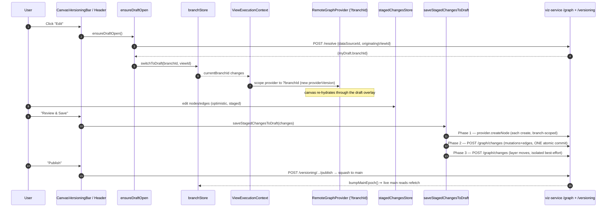

# 07 · Frontend Integration — How the Canvas Drives Versioning

> **Audience & scope:** frontend engineers working on the canvas/versioning UI, and anyone tracing a
> user edit from click to committed draft. Backend contract lives in
> [06 · API Reference](06-api-reference.md); the engine it drives is
> [03 · Branching, Commits & Merge](03-branching-commits-merge.md).

**TL;DR.** The client is a **thin, honest shell over the API** — Postgres is never touched directly.
"Edit mode" *is* an open **draft**; every graph read is routed through `?branchId=` so a draft is a
first-class provider scope; and "Save" is a carefully **three-phase** pipeline that persists creates,
structural mutations, and layer moves with the right atomicity so a partial failure never corrupts a
hierarchy. Two small Zustand stores (`branchStore`, `versioningPanelStore`) hold transient
branch/panel state; everything durable is a React-Query read against the versioning API.

---

## 1. The mental model

> **Invariant.** The browser talks only to the API; `graphver` Postgres is API-only. Every
> versioning affordance below is a call to a route documented in [06 · API Reference](06-api-reference.md).

---

## 2. Branch identity — `branchStore`

`frontend/src/store/branchStore.ts` is the **single source of truth** for *"which branch are we
editing/viewing?"* and *"is the committed-diff overlay on?"*. It is read by `ViewExecutionContext`
(to scope the provider's `?branchId=`), the canvases (to tint diffed nodes), and the versioning
chrome (switcher, banners).

> **Decision — a separate, NON-persisted store.** Branch identity is deliberately split from the
> localStorage-persisted `canvas` store (`branchStore.ts:6-12`). Two reasons: (1) branch identity is
> *not* a graph edit, so it must not bump the canvas's version counter; (2) a stale branch id
> resurrected from localStorage across reloads is a footgun — branch context is **re-resolved per
> session** from `resolveGraph`.

### Branch-per-view scoping

The store is scoped to a `(workspaceId, dataSourceId, viewId)` triple (`branchStore.ts:17-27`).
A `branchId` is valid **only** for its own graph *and the view it was resolved for* — because each
Context View tracks its own draft ("branch-per-view"). The two selector helpers enforce this:

- `branchIdForScope(wsId, dsId, viewId?)` / `useEffectiveBranchId(...)` return `currentBranchId`
  **only if the full scope (including `viewId`) matches** (`branchStore.ts:91-96, 166-177`). Passing
  `viewId` is optional for legacy callers, but the store itself never holds a different view's draft.
- `setResolved(scope, r)` (`branchStore.ts:98-125`): entering a **different** scope (data source *or*
  view) clears branch state → the user lands on Published; a **same-scope** refetch leaves the active
  branch untouched, so a background resolve never overrides an explicit switch.

> **Decision — a view switch never silently resumes a draft.** Even when the backend reports this
> view's own open draft as `myDraft`, entering the scope opens **Published**; the user explicitly
> resumes by clicking Edit (which routes through `ensureDraftOpen`). This keeps "which branch am I on"
> predictable across view switches (`branchStore.ts:111-123`).

`mainEpoch` (`branchStore.ts:47, 149`) is a monotonic counter bumped on publish/merge; §4 and §11
explain how it forces live-main reads to refetch. `activeChangeSet` holds the committed draft-vs-main
diff (owned by the bar's effect, cleared on branch switch); `committedDiffHidden` is a sticky view
preference for the overlay toggle.

| Store field | Purpose |
|-------------|---------|
| `currentBranchId` | `null` = trunk/main (no `?branchId=`); a `br_…` id = an open draft |
| `originatingViewId` | the view a draft was opened from (branch-level attribution) |
| `mainBranchId` / `mainHeadCommitSeq` | main pointer + head seq for "behind main?" checks |
| `activeChangeSet` | committed draft-vs-main diff (drives canvas rings) |
| `committedDiffHidden` | show/hide committed rings (sticky preference; staged always shows) |
| `mainEpoch` | bumped on publish/merge → folded into `providerVersion` to refetch main |

---

## 3. Read routing — `ViewExecutionContext` → provider `?branchId`

`frontend/src/providers/ViewExecutionContext.tsx` builds an isolated execution environment per view:
it picks a **provider from a pool** and overrides the provider context so every downstream hook
(`useGraphProvider`, `useGraphHydration`) targets the scoped provider.

- **Draft scoping** (`ViewExecutionContext.tsx:128-145`): `effectiveBranchId = useEffectiveBranchId(
  workspaceId, dataSourceId, viewId)` — when this scope owns a draft, `getOrCreateProvider(ws, ds,
  effectiveBranchId)` returns a provider that stamps `?branchId=` on every read. A draft is therefore
  **never** the shared global (main) provider.
- **`providerVersion` folds in `mainEpoch`** (`ViewExecutionContext.tsx:161`):
  `providerVersion = (scopeMatchesGlobal ? globalCtx.providerVersion : localVersion) + mainEpoch`.
  Schema (`useGraphSchema`) and canvas hydration are keyed by `providerVersion`, so a publish/merge
  (`bumpMainEpoch`) makes them refetch **once main has actually moved**.

> **Decision — the canvas graph is manually hydrated, not React-Query.** The node/edge graph is
> loaded by `useGraphHydration` keyed on `providerVersion`; it is *not* a React-Query cache. This is
> why publish/merge must `bumpMainEpoch()` (a version bump) to re-read, rather than invalidating a
> query key. React-Query is used for the *versioning metadata* (branches, diffs, commits, PRs), which
> §11 keeps in sync.

---

## 4. Edit → open a draft (`ensureDraftOpen`)

`frontend/src/features/versioning/model/ensureDraftOpen.ts` guarantees an editable draft is active
**before** any optimistic canvas mutation — switching branches reloads the canvas, so opening a draft
*after* staging an edit would discard it (`ensureDraftOpen.ts:1-18`).

Flow (`ensureDraftOpen.ts:36-59`):
1. No-op if already in a draft (returns `currentBranchId`).
2. Resolve the **active view** from the schema store (`getActiveView()`), so write-time attribution
   matches the read side (Changes & Reviews filter by the active view).
3. `resolveAndOpenDraft(ws, {dataSourceId, originatingViewId})` — `POST /resolve`, which
   **opens-or-resumes atomically** and returns `myDraft.branchId`.
4. `switchToDraft(branchId, originatingViewId)` and **fire-and-forget** invalidate the versioning
   caches so the `?branch` deep-link guard (§12) sees the just-opened draft in the cached branches
   list (`ensureDraftOpen.ts:30-34, 53`).
5. Returns `null` when no draft can be opened (context unresolved, or the caller lacks `:manage`) —
   callers treat `null` as "cannot edit"; **Published is read-only**.

Callers: the header's Edit entry (`ContextViewCanvas.tsx:1461` `handleEnterEdit`), the Hierarchy
Builder's "Start building" (`ContextViewCanvas.tsx:2439`), and the builder store's `open()` guard.

> **Invariant — branch-level attribution.** A draft, and every commit made on it, belongs to one
> view via `originating_view_id`. The server also **claim-fills** attribution onto a resumed draft
> that predates view tracking (`ensureDraftOpen.ts:11-17`). See
> [06 · API Reference](06-api-reference.md) `/resolve`.

---

## 5. Staged changes → ops → the three-phase save

Canvas edits accumulate optimistically in `stagedChangesStore` (dashed-halo feedback, unsaved).
"Review & Save" runs `saveStagedChangesToDraft` (`ContextViewCanvas.tsx:2370-2399` `StagedChangesPanel
onConfirm` → `saveStagedChangesToDraft.ts`). The header docstring says "two phases" but the code
implements **three**, and the separation is the whole point:

### Phase 1 — creates via `provider.createNode` (`saveStagedChangesToDraft.ts:46-100`)
`create_entity` is intentionally **excluded** from the ops translation (`stagedChangesToOps.ts:5-7,
119-120`) and run first through its proven branch-scoped provider hook, which constructs the urn +
containment edge and remaps the optimistic temp id. Each create is attempted **independently** so an
ontology rejection is attributed to the *specific* entity; on any failure the code drops
already-persisted creates (retry-safe), skips children of a failed parent (`blockedParentUrns`), flags
the failures, and **stops before Phase 2** — never persisting a partial hierarchy. Layer assignments
are re-keyed temp→real in the same tick as each create's node swap (`remapEntityId`,
`saveStagedChangesToDraft.ts:71-75`) so a later failure can't strand a node out of its layer.

### Phase 2 — mutations + user-drawn edges as ONE atomic commit (`saveStagedChangesToDraft.ts:102-115`)
`stagedChangesToOps(changes without creates, resolveTempId)` → `applyGraphChanges(ws, ds, branchId,
ops)` → `POST /graph/changes` (one server-merged commit). The translation
(`stagedChangesToOps.ts:48-126`):
- `rename_entity`/`update_entity` → an `update` **node** op carrying only the changed fields
  (`nodeUpdatePayload` normalizes canvas `label`/`type` → `displayName`/`entityType`) plus a
  `baseVersion` OCC token (§ below).
- `edit_edge` → `update` edge stripping client-only/immutable keys (`IMMUTABLE_EDGE_KEYS`).
- `delete_entity`/`delete_edge` → `delete`.
- `create_edge` → `create` edge; temp endpoints resolved to real ids via Phase 1's map.
- `reverse_edge` → delete + recreate flipped (endpoints aren't mutable in place).

> **Decision — the client sends *partial* updates and lets the server merge.** `stagedChangesToOps`
> emits only the fields that changed and the `baseVersion` content-hash the entity was read at
> (`stagedChangesToOps.ts:24-31, 63-64`). The backend applies `update` as a **field-level PATCH**
> (or a 3-way conflict when `baseVersion` is present) — this is the OCC seam that turns a stale
> same-field edit into a conflict rather than a silent overwrite. Absent token ⇒ plain patch, so it's
> safe even before hydration carries `version`. (Backend semantics: [03 · Branching, Commits &
> Merge](03-branching-commits-merge.md).)

### Phase 3 — layer moves in a SEPARATE isolated commit (`saveStagedChangesToDraft.ts:117-142`)
`assign_layer`/`move_to_layer` become `update` node ops on `layerAssignment`, applied in their **own**
best-effort commit *after* the structural one.

> **Decision — why layer moves are isolated.** A layer move rewrites the single field the reload
> placement reads, but it must **not** ride in the atomic Phase-2 batch: if a layer op failed there,
> it would roll back the user's creates/renames/containment edits too — the data-loss trap. Isolated
> and best-effort, a layer failure is logged and skipped; the structural commit already succeeded and
> is safe (`saveStagedChangesToDraft.ts:117-142`).

After saving, `invalidateAggregatedEdges()` refetches rollups (the draft overlay reports adjusted
`:AGGREGATED` edges, but only a fresh fetch shows them). The panel then clears the staged store
*without* discard hooks (to keep the optimistic canvas) and invalidates `VERSIONING_KEYS.all`
(`ContextViewCanvas.tsx:2395-2397`).

---

## 6. The diff overlay — one visual language (`useDiffDecoration`)

`frontend/src/features/versioning/canvas/useDiffDecoration.ts` is the single source of truth for
*"how has this entity changed?"*, shared by graph nodes and the context tree so every surface speaks
one language. It merges two layers (`useDiffDecoration.ts:30-61`):

- **STAGED** (uncommitted) edits from the staged store — always shown, higher precedence.
- **COMMITTED** branch-vs-main changes from `branchStore.activeChangeSet` — shown by default, hidden
  when the user toggles `committedDiffHidden`.

> **Invariant — style encodes commit-state, colour encodes the change.** Line **style**: dashed =
> staged (unsaved), solid ring = committed (not merged). **Colour**: emerald = added, amber/orange =
> modified, rose = removed (`useDiffDecoration.ts:12-14, 69-83`). This makes "saved vs not"
> unmistakable at a glance. `activeChangeSet` is populated by the bar's effect from
> `useDiffVsMain` → `fromDiffVsMain` (`CanvasVersioningBar.tsx:59-66`).

---

## 7. The versioning chrome — the bar, the bridge, the panel

### `CanvasVersioningBar` — one strip, mounted once
`frontend/src/features/versioning/components/CanvasVersioningBar.tsx` carries all versioning chrome
for every canvas (mounted once in `CanvasRouter`). It renders **nothing** for a non-versioned data
source, and an **"Enable version control"** empty state when `needsSeed` (no graph, or a genesis-only
non-blank graph — managers only; a `kind === 'blank'` model is excluded because it's genesis-only by
design) (`CanvasVersioningBar.tsx:98-132`). On a draft it shows an amber strip: `BranchSwitcher`,
`RefreshingBadge`, `AggregationSyncChip`, the committed `ChangeCountChips` + an *"N unsaved"* staged
hint (`:162-185`), `ViewPrIndicator`, a **Reviews** button, the committed-diff `ChangeHighlightControl`
(toggles `committedDiffHidden`), **Publish** (`CommitDialog`), and **Discard** (`useAbandonDraft`). A
`PullBeforeMergeBanner` appears when the draft is `behindMain` (`:84-87, 228-236`).

### `versioningPanelStore` — a one-shot bridge
`frontend/src/store/versioningPanelStore.ts` is a deliberately tiny, non-persisted store: the Context
View header's far-away "Changes" button calls `openPanel(tab)`; the bar subscribes, opens the panel on
that tab, and clears the request (`CanvasVersioningBar.tsx:73-79`). It carries a transient *request*,
not durable state.

### `ViewVersioningPanel` — the review hub
`frontend/src/features/versioning/components/ViewVersioningPanel.tsx` is a slide-over with tabs
(`ViewVersioningPanel.tsx:24-31`): **Changes**, **Commits**, **Pull Requests**, and **Data health**
(manager-only — filtered out for everyone else, `:88`). The Changes tab shows `PendingChanges`
(unsaved staged edits with a "Review & Save" action, `:35-62`) above the cumulative committed tree, so
after you save, work moves from *Pending* to *Committed* in the same view rather than vanishing. It
requests up to **1000** top-level diff groups so "all branch changes" is genuinely complete (`:92`).

Two change-review presentations sit under it:
- **`ChangesPanel`** — flat, source-agnostic (Entities/Relationships × Added/Modified/Removed), each
  row expandable to a field-level `EntityDiff`; also exports `ChangeCountChips`.
- **`ChangeTreePanel`** — hierarchical, lazy, business-reader-facing: an impact header rolls up per
  entity-type ("17 tables · 40 columns"), with a containment tree whose children page in on demand
  (`summaryFirst`).

---

## 8. Pull-latest / rebase UX

When a draft falls behind `main`, `PullLatestButton`
(`frontend/src/features/versioning/components/PullLatestButton.tsx`) appears (variants row/bar/manager,
rendered only when `behind`). It calls `usePullLatestDraft` (`useVersioning.ts:340-359` →
`rebaseDraft` → `POST /versioning/.../rebase`). A `{clean: false}` response opens the
`ConflictResolver`, whose resolutions feed straight back into a re-call loop. On a **clean** pull it
invalidates branches/state/diff/resolve **and the PR lists** — a clean pull clears the merge gate
(`useVersioning.ts:347-357`). The `PullBeforeMergeBanner` and the PR drawer's `needsPull` banner (§9)
cover the merge-gate case.

---

## 9. Merge / PR flow (`PrDetailDrawer`)

`frontend/src/features/reviews/components/PrDetailDrawer.tsx` is one PR's review surface — overview +
reviewers/approval, **Commits** (draft MRs only, each expandable to a per-commit diff, `:68-72`),
**Files changed** (`ChangesPanel` via `fromPrDiff`, `:93`), a derived activity timeline, and the
**Approve / Merge / Close** action bar. It works for both draft MRs and fork PRs — the backend
endpoint dispatches; the drawer just reads `useMergeRequest`.

`runMerge` (`PrDetailDrawer.tsx:119-148`) is conflict-aware:
- `NotUpToDateError` → set `needsPull`, show the pull banner + Pull-latest (the 409 is a backstop; the
  proactive `pr.behind` flag drives `needsPull` up front, `:114-117`).
- `MergeConflictError` → open the `ConflictResolver`; its resolutions feed a re-merge.
- `approval_required` → a friendly toast.
On success it lands on the freshly-merged main (`switchToMain()`) and closes — read-your-writes serves
`main` even before the projection catches up. `runPull` (`:150-167`) interleaves the pull-resolve mode
in the same resolver.

---

## 10. Import-triggered refresh (brief)

Import/export dialogs are mounted in the canvas (`ContextViewCanvas.tsx:2343-2362`) and hand off to the
same review surfaces. Because an import commits **server-side** on the draft (no optimistic canvas),
`ContextViewCanvas` uses an `importedRef` + `refreshAfterImport()` (`:884-894`) that invalidates
`VERSIONING_KEYS.all`, refetches aggregated edges, and `bumpMainEpoch()`s — but **only when the dialog
closes**, so the import preview stays visible instead of the canvas flipping mid-flow. Full detail in
[08 · Import / Export](08-import-export.md).

---

## 11. React-Query keys & the invalidation fan-out

`frontend/src/features/versioning/hooks/useVersioning.ts` defines `VERSIONING_KEYS`
(`useVersioning.ts:12-59`) and every query/mutation.

> **Decision — `viewId` is appended to a cache key only when given** (`useVersioning.ts:14-24`), so
> data-source-level callers keep their exact prior key — no unintended churn — while view-scoped
> callers get branch-per-view isolation.

Freshness polling is surgical: `useProjectionWatermark` polls every 3s **only while a projection is
actively catching up** (`status ∈ projecting|rebuilding`), then stops — a merely-behind-idle graph is
never polled (`useVersioning.ts:103-120`).

The publish/merge fan-out is the subtle part. `usePublishBranch` (`useVersioning.ts:375-399`) and
`useMergeMergeRequest` (`:483-506`) both:
1. invalidate branches + **all** commit-log scopes (`commits`, `viewCommits`) by prefix so History's
   "This view"/"Whole graph" refresh without a reload;
2. invalidate `projectionWatermark` so the "refreshing…" badge can show while FalkorDB catches up;
3. **`bumpMainEpoch()`** — the version bump that makes the manually-hydrated canvas re-read main (§3);
4. `invalidateAggregatedEdges()` **now and again after 4 s** —

> **Gotcha.** Rollups change with `main`, but an *immediate* refetch can hit the stale projection
> window and cache an empty result for the TTL. So the fan-out fires `invalidateAggregatedEdges()`
> once and again via `setTimeout(..., 4000)` after the post-commit projection nudge has had time to
> land (`useVersioning.ts:392-396, 501-503`).

`useRebuildProjection` seeds the watermark cache with the response before invalidating, guaranteeing
the progress effect observes one `rebuilding` tick even on an instant rebuild (`useVersioning.ts:407-414`).

---

## 12. `?branch` deep-link (`useBranchDeepLink`)

`frontend/src/features/versioning/hooks/useBranchDeepLink.ts` two-way-syncs the URL `?branch=<id>`
param with the active branch, making a view+branch shareable and bookmarkable.

- **URL → store**: apply the deep-linked branch only if it names an **open** draft that appears in the
  **permission-gated, view-scoped** branches list; on a *settled* list miss, drop the param, stay on
  main, and toast (`useBranchDeepLink.ts:52-70`). A REJECT waits for the settled list (a just-opened
  draft may not be in the stale one yet); an ACCEPT acts immediately.
- **store → URL**: reflect the active branch (replace, no history spam), with a guard against erasing
  an unapplied deep-link on fresh load (`:73-90`).

> **Invariant — branch-per-view in the URL too.** Both directions are gated on
> `viewResolved = scopeViewId === activeViewId` (`useBranchDeepLink.ts:49`), so a mid-view-switch
> never stamps the previous view's branch into this view's URL (which would make branches appear
> global across views).

---

## 13. Limitations & gotchas (frontend)

> **Limitation.** The `saveStagedChangesToDraft` header comment says "two phases" but the body
> implements three (creates / atomic mutations / isolated layer moves). The code is authoritative;
> the comment is slightly behind.
- **Optimistic canvas vs server truth.** Save keeps the optimistic canvas and clears the staged store
  *without* discard hooks (`ContextViewCanvas.tsx:2395-2397`). If Phase 2/3 partially fail, the review
  panel flags the offending entities (`saveStagedChangesToDraft.ts:81-100`), but the canvas can
  briefly lead the server until the next hydration.
- **Manual hydration means version bumps, not query invalidation.** Anything that changes `main` and
  must show on the canvas has to `bumpMainEpoch()`; invalidating a React-Query key alone won't move
  the graph (§3). This trips up new code that only invalidates.
- **The 4 s aggregated-edge re-fetch is a timing heuristic** (§11), not a signal — a slow projection
  could still serve stale rollups past 4 s until the next interaction.

---

## Related chapters

- [03 · Branching, Commits & Merge](03-branching-commits-merge.md) — the backend semantics behind
  `update`-as-PATCH, 3-way merge, publish/rebase.
- [06 · API Reference](06-api-reference.md) — the `/resolve`, `/graph/changes`, publish/merge/rebase
  routes this chapter calls.
- [08 · Import / Export](08-import-export.md) — the import dialog + `refreshAfterImport` handoff.
- [04 · Projection & Cache](04-projection-and-cache.md) — why the "refreshing…" badge and the 4 s
  rollup re-fetch exist.
- [README](README.md) — glossary and the suite index.
