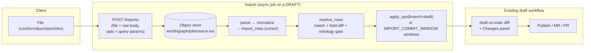

# 08 — Import / Export

> **Audience & scope.** Engineers building or operating bulk data flows into and out of a versioned
> graph, and architects assessing how bulk CRUD stays safe at scale. Covers the import/export
> vertical end to end: the draft-based thesis, the parse→resolve→apply pipeline, identity &
> idempotency, reconcile modes, the tabular column model, format adapters, view-scoped export, the
> object store, and the honest limits. See [`README.md`](README.md) for the glossary and
> [03 — Branching, Commits & Merge](03-branching-commits-merge.md) for the draft/`apply_ops`
> primitives this builds on.

**TL;DR.** Bulk import/export is deliberately **not** a separate write path — it is *the manual
draft flow at scale*. Every import opens (or appends to) the user's working **draft** branch; a
worker parses the file, resolves each row against the draft's composed state, and applies the
changes via the same `apply_ops` the canvas uses. The result is **reviewed and published through the
normal draft diff/PR workflow** — the import/export service never writes `main` itself. Export is
symmetric: it reads a branch's state a page at a time and streams it out as a downloadable,
re-importable file (a backup), lossless enough that an unchanged round-trip resolves to **zero
changes**.

---

## 1. The thesis: bulk = the manual flow at scale

The design goal was that loading 50,000 rows should be **governed exactly like editing one node**:
isolated on a draft, validated against the ontology, previewed, reviewed, and published — never a
privileged side-door that mutates the shared graph directly.

> **Decision.** An import **opens/append s a draft and applies rows via `apply_ops(branch_id=draft)`**,
> then hands off to the existing review/publish/PR flow. `ImportExportService` *never writes `main`*
> (`import_export/service.py:6-7`; `import_worker.py:1-14`). Consequences: repeated imports **stack on
> one draft** like successive manual edits; a bad import is discarded by abandoning the draft; every
> imported change shows up in the same Changes panel and diff as hand edits; and the import worker
> reuses the engine's ontology gate, edge integrity, cascade-delete, and 3-way merge for free.

The vertical is **independent of the aggregation/ingestion worker** — it copies that stateless
worker *pattern* (a `graphver.jobs` row with traceability metadata, resumable phases) but imports
none of it and drives the versioning service instead (`import_worker.py:1-6`).

> **Invariant.** Imported changes are **committed on the draft, not staged** — the worker calls
> `apply_ops`, which writes version rows and a commit. So the review handoff is the **Changes**
> (committed diff) surface, not the unsaved staged-changes panel. See
> [07 — Frontend Integration](07-frontend-integration.md).

---

## 2. Job model & dispatch

A job is a row in `graphver.jobs` (`job_type ∈ ingest | export`) carrying full traceability —
workspace, data source, provider, graph, the draft `branch_id`, `reconcile_mode`, `import_format`,
`scope_view_id`, `field_scope` (export options / import field allow-list), `source_uri`/`result_uri`
artifact keys, `as_of_seq`, and a `summary` JSON tally (see the `JobORM` definition in
[02 — Data Model](02-data-model.md)). Staging rows live in the plain (non-partitioned) `import_rows`
table, keyed by `job_id` + `row_index`.

**Create.** `ImportExportService.create_import_job` (`service.py:61-106`) opens a fresh `"Import"`
draft via `open_draft` when no `branch_id` is supplied, or **stacks onto an existing draft** when one
is (`service.py:86-88`). It inserts the `JobORM` row and mints a self-describing `source_uri`
(`{ws}/{ds}/{graph}/{job}/source.<fmt>`) for the caller to stream the upload into
(`service.py:102-105`).

**Dispatch.** The endpoint streams the uploaded file into the object store, then runs the worker as
a detached task (`spawn_detached`, `app/services/background.py`). Not FastAPI `BackgroundTasks`:
those run inside the request's ASGI call, so the route's 120 s timeout tier cancelled any import
that outlasted it. `run_import_safe` / `_run_safe` wrap the run so any exception, or a
cancellation, marks the job `failed` with an `error_message` — the failure is durable on the job
row.

> **Limitation — in-process dispatch.** v1 runs imports (detached tasks) and exports (**FastAPI
> `BackgroundTasks`**) inside the web process, not a real async dispatcher (`service.py:9-11`). Two
> consequences to know: a `uvicorn --reload` (or any process restart) **mid-import kills the job** —
> it never reaches `completed`, and since a running import touches its `updated_at` every 15 s,
> `get_job` reports a job silent for `JOB_STALE_AFTER_SECS` (default 900) as `failed` so the UI
> stops waiting; and a very large import competes with request handling.
> A Redis/Postgres dispatcher (mirroring the aggregation worker) slots in behind the same
> `run_import_safe` call without touching the pipeline. Tracked in
> [09 — Scale, Limits & Roadmap](09-scale-limits-and-roadmap.md).

The service is wired as a singleton (`get_import_export_service`, `versioning.py:1964-1972`) with two
injected resolvers so the worker stays decoupled from the management DB: a **scope resolver**
(view-scope for scoped export/replace) and an **ontology resolver** (live valid types for the
per-row gate).

---

## 3. The import pipeline (parse → resolve → apply)

`ImportWorker.run` (`import_worker.py:100-116`) executes three phases, all parameters read from the
`JobORM` row.

### 3a. Parse

`_parse` (`import_worker.py:151-169`) streams `source_uri` from the object store through the format
adapter's `parse`, calls `normalize(raw, kind)` per record, and bulk-inserts `ImportRowORM` rows in
2,000-row flushes (`_PARSE_BATCH`) — **the whole file is never buffered** (except the buffered
formats; see §5). Records whose `kind` is neither `node` nor `edge` are skipped, never fatal
(`import_worker.py:159-160`).

Before parsing a non-xlsx file, `_reject_binary` (`import_worker.py:136-149`) sniffs the first chunk
for a ZIP (`PK\x03\x04`) or OLE (`\xd0\xcf\x11\xe0`) magic and fails fast with a friendly *"this is
an Excel workbook — Save As CSV"* message — a very common mistake that would otherwise parse into
garbage rows. xlsx is exempt (it *is* a PK zip and its adapter reads it natively).

### 3b. Resolve

`_resolve_and_build` (`import_worker.py:175-206`) loads the staged rows, fetches the draft's
composed state as **match indexes** via `entity_indexes(graph, branch)`, and calls `resolve_rows`
(`resolve.py:125-228`) — a **pure, deterministic** function (the id minter is injected) that returns
`(ops, resolutions)`.

Two passes, so an edge can reference a node created earlier in the same file
(`resolve.py:1-9, 149-150`):

- **Nodes** match an existing entity by **`entity_id` → `urn` → `qualifiedName`** (`_match_node`,
  `resolve.py:231-239`); no match ⇒ mint a new `entity_id` and register it in the local indexes for
  later edges (`resolve.py:180-188`).
- **Edges** resolve each endpoint through those node indexes
  (`entity_id` → `qualifiedName` → `urn`, `_resolve_endpoint`, `resolve.py:242-252`) and key on the
  `(source_eid, target_eid, edge_type)` triple — the same keying `sync_ingest` uses
  (`resolve.py:205`).

> **Invariant — partial acceptance.** An unresolvable or ontology-invalid row is **quarantined**
> (`resolved_op = "invalid"` + a human reason), never aborting the batch (`resolve.py:14, 154-164`).
> The tally lands on `job.summary` and the reasons on the `import_rows` row.

### 3c. Apply

Accepted ops are applied to the draft in `IMPORT_COMMIT_WINDOW`-sized windows (default 50,000) via
`apply_ops(graph_id, ops=window, actor, branch_id=draft, message="import")`
(`import_worker.py:198-200`). Each window is one commit on the draft — so a huge import becomes a
sequence of ordinary checkpoints, and the engine's referential-integrity, edge-integrity,
cascade-delete, and ontology gates all apply. The resolutions are persisted back onto `import_rows`
(`_persist_resolutions`, `import_worker.py:208-217`), and `job.summary` tallies
`{new, updated, unchanged, deleted, invalid}`.

---

## 4. Identity & idempotency (a round-trip is a no-op)

The single most important correctness property: **re-importing an unchanged export changes nothing.**
Two mechanisms deliver it.

- **Stable identity, not fragile keys.** Matching prefers the stable `entity_id`, then the mutable
  `urn`, then `qualifiedName` — `qualifiedName` is a *field*, not an identity, so a rename doesn't
  fork the entity. (Glossary: `entity_id` in [`README.md`](README.md).)
- **Type-tolerant, field-level diff.** `_changed_fields` / `_changed_props` (`resolve.py:41-84`)
  compare each provided field against the current stored value with `_scalar_eq`
  (`resolve.py:31-38`), which treats `5 == "5"` and `True == "True"` — essential because CSV
  stringifies everything. `tags` compare as an unordered set. If nothing genuinely changed, the row
  resolves to **`unchanged`** and emits **no op**; an update carries **only the changed fields** (a
  PATCH), never a full-payload replace.

> **Decision — sparse edits scale.** Because matching is by identity and updates are field-level
> patches, a minimal file changes only the rows and columns it contains: absent columns leave fields
> untouched, absent rows leave entities untouched. You can update one property on 1 of 10,000
> entities by importing a one-row, one-column file — this is what makes "edit in Excel, re-import"
> viable at scale.

---

## 5. The tabular column model (each property is its own column)

Import/export uses **one shared flat schema across every format** (`rowmodel.py:1-19`):

| Group | Columns |
|-------|---------|
| **Locked identity** | `entity_id`, `urn`, `baseVersion` (= content hash / OCC token) — greyed/locked, do not edit |
| **Node core** | `entityType`, `displayName`, `qualifiedName`, `description`, `sourceSystem`, `layerAssignment`, `tags` |
| **Edge core** | `edgeType`, `sourceQualifiedName`, `targetQualifiedName`, `source_entity_id`, `target_entity_id`, `confidence` |
| **Properties** | one dynamic **`prop.<name>`** column per property + a `properties_json` **overflow** column |
| **Op** | `_op` — blank/`upsert` (default) or `delete` |

> **Decision — properties are tabular, not a JSON blob.** Every property is its **own `prop.<name>`
> column** (`column_order`, `export_worker.py:51-80`) — like a spreadsheet — so 10–50 properties are
> 10–50 editable columns, not one bulky JSON cell. `properties_json` is demoted to a pure overflow
> column, emitted only for genuinely nested/complex values (`rowmodel.py:121-129`). Export columns
> are the **union** of properties entities actually have **plus** any the ontology defines for the
> present types (`schema_props`) **plus** any the user asked to add — so a defined-but-empty property
> is still a fillable column.

**`normalize`** (`rowmodel.py:83-118`) turns a flat record into a normalized row: **empty cells are
dropped** (a blank means "leave unchanged" — PATCH semantics, `rowmodel.py:90-107`); `tags`/
`confidence` are coerced; and an **unexpected `_op` value** is flagged `invalid` with a
column-shift hint rather than silently swallowed as an upsert (`rowmodel.py:89-98`) — the fix for
the classic "a property value slid into the `_op` slot and my edit vanished" bug.

**Deleting a property** is explicit (an empty cell never deletes). A `\N` / `\NULL` token in a
`prop.<name>` cell, or a `null` in `properties_json`, becomes the **`PROP_DELETE` sentinel**
(`"__nx_prop_delete__"`, `rowmodel.py:60-80`) which flows through the update patch to
`service._patch_payload`, removing the key. The sentinel uses a plain ASCII marker (not a NUL byte,
which Postgres JSONB rejects) and is stripped from `create` payloads, where it is meaningless
(`resolve.py:55-65`).

---

## 6. Reconcile modes: upsert vs replace

| Mode | Absent-entity behavior | Default? |
|------|------------------------|----------|
| **`upsert`** | Never deletes on absence — only creates/updates the rows in the file. | Yes (safe) |
| **`replace`** | The file is the **authoritative snapshot for its scope**: every existing in-scope entity that no file row matched is **deleted**. | Opt-in |

Replace deletes are computed by `_append_replace_deletes` (`import_worker.py:70-90`): `universe −
matched` → `delete` ops (edges first, then nodes; `apply_ops` cascades containment/incident edges).
Derived deletes aren't file rows, so they're counted separately into `summary["deleted"]`.

> **Invariant — scoped replace can't nuke the data source.** For a **view-scoped** replace,
> `_view_scope_eids` (`import_worker.py:41-67`) restricts the deletable universe to the view's own
> entities — the same rule as export scope: each assigned URN plus its containment descendants (when
> the assignment inherits children), edges in-scope only when both endpoints are. `None` scope ⇒
> whole graph. Because the review dialog always passes the active `viewId`, a replace from a view is
> view-scoped by default. Whole-DS replace is still available and is guarded by a prominent
> "N entities will be deleted" callout before publish.

Replace is always **reviewed on the draft before publish** — the delete-on-absence set is visible in
the diff, so a mistaken scope is caught before it touches `main`.

---

## 7. Format adapters

A `FormatAdapter` (`formats.py:21-28`) converts one file format ↔ raw column-dict records; the
pipeline, staging, reconcile, and diff never change when a format is added. The registry
(`formats.py:152-158`, resolved by `get_adapter`, `:161-166` — unknown format ⇒ `ValueError` ⇒ HTTP
422) ships five:

| Format | Adapter | Streaming? | Notes |
|--------|---------|-----------|-------|
| `ndjson` | `NdjsonAdapter` | ✅ | One JSON object per line — the canonical large-scale format |
| `csv` / `tsv` | `DelimitedAdapter` | ✅ | Quote-aware via stdlib `csv`; cells must not contain raw newlines (nested values go in `properties_json`) |
| `json` | `JsonAdapter` | ❌ (buffered) | A single `[{…}]` array — human-scale only |
| `xlsx` | `XlsxAdapter` (lazy) | ❌ (buffered) | A real workbook; needs `openpyxl`, registered lazily so a missing lib never breaks the others |

**Encoding robustness.** `decode_bytes` (`formats.py:31-42`) strips a UTF-8 BOM (Excel "CSV UTF-8")
and falls back UTF-8 → cp1252 so Windows/Excel exports never crash the import; `_lines`
(`formats.py:58-69`) reassembles lines across byte-chunk boundaries and tolerates CRLF. Content-based
detection on the client (`detectFormat`, `importExportApiService.ts:181-197`) sniffs the first bytes
(PK → xlsx) rather than trusting a possibly-missing extension.

**The xlsx workbook** (`xlsx_adapter.py`) is the strategic fix for flat-CSV column-shift fragility:
separate **Nodes** and **Edges** sheets (kind comes from the *sheet*, not a column, so a stray value
can't shift into `_op`, `:34-40`), greyed **locked identity** columns (`_LOCKED`, `:17, 116-117`),
an `_op` dropdown data-validation (`:124-128`), and an **Instructions** sheet (`:139-161`). Adding a
property is typing under a new `prop.<name>` header — nothing shifts.

---

## 8. Export

An export reads a **snapshot** (`import_export/snapshot.py`): the branch's state as a stack of
layers — `main` at a commit (a fork's `main` sits on its parent's at the fork point), then a draft
at a commit or as it stands now (its `entity_heads`). Each layer is keyset-paged on `entity_id`,
and each page drops the entities a higher layer decides, found with one indexed point lookup per
layer — so every live entity comes out once, a page at a time, with no global sort and no map of
the whole state in memory. `main` is pinned to its head commit when the export starts, so a long
export is one consistent snapshot. `import_export/stream.py` turns each page into records (off the
event loop) and hands them to the format's `write_pages`; spreadsheets take a first pass that keeps
only the records' keys, for their columns. Postgres integration test:
`tests/integration/test_export_stream.py` (identical records to `materialize_state` for main,
as-of, draft, draft as-of and fork, many pages each).

Three ways out, one pipeline:

- **`GET /exports/plan` then `GET /exports/stream`** — what the Export dialog does: the plan says
  what the export would hold (counts, emptiness, whether Excel can hold it), then the browser
  downloads the stream natively. Nothing is stored; any pod serves it.
- **`GET /{ws}/graph/export/plan · /stream`** (`import_export/live.py`) — a data source **without**
  version control: the provider's `scan_nodes`/`scan_edges` (FalkorDB: internal-id windows, each
  one `NodeByIdSeek`) into the same rows, with no entity ids, so a re-import matches by URN.
- **`POST /exports`** — the job (`ExportWorker.run`), for API clients: the same stream written to
  the `result_uri` artifact, then a `{nodes, edges, bytes}` summary.

- **Branch vs published.** A `branch_id` (a working draft) exports the draft's **composed state**
  (main + committed + staged draft changes); omitting it defaults to **published `main`**. A draft
  must be readable by the caller. This is what lets a user export their in-progress branch, edit it
  in Excel, and re-import onto the same branch.
- **As-of.** `as_of_seq` gives a point-in-time snapshot: `main` and the draft read at that commit.
- **View-scoped export.** When a `viewId` is given, `stream.view_entities` restricts to the view's
  entity set. The **authoritative source is the view's reference-layout placements** — the explicit
  physical-entity → logical-layer assignments — read by `_view_export_scope` (`versioning.py`): the
  placed entities (entries with a real `layerId`) plus their containment descendants (when
  `inheritsChildren`, the default). A placement key is the entity's URN, or `gv:<entity id>` for a
  node without one, as the canvas writes it. Edges are kept only when **both** endpoints are in
  scope. A view that places nothing exports the whole data source (the plan says so).
- **Row-scoped export.** `stream.Selection` keeps only an explicit `entity_id`/`urn` set and/or
  entity-type set (intersection), composing after view scope.
- **Add-property columns.** `props` emits extra empty `prop.<name>` columns to fill (`:219-222`).

**The options plumbing is consistent end to end** (verified against the current tree): the
`create_export` endpoint declares `props`/`ids`/`types` and passes
`extra_props`/`select_ids`/`select_types` (`versioning.py:2095-2116`) → `create_export_job` packs
them into an `options` dict stored in `field_scope` (`service.py:208-221`) → `run_export` passes
`options=` to `ExportWorker` (`service.py:239`) → the worker reads `options.get("props"/"ids"/"types")`
(`export_worker.py:191-196`).

> **Limitation — the UI exposes a subset.** The **backend** supports `props` + row-scope (`ids` /
> `types`) + view-scope + branch-vs-published + as-of. The **ExportDialog / client service** currently
> send only `format`, `viewId`, `branchId`, and `props` (`importExportApiService.ts:135-151,
> 200-212`) — so **row-scoped export (`ids`/`types`) is API-only today**, not surfaced in the dialog.
> Row-scope is fully wired server-side; surfacing it in the UI is the remaining step. (An earlier
> analysis flagged a `TypeError` in this plumbing; it is **not present in the current code** — the
> three layers' kwargs line up.)

**Lossless round-trip.** `denormalize_node`/`denormalize_edge`
(`rowmodel.py:132-168`) spill scalar props to `prop.*` and nested to `properties_json`, mirroring the
projector's native-vs-`propertiesRaw` split, so an unchanged export re-imports to a zero diff. A
whole-data-source export is therefore a faithful **backup**; the identity columns let a re-import
restore or clone the graph.

---

## 9. Object store & artifacts

All import/export blobs (uploaded source, export result, preview/rejected reports, view packages and
their uploads) are stored under a self-describing `{workspace}/{data_source}/{graph}/{job}/{name}`
key (`storage_key`, `object_store.py:40-42`), attributable to their origin at a glance. Everything
streams at a 1 MiB chunk size, so a 5M-row file is never buffered whole.

**The store is the management database** (`DatabaseObjectStore`, `object_store.py:202-330`; the
default, `OBJECT_STORE_BACKEND=database`). Production runs several API pods with no shared volume,
so an artifact written to one pod's disk was missing on the others: an export download, or a view
package's data import (`/packages/inspect` keeps the upload, `/packages/{uploadId}/data` reads it
back), failed whenever the load balancer sent the next request to another pod. The database is the
one place every pod shares:

- `object_store_objects` has a row per key naming a blob; `object_store_chunks` holds the blob's
  bytes in 1 MiB chunks, in order. A put coalesces whatever sizes arrive into 1 MiB chunks and
  commits every few of them, so a multi-GB artifact never sits in one transaction. Only after the
  last chunk does a single transaction point the key at the new blob and drop the blob it replaced,
  so a reader gets the previous version, whole, until then. A put that fails deletes what it wrote.
- A read fetches one chunk per short query, from any byte offset (`open_stream(start=…)`).
- The versioning worker's daily sweep deletes objects older than `OBJECT_STORE_TTL_HOURS`
  (default 24), and chunks no object names once they are an hour old (a put that died mid-way).

`OBJECT_STORE_BACKEND=local` keeps the filesystem store rooted at `IMPORT_STORE_ROOT`
(`LocalFsObjectStore`, `object_store.py:79-173`) for a single-node stack; a path-escape guard
rejects keys that resolve outside the root (`:85-91`), and the same sweep deletes its files by age.

> **Limitation — no cloud store yet.** `OBJECT_STORE_BACKEND=s3|gcs` raises `NotImplementedError`
> (`get_object_store`, `object_store.py:333-348`). Cloud backends implement the same `ObjectStore`
> Protocol and differ only in `upload_target` (a presigned PUT vs the backend-streamed blob), so
> callers don't change — but the presigned path is modeled, not yet backed (`UploadTarget`,
> `:52-64`).

---

## 10. Preview, templates & the dialogs

- **Preview.** `get_preview` (`service.py:124-145`) returns the job summary plus a bounded sample of
  **changed** rows only (`status != "unchanged"`, capped at `PREVIEW_SAMPLE_LIMIT` = 200) with a
  human label per row — a real "T0 · updated / orders · new / row 13 · invalid: <reason>" preview,
  not noise. The **full field-level diff is the draft-vs-main diff** served by the existing
  versioning endpoints ([06 — API Reference](06-api-reference.md)).
- **Starter template.** `GET /imports/template` (`versioning.py:2030-2050`, declared *before*
  `/imports/{job_id}` so the literal path wins) returns a prepopulated file — the column schema plus
  a few real rows from the graph, or worked examples when it's empty (`build_template`,
  `service.py:251-273`).
- **The dialogs** (`frontend/src/features/import-export/{ImportDialog,ExportDialog}.tsx`, client
  service `importExportApiService.ts`): the ImportDialog drag-drops a file, content-detects its
  format, offers upsert/replace (replace warns, and when view-scoped notes only the view's entities
  can be deleted), uploads, polls the job (`pollJob`, `:215-228`), and shows a
  New/Updated/Deleted/Needs-fixing summary + changed-row preview with a "Review changes" handoff to
  the draft's Changes panel. The ExportDialog offers format, branch-vs-published (when on a draft),
  view-vs-whole-DS (when in a view), and "add property columns"; `exportAndDownload`
  (`:200-212`) creates → polls → downloads with a correct `.<format>` filename
  (`triggerBrowserDownload`, `:169-177`). See [07 — Frontend Integration](07-frontend-integration.md).

---

## 11. Limitations & open items (candid)

- **In-process dispatch**, not a durable async dispatcher — a process restart mid-import kills the
  job, which is then reported `failed` once stale (`service.py:9-11`). Highest-priority hardening
  item.
- **JSON and xlsx imports are read whole** (a JSON array and a zip aren't line-streamable); every
  format *writes* streaming. Imports are capped at 100 MB per file anyway.
- **No cloud object store yet**: artifacts live in the management database (§9); S3/GCS and the
  presigned-upload path are stubbed (`object_store.py:333-348`).
- **Row-scoped export is API-only** — the UI sends only `props` (`importExportApiService.ts:135-151`).
- **`auto_publish` and a custom draft `name`** exist on `JobORM` / `create_import_job`
  (`service.py:75-77`) but the `create_import` endpoint doesn't expose them — imports always flow
  through the manual review/publish path (the draft is named "Import").
- **`idempotency_key` is stored on import/export jobs but not deduped in the workers** — job-level
  idempotency for these paths is a designed follow-up (the ndjson `bulk-ingest`/`sync` paths dedup at
  the service level, separately; see [10 — Authoritative Sources](10-authoritative-sources-datahub-openmetadata.md)).
- **`INLINE_IMPORT_MAX` (5,000) two-tier threshold** exists in config as the intended
  "stage small imports client-side, run large ones async" split, but the endpoint currently always
  dispatches the async worker.
- **Staging retention.** `import_rows` and artifacts are meant to be GC'd after a terminal job
  (`STAGING_GC_DAYS` = 7); confirm the sweeper is wired before relying on automatic cleanup — see
  the retention discussion in [09 — Scale, Limits & Roadmap](09-scale-limits-and-roadmap.md).

---

## Related chapters

- [03 — Branching, Commits & Merge](03-branching-commits-merge.md) — `apply_ops`, drafts, cascade
  delete, `_patch_payload` (where `PROP_DELETE` lands), and the 3-way merge imports inherit.
- [05 — Ontology Governance](05-ontology-governance.md) — the commit-boundary gate the per-row
  ontology check complements.
- [06 — API Reference](06-api-reference.md) — the import/export REST routes, auth, and the
  draft-vs-main diff that is the full import preview.
- [07 — Frontend Integration](07-frontend-integration.md) — the Import/Export dialogs and the
  committed-changes review handoff.
- [09 — Scale, Limits & Roadmap](09-scale-limits-and-roadmap.md) — the async-dispatcher, streaming,
  and retention roadmap.
