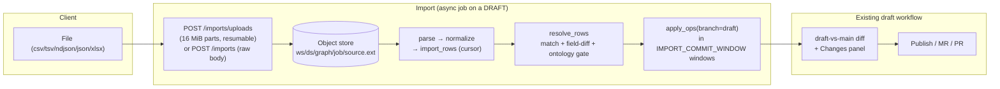

# 08 — Import / Export

> **Audience & scope.** Engineers building or operating bulk data flows into and out of a versioned
> graph, and architects assessing how bulk CRUD stays safe at scale. Covers the import/export
> vertical end to end: the draft-based thesis, the parse→resolve→apply pipeline, identity &
> idempotency, reconcile modes, the tabular column model, format adapters, view-scoped export, the
> object store, and the honest limits. See [`README.md`](README.md) for the glossary and
> [03 — Branching, Commits & Merge](03-branching-commits-merge.md) for the draft/`apply_ops`
> primitives this builds on.

**TL;DR.** Bulk import/export is deliberately **not** a separate write path — it is *the manual
draft flow at scale*. Every import opens (or appends to) the user's working **draft** branch; a
worker parses the file, resolves each row against the draft's composed state, and applies the
changes via the same `apply_ops` the canvas uses. The result is **reviewed and published through the
normal draft diff/PR workflow** — the import/export service never writes `main` itself. Export is
symmetric: it reads a branch's state a page at a time and streams it out as a downloadable,
re-importable file (a backup), lossless enough that an unchanged round-trip resolves to **zero
changes**.

---

## 1. The thesis: bulk = the manual flow at scale

The design goal was that loading 50,000 rows should be **governed exactly like editing one node**:
isolated on a draft, validated against the ontology, previewed, reviewed, and published — never a
privileged side-door that mutates the shared graph directly.

> **Decision.** An import **opens/append s a draft and applies rows via `apply_ops(branch_id=draft)`**,
> then hands off to the existing review/publish/PR flow. `ImportExportService` *never writes `main`*
> (`import_export/service.py:6-7`; `import_worker.py:1-14`). Consequences: repeated imports **stack on
> one draft** like successive manual edits; a bad import is discarded by abandoning the draft; every
> imported change shows up in the same Changes panel and diff as hand edits; and the import worker
> reuses the engine's ontology gate, edge integrity, cascade-delete, and 3-way merge for free.

The vertical is **independent of the aggregation/ingestion worker** — it copies that stateless
worker *pattern* (a `graphver.jobs` row with traceability metadata, resumable phases) but imports
none of it and drives the versioning service instead (`import_worker.py:1-6`).


```mermaid
graph LR
    subgraph Client
      F["File (csv/tsv/ndjson/json/xlsx)"]
    end
    subgraph Import["Import (async job on a DRAFT)"]
      EP["POST /imports/uploads<br/>(16 MiB parts, resumable)<br/>or POST /imports (raw body)"]
      OS[("Object store<br/>ws/ds/graph/job/source.ext")]
      P["parse → normalize<br/>→ import_rows (cursor)"]
      R["resolve_rows<br/>match + field-diff + ontology gate"]
      A["apply_ops(branch=draft)<br/>in IMPORT_COMMIT_WINDOW windows"]
    end
    subgraph Review["Existing draft workflow"]
      D["draft-vs-main diff<br/>+ Changes panel"]
      PUB["Publish / MR / PR"]
    end

    F --> EP --> OS --> P --> R --> A --> D --> PUB

```

> **Invariant.** Imported changes are **committed on the draft, not staged** — the worker calls
> `apply_ops`, which writes version rows and a commit. So the review handoff is the **Changes**
> (committed diff) surface, not the unsaved staged-changes panel. See
> [07 — Frontend Integration](07-frontend-integration.md).

---

## 2. Job model & dispatch

A job is a row in `graphver.jobs` (`job_type ∈ ingest | export`) carrying full traceability —
workspace, data source, provider, graph, the draft `branch_id`, `reconcile_mode`, `import_format`,
`scope_view_id`, `field_scope` (export options / import field allow-list), `source_uri`/`result_uri`
artifact keys, `as_of_seq`, and a `summary` JSON tally (see the `JobORM` definition in
[02 — Data Model](02-data-model.md)). Staging rows live in the plain (non-partitioned) `import_rows`
table, keyed by `job_id` + `row_index`.

**Create.** `ImportExportService.create_import_job` (`service.py:61-106`) opens a fresh `"Import"`
draft via `open_draft` when no `branch_id` is supplied, or **stacks onto an existing draft** when one
is (`service.py:86-88`). It inserts the `JobORM` row and mints a self-describing `source_uri`
(`{ws}/{ds}/{graph}/{job}/source.<fmt>`) for the caller to stream the upload into
(`service.py:102-105`).

**Dispatch.** The endpoint stores the job's inputs (it streams the upload into the object store),
then queues the job with `ImportExportService.start_import` / `start_export` / `start_publish`
(`service.py`): the job stays `pending`, in phase `queued`, and the endpoint reports `pending`. A
job is queued only once its inputs are stored, so no worker takes one whose upload is still
arriving. **The web tier never runs a job.** `GRAPHVER_TRANSFER_INPROCESS` is gone (a process that
still finds it set logs a WARNING); jobs run on the versioning worker's **transfer lane** (§2a), so
a large import or export never shares a web pod's CPU, memory or event loop with requests, and
neither a web restart nor gunicorn's 120 s worker timeout touches it.

**Claim.** Each transfer-lane process runs `GRAPHVER_TRANSFER_SLOTS` (2) jobs at a time, plus one
slot kept for `package_inspect` jobs so an inspection never waits behind a long import. A slot
claims through `job_lease.claim`: one transaction, `FOR UPDATE … SKIP LOCKED`, so a job goes to one
worker however many pods poll. Inspections go first, then the oldest job of a workspace running
fewer than `GRAPHVER_JOBS_PER_WORKSPACE` (2), so one tenant queueing fifty imports does not hold
every slot. The share is soft: with nobody else waiting, that tenant's jobs still run. Every claim
adds one to the job's `retry_count`, its **epoch**, so (job id, epoch) names exactly one owner.

**Lease and fencing.** While a job runs, a heartbeat thread in its process (`LeaseKeeper`) touches
its `updated_at` every `GRAPHVER_INGEST_HEARTBEAT_SECS` (30 s), off the event loop, so a busy
window cannot starve it. Every write a job makes to its own row (a checkpoint, the finish, a
failure) is conditional on (id, epoch, `running`), and a checkpoint commits in the same
transaction as the work it records. A job silent for `GRAPHVER_INGEST_STALE_SECS` (120 s), because
its pod was killed or ran out of memory, is **taken over** by the next claim. If the old owner was
only slow, its next checkpoint is refused, that window rolls back, and its finish does nothing. A
job taken over more than `max_retries` (3) times fails instead ("The worker running this job
stopped 4 times…"), so it can't take a fifth worker down with it.

**Resume.** A job that is taken over or handed back carries on according to its type:

- **Import** resumes from its cursor (`last_cursor`): `parse:<n>` (n rows staged), `node:<row>` /
  `edge:<row>` (windows applied up to that staged row), `replace` (the replace's deletes, run
  again whole). It redoes at most one window, `IMPORT_COMMIT_WINDOW` (10,000) rows
  (`import_worker.py`).
- **Export** starts over and writes to a key of its own attempt (`…/export-e<epoch>.<ext>`), so an
  old owner still writing cannot interleave with it; the finish points `result_uri` at the file of
  the attempt that finished (`export_worker.py`).
- **Publish** is safe to run again: a draft an earlier attempt already merged is not published
  twice, and only what follows a publish runs again (`run_publish`).
- An import staged by a worker from before leases (rows in `import_rows` but no cursor) fails with
  "The job stopped before it finished… Start it again." instead: nothing records how far it got.

**Stop.** A stopping worker (a rollout, a scale-down) takes no more jobs and gives its running
ones `GRAPHVER_DRAIN_SECS` (40) to hand themselves back at a window boundary, `pending` again with
the cursor kept; then it cancels the rest and hands them back too. The manifests allow 60 s for
this (`terminationGracePeriodSeconds`; compose `stop_grace_period`), and the next worker resumes
them.

**Status.** `get_job` is read-only. For a queued job it reports `queuedAhead`, the jobs queued
before it in the same slot, and the dialogs say "Waiting to start… 2 jobs are ahead of it." For
every job it reports `phase`, `progress`, `processed`/`total`, `attempt` (the epoch) and `stale`:
running, but silent past `GRAPHVER_INGEST_STALE_SECS`, so its worker died and another will take it
over. A silent job is no longer reported failed. The transfer lane's `JobReaper` runs every minute
and fails what nothing will run: a job queued past `GRAPHVER_TRANSFER_QUEUE_TIMEOUT_SECS` (6 hours,
meaning no transfer lane is running), and a job whose upload never finished (pending with no phase
for an hour). An export job also takes one of its pod's export turns (`GRAPH_EXPORT_CONCURRENCY`,
2), so raise the two together.

`_run_safe` wraps every run. An exception other than losing the lease marks the job `failed` with
an `error_message`, through the same fenced write, so the failure is durable on the job row and a
superseded worker's failure changes nothing.

The service is wired as a singleton (`get_import_export_service`, `versioning.py:1964-1972`) with two
injected resolvers so the worker stays decoupled from the management DB: a **scope resolver**
(view-scope for scoped export/replace) and an **ontology resolver** (live valid types for the
per-row gate).

### 2a. Where the jobs run: the worker lanes

`python -m backend.app.services.versioning` runs the lanes `GRAPHVER_WORKER_LANES` names
(comma-separated; all three by default, and an unknown name stops it from starting):

| Lane | Runs | Helm and k8s base | Compose |
|---|---|---|---|
| `projection` | FalkorDB projection, idle-draft sweep, the object-store and staged-row sweeps, cache eviction | `versioning-worker`, 1 replica | `versioning-worker` |
| `transfer` | import, export and publish jobs (2 slots), the `package_inspect` slot, `JobReaper` | `versioning-transfer`, HPA 2–8 at 70 % CPU, scale-down after 15 quiet minutes | `versioning-jobs` (`transfer,bootstrap`) |
| `bootstrap` | "Enable version control" jobs (2 slots; at most `GRAPHVER_BOOTSTRAP_PER_PROVIDER`, 2, at once per FalkorDB provider fleet-wide), purges, the undo-window reaper | `versioning-bootstrap`, 2 replicas | `versioning-jobs` |

Every lane pod carries the label `synodic.io/lane`, mounts a 12Gi `emptyDir` as `TMPDIR` for its
spool files, and gets 60 s to stop. Each process sizes its versioned-store pool for its lanes
(`config.lane_pool_size`) unless `GRAPHVER_POOL_SIZE` is set. The lanes must resolve the same object
store and database as the web tier, because the web tier stores an upload and a lane reads it back:

- **Helm:** every lane reads the ConfigMap and Secret viz-service reads; `config.objectStore` sets
  `OBJECT_STORE_*` for both.
- **k8s base:** set `OBJECT_STORE_*` in `common-config`, which both tiers read, never in
  `viz-config` alone.
- **Compose:** the two services share one environment block.

> **Deploy the lanes, or nothing runs.** A deployment without the transfer lane queues imports,
> exports and publishes that never start, and has no `JobReaper` to time them out. System status
> reports the oldest claimable job per lane (`bootstrapJobs.lanes`), so a missing lane shows up
> there as a backlog that only grows. In development, `SYNODIC_ROLE=dev` with
> `GRAPHVER_PROJECTION_INPROCESS=1` runs the lanes inside the API process; on any other role that
> setting is ignored. The quickstart (`docker-compose.quickstart.yml`, SQLite) runs no
> versioning worker, so versioning, and with it these jobs, is not part of the quickstart.

> **Upgrading from the single worker.** Roll it over in one release. Apply the migrations, scale the
> old `versioning-worker` to 0 (on Helm, roll the web tier first, so nothing still runs jobs
> in-process), then start the three lanes. Jobs the old workers left running are taken over once
> they go silent. An import that had already staged rows fails with "Start it again".

---

## 3. The import pipeline (parse → resolve → apply)

`ImportWorker.run` (`import_worker.py:100-116`) executes three phases, all parameters read from the
`JobORM` row.

### 3a. Parse

`_parse` streams the file through the format adapter's `parse`, calls `normalize(raw, kind)` per
record, and stages the rows in `import_rows`, 2,000 at a time (`_PARSE_BATCH`, multi-row INSERTs):
**the whole file is never buffered** (except the formats read whole; see §7). The file is one object,
or a resumable upload's parts read in order as one stream (`uploads.open_source`, §3d). Records whose
`kind` is neither `node` nor `edge` are skipped, never fatal. A JSON array or an Excel workbook larger
than `IMPORT_WHOLE_FILE_MAX_BYTES` (100 MB) is refused, whatever the file was declared as.

Before parsing a non-xlsx file, `_reject_binary` sniffs the first chunk for a ZIP (`PK\x03\x04`) or
OLE (`\xd0\xcf\x11\xe0`) magic and fails fast with a friendly *"this is an Excel workbook — Save As
CSV"* message — a very common mistake that would otherwise parse into garbage rows. xlsx is exempt
(it *is* a PK zip and its adapter reads it natively).

### 3b. Resolve, a window at a time

`_resolve_and_build` works through the staged rows in windows of `IMPORT_COMMIT_WINDOW` (50,000):
**every node window first, then every edge window**, so an edge finds a node any row of the file
creates, even a later one. A window looks up **only what its own rows name** in the draft's composed
state (`snapshot.py`, the export's reader): nodes by `entity_id`, `urn` and `qualifiedName`, the
live edges between its endpoints, and those entities' current payloads. The windows before it are
already applied, so it sees them too. Nothing loads the whole graph or the whole file, so memory
stays flat: 200,000 rows into a draft of a 200,000-node graph peak at about 490 MB, where the
whole-state importer (~4.4 KB per entity) reached 1.4 GB.

Each window goes through `resolve_rows` (`resolve.py`) — a **pure, deterministic** function (the id
minter is injected) that returns `(ops, resolutions)`:

- **Nodes** match an existing entity by **`entity_id` → `urn` → `qualifiedName`** (`_match_node`);
  no match ⇒ mint a new `entity_id` and register it in the window's indexes for later rows.
- **Edges** resolve each endpoint (`entity_id` → `qualifiedName` → `urn`, `_resolve_endpoint`) and
  key on the `(source_eid, target_eid, edge_type)` triple — the same keying `sync_ingest` uses.

The lookups by `qualifiedName`, and replace's check of which entities some row matched, use two
indexes (migration `20260927_1000_import_indexes`).

> **Invariant — partial acceptance.** An unresolvable or ontology-invalid row is **quarantined**
> (`resolved_op = "invalid"` + a human reason), never aborting the batch (`resolve.py:14, 154-164`).
> The tally lands on `job.summary` and the reasons on the `import_rows` row.

### 3c. Apply

Each window's ops are applied to the draft before the next window is resolved, via
`apply_ops(graph_id, ops, actor, branch_id=draft, message="import")`. Each window is one commit on the
draft — so a huge import becomes a sequence of ordinary checkpoints, and the engine's
referential-integrity, edge-integrity, cascade-delete, and ontology gates all apply. The resolutions
are recorded on `import_rows` (`_persist_resolutions`, one `UPDATE … FROM unnest()` per 5,000 rows),
and `job.summary` tallies `{new, updated, unchanged, deleted, invalid}`. A commit's entity heads are
written in bulk too (`_write_deltas`: multi-row INSERTs for the versions, an `unnest()` UPDATE then
INSERT for the heads, keeping the per-entity compare-and-swap), so an import writes about 1,500–2,500
rows a second: six times the row-at-a-time rate.

The versioning worker's sweep deletes the staged rows of imports finished more than
`IMPORT_STAGING_GC_DAYS` (7) ago, a batch at a time. Until then a large import's rows take their
space in Postgres: roughly the file's size again.

### 3d. Resumable uploads

A file of up to `IMPORT_MAX_BYTES` (10 GiB; NDJSON, CSV and TSV, which are read a row at a time)
arrives in parts (`import_export/uploads.py`), since one request that size would outlast every proxy
and timeout on the way, and a dropped connection would start it over:

1. `POST …/imports/uploads` `{fileName, size, format}` → `{uploadId, partBytes, parts}` (16 MiB parts).
   A file too large for its format is refused here (413), before any of it is sent.
2. `PUT …/imports/uploads/{uploadId}/parts/{n}`, the part as the body: several at once, in any order.
   Each is its own write-once object in the store (a bucket mount never appends or renames), and
   must hold exactly its share of the file; sending a part again replaces it.
3. `GET …/imports/uploads/{uploadId}` → `received`: what a resumed upload doesn't send again.
4. `POST …/imports/uploads/{uploadId}/complete?reconcileMode&branchId&viewId` → 202, the import job
   (409 while a part is missing). It reads the parts in order as one file; asking again answers with
   the same job.

The Import dialog sends three parts at a time, retries a part the server failed on (not one it
refused), shows how much is up, and resumes: the same file chosen again (name, size and modification
time) after a failure or a reload sends only the missing parts. An upload is its owner's only, and
its parts are swept with every other artifact after `OBJECT_STORE_TTL_HOURS` (24), so it has a day
to finish. `POST …/imports` (the file as the request body, up to 100 MB) stays for scripts.

---

## 4. Identity & idempotency (a round-trip is a no-op)

The single most important correctness property: **re-importing an unchanged export changes nothing.**
Two mechanisms deliver it.

- **Stable identity, not fragile keys.** Matching prefers the stable `entity_id`, then the mutable
  `urn`, then `qualifiedName` — `qualifiedName` is a *field*, not an identity, so a rename doesn't
  fork the entity. (Glossary: `entity_id` in [`README.md`](README.md).)
- **Type-tolerant, field-level diff.** `_changed_fields` / `_changed_props` (`resolve.py:41-84`)
  compare each provided field against the current stored value with `_scalar_eq`
  (`resolve.py:31-38`), which treats `5 == "5"` and `True == "True"` — essential because CSV
  stringifies everything. `tags` compare as an unordered set. If nothing genuinely changed, the row
  resolves to **`unchanged`** and emits **no op**; an update carries **only the changed fields** (a
  PATCH), never a full-payload replace.

> **Decision — sparse edits scale.** Because matching is by identity and updates are field-level
> patches, a minimal file changes only the rows and columns it contains: absent columns leave fields
> untouched, absent rows leave entities untouched. You can update one property on 1 of 10,000
> entities by importing a one-row, one-column file — this is what makes "edit in Excel, re-import"
> viable at scale.

---

## 5. The tabular column model (each property is its own column)

Import/export uses **one shared flat schema across every format** (`rowmodel.py:1-19`):

| Group | Columns |
|-------|---------|
| **Locked identity** | `entity_id`, `urn`, `baseVersion` (= content hash / OCC token) — greyed/locked, do not edit |
| **Node core** | `entityType`, `displayName`, `qualifiedName`, `description`, `sourceSystem`, `layerAssignment`, `tags` |
| **Edge core** | `edgeType`, `sourceQualifiedName`, `targetQualifiedName`, `source_entity_id`, `target_entity_id`, `confidence` |
| **Properties** | one dynamic **`prop.<name>`** column per property + a `properties_json` **overflow** column |
| **Op** | `_op` — blank/`upsert` (default) or `delete` |

> **Decision — properties are tabular, not a JSON blob.** Every property is its **own `prop.<name>`
> column** (`column_order`, `export_worker.py:51-80`) — like a spreadsheet — so 10–50 properties are
> 10–50 editable columns, not one bulky JSON cell. `properties_json` is demoted to a pure overflow
> column, emitted only for genuinely nested/complex values (`rowmodel.py:121-129`). Export columns
> are the **union** of properties entities actually have **plus** any the ontology defines for the
> present types (`schema_props`) **plus** any the user asked to add — so a defined-but-empty property
> is still a fillable column.

**`normalize`** (`rowmodel.py:83-118`) turns a flat record into a normalized row: **empty cells are
dropped** (a blank means "leave unchanged" — PATCH semantics, `rowmodel.py:90-107`); `tags`/
`confidence` are coerced; and an **unexpected `_op` value** is flagged `invalid` with a
column-shift hint rather than silently swallowed as an upsert (`rowmodel.py:89-98`) — the fix for
the classic "a property value slid into the `_op` slot and my edit vanished" bug.

**Deleting a property** is explicit (an empty cell never deletes). A `\N` / `\NULL` token in a
`prop.<name>` cell, or a `null` in `properties_json`, becomes the **`PROP_DELETE` sentinel**
(`"__nx_prop_delete__"`, `rowmodel.py:60-80`) which flows through the update patch to
`service._patch_payload`, removing the key. The sentinel uses a plain ASCII marker (not a NUL byte,
which Postgres JSONB rejects) and is stripped from `create` payloads, where it is meaningless
(`resolve.py:55-65`).

---

## 6. Reconcile modes: upsert vs replace

| Mode | Absent-entity behavior | Default? |
|------|------------------------|----------|
| **`upsert`** | Never deletes on absence — only creates/updates the rows in the file. | Yes (safe) |
| **`replace`** | The file is the **authoritative snapshot for its scope**: every existing in-scope entity that no file row matched is **deleted**. | Opt-in |

Replace deletes are computed after the file's rows are applied (`_delete_absent`): the draft is
walked a page at a time, and every entity in scope that no row matched (`import_rows.matched_entity_id`)
is deleted, edges first, then nodes (`apply_ops` cascades containment/incident edges). Derived deletes
aren't file rows, so they're counted separately into `summary["deleted"]`.

> **Invariant — scoped replace can't nuke the data source.** For a **view-scoped** replace, only the
> view's own entities are walked: the same rule as export scope (`stream.view_entities`), each
> placement plus its containment descendants (when the placement inherits children), edges in scope
> only when both endpoints are. No scope ⇒ whole graph. Because the review dialog always passes the active `viewId`, a replace from a view is
> view-scoped by default. Whole-DS replace is still available and is guarded by a prominent
> "N entities will be deleted" callout before publish.

Replace is always **reviewed on the draft before publish** — the delete-on-absence set is visible in
the diff, so a mistaken scope is caught before it touches `main`.

---

## 7. Format adapters

A `FormatAdapter` (`formats.py:21-28`) converts one file format ↔ raw column-dict records; the
pipeline, staging, reconcile, and diff never change when a format is added. The registry
(`formats.py:152-158`, resolved by `get_adapter`, `:161-166` — unknown format ⇒ `ValueError` ⇒ HTTP
422) ships five:

| Format | Adapter | Streaming? | Notes |
|--------|---------|-----------|-------|
| `ndjson` | `NdjsonAdapter` | ✅ | One JSON object per line — the canonical large-scale format |
| `csv` / `tsv` | `DelimitedAdapter` | ✅ | Quote-aware via stdlib `csv`; cells must not contain raw newlines (nested values go in `properties_json`) |
| `json` | `JsonAdapter` | Export ✅, import ❌ (read whole) | A single `[{…}]` array — human-scale only for import; the client caps the file at 100 MiB |
| `xlsx` | `XlsxAdapter` (lazy) | Export ✅, import ❌ (read whole) | A real workbook; needs `openpyxl`, registered lazily so a missing lib never breaks the others. Export writes rows into the zip as they come, in flat memory |

**Encoding robustness.** `decode_bytes` (`formats.py:31-42`) strips a UTF-8 BOM (Excel "CSV UTF-8")
and falls back UTF-8 → cp1252 so Windows/Excel exports never crash the import; `_lines`
(`formats.py:58-69`) reassembles lines across byte-chunk boundaries and tolerates CRLF. Content-based
detection on the client (`detectFormat`, `importExportApiService.ts:181-197`) sniffs the first bytes
(PK → xlsx) rather than trusting a possibly-missing extension.

**The xlsx workbook** (`xlsx_adapter.py`) is the strategic fix for flat-CSV column-shift fragility:
separate **Nodes** and **Edges** sheets (kind comes from the *sheet*, not a column, so a stray value
can't shift into `_op`, `:34-40`), greyed **locked identity** columns (`_LOCKED`, `:17, 116-117`),
an `_op` dropdown data-validation (`:124-128`), and an **Instructions** sheet (`:139-161`). Adding a
property is typing under a new `prop.<name>` header — nothing shifts.

---

## 8. Export

An export reads a **snapshot** (`import_export/snapshot.py`): the branch's state as a stack of
layers — `main` at a commit (a fork's `main` sits on its parent's at the fork point), then a draft
at a commit or as it stands now (its `entity_heads`). Each layer is keyset-paged on `entity_id`,
and each page drops the entities a higher layer decides, found with one indexed point lookup per
layer — so every live entity comes out once, a page at a time, with no global sort and no map of
the whole state in memory. `main` is pinned to its head commit when the export starts, so a long
export is one consistent snapshot. `import_export/stream.py` turns each page into records (off the
event loop) and hands them to the format's `write_pages`; spreadsheets take a first pass that keeps
only the records' keys, for their columns. Postgres integration test:
`tests/integration/test_export_stream.py` (identical records to `materialize_state` for main,
as-of, draft, draft as-of and fork, many pages each).

Three ways out, one pipeline:

- **`GET /exports/plan`, then `POST /exports`** — what the Export dialog does for a data source with
  version control. The plan says what the export would hold (counts, emptiness, whether Excel can
  hold it); then the job (`ExportWorker.run`, queued for the workers as §2 describes) writes the
  file to the `result_uri` artifact, up to `GRAPH_EXPORT_MAX_BYTES` (50 GiB). While it runs, its
  heartbeat (every 5 s) keeps its progress in `summary`: this pass's `nodes` and `edges`, the
  `passes` so far (a spreadsheet reads everything once for its columns, then again to write it), and
  the `bytes` written; the finished `{nodes, edges, bytes}` replaces it. Then
  **`GET /exports/{job}/download`** serves the file as a download that resumes: `Content-Length`,
  `Accept-Ranges: bytes`, a strong `ETag` and `Last-Modified`, and the part a `Range` asks for (206;
  an `If-Range` naming another file gets all of it, a range past the end 416). Nothing compresses it
  on the way (gzip would hide its size and move the ranges), and it is exempt from the request
  deadline and from nginx's buffering, like the streams: a download that takes hours at the
  client's pace ties up only a file read on the web pod.
- **`GET /exports/stream`** — the same records, streamed as they are read: nothing is stored, and
  any pod serves it. For scripts; a download that breaks off starts again.
- **`GET /{ws}/graph/export/plan · /stream`** (`import_export/live.py`) — a data source **without**
  version control: the provider's `scan_nodes`/`scan_edges` (FalkorDB: internal-id windows, each
  one `NodeByIdSeek`) into the same rows, with no entity ids, so a re-import matches by URN.

Reading an export job (the list, its status, its download) checks again what creating it checked
(`_check_export_access`): an export of a draft is for that draft's readers, and one of a view for
the view's readers. Any other is a 404, as for a job that doesn't exist, and is left out of the list.

All three take turns (`stream.Slots`). An export keeps about one CPU core busy, so a pod streams
`GRAPH_EXPORT_CONCURRENCY` (2) at once, whichever of its worker processes serve them. A turn is an
exclusive `flock` on one of that many files in the temp directory, which the kernel drops when its
holder exits. Another export waits for a turn, before its response starts, for up to
`GRAPH_EXPORT_SLOT_WAIT_SECS` (15 minutes); then a download gets 429 with `Retry-After`, and a job
fails.

- **Branch vs published.** A `branch_id` (a working draft) exports the draft's **composed state**
  (main + committed + staged draft changes); omitting it defaults to **published `main`**. A draft
  must be readable by the caller. This is what lets a user export their in-progress branch, edit it
  in Excel, and re-import onto the same branch.
- **As-of.** `as_of_seq` gives a point-in-time snapshot: `main` and the draft read at that commit.
- **View-scoped export.** When a `viewId` is given, `stream.view_entities` restricts to the view's
  entity set. The **authoritative source is the view's reference-layout placements** — the explicit
  physical-entity → logical-layer assignments — read by `_view_export_scope` (`versioning.py`): the
  placed entities (entries with a real `layerId`) plus their containment descendants (when
  `inheritsChildren`, the default). A placement key is the entity's URN, or `gv:<entity id>` for a
  node without one, as the canvas writes it. Edges are kept only when **both** endpoints are in
  scope. A view that places nothing exports the whole data source (the plan says so).
- **Row-scoped export.** `stream.Selection` keeps only an explicit `entity_id`/`urn` set and/or
  entity-type set (intersection), composing after view scope.
- **Add-property columns.** `props` emits extra empty `prop.<name>` columns to fill (`:219-222`).

**The options plumbing is consistent end to end** (verified against the current tree): the
`create_export` endpoint declares `props`/`ids`/`types` and passes
`extra_props`/`select_ids`/`select_types` (`versioning.py:2095-2116`) → `create_export_job` packs
them into an `options` dict stored in `field_scope` (`service.py:208-221`) → `run_export` passes
`options=` to `ExportWorker` (`service.py:239`) → the worker reads `options.get("props"/"ids"/"types")`
(`export_worker.py:191-196`).

> **Limitation — the UI exposes a subset.** The **backend** supports `props` + row-scope (`ids` /
> `types`) + view-scope + branch-vs-published + as-of. The **ExportDialog / client service** currently
> send only `format`, `viewId`, `branchId`, and `props` (`importExportApiService.ts:135-151,
> 200-212`) — so **row-scoped export (`ids`/`types`) is API-only today**, not surfaced in the dialog.
> Row-scope is fully wired server-side; surfacing it in the UI is the remaining step. (An earlier
> analysis flagged a `TypeError` in this plumbing; it is **not present in the current code** — the
> three layers' kwargs line up.)

**Lossless round-trip.** `denormalize_node`/`denormalize_edge`
(`rowmodel.py:132-168`) spill scalar props to `prop.*` and nested to `properties_json`, mirroring the
projector's native-vs-`propertiesRaw` split, so an unchanged export re-imports to a zero diff. A
whole-data-source export is therefore a faithful **backup**; the identity columns let a re-import
restore or clone the graph.

---

## 9. Object store & artifacts

All import/export blobs (uploaded source, export result, preview/rejected reports, view packages and
their uploads) are stored under a self-describing `{workspace}/{data_source}/{graph}/{job}/{name}`
key (`storage_key`, `object_store.py:40-42`), attributable to their origin at a glance. Everything
streams at a 1 MiB chunk size, so a 5M-row file is never buffered whole.

**The store is the management database** (`DatabaseObjectStore`, `object_store.py:202-330`; the
default, `OBJECT_STORE_BACKEND=database`). Production runs several API pods with no shared volume,
so an artifact written to one pod's disk was missing on the others: an export download, or a view
package's data import (`/packages/inspect` keeps the upload, `/packages/{uploadId}/data` reads it
back), failed whenever the load balancer sent the next request to another pod. The database is the
one place every pod shares:

- `object_store_objects` has a row per key naming a blob; `object_store_chunks` holds the blob's
  bytes in 1 MiB chunks, in order. A put coalesces whatever sizes arrive into 1 MiB chunks and
  commits every few of them, so a multi-GB artifact never sits in one transaction. Only after the
  last chunk does a single transaction point the key at the new blob and drop the blob it replaced,
  so a reader gets the previous version, whole, until then. A put that fails deletes what it wrote.
- A read fetches one chunk per short query, from any byte offset (`open_stream(start=…)`).
- The versioning worker's daily sweep deletes objects older than `OBJECT_STORE_TTL_HOURS`
  (default 24), and chunks no object names once they are an hour old (a put that died mid-way).

**Or files on a mount.** `OBJECT_STORE_BACKEND=local` keeps the files under `IMPORT_STORE_ROOT`
instead (`LocalFsObjectStore`), which keeps multi-GB files out of the database. Point it at a
directory that every viz-service pod and every versioning lane pod mounts (§2a). The Helm chart and
the k8s base mount none, so add the volume to both tiers:

- a shared volume: a `ReadWriteMany` PersistentVolumeClaim (NFS, Amazon EFS, Filestore);
- a bucket through its FUSE driver: S3 through Mountpoint for Amazon S3 (with `--allow-delete` and
  `--allow-overwrite`), GCS through Cloud Storage FUSE;
- for a single-process development run (`SYNODIC_ROLE=dev`, lanes in-process), the process's own
  disk (the default, `/tmp/synodic-import-store`). No separate worker can read it, compose's
  `versioning-jobs` included.

A file is written once, front to back, and never appended to or renamed, which is all a bucket
mount supports. A write that fails, or whose upload fails when the file closes, deletes what it
wrote, so a reader never takes half a file for the whole one. A path-escape guard rejects keys that
resolve outside the root, and the same sweep deletes files by age.

**Which store.** The database is right for artifacts of up to about 1 GB each. Above that (a large
export, or a view package with a big graph), use `local` on a shared mount or `s3` (below), which
keep multi-GB blobs out of Postgres.

### Optional S3/GCS object store

`OBJECT_STORE_BACKEND=s3` keeps the artifacts in an S3-compatible bucket (`S3ObjectStore`,
`storage/s3_store.py`): Amazon S3, MinIO, or Google Cloud Storage through its XML API. It is **off by
default and nothing depends on it**. The default image doesn't carry its client: install
`backend/requirements-s3.txt` (boto3) in the image of every tier that reads the store, which means
viz-service and every versioning lane (§2a). `get_object_store` refuses a configuration without a
bucket or without boto3, and says which is missing — on first use, not at startup: a misconfigured
pod starts healthy, and every import, export and package route answers 500 until it is fixed.
Unknown backends (`gcs` included: GCS goes through `s3`) still raise `NotImplementedError`. On Helm,
the chart renders only `OBJECT_STORE_BACKEND` and `OBJECT_STORE_TTL_HOURS`, and no shipped image
carries boto3: an `s3` deployment needs images built with `requirements-s3.txt` and the
`OBJECT_STORE_S3_*` variables added by a post-renderer (or a chart of your own).

| Variable | Default | |
|---|---|---|
| `OBJECT_STORE_S3_BUCKET` | none (required) | |
| `OBJECT_STORE_S3_PREFIX` | `synodic-import-store` | Every key goes under it. The daily sweep deletes whatever under it is older than `OBJECT_STORE_TTL_HOURS`, so nothing else may write there. Empty (or `/`) means the default: never the bucket's root. |
| `OBJECT_STORE_S3_ENDPOINT_URL` | Amazon S3 | e.g. `http://minio:9000`, `https://storage.googleapis.com` |
| `OBJECT_STORE_S3_REGION` | boto3's | `auto` for GCS. With `PRESIGN=1` on Amazon S3, the bucket's own region: browsers can't follow S3's region redirect as boto3 does, so a URL signed for another region fails (`AuthorizationQueryParametersError`). |
| `OBJECT_STORE_S3_ADDRESSING` | `auto` | `path` for MinIO, or `virtual` |
| `OBJECT_STORE_S3_PRESIGN` | off | `1`: presigned URLs for browsers (below) |

Credentials come from boto3's own chain: `AWS_ACCESS_KEY_ID`/`AWS_SECRET_ACCESS_KEY`, or an IAM role
(IRSA, an instance profile). It keeps the same `ObjectStore` contract as the other stores
(`tests/test_object_store.py` runs one contract against all three):

- Every bucket call runs in a worker thread, and so does signing a URL in a request (signing may
  first refresh temporary credentials), so the event loop doesn't wait on the bucket. The client is
  built once per process and configuration; with role credentials that first build resolves them
  (an STS or instance-metadata call). Requests use s3v4 signing, 5 standard retries, and checksums
  only where an operation requires one (botocore's default CRC32 checksums are refused by GCS).
- A put of up to 16 MiB is one PutObject (a package part sent through the API is exactly that). A
  larger one is a multipart upload in parts of just over 16 MiB, visible only once complete. The
  chunks are held as they arrive and joined once per part, so a put holds about two parts' worth for
  an instant, then one while the part is sent. A put that fails, or is cancelled, aborts its
  multipart upload, also when cancelled while the upload was being created. One cancelled during its
  last call (the PutObject, or completing the multipart upload) may still land, because that call
  carries on in its thread; an export writes a key per attempt, so a late landing never replaces a
  newer attempt's file. Give the bucket an `AbortIncompleteMultipartUpload` lifecycle rule (1 day)
  for the uploads of a process that was killed before it could abort them.
- A read is one ranged GET (`open_stream(start=…)`), stat is a HeadObject, and a delete is one
  DeleteObject per object (GCS has no multi-object delete). Listings use ListObjects (v1), which both
  APIs serve.
- The sweep and the package-upload prune (`prune_older_than`) list the prefix and delete by
  `LastModified`. Like the other stores, they keep the inputs of jobs that may still read them
  (`jobs_input_prefixes`).

**GCS.** Create an HMAC key for a service account with Storage Object Admin on the bucket (Cloud
Storage → Settings → Interoperability) and set it as `AWS_ACCESS_KEY_ID`/`AWS_SECRET_ACCESS_KEY`,
with `OBJECT_STORE_S3_ENDPOINT_URL=https://storage.googleapis.com` and `OBJECT_STORE_S3_REGION=auto`.

**Presigned URLs** (`OBJECT_STORE_S3_PRESIGN=1`): the bytes move between the browser and the bucket
without passing through an API worker.

- **Package uploads.** While a package upload is `uploading`, `POST /packages/uploads` and
  `GET /packages/uploads/{id}` carry `partUrls`: one presigned PUT per part, signed for that part's
  exact length. The wizard sends each part there as a bare request (no cookies, no CSRF header). A
  part that lands counts in `received` (a HeadObject per part) like one sent through
  `PUT …/parts/{n}`, and completing the upload works as before. A completed upload hands out no
  URLs. A part changed later through an old URL fails its import's checksum; it is never imported
  as something else.
- **How long a URL works.** A part URL is signed for a day and a download for an hour, but no URL
  outlives the credentials that signed it. A role's temporary credentials (IRSA, an instance
  profile, STS) last an hour by default and are renewed shortly before they run out, so a URL may
  stop working about 15 minutes after it was signed. When the bucket refuses a part (403), the
  wizard reads the upload again for freshly signed URLs and sends the part again.
- **Downloads.** A finished export's or package's download (`…/exports/{id}/download`) answers
  `307` with a presigned GET, which carries the file's name. Ranges and resumes go to the bucket.
- The endpoint must be one browsers can reach, not an in-cluster name such as `http://minio:9000`.
  The bucket's CORS must allow this site's origin to `PUT`; no custom header is sent, so no
  `AllowedHeaders` is needed. The redirected download is a navigation and needs no CORS. For S3,
  `aws s3api put-bucket-cors --bucket B --cors-configuration file://cors.json` with:

  ```json
  {"CORSRules": [{"AllowedOrigins": ["https://synodic.example.com"], "AllowedMethods": ["PUT"], "MaxAgeSeconds": 3600}]}
  ```

  For GCS, `gcloud storage buckets update gs://B --cors-file=cors.json` with
  `[{"origin": ["https://synodic.example.com"], "method": ["PUT"], "maxAgeSeconds": 3600}]`. MinIO
  allows every origin by default.
- This site's Content-Security-Policy (`connect-src`) must let the browser reach the bucket too: add
  the bucket's exact origin as the URLs name it to `CSP_CONNECT_SRC` (compose) or
  `frontend.cspConnectSrc` (Helm). That is `https://B.s3.REGION.amazonaws.com` with virtual-host
  addressing, or the endpoint itself with path addressing (`https://storage.googleapis.com`). Only
  `https://` origins are accepted there, so presigning needs an HTTPS endpoint.
- A part the browser can't send to its URL at all (no CSP entry or CORS rule for it) goes through
  `PUT …/parts/{n}` instead, and so does every part after it: a misconfigured bucket slows an upload
  down rather than breaking it.

**Locally.** Set `MINIO_ROOT_USER` and `MINIO_ROOT_PASSWORD` (8+ characters) in `.env`; MinIO has
no default login here. `docker compose --profile s3 up -d minio minio-init` then starts MinIO on
`localhost:9000` with the bucket `synodic`. The compose images don't carry boto3, so run the backend outside them to
use it: `pip install -r backend/requirements-s3.txt`, then set `OBJECT_STORE_BACKEND=s3`,
`OBJECT_STORE_S3_BUCKET=synodic`, `OBJECT_STORE_S3_ENDPOINT_URL=http://localhost:9000`,
`OBJECT_STORE_S3_ADDRESSING=path`, and `AWS_ACCESS_KEY_ID`/`AWS_SECRET_ACCESS_KEY` to that user and password. The opt-in
tests run against it: `OBJECT_STORE_S3_TEST_ENDPOINT=http://localhost:9000 python -m pytest -q
tests/integration/test_s3_store_minio.py tests/test_object_store.py`.

---

## 10. Preview, templates & the dialogs

- **Preview.** `get_preview` (`service.py:124-145`) returns the job summary plus a bounded sample of
  **changed** rows only (`status != "unchanged"`, capped at `PREVIEW_SAMPLE_LIMIT` = 200) with a
  human label per row — a real "T0 · updated / orders · new / row 13 · invalid: <reason>" preview,
  not noise. The **full field-level diff is the draft-vs-main diff** served by the existing
  versioning endpoints ([06 — API Reference](06-api-reference.md)).
- **Starter template.** `GET /imports/template` (`versioning.py:2030-2050`, declared *before*
  `/imports/{job_id}` so the literal path wins) returns a prepopulated file — the column schema plus
  a few real rows from the graph, or worked examples when it's empty (`build_template`,
  `service.py:251-273`).
- **The dialogs** (`frontend/src/features/import-export/{ImportDialog,ExportDialog}.tsx`, client
  service `importExportApiService.ts`): the ImportDialog drag-drops a file, content-detects its
  format, offers upsert/replace (replace warns, and when view-scoped notes only the view's entities
  can be deleted), uploads, polls the job (`pollJob`, `:215-228`), and shows a
  New/Updated/Deleted/Needs-fixing summary + changed-row preview with a "Review changes" handoff to
  the draft's Changes panel. The ExportDialog offers format, branch-vs-published (when on a draft),
  view-vs-whole-DS (when in a view), and "add property columns"; it asks for the plan, then for a
  data source with version control has the server prepare the file (`createExport`, then `getExport`
  polled: its place in the queue, then its progress) and downloads it once ready
  (`downloadExportUrl`), named `.<format>` (`triggerBrowserDownload`). The export being prepared is
  remembered in the browser, so the dialog closed meanwhile opens on it again. A data source without
  version control streams (`exportStreamUrl`). See [07 — Frontend Integration](07-frontend-integration.md).

---

## 11. Limitations & open items (candid)

- **A taken-over export starts over.** An import resumes from its last window and a publish runs
  again safely, but an export rewrites its file from the start under a new key (§2). A job whose
  worker keeps dying fails once it has been taken over more than 3 times.
- **JSON and xlsx imports are read whole** (a JSON array and a zip aren't line-streamable), so they
  stay at 100 MB; NDJSON, CSV and TSV go to 10 GB (§3d). Every format *writes* streaming.
- **A 10 GB import takes hours**: about 1,500–2,500 rows a second (a 10 GB NDJSON file holds ~40M
  rows). It runs on the transfer lane; `get_job` reports its phase and the rows processed.
- **A large import's staged rows take their space in Postgres** until they are swept (§3c).
- **A 50 GB export takes hours to prepare**: one job writes about 10 MB a second as NDJSON, 3.5 as
  CSV (which reads everything twice), on one worker. Nothing splits an export across workers yet,
  or cancels one being prepared; its file is swept a day after it is written.
- **Exports download uncompressed**, so that their size is known and a download resumes: a 50 GB
  CSV is 50 GB on the wire.
- **The S3/GCS store is optional and off by default** (§9): boto3 isn't in the default image.
  Presigned URLs serve package uploads and stored downloads, but not yet a data source's own import
  uploads (`…/imports/uploads`), whose parts still go through the API.
- **Row-scoped export is API-only** — the UI sends only `props` (`importExportApiService.ts:135-151`).
- **`auto_publish` and a custom draft `name`** exist on `JobORM` / `create_import_job`
  (`service.py:75-77`) but the `create_import` endpoint doesn't expose them — imports always flow
  through the manual review/publish path (the draft is named "Import").
- **`idempotency_key` is stored on import/export jobs but not deduped in the workers** — job-level
  idempotency for these paths is a designed follow-up (the ndjson `bulk-ingest`/`sync` paths dedup at
  the service level, separately; see [10 — Authoritative Sources](10-authoritative-sources-datahub-openmetadata.md)).
- **`INLINE_IMPORT_MAX` (5,000) two-tier threshold** exists in config as the intended
  "stage small imports client-side, run large ones async" split, but the endpoint currently always
  dispatches the async worker.

---

## Related chapters

- [03 — Branching, Commits & Merge](03-branching-commits-merge.md) — `apply_ops`, drafts, cascade
  delete, `_patch_payload` (where `PROP_DELETE` lands), and the 3-way merge imports inherit.
- [05 — Ontology Governance](05-ontology-governance.md) — the commit-boundary gate the per-row
  ontology check complements.
- [06 — API Reference](06-api-reference.md) — the import/export REST routes, auth, and the
  draft-vs-main diff that is the full import preview.
- [07 — Frontend Integration](07-frontend-integration.md) — the Import/Export dialogs and the
  committed-changes review handoff.
- [09 — Scale, Limits & Roadmap](09-scale-limits-and-roadmap.md) — the async-dispatcher, streaming,
  and retention roadmap.
