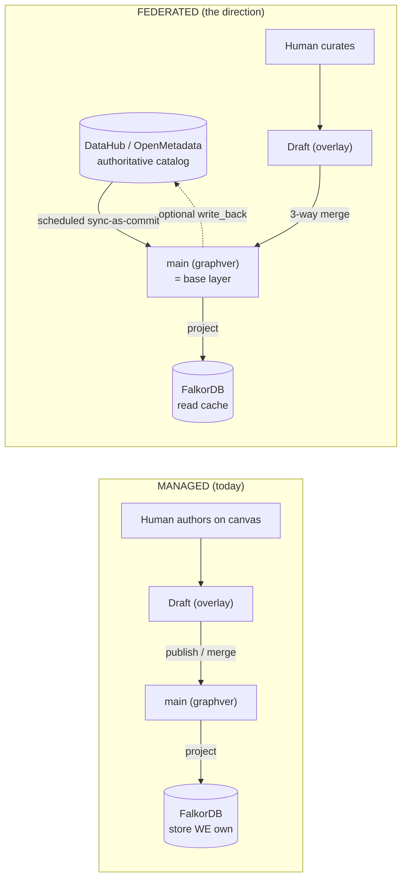
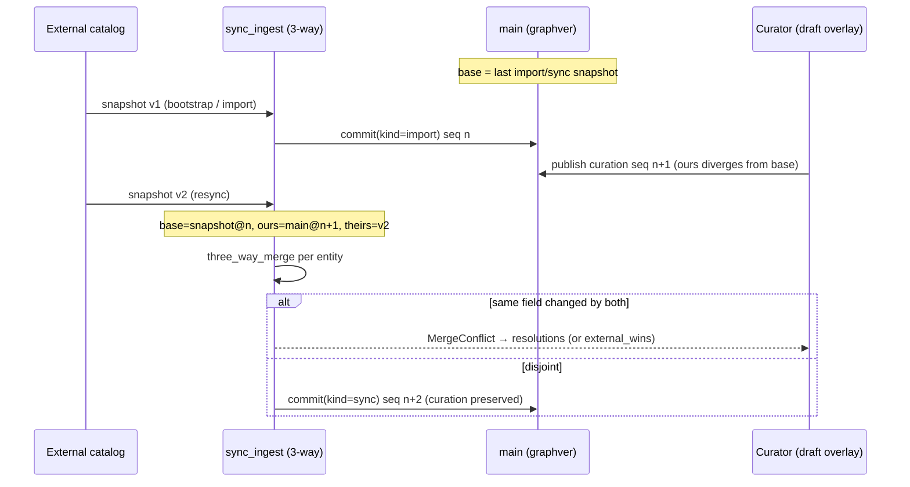

# 10 — Authoritative Sources: DataHub / OpenMetadata

> **Audience & scope.** Architects and backend engineers planning integration with external
> metadata catalogs. This is a **forward-looking design chapter**: it separates *what exists in the
> code today* (the seam) from *what connecting DataHub / OpenMetadata would add* (labeled as
> proposals). See [README](README.md) for the glossary and [03 — Branching, Commits &
> Merge](03-branching-commits-merge.md) for the 3-way merge this chapter leans on.

**TL;DR — how is it different with an authoritative source?** Today most versioned graphs are
**managed**: humans *author* the graph directly on the canvas and we own the FalkorDB store
end-to-end. When you connect an **authoritative** external catalog (DataHub, OpenMetadata), the
external system becomes the **base layer** — the graph is periodically **re-synced from it as
commits** — and human curation moves to an **overlay** of drafts merged *on top* via 3-way merge.
The key property, already implemented: **an authoritative re-sync never clobbers a human edit** — a
field the source and a user both changed *conflicts* (or the source wins only if you say
`external_wins`). The seam for this — provider capabilities, `source_mode`, graph `kind`, the
`sync_ingest` merge path, and external-type mapping — is **built**; DataHub-specific scheduling,
write-back, and an OpenMetadata connector are **not yet wired**.

---

## 1. Two source models: managed vs federated

Every versioned graph is 1:1 with a **data source**, and a data source has a `source_mode`
(`backend/app/db/models.py:502`):

```python
source_mode = Column(Text, nullable=True)   # "managed" | "federated"   (NULL ⇒ derive from provider capability)
write_back_enabled = Column(Boolean, nullable=False, default=False)      # federated opt-in: push overlay edits upstream
```

- **Managed** — we own the backing store end-to-end (FalkorDB today). Writes persist there; the
  versioned graph *is* the system of record; humans author the base directly. This is the default
  and the well-trodden path in this codebase.
- **Federated** — the data source is an **externally-owned catalog** we present a *view* of (DataHub,
  and by design OpenMetadata). The external system is authoritative for the base graph; we hold
  human curation as an overlay and can optionally push it back (`write_back_enabled`).

`NULL` means "derive from the provider's capability" (see §2). The migration that introduced these
columns states their purpose directly — they *"drive write routing in the layered base/overlay
versioning model"* (`backend/alembic/versions/20260603_1400_ds_source_mode.py`).

> **Decision.** The managed/federated split is expressed as **data-source metadata plus a provider
> capability**, not as a separate code path per catalog. A federated catalog is "just another
> provider" that happens to be read-only and external — so the same draft/merge/publish machinery
> applies to curation regardless of where the base graph originates.



---

## 2. The seam that already exists

### 2.1 Provider capability kernel

The shared kernel classifies every provider type by what the system may do with its store
(`backend/common/interfaces/provider.py:50`):

```python
@dataclass(frozen=True)
class ProviderCapability:
    writable: bool       # writes can be persisted to this store at all
    full_crud: bool      # supports edge update/delete (not just create)
    is_external: bool    # an externally-owned catalog (federated) vs a store we manage end-to-end
    supports_copy: bool  # a fast server-side graph copy is available
```

The registry (`provider.py:69`) already places DataHub on the federated side, and defaults anything
unknown to read-only/external:

| provider_type | writable | full_crud | is_external | supports_copy | Implication |
|---|---|---|---|---|---|
| `falkordb` | ✓ | ✓ | ✗ | ✓ | managed, per-branch copy possible |
| `spanner` | ✓ | ✓ | ✗ | ✗ | managed |
| `neo4j` | ✓ | ✗ | ✗ | ✗ | managed, create-only edges |
| **`datahub`** | **✗** | **✗** | **✓** | **✗** | **federated (read-only external)** |
| `mock` | ✓ | ✓ | ✗ | ✗ | test |
| *(unknown)* | ✗ | ✗ | ✓ | ✗ | `_DEFAULT_CAPABILITY` — safe: treat as federated view |

`capability_for(provider_type)` (`provider.py:82`) returns the row or the read-only/external default —
so a not-yet-registered catalog (e.g. **OpenMetadata**) is automatically treated as a federated,
never-written store until a connector says otherwise.

> **Design default.** Unknown providers resolve to `writable=False, is_external=True` — the *intended*
> default is to treat an unrecognized store as a read-only federated view. **Caveat:** `capability_for`
> is currently **defined and unit-tested** (`test_provider_capability.py`) but **not yet consulted by
> production write-routing** — no code path calls it to gate writes, and `source_mode` /
> `write_back_enabled` are likewise defined-but-unread. Today, write-safety for a federated source
> comes from its connector being read-only (e.g. the DataHub GraphQL provider), not from a capability
> gate. Wiring capability / `source_mode` into write-routing is part of the federation work (§4).

### 2.2 A DataHub read connector already exists

DataHub is not hypothetical: `DataHubGraphQLProvider` is registered in the provider factory
(`backend/app/providers/manager.py:786`, also `backend/app/registry/provider_registry.py:331`):

```python
elif ptype == "datahub":
    from backend.graph.adapters.datahub_provider import DataHubGraphQLProvider
    return DataHubGraphQLProvider(base_url=host or "", token=creds.get("token"))
```

It is a **read-only GraphQL** connector. Because the versioning re-sync path pages *any*
`GraphDataProvider` generically (§3), a DataHub-backed data source can already be fed through it —
the connector is the read half; the versioning half is provider-agnostic.

> **Not yet built.** **OpenMetadata** has no `provider_type` branch and no adapter. Integrating it
> means (a) implementing an OpenMetadata `GraphDataProvider` and (b) registering a `provider_type`
> in the factory. Until then it resolves to `_DEFAULT_CAPABILITY` (read-only/external).

### 2.3 Graph `kind` records provenance

A versioned graph carries `kind ∈ manual | authoritative | hybrid | blank`
(`backend/app/services/versioning/models.py`, `ck_graphs_kind`). It is **descriptive metadata** —
the write path does not branch on it (only on fork lineage and `ontology_enforcement`) — but it is
the intended place to distinguish a human-authored graph (`manual`) from one seeded/refreshed from an
external SoR (`authoritative`) or both (`hybrid`). See [02 — Data Model](02-data-model.md).

---

## 3. Authoritative re-sync as commits (the mechanism, built today)

This is the heart of federation, and it already works for the managed→authoritative transition: an
external snapshot is **merged into `main` as a single `sync` commit that preserves human edits**.

### 3.1 Day-0 seed vs ongoing re-sync

| Operation | Method | Commit kind | Semantics |
|---|---|---|---|
| **Enable / bootstrap** (first seed) | `enable_versioning` → `bulk_ingest` (`service.py:3644`); endpoint `POST /graph/bootstrap` (`endpoints/graph.py:105`) | `import` | Snapshot the provider's full state into a fresh graph in **one atomic transaction**; idempotent; provider reads happen outside the txn. `bootstrap_versioned_graph` is idempotent on `bootstrap:{graph_id}` (`providers/versioned_bootstrap.py:50`). |
| **Re-sync** (ongoing) | `resync_from_provider` (`service.py:3741`) → `sync_ingest` (`service.py:3761`); endpoint `POST /graph/resync` (`endpoints/graph.py:128`) | `sync` | Re-read the provider's **current** snapshot and 3-way-merge it into `main`. On-demand today. |

`resync_from_provider` is deliberately **provider-agnostic**: it pages the provider's full node+edge
snapshot via `collect_provider_rows(provider)` (`providers/versioned_bootstrap.py:20`) — pure
`GraphDataProvider` reads, *outside* the transaction — and feeds the rows to `sync_ingest`. Any
provider that implements the read interface (including `DataHubGraphQLProvider`) flows through it
unchanged (`service.py:3754-3759`).

### 3.2 The 3-way merge that protects human curation

`sync_ingest` (`service.py:3761`) frames the sync as a 3-way merge (same engine as draft publish —
see [03](03-branching-commits-merge.md)):

- **base** = the previous `import`/`sync` snapshot (the last authoritative state we recorded),
  reconstructed via `_state_as_of` at the last import/sync `commit_seq` (`service.py:3791-3795`).
- **ours** = current `main` — i.e. the human edits accumulated since the last sync (`service.py:3796`).
- **theirs** = the incoming external snapshot, parsed by `_external_state` (`service.py:3856`).

Per entity, `three_way_merge(base, ours, theirs, set_fields)` runs (`service.py:3807`):

- A field only the source changed → the source value is taken.
- A field only the user changed → the **user's edit survives**.
- A field **both** changed → a **conflict** under `strategy="merge"` (raise `MergeConflict`; resubmit
  with `resolutions`), **or** the external value wins under `strategy="external_wins"`
  (`service.py:3808-3810`).

> **Invariant (no-clobber).** An authoritative re-sync **cannot silently overwrite a human edit**.
> Divergent same-field changes conflict; the operator chooses `merge` (curator resolves) or
> `external_wins` (source of record wins) — explicitly, per sync.

The snapshot is **authoritative about existence**, too: an entity the external snapshot *drops* is
deleted from `main` **if the user hadn't touched it** — this falls out of `net_delta(ours, merged)`
after `_cascade_containment` + `_cascade_incident_edges` + `_assert_referential_integrity`
(`service.py:3820-3824`). The whole thing lands as **one `sync` commit**, idempotent on
`idempotency_key`, and advances the projection target so FalkorDB refreshes (`service.py:3836-3851`).

### 3.3 Identity matching across syncs — `_external_state`

To make a re-sync *update in place* rather than duplicate, `_external_state` (`service.py:3856`)
matches each incoming row to an existing `main` entity:

- **Nodes** by `urn` (`service.py:3868-3869, 3881`).
- **Edges** by the `(sourceEntityId, targetEntityId, edgeType)` triple (`service.py:3867, 3904`).
- New external entities get a **stable synthesized id** (`sync:{urn}` for nodes,
  `sync:e:{src}->{tgt}:{type}` for edges) so the *next* sync re-matches them (`service.py:3882, 3905`).
- Rows missing required fields are **rejected**, not fatal (`service.py:3877-3878, 3896-3897`).

> **Limitation.** Identity hinges on a **stable external `urn`** for nodes and stable endpoints for
> edges. If the authoritative source renames a urn or re-keys endpoints between syncs, the match is
> lost and the entity looks new-and-deleted (a delete + create), not a rename. Durable external-id
> mapping (below) is the mitigation and is an open item for real DataHub/OpenMetadata volume.



---

## 4. What connecting DataHub / OpenMetadata entails

The re-sync engine is generic; a full authoritative integration adds the pieces around it. What is
**built** vs **proposed**:

| Piece | Status | Notes |
|---|---|---|
| Read connector (`GraphDataProvider`) | **Built for DataHub** (`manager.py:786`), **absent for OpenMetadata** | OpenMetadata needs an adapter + a `provider_type` branch. |
| Provider capability classification | **Defined + unit-tested; not yet consulted by write-routing** (`provider.py:69`) | DataHub already `is_external=True, writable=False`; no production code calls `capability_for` yet. |
| Federated `source_mode` on the data source | **Built (column + CHECK)** (`models.py:502`) | Set it to `federated` for a catalog-backed source. |
| Seed + re-sync as commits | **Built** (`bulk_ingest` / `sync_ingest`, endpoints `/bootstrap` `/resync`) | Works over any provider. |
| Curation-as-overlay (drafts on top, preserved across syncs) | **Built** (draft/merge machinery + no-clobber 3-way) | The whole [03](03-branching-commits-merge.md) lifecycle applies unchanged. |
| External type → ontology type mapping + drift | **Built** (`OntologySourceMappingORM`, §5) | Purpose-built for DataHub (see its docstring). |
| **Scheduled** periodic re-sync | **Proposed** | `/resync` is **on-demand** today. A scheduler would reuse the existing `jobs` table + projection worker cadence (the data source already carries `aggregation_schedule` / `polling_config` for adjacent concerns). |
| **Write-back** (push overlay edits upstream) | **Proposed — column only** | `write_back_enabled` exists but **nothing reads it** (no upstream-push code path anywhere in `backend/app`). Requires a write-capable connector + a mutation-mapping layer. |
| Provenance of external vs curated fields | **Proposed** | Payloads don't tag field origin (see §6). |

> **Proposal (recommended integration shape).** For a federated catalog: (1) implement/enable the
> connector and set the data source `provider_type` + `source_mode="federated"`; (2)
> `POST /graph/bootstrap` for the day-0 seed (`kind="authoritative"`); (3) schedule
> `resync_from_provider` on a cadence (a new job type on the existing worker) so the base layer stays
> current; (4) let curators work in **drafts** (overlays) that the no-clobber 3-way preserves across
> every re-sync; (5) *optionally* wire `write_back_enabled` to push published curation upstream where
> the connector is write-capable.

> **Limitation (`source_mode` not yet enforced).** `source_mode` is recorded (blank-model creation
> sets it to `"managed"`, `endpoints/versioning.py:1117`) but **no write-path code currently reads it
> to gate routing** — the managed/federated distinction is descriptive today. Enforcing "federated
> base is read-only except via sync; human writes only as overlay" is the wiring a real federation
> milestone must add.

---

## 5. Ontology mapping & schema drift

External catalogs speak their own type vocabulary; the graph speaks the assigned **ontology**'s.
`OntologySourceMappingORM` (`backend/app/db/models.py:383`) bridges them — and its docstring names
DataHub explicitly:

> *"When a DataHub asset arrives with type `DATASET` from platform `snowflake`, the mapping profile
> for that data source translates it to the Synodic entity type `dataset` before writing to the
> graph."*

It stores, per data source:

- `entity_type_mappings` / `relationship_type_mappings` — JSON `{ external_label → ontology_type_id }`
  (`models.py:401-403`).
- **Drift detection** — `last_seen_schema_hash`, `last_seen_at`, `has_drift`, `drift_details`
  (`models.py:407-411`): when the external schema grows a type with no mapping, drift is flagged so an
  operator can extend the profile before it silently drops or mis-types assets.
- An **extension point** noted in-code for *"conditional aliasing/ignore rules when
  DataHub/OpenMetadata ingestion needs source-context-aware mappings beyond simple label→type maps"*
  (`models.py:404-405`).

This matters because the versioned write path enforces the ontology at the commit boundary
([05 — Ontology Governance](05-ontology-governance.md)). A federated sync must map external types
**before** `sync_ingest`, or strict enforcement would reject the commit. (Note: `bulk_ingest` and
`sync_ingest` are themselves **exempt** from the strict rich-ontology gate — re-sync must not break —
so mapping is about *correctness of types*, not passing the gate.)

---

## 6. Non-goals & open questions

> **Limitation.** These are unresolved and should be settled before a production federation rollout:

- **Bidirectional sync semantics.** `write_back_enabled` is a flag with no implementation. Real
  write-back needs: which fields are pushable, conflict handling when upstream also changed, and a
  write-capable connector (DataHub's GraphQL connector is read-only today). Until then, federation is
  **read-down + curate-locally**.
- **External-id identity mapping.** Matching is by `urn` / endpoint-triple (§3.3). Large catalogs
  need a durable `{external_id → entity_id}` map so renames/re-keys are updates, not delete+create.
- **Provenance of fields.** A node's payload doesn't record *which fields came from the source vs a
  human*. The 3-way merge preserves edits, but the UI can't yet render "this owner was set by a
  curator; this schema came from DataHub." A field-origin/provenance model is a design gap.
- **Ontology enforcement on federated writes.** Sync is exempt from strict rich enforcement; overlay
  drafts are not. The policy for a federated source whose *external* types violate the assigned
  ontology (map? quarantine? relax enforcement?) needs a decision — see [05](05-ontology-governance.md).
- **Scheduling & scale.** On-demand `/resync` re-reads the *full* snapshot and 3-way-merges the whole
  state (`_state_as_of` over both sides) — see the scale caveats in
  [09 — Scale, Limits & Roadmap](09-scale-limits-and-roadmap.md). A high-frequency, large-catalog
  federation wants incremental/delta sync, not full-snapshot re-merge.

---

## Related chapters

- [01 — Overview & Architecture](01-overview-and-architecture.md) — the managed base⊕overlay model.
- [03 — Branching, Commits & Merge](03-branching-commits-merge.md) — the 3-way merge and `sync`
  commit mechanics `sync_ingest` reuses.
- [05 — Ontology Governance](05-ontology-governance.md) — commit-boundary enforcement and the
  bulk/sync exemptions.
- [09 — Scale, Limits & Roadmap](09-scale-limits-and-roadmap.md) — full-snapshot re-sync cost and the
  path to incremental federation.
- [`../DATA_ARCHITECTURE.md`](../DATA_ARCHITECTURE.md) — providers, `ontology_source_mappings`, and
  the surrounding catalog model.
