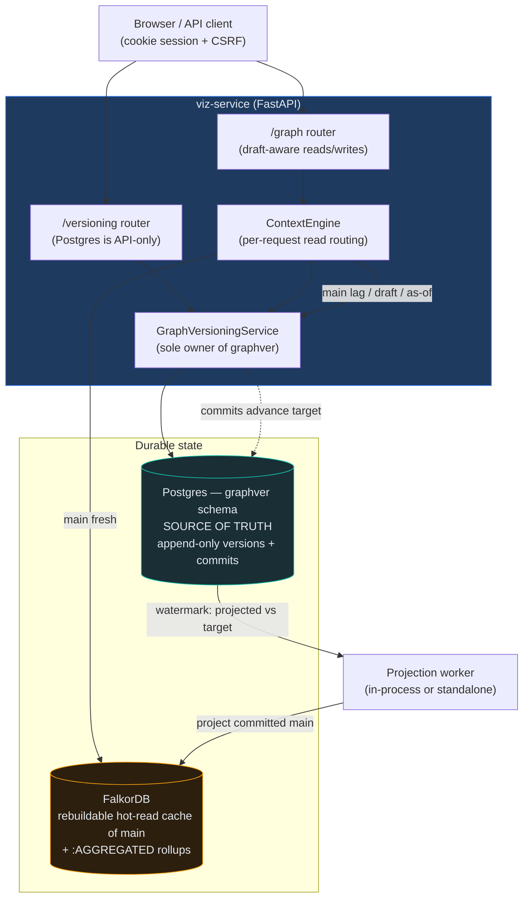

# The Versioned Graph — Engineering Documentation

> **Git for graphs.** A collaborative versioning layer over property graphs: per-user **drafts**,
> per-entity **history**, an **audit trail** of who-changed-what, **3-way field-level merge**,
> **squash-publish** to a shared `main`, copy-on-write **forks**, **pull requests**, and
> **ontology-governed** writes — over a store designed for **millions of entities** with **no data
> loss**. Postgres is the source of truth; FalkorDB is a rebuildable hot-read cache.

This suite is the canonical reference for the Versioned Graph subsystem. It is written for **two
audiences at once**: engineers extending or operating the system (implementation detail, invariants,
`file:line` anchors, how-to-extend) and architects/evaluators (concepts, design decisions,
trade-offs, the scale story, and the federation direction). Every non-obvious claim cites the code.

---

## Why this exists

The platform lets users **explore and curate** a metadata/lineage graph. Curation is a write, and
enterprise curation needs the same guarantees code does: isolation while you work, review before it
ships, a full audit trail, and the ability to undo. So the graph got a version-control layer modeled
on Git — but adapted to a **property graph** (nodes + typed edges + a containment hierarchy) governed
by an **ontology**, and to a **read cache** (FalkorDB) that must stay a faithful, rebuildable
projection of committed truth.

## What it is, in one picture

**The two invariants everything rests on:** (1) **Postgres is truth, FalkorDB is derived** — the
cache can be dropped and rebuilt from Postgres at any time; (2) **a draft opened off `main` reads
*identically* to `main`** — every node, edge, and rollup — until it changes something, then *only*
the changed entities differ (the "draft = main ⊕ sparse delta" overlay).

---

## Read this suite in order (or jump by need)

| # | Chapter | What's inside | Start here if you… |
|---|---------|---------------|--------------------|
| — | [README](README.md) | Index, glossary, scale snapshot, branch-changes map | are new to the system |
| 01 | [Overview & Architecture](01-overview-and-architecture.md) | The thesis, component map, read-routing, deployment topology, headline design decisions | want the big picture |
| 02 | [Data Model](02-data-model.md) | The `graphver` Postgres schema — every table, append-only + head-pointer discipline, partitioning, hashing, the op model | are touching the store |
| 03 | [Branching, Commits & Merge](03-branching-commits-merge.md) | The git-like lifecycle: drafts, stage→checkpoint→publish, 3-way merge, fork/PR, rebase, revert, concurrency | want to understand the engine |
| 04 | [Projection & Cache](04-projection-and-cache.md) | The FalkorDB projector, watermark & staleness, verify/self-heal, `:AGGREGATED` rollups, provider routing, eviction | operate the read cache |
| 05 | [Ontology Governance](05-ontology-governance.md) | Commit-boundary enforcement, edge integrity, strict vs permissive, rule injection | work on ontology/validation |
| 06 | [API Reference](06-api-reference.md) | Auth/RBAC/tenancy, the full REST catalog, the draft-aware graph plane | integrate over HTTP |
| 07 | [Frontend Integration](07-frontend-integration.md) | Branch identity, Edit→draft, staged-changes→save, diff overlay, the bar & panels, PR flow | work on the canvas/UI |
| 08 | [Import / Export](08-import-export.md) | Bulk CRUD as "manual flow at scale": drafts, resolve/reconcile, tabular columns, formats, view-scope | build bulk data flows |
| 09 | [Scale, Limits & Roadmap](09-scale-limits-and-roadmap.md) | Measured wins, O(graph) hotspots, dormant machinery, honest gaps, roadmap | assess production-readiness |
| 10 | [Authoritative Sources — DataHub / OpenMetadata](10-authoritative-sources-datahub-openmetadata.md) | Managed vs federated, the existing seam, sync-as-commit, curation-as-overlay | plan external-catalog integration |

**Suggested paths.** *Architect / evaluator:* 01 → 03 → 09 → 10. *Backend engineer:* 02 → 03 → 04
→ 05. *Frontend engineer:* 01 → 07 → 06. *Operator / SRE:* 04 → 09.

**Related, kept as focused deep-dives (not replaced by this suite):**
- [`../VERSIONING_E2E.md`](../VERSIONING_E2E.md) — end-to-end run/test guide + smoke script.
- [`../VERSIONING_DRAFTS_LINEAGE_AND_MERGE.md`](../VERSIONING_DRAFTS_LINEAGE_AND_MERGE.md) —
  engineering memory of the draft-overlay design and the merge-time data-loss root-cause + repair.
- [`../DATA_ARCHITECTURE.md`](../DATA_ARCHITECTURE.md) — the surrounding stack (providers, ontologies,
  views, aggregation) this layer sits within.

---

## Glossary

*Shared vocabulary — used consistently across every chapter.*

| Term | Meaning |
|------|---------|
| **`graphver`** | The dedicated Postgres schema that is the **source of truth** for versioned graphs. Decoupled: can live on its own database (`GRAPHVER_DB_URL`). |
| **Graph** | A versioned graph, **1:1 with a data source**. `kind ∈ manual \| authoritative \| hybrid \| blank`. |
| **Branch** | `main` (the shared published timeline), a **draft** (isolated editing branch), or a **fork_draft**. |
| **Draft** | A per-user (optionally **shared**) editing branch off `main`. Scoped to a **view** via `originating_view_id` ("branch-per-view"). |
| **`working_changes`** | The durable staging buffer — client edits land here before a checkpoint folds them into version rows. |
| **Checkpoint** | Folding a draft's staged changes into append-only version rows + one commit. |
| **Commit** | An append-only, per-branch record. `kind ∈ genesis \| edit \| checkpoint \| squash_publish \| import \| sync \| revert`. Monotonic `commit_seq` per branch. |
| **Publish** | **Squash-publish** a draft into `main` as one `squash_publish` commit (auto-rebases if `main` moved and it's clean). |
| **Merge Request (MR)** | A **reviewed** draft→`main` publish (approval/checks gate). Stored in `merge_requests`. |
| **Pull Request (PR)** | A fork→base merge proposal. Same table; "PR" and "fork PR" are used interchangeably. |
| **Fork** | A **copy-on-write** clone of a graph — no rows copied; reads compose from the parent at the fork point. |
| **Rebase / Pull-latest** | Merge current `main` into an open draft (3-way), so it's up to date before publish/merge. |
| **Revert** | Apply the inverse of a published `main` commit as a new `revert` commit (audited, conflict-guarded). |
| **Entity head** | The mutable pointer (`entity_heads`) to the latest version row per `(graph, branch, entity)`. Keeps version tables strictly append-only. |
| **`entity_id`** | A stable ULID identifying an entity across renames (the `urn` is a mutable field, **not** the identity). |
| **Op** | A `create \| update \| delete` on a `node \| edge`. `update` is a **field-level PATCH**, not a wholesale replace. |
| **Projection** | Writing committed `main` into FalkorDB (the **projector**). Idempotent (MERGE/DELETE), watermark-after-apply. |
| **Watermark** | `projection_state.projected_commit_seq` vs `target_commit_seq`. **`fresh` = projected ≥ committed**. |
| **Rollup / `:AGGREGATED`** | Materialized coarse-grained lineage edges (column→table, etc.) maintained incrementally in FalkorDB. |
| **Overlay** | `DraftOverlayProvider` — serves a draft as **main ⊕ sparse delta**; an empty delta ⇒ a pure pass-through (draft ≡ main). |
| **Merkle** | A copy-on-write, content-addressed trie over entity content hashes, enabling O(changed) diff/history and integrity roots. |
| **OCC** | Optimistic concurrency — `base_content_hash` / `base_version` tokens turn a stale same-field edit into a conflict, not a silent overwrite. |
| **Managed vs Federated** | Data-source `source_mode`. **Managed** = we own the store end-to-end (writable). **Federated** = an external catalog we present a view of (e.g. DataHub). |
| **Ontology enforcement** | `strict \| permissive`. Strict gates writes at the commit boundary against the assigned, published ontology's rich rules. |

---

## Status & scale snapshot (as of branch `claude/affectionate-fermi-ii373`)

- **Store.** `graphver` Postgres schema: 6 high-cardinality **append-only** tables
  (`commits`, `node_versions`, `edge_versions`, `entity_heads`, `merkle_nodes`, `working_changes`)
  **HASH-partitioned on `graph_id`** into 64 partitions; control-plane tables (`graphs`, `branches`,
  `branch_members`, `merge_requests`, `projection_state`, `jobs`, `import_rows`) unpartitioned.
- **Hashing.** Content + Merkle hashing is **blake2b** (32-byte), length-prefixed; Merkle trie depth
  **4** (16⁴ = 65,536 leaf buckets). Both are **immutable-after-data**.
- **Code footprint.** `GraphVersioningService` ≈ **5,056** lines; the REST surface ≈ **2,562**;
  the projector ≈ **941**; plus the provider layer, import/export vertical, and a
  `frontend/src/features/versioning/` module. Covered by ~**60** backend integration test files.
- **Read routing.** `main` fresh → live **FalkorDB**; `main` lagging (just after a merge) → Postgres
  composition (read-your-writes); a **draft** → `DraftOverlayProvider`; **as-of** / historical →
  Postgres snapshot.
- **Deployment.** The projection worker runs **in-process** (`GRAPHVER_PROJECTION_INPROCESS=1`, set in
  the dev compose) or as a **standalone** process (`python -m backend.app.services.versioning`). The
  browser never touches Postgres directly — everything is API-only.
- **External sources.** Today graphs are predominantly **managed** (FalkorDB-backed, human-authored).
  **DataHub / OpenMetadata federation is designed-in** — the provider-capability seam, `source_mode`,
  graph `kind`, and authoritative `sync_ingest` all exist — **but not yet wired to those connectors**
  (see chapter 10).

> **Honesty note.** This subsystem is feature-complete and test-covered for the managed,
> single-node case, with several deliberately deferred scale items (checkpoint Merkle CoW,
> keyset-streaming full seed, a real async import dispatcher, GC/retention) and a handful of known
> gaps. Chapter 09 is the consolidated, candid list — read it before making production commitments.

---

## Since this suite was written (2026-07-13)

Four capabilities landed that the chapters below predate. Until they are folded in, the
canonical reference for each is **[`../VERSIONING_E2E.md`](../VERSIONING_E2E.md)** (endpoint
tables + semantics) and the code:

1. **Rollback is a product feature, not just a service method.** `revert_commit` (undo one
   commit, conflict-guarded) is joined by **`restore_to_commit`** — reset `main` to its state at
   any commit as ONE new `restore` commit. A restore overrides everything after its target, so
   it *cannot* conflict: it is the escape hatch when a revert is blocked. Both write new commits
   (history is never rewritten) and both are reachable from the UI — the history timeline's
   per-revision menu, and "Revert this merge" on a merged PR.
   → `service.py::restore_to_commit` / `restore_preview`, migration `20260713_1200_restore_kind`.
2. **"Enable version control" is an async, resumable, integrity-validated job**, not an inline
   request. ID-range windows + per-window transactions (memory is O(window), not O(graph)),
   deterministic version ids so a replayed window is a no-op, and the import stays **invisible
   until validated** (head parked at genesis). Finalize **fast-forwards** the projection rather
   than reseeding the graph it just copied. → `services/versioning/bootstrap_worker.py`.
3. **A `versioningEnabled` admin flag** gates every mutating versioning route (403
   `feature_disabled`) and hides the whole UI surface; reads and workers keep running, and
   nothing is deleted. → `api/v1/versioning_gate.py`, `frontend/src/store/features.ts`.
4. **What "the graph" means is now explicit.** The copy contains exactly what the application
   can see: the reader ignores nodes without a `urn` and edges whose endpoints have none, so
   those are counted and disclosed in the integrity report rather than silently dropped (the
   old bootstrap's behaviour). Derived artifacts (`:AGGREGATED`, `_GVRollupMeta`, `_AggMeta`,
   `_Projection`) are never imported.

Chapter 09's "keyset-streaming full seed" item is now **half-done**: the *bootstrap* streams;
the *projector's* full reseed (`_compute_changes` at `from_seq<=0`) still materializes state in
memory — bootstrap simply never triggers it.

---

## Branch-changes coverage map

The versioning subsystem was built incrementally across ~230 commits on
`claude/affectionate-fermi-ii373`. This maps the major themes to the chapter that documents them, so
"everything on this branch" is traceable. (Adjacent, non-versioning branch work — application
branding/white-label, SSO, the insights-service internals, the RBAC editor — is **out of scope**
except where it intersects versioning.)

| Theme (representative commits) | Documented in |
|-------------------------------|---------------|
| Foundation P1–P13: pure core, `graphver` schema, write path, fork→PR→merge, projection worker | 02, 03, 04 |
| HTTP API boundary, auth/RBAC/tenant scoping, actor-name resolution | 06 |
| FalkorDB projection: watermark, eviction, reconcile, Data health, provider routing, TLS/cluster | 04 |
| Draft overlay (draft = main ⊕ delta), merge data-loss fix (`update`=PATCH), repair tooling | 03, 04 |
| Branch-per-view (`originating_view_id` resolution, scoped switcher, `?branch` deep-link) | 03, 06, 07 |
| Blank models + rich **commit-boundary ontology enforcement** | 05 (+ 02, 06) |
| Reviews / PR center, conflict resolution, per-view & per-DS PR lists | 03, 07 |
| Import/Export vertical + Build Mode / Hierarchy Builder authoring | 08 (+ 07) |
| View attribution, published-history drill-down, data-freshness stamps | 03, 06, 07 |
| Aggregation `:AGGREGATED` rollups maintained by the projector + stale-hook | 04 |
| Managed-vs-federated source model, authoritative re-sync | 10 |

---

*Conventions used throughout:* `path:line` citations are clickable and point at the current tree;
callout boxes mark `> **Decision:**`, `> **Invariant:**`, and `> **Limitation:**`. Where behavior is
designed but not fully wired, it is labeled as such — the docs describe what the code does, not what
it intends.
